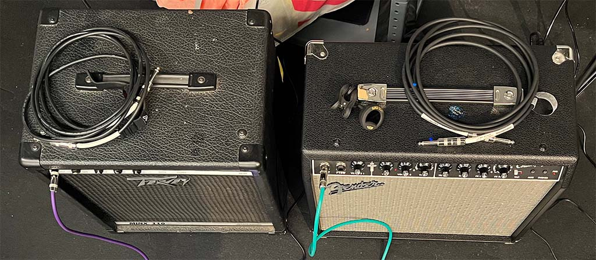
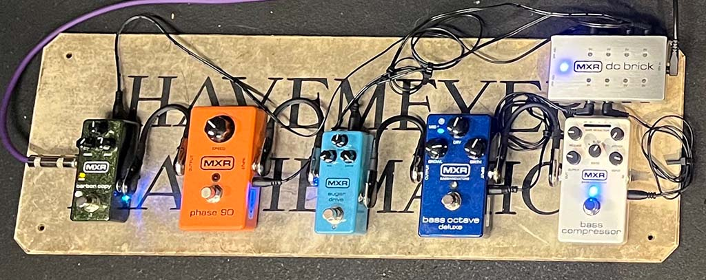
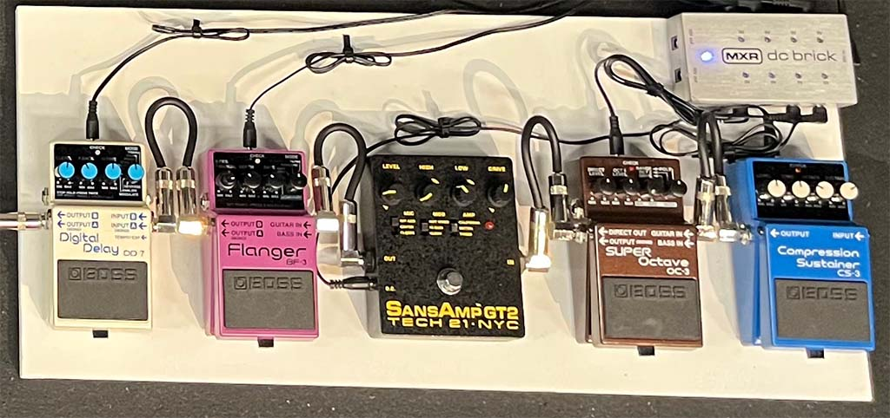

# IDM Amps

The IDM Audio Lab has two instrument amplifiers: a [Peavey Minx 110](https://guitarsdoneright.com/guitars/peavey-minx-110-bass-amp-35-watt/) 35-watt bass amplifier, and a [Fender Champion 40](https://www.fender.com/en-US/guitar-amplifiers/contemporary-digital/champion-40/2330300000.html) 40-watt guitar amplifier: 

The Peavey power switch is on the front panel; the Fender power switch is on the back. **Please remember to turn off the amplifiers when you are done using them.**

Both amps have pedalboards, curated to use for baseline instrument effects research with the [IDM Pedals](https://idmnyu.github.io/IDMPEDALS/) project.

The bass pedalboard consists of (from right to left):

- an MXR Bass Compressor
- an MXR Bass Octave Deluxe
- an MXR Sugar Drive
- an MXR Phase 90
- an MXR Carbon Copy

The guitar pedalboard consists of (from right to left):

- a BOSS CS-3 Compression Sustainer
- a BOSS OC-3 Super Octave
- a Tech 21 Sans-Amp GT-2
- a BOSS BF-3 Flanger
- a BOSS DD-7 Digital Delay

**Do not disconnect or rearrange the pedalboards**

[return to main page](./index.md)
