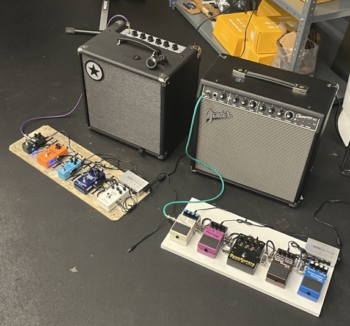

# The Amps

The IDM Audio Lab has two instrument amplifiers: a [Peavey Minx 110](https://guitarsdoneright.com/guitars/peavey-minx-110-bass-amp-35-watt/) 35-watt bass amplifier, and a [Fender Champion 40](https://www.fender.com/en-US/guitar-amplifiers/contemporary-digital/champion-40/2330300000.html) 40-watt guitar amplifier: 

The Peavey power switch is on the front panel; the Fender power switch is on the back. 

Both amps have pedalboards, curated to use for baseline instrument effects research with the [IDM Pedals](https://idmnyu.github.io/IDMPEDALS/) project. The pedalboars are both DC powered from [MXR DC Brick](https://www.jimdunlop.com/mxr-dc-brick-power-supply/) power supplies.

The bass pedalboard consists of (from right to left):

- an [MXR Bass Compressor](https://www.jimdunlop.com/mxr-bass-compressor/)
- an [MXR Bass Octave Deluxe](https://www.jimdunlop.com/mxr-bass-octave-deluxe/)
- an [MXR Sugar Drive](https://www.jimdunlop.com/mxr-sugar-drive-pedal/)
- an [MXR Phase 90](https://www.jimdunlop.com/mxr-phase-90/)
- an [MXR Carbon Copy Mini](https://www.jimdunlop.com/mxr-carbon-copy-mini-analog-delay/)

The guitar pedalboard consists of (from right to left):

- a [BOSS CS-3 Compression Sustainer](https://www.boss.info/us/products/cs-3/)
- a [BOSS OC-3 Super Octave](https://www.boss.info/us/products/oc-3/)
- a [Tech 21 Sans-Amp GT-2](https://www.tech21nyc.com/products/sansamp/gt2/)
- a [BOSS BF-3 Flanger](https://www.boss.info/us/products/bf-3/)
- a [BOSS DD-7 Digital Delay](https://www.boss.info/us/products/dd-7/)

Rules for using the amps:
- Do not disconnect, unplug, or rearrange the pedalboards.
- Remember to turn off the amplifiers when you are done using them.

[return to main page](./index.md)
