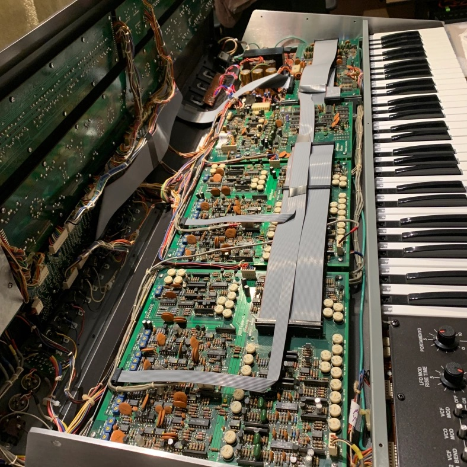

# 370 Jay Street Room 375

- [Overview](#overview)
- [Glossary](./glossary.md)
- The Synths
  - [Black Corporation ISE-NIN](#ise-nin)

## Overview

Room 375 (the A/V "edit room" in the back hallway) has an "annex" for the IDM Audio Lab, consisting of an audio mixer, computer, and ISE-NIN synthesizer.

## イセーニン / ISE-NIN

The [ISE-NIN](https://black-corporation.com/product/deckards-dream-mk2/) is an 8-voice analog synthesizer, developed by the [Black Corporation](https://black-corporation.com/) as a modern reimagining of the Roland [Jupiter 8](https://en.wikipedia.org/wiki/Roland_Jupiter-8) synthesizer from 1981. The ISE-NIN is a rack unit, and can be controlled via MIDI by an [Arturia KeyStep](https://www.arturia.com/keystep/overview) MIDI keyboard controller.

The Roland Jupiter synthesizers (and their budget cousins, the Juno series) were Roland's flagship analog polyphonic synthesizers in the late 1970s and early 1980s. Like the Sequential Circuits Prophet 5, the Jupiter 8 had presets, which allowed the user to save patches of settings, with the front-panel controls overriding the preset values when touched. Unlike the Prophet 5, the Jupiter 8 had a higher polyphony count (8 voices instead of 5), and the ability to work in a [multitimbral](https://en.wikipedia.org/wiki/Timbrality) manner, with two independent patches that could be "stacked" or split across the keyboard. The Jupiter 8 also had an onboard arpeggiator and a number of other performance features. 

The ISE-NIN, like the Deckard's Dream, is built from a DIY Kit and re-imagines the Jupieter 8 as a rack synthesizer with modern MIDI/USB input, custom tuning, and other modern features unavailable at the time.

The user manual for the ISE-NIN can be found [here](https://www.dsl-man.de/display/ISENIN/ISE-NIN+Manuals+and+Firmware?preview=/107544682/135233592/ISE-NIN%20MANUAL%201.1.0.pdf).

### ISE-NIN Architecture

The Jupiter 8 (and ISE-NIN) has independent boards for each voice, mounted on a chassis to a control board that contains the front-end controls and the microcontroller that holds the entire system together.

[return to main page](./index.md)
