# IDM ARP Synthesizers

- [ARP 2600 overview](#arp-2600-overview)
- [TTSH](#ttsh)
- [1601 Sequencer](#1601-sequencer)
- [Keystep](#keystep)
- [Werkstatt](#werkstatt)
- [Rumbarack](#rumbarack)

## ARP 2600 Overview

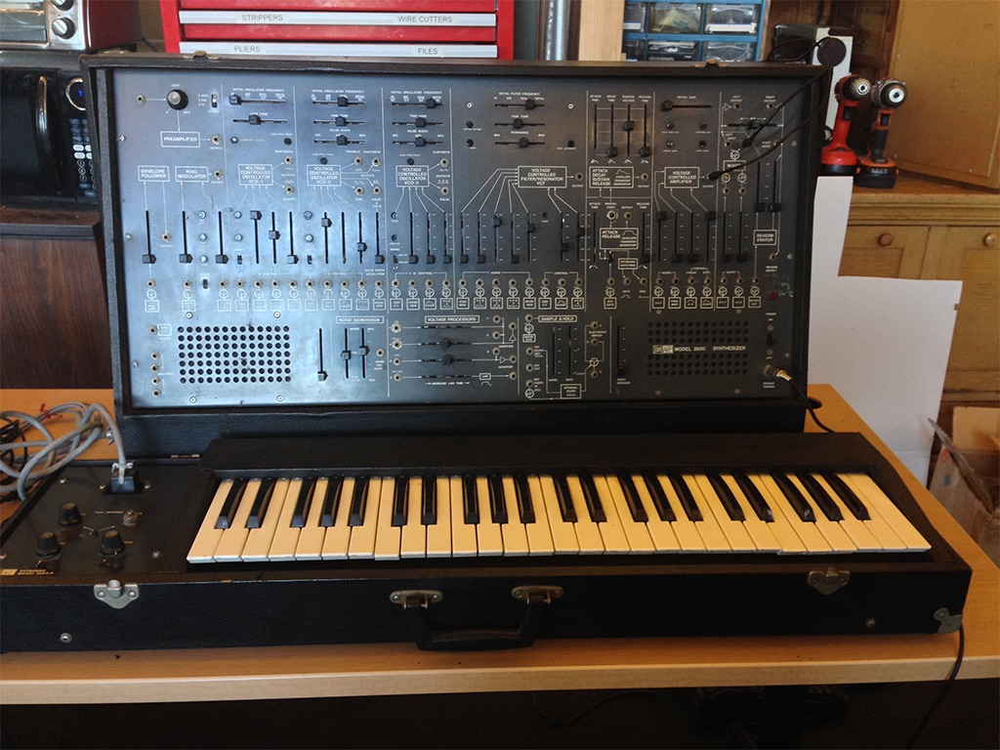

*Much of what follows is adapted from the [manual I wrote](https://github.com/CreativeInquiry/ARP-2600) for the Frank-Ratchye STUDIO for Creative Inquiry at Carnegie Mellon University, where I spent part of 2016 helping to restore and document their vintage ARP 2600, pictured above. - Luke*

The [ARP 2600](https://en.wikipedia.org/wiki/ARP_2600) is a [*semi-modular*](https://www.musicradar.com/how-to/what-is-a-semi-modular-synthesizer) [analog synthesizer](https://en.wikipedia.org/wiki/Analog_synthesizer) designed by Dennis Colin and [**Alan Robert Pearlman**](https://en.wikipedia.org/wiki/Alan_R._Pearlman) - [A.R.P.](https://en.wikipedia.org/wiki/ARP_Instruments) himself - and commercially released in 1971. It was one of the first synthesizers extensively marketed for education, with a retail price of below $3,500. It is considered one of the canonical synthesizers of its day, so a "mint" (or fully-restored) ARP 2600 can easily fetch $10,000 or more today.

The ARP 2600 shows up in many genres of music in the 1970s and 1980s - the synth was integral to the sound of artists ranging from [Jean Michel Jarre](https://en.wikipedia.org/wiki/Jean_Michel_Jarre) to [Joy Division](https://en.wikipedia.org/wiki/Joy_Division). It's also well-known in the sound effects community because of its built-in envelope follower; sound designer [Ben Burtt](https://en.wikipedia.org/wiki/Ben_Burtt) used this to great effect in making the "voice" of [R2-D2](https://en.wikipedia.org/wiki/R2-D2) in the Star Wars movies.

The ARP 2600 went through [multiple changes during its manufacturing lifetime](http://www.vintagesynth.com/arp/arp.php), ranging from several different cosmetic styles to a radical redesign of the filter in 1976 in response to a threatened lawsuit from Moog. The 2600 was manufactured by ARP until the bankruptcy of the company in 1981. Since then, the ARP 2600 has been resurrected as a software plug-in by [Arturia Instruments](https://www.arturia.com/products/analog-classics/arp2600-v/) and an open-source hardware [kit](./pdf/TTSH-BUILD.pdf) developed by the Human Comparator called the [**TTSH**](https://synthcube.com/cart/ttsh-v4) (Two Thousand Six Hundred). The commercial license for the ARP line of synthesizers is currently held by [Korg](http://www.arpsynth.com/en/products/), which announced a [limited-edition replica](https://www.korg.com/us/products/synthesizers/arp2600_fs/) of the ARP 2600 in 2020.

A scan of the original ARP 2600 owner's manual can be found [here](./pdf/ARP-2600-manual.pdf).

ARP also published a "Patch Book" of 100 setups for users to experiment with their ARP 2600. A scan can be found [here](./pdf/Arp-2600-PatchBook.pdf).

A scan of the complete ARP 2600 Service Manual (119 pgs) can be found [here](http://dl.lojinx.com/analoghell/Arp2600-ServiceManual.pdf).

A number of textbooks exist around electronic music / music technology that use the ARP 2600 as a teaching synthesizer. Samuel Ecoff's *Fundamentals of Music Technology: The ARP 2600 Synthesizer* is a great one. A PDF can be found [here](./pdf/arp_ecoff.pdf). The CD examples for the book can be found on Ecoff's [home page](https://samecoff.com/works.html).

### What makes an ARP an ARP?

The ARP 2600 is:
- **Semi-modular** : unlike pure modular synthesizers (like the [Buchla](https://en.wikipedia.org/wiki/Buchla_Electronic_Musical_Instruments), [Serge](https://en.wikipedia.org/wiki/Serge_synthesizer), and [Moog](https://en.wikipedia.org/wiki/Moog_synthesizer) synthesizers), the ARP 2600 has a *default internal wiring* between the individual modules (similar to [patchbay "normalization"](https://en.wikipedia.org/wiki/Patch_panel#Normalization) in a recording studio) so that you could bring it home, plug it in, turn it on, and get sound out of the built-in speakers without any additional work. The patch points on the front of the synthesizer then *override* these defaults by breaking the internal connection, allowing you to customize how the modules are routed from one to another to make new sounds.
- [**Monophonic / monotimbral**](https://en.wikipedia.org/wiki/Polyphony_and_monophony_in_instruments#Monophonic) : the ARP 2600 was designed to be played with a keyboard controller or the 1601 sequencer, one note at a time, with each note making the same kind of "sound," or timbre. However, with a little bit of work, you can re-patch an ARP to leverage the four sound sources independently of one another to create more than one sound at a time.
- **Voltage-based** : like most modular synthesizers of the day, the ARP uses voltage for both transmitting [analog audio signals](https://en.wikipedia.org/wiki/Analog_signal) (e.g. the sound coming from the oscillators) and [control voltage](https://en.wikipedia.org/wiki/CV/Gate) to modify parameters of the synthesizer. These signals are *both* carried over dual-conductor wiring either internally within the synth or externally via "TS" patch cables. This allows you to treat audio signals as control voltage when using the synthesizer so that, for example, an oscillator can be used to "sweep" the cutoff frequency of a filter. The downside of this is that *you can accidentally patch a control voltage line into the signal path to the speakers*, which can damage both the speakers and your ears.
- **Subtractive** : the ARP 2600 makes sound based on the principles of [*subtractive synthesis*](https://en.wikipedia.org/wiki/Subtractive_synthesis) - the oscillators create waveforms rich in harmonic content which are then shaped by the filters and amplifiers. This is in contrast to [*additive* synthesizers](https://en.wikipedia.org/wiki/Additive_synthesis) where simple waveforms (e.g. sine waves) are combined to make complex tones. Subtractive synthesis, along with a default (keyboard-oriented) wiring pathway, is part of what makes the ARP 2600 a classic [*"East Coast"*](https://reverb.com/news/the-basics-of-east-coast-and-west-coast-synthesis) synthesizer.
- **Multiple source / single destination** : many modules on the ARP can mix (add together) signals from a number of inputs without requiring an additional mixer module, but generally have only one patch point for the module's output. This goes for control voltage as well, so that you can often modulate a parameter of the synthesizer with more than one source at once. This is different from, e.g. a Buchla synthesizer, where separate mixer modules must be used to combine several oscillators through a single filter, or Serge synthesizers, where [banana jacks](https://en.wikipedia.org/wiki/Banana_connector) can be stacked to send a module's output to several places at once.
- **Monolithic design** : the ARP 2600 was intended to be used as a standalone instrument, in contrast to the (fully-modular) ARP 2500 or competitor systems from Moog, etc. As such, there was no way to order the ARP 2600 modules à la carte, and a number of design choices, such as its built-in speakers, signal that it was intended to be used as an all-in-one synthesizer. The ARP 2600 form factor (32"x18") wasn't designed for rack-mounting, but instead to be a complementary width to the 4-octave full-size keyboard that could be bought along with it.

### Interface standards

The ARP 2600 has 14 or so modules, along with built-in speakers, an optional keyboard (and later sequencer), and some other bits and pieces to make it easier to wire into an external sound system. Larger modules are arrayed along a top row on the main panel, with some smaller modules fitted into a bottom row between the speakers. The keyboard has some controls as well. Controls on the ARP consist mostly of [slide potentiometers](https://en.wikipedia.org/wiki/Potentiometer) (sliders), along with a couple of knobs and a toggle switch or two. Small trim pots are arrayed under rubber protective caps; these are used to fine tune the synthesizer.

*The most important thing to know about the ARP out is the default wiring between the modules*. These are indicated by friendly diagrams under the patch points and sliders, e.g.:

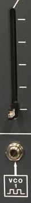

This slider lets you mix in a signal to a module (this particular slider is from the TTSH filter, but this user interface is consistent across the synth). Where it gets this signal from depends on *whether or not a cable is patched into the jack* below the slider. If no cable exists, the synth's default wiring is used, and the symbol below the jack tells you the default source. In this case, it's the square wave output from **VCO 1** (the first oscillator on the synth). If you patch a cable into the jack, that will break the default connection and override it, so that you can wire in any signal you like from elsewhere on the synthesizer.

*Nearly all modules have one or more sliders* that allow you to control the mix of one or more inputs. If these sliders are down, the module will receive no input, from its default source or elsewhere, and will rely entirely on its internal circuitry to function. When a module has multiple inputs, their voltages are summed; in addition, these voltages will also be mixed with any control voltage being generated directly by controls on the module, such as a frequency control on the VCO modules. This elegant system allows you to *offset and scale* input voltages using controls mounted directly on the module itself rather than having to resort to separate voltage processing modules (although the ARP has one of those as well). Generally-speaking, the vertical sliders will provide a scalar to the incoming voltage (a *multiplication* of voltage), while horizontal sliders will provide an offset to the incoming voltage (an *addition* of voltage).

The default wiring allows most of the modules on the ARP to interact with no patch cords; without any cables inserted, the ARP wires its oscillators (labeled **VCO 1, 2, and 3**) through the filter (**VCF**), into an amplifier (**VCA**), and from there to a mixer that is wired to the built-in speakers. By looking at the symbols and adjusting the mix sliders, you can follow the signal path of the modules through the synthesizer.

To override the default wiring, modules can connected by **patching** within and between module jacks using audio \* cables:

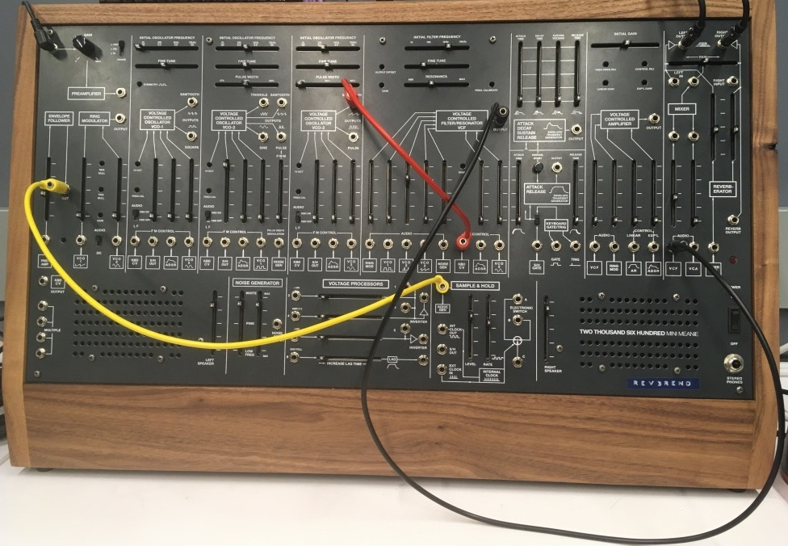

> \* *More audio connector trivia*: original ARP equipment used **Switchcraft** [**"Tini-Jax"**](http://www.switchcraft.com/Category.aspx?Parent=60) connectors for all its synthesizers' front-panel connections. Somewhat rare today, in the 1960s and 70s this connector was a competitor to the 3.5mm / 1/8" mini-phone jacks considered standard today after being popularized by the Sony Walkman. Tini-Jax were used by ARP (and Buchla) as an alternative to the larger 1/4" phono jacks used by Moog. 3.5mm / 1/8" cables will work just fine in a Tini-Jax socket, though they may feel a little loose; *however, a Tini-Jax plug can damage or break a normal 3.5mm jack*. The TTSH in the IDM analog studio uses standard 3.5mm jacks. Because the TTSH uses two-conductor (+ and -) cables, it's somewhat easier to integrate with other A/V equipment than the Serge system.

The 3.5mm cables in the IDM Audio Lab are stackable by inserting one cable into the back of another. The are stored against the wall in the analog studio area, and are color-coded by length.

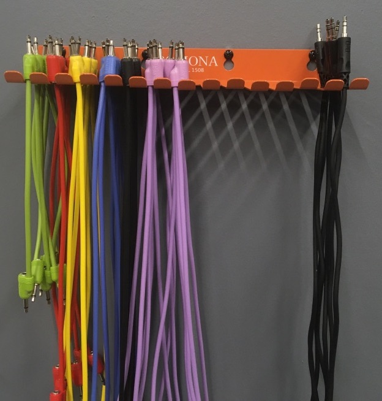

**IMPORTANT: unlike the banana connectors on the Serge system, the 3.5mm patch points on the TTSH (or any synth that uses [phone connectors](https://en.wikipedia.org/wiki/Phone_connector_(audio))) can *easily be damaged* by forcing a plug into a jack, or by pulling a cable out of a socket with force. Please make connections on the TTSH with care.**

ARP synthesizers use a 10V AC standard for both audio and control voltage, which is signifantly higher than the lower-voltage Serge system. As a result, Serge "Pulse" voltages (and Arduino pins) will not trigger the envelope generator on an ARP 2600 without being amplified (the CV.OCD "Gate Boost" module is available to help with this). The ARP 2600 uses a standard scaling of 1 volt per octave to represent musical pitch.

[back to top](#top)

## TTSH

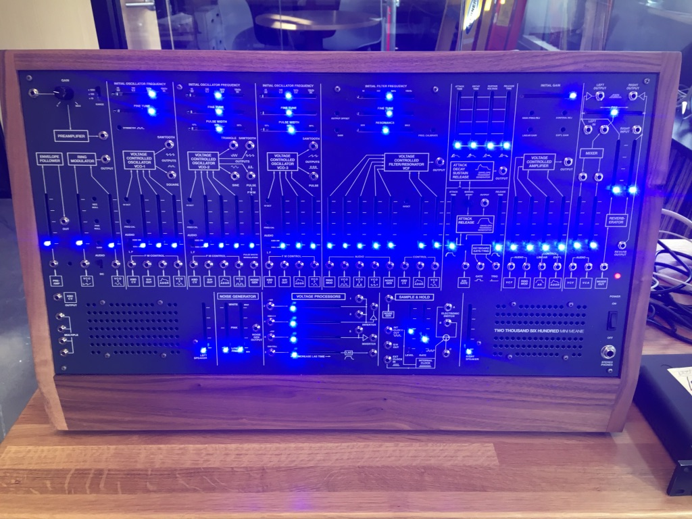

The **TTSH** (the "Mini Meanie") was custom-built for Luke in 2019 by Darrin Wiener and Flavia Ferreira at Patch Point in Berlin. Designed to be as faithful as possible to the original ARP 2600 design, there are a number of differences between the TTSH and a vintage ARP:
- the TTSH is 75% of the size (24"x 12") of the ARP 2600.
- the TTSH uses standard 3.5mm ("Eurorack") connectors instead of the Switchcraft Tini-Jax used on the original.
- the TTSH *glows*, using [Bourns PTA](https://www.bourns.com/docs/Product-Datasheets/pta.pdf) slide potentiometers with LEDs. The TTSH in the IDM analog studio is fitted with ultra-bright blue LEDs.
- the original ARP 2600 had a dedicated cinch connector on one side for interfacing with a keyboard (sold as an add-on to the system). The TTSH has no keyboard; instead, the jacks that are normalled to the **KBD CV** and **KEYBOARD GATE/TRIG** can receive input from, e.g. the 1601 sequencer, the Arturia Keystep (or other MIDI device) via the CV.OCD converter, a Serge module using a Low-Gain format converter, an Arduino, or elsewhere.

### The Modules

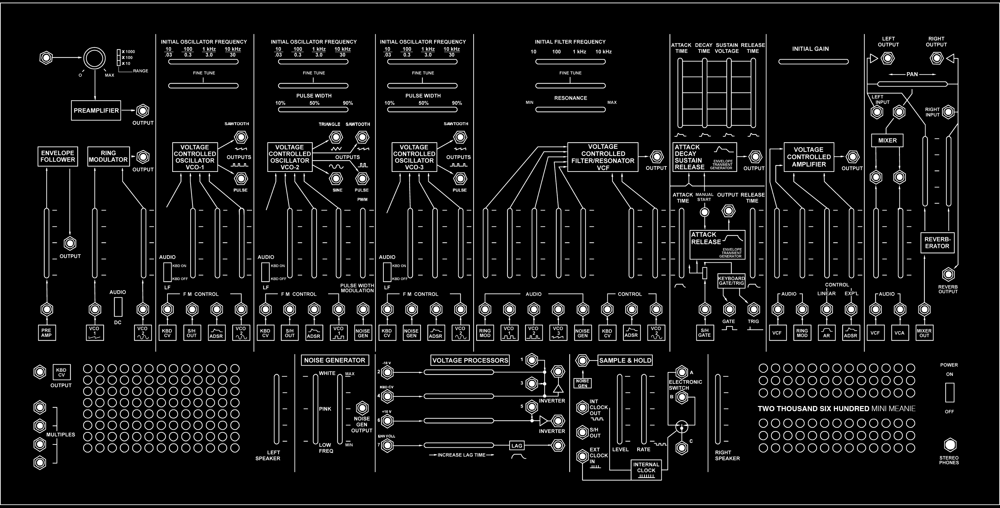

Below is a list of modules (left-to-right, top row then bottom row), an explanation of their capabilities, and their wiring (default input and output).

#### Pre-Amplifier (PRE AMP) / Envelope Follower (ENV FOLL) / Ring Modulator (RING MOD)

This module consists of three-submodules:
- A [**Pre-Amplifier**](https://en.wikipedia.org/wiki/Preamplifier) that allows you to connect an external sound source (mic or line) into the synth, either for processing (e.g. through the filter and amplifier) or to control a parameter of the synth (most likely using the envelope follower). The knob and the three-way toggle switch allow you to adjust the gain of the input signal. The output patch point allows you to wire the pre-amplifier to the rest of the synthesizer.
- An **Envelope Follower**, which converts any input audio signal into a corresponding control voltage based on a smoothed representation of the amplitude (loudness) of the input. For example, you can use a microphone input to the *pre-amplifier* to generate a CV slope that controls the amplitude of the synthesizers oscillators. This module allowed Ben Burtt to create R2-D2's voice in *Star Wars*.
- A **Ring Modulator**, which multiplies two audio signals together (or one audio signal and one CV signal, for more traditional amplitude modulation), creating sideband effects that create a signature 'metallic' or 'robotic' sound. The toggle switch labeled **AUDIO/DC** allows you to select whether the second signal is a sound or a control voltage - if the latter is selected, the second input will become DC-coupled, allowing the module to function as a second VCA for the synthesizer.

1. **PRE AMP** input
2. **PRE AMP** gain knob
3. **PRE AMP** gain multiplier switch
4. **PRE AMP** output (*default destination*: input of **ENV FOLL**)
5. **ENV FOLL** input (*default source*: **PRE AMP** output)
6. **ENV FOLL** mix amount
7. **ENV FOLL** output (*default destination*: "lag" input of the **VOLTAGE PROCESSORS**)
8. **RING MOD** carrier input (*default source*: sawtooth output of **VCO 1**)
9. **RING MOD** carrier mix amount
10. **RING MOD** **AUDIO/DC** switch
11. **RING MOD** modulator input (*default source*: sine output of **VCO 2**)
12. **RING MOD** modulator mix amount
13. **RING MOD** output (*default destination*: **VCF**)

#### Voltage Controlled Oscillator (VCO 1)

This module is the first oscillator for the TTSH. Sliders at the top provide a base frequency (in two ranges) and the ability to fine tune the oscillator. A toggle switch labeled **AUDIO/LF** provides two functions - (1) it wires in control voltage from the KBD CV "keyboard" input so that you can play the oscillator with a 1 volt-per-octave signal and (2) it switches the oscillator scaling between a low-frequency oscillator (LFO) mode where its range is between 0.3 and 30Hz (**LF** or **KBD OFF**) and a high frequency mode where it outputs waveforms between 10Hz and 10kHz (**AUDIO** or **KBD ON**). There are patch point output jacks for a sawtooth wave and a square wave from the VCO. The mixer section at the bottom allows for frequency modulation of the oscilator. These inputs *add* to the voltage set by the sliders at the top; this allows you to control the range of FM through a combination of the frequency control sliders and the mixer.

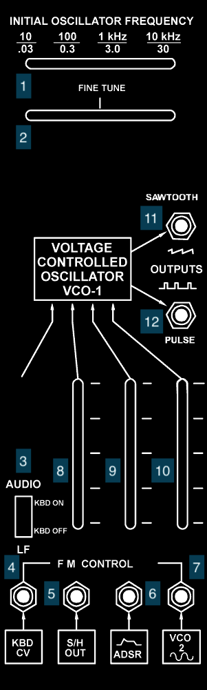

1. Coarse frequency slider
2. Fine frequency slider
3. AUDIO/LF switch
4. Frequency Modulation (FM) Input 1 - only engaged in AUDIO mode (*default source*: **KBD CV**)
5. FM Input 2 (*default source*: **S/H** output)
6. FM Input 3 (*default source*: **ADSR** output)
7. FM Input 4 (*default source*: sine output of **VCO 2**)
8. FM Input 2 mix amount
9. FM Input 3 mix amount
10. FM Input 4 mix amount
11. **VCO 1** Sawtooth output
12. **VCO 1** Pulse (square wave) output (*default destinations*: **VCO 2** and **VCF**)

#### Voltage Controlled Oscillator (VCO 2)

This module is the second oscillator for the TTSH, and has more features than **VCO 1**. As with the first oscillator, sliders at the top provide a base frequency and fine tune control. A third slider allows you to set the pulse width for the pulse/pwm wave output. The **AUDIO/LF** switch provides the same function as on **VCO 1**, allowing 'keyboard' (**KBD CV** input) control of the oscillator and switching between LFO and audible frequency mode. There are four output jacks on **VCO 2** - a triangle wave, a sawtooth wave, a sine wave, and a [pulse width modulation](https://en.wikipedia.org/wiki/Pulse-width_modulation) generator that can vary continuously between a square wave and a short pulse wave. The mixer section at the bottom allows for frequency modulation of the oscilator, as well as modulation of the pulse width for the pulse/pwm wave output.

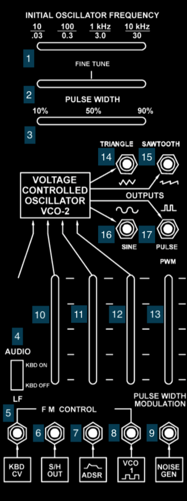

1. Coarse frequency slider
2. Fine frequency slider
3. Pulse width slider
4. AUDIO/LF switch
5. Frequency Modulation (FM) Input 1 - only engaged in AUDIO mode (*default source*: **KBD CV**)
6. FM Input 2 (*default source*: **S/H** output)
7. FM Input 3 (*default source*: **ADSR** output)
8. FM Input 4 (*default source*: pulse output of **VCO 1**)
9. PWM Input (*default source*: **NOISE GEN** output)
10. FM Input 2 mix amount
11. FM Input 3 mix amount
12. FM Input 4 mix amount
13. PWM Input mix amount
14. **VCO 2** Triangle output
15. **VCO 2** Sawtooth output
16. **VCO 2** Sine output (*default destinations*: **VCO 1**, **VCO 3**, **VCF**)
17. **VCO 2** Pulse output (*default destination*: **VCF**)

#### Voltage Controlled Oscillator (VCO 3)

**VCO 3** is the TTSH synthesizer's third oscillator, intermediate in complexity between **VCO 1** and **VCO 2**. As with **VCO 2**, there are sliders for a base frequency, fine tune, and pulse width. The **AUDIO/LF** switch toggles **KBD CV** input control of the oscillator and switches between LFO and audible frequency mode. The oscillator has output jacks for a sawtooth and a pulse/pwm wave output. The mixer section at the bottom allows for frequency modulation of the oscilator.

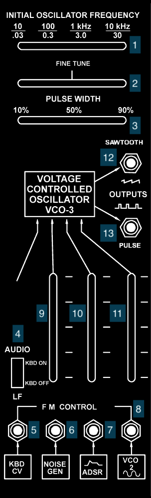

1. Coarse frequency slider
2. Fine frequency slider
3. Pulse width slider
4. AUDIO/LF switch
5. Frequency Modulation (FM) Input 1 - only engaged in AUDIO mode (*default source*: **KBD CV**)
6. FM Input 2 (*default source*: **NOISE GEN** output)
7. FM Input 3 (*default source*: **ADSR** output)
8. FM Input 4 (*default source*: sine output of **VCO 2**)
9. FM Input 2 mix amount
10. FM Input 3 mix amount
11. PWM Input mix amount
12. **VCO 3** Sawtooth output (*default destination*: **VCF**)
13. **VCO 3** Pulse output

#### Voltage Controlled Filter / Resonator (VCF)

The **VCF** is the ARP 2600's filter. Early versions of the ARP 2600 used a reverse-engineered clone of a ladder filter design used in Moog synthesizers; as a result of legal action, these were replaced with ARP's own design after 1976. The TTSH uses the pre-lawsuit ("Model 4012") filter. In either case, the **VCF** consists of a resonant 24dB/octave low-pass filter with sliders controlling the cut-off frequency (coarse and fine) and a resonance amount. The mixer at the bottom allows you to control both audio inputs to the filter as well as control voltage inputs that vary the cutoff frequency. As with the **VCO**s, the control voltage *adds* to the cutoff frequency set by the sliders, so that you can set the range of CV control with a combination of the frequency controls at the top and the mixer gain for the CV input at the bottom of the module. There is an output jack for custom wiring of the output of the **VCF**.

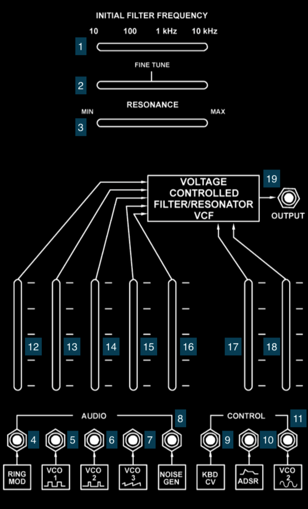

1. Coarse frequency slider
2. Fine frequency slider
3. Resonance slider
4. Audio Input 1 (*default source*: **RING MOD** output)
5. Audio Input 2 (*default source*: pulse output of **VCO 1**)
6. Audio Input 3 (*default source*: pulse output of **VCO 2**)
7. Audio Input 4 (*default source*: sawtooth output of **VCO 3**)
8. Audio Input 5 (*default source*: **NOISE GEN** output)
9. Control Input 1 (*default source*: **KBD CV**)
10. Control Input 2 (*default source*: **ADSR** output)
11. Control Input 3 (*default source*: sine output of **VCO 2**)
12. Audio Input 1 mix amount
13. Audio Input 2 mix amount
14. Audio Input 3 mix amount
15. Audio Input 4 mix amount
16. Audio Input 5 mix amount
17. Control Input 2 mix amount
18. Control Input 3 mix amount
19. **VCF** output (*default destinations*: **VCA**, **MIXER**)

*Notes:*
- The **KBD CV** is hard-wired to Control Input 1 on the **VCF**. If you are using a **KBD CV** signal elsewhere in your patch (e.g. to control and oscillator) and *don't* want the **VCF** cutoff freequency to track with that signal, you can insert a cable into jack *9* to break the connection.

#### Envelope Generator (ADSR/AR)

The envelope generator on the TTSH creates control voltage signals that rise and fall in response to a trigger. These are used for amplitude curves, filter curves, etc. This module generates no audio, but can be used with other modules to process audio (e.g. through the FM inputs on the VCOs or the CV input on the VCA). The top half of the module controls an **ADSR** (attack/decay/sustain/release) envelope with sliders to control each stage of the envelope. The bottom half controls a simple **AR** (attack/release) envelope with two sliders instead of four. Both envelopes are "fired" through the same trigger mechanism and cannot be controlled independently: there is a button for manual firing, as well as a jack for an external trigger. There are output jacks for each envelope, as well as utility jacks that on an ARP 2600 output voltage from the keyboard, but on the TTSH allow you to wire in 10V signals to fire the envelopes - a **GATE** input (voltage high on key down, voltage low on key up) and a **TRIGGER** input (a voltage pulse on key down).

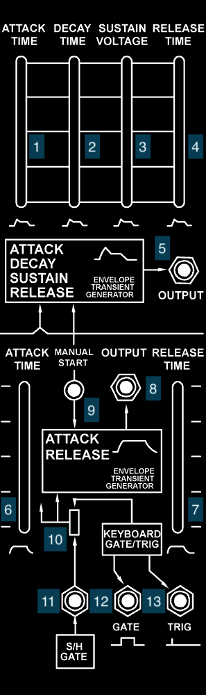

1. **ADSR** Attack time slider
2. **ADSR** Decay time slider
3. **ADSR** Sustain level slider
4. **ADSR** Release time slider
5. **ADSR** output (*default destinations*: **VCO 1**, **VCO 2**, **VCO 3**, **VCF**, **VCA**)
6. **AR** Attack time slider
7. **AR** Release time slider
8. **AR** output (*default destination*: **VCA**)
9. Manual trigger button
10. Gate input switch
11. External gate input; active when switch *10* is down (*default source*: **S/H** gate output)
12. External gate input; active when switch *10* is up
13. External trigger input; active when switch *10* is up

*Notes:*
- The Envelope Generator will respond to the **GATE** and **TRIGGER** inputs differently. A **TRIGGER** pulse is required to made the **ADSR** "restart" it's envelope if the **GATE** signal remains high; the **AR** circuit responds to the **GATE** alone, and is similar to the "lag" on the **VOLTAGE PROCESSORS** or the **DUSG** (and other slew-limiting modules) on the Serge. 

#### Voltage Controlled Amplifier (VCA)

The **VCA** of the TTSH modulates the amplitude of audio inputs based on control voltage sources. This allows you to shape the volume of a synthesizer "note", allowing it to fade in and out. The VCA has a slider to set an *initial gain* - as with other horizontal sliders on the ARP, these voltages are added to external control voltages, allowing you to offset and scale them when used together with the vertical mixer sliders on the same module. The **VCA** has two input sources and two control sources, but only one amplifier circuit, which will sum the audio signals and amplify them based on the control voltages to generate one shaped output. There is a jack for the **VCA** output.

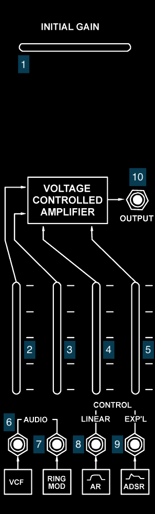

1. Initial gain slider
2. Audio Input 1 mix amount
3. Audio Input 2 mix amount
4. Control Input 1 mix amount
5. Control Input 2 mix amount
6. Audio Input 1 (*default source*: **VCF** output)
7. Audio Input 2 (*default source*: **RING MOD** output)
8. Linear Control Input (*default source*: **AR** output)
9. Exponential Control Input (*default source*: **ADSR** output)
10. **VCA** output (*default destination*: **MIXER**)

#### MIXER / REVERBERATOR / Output

The right-hand module on the top row of the TTSH consists of a final stage mixer, a reverberation unit, and jacks for audio output from the synthesizer:
- the [**MIXER**](https://en.wikipedia.org/wiki/Audio_mixing) module is a two-channel mixer with vertical sliders, a jack above each slider that can "tap" a direct out of the channel, and a horizontal [pan](https://en.wikipedia.org/wiki/Panning_(audio)) slider to move the mixers output between the left and right output jacks from the synthesizer. There are also additional input jacks to bypass the mixer entirely, wiring their voltage directly to their respective output jacks.
- the **REVERBERATOR** module is a stereo [spring reverb](https://en.wikipedia.org/wiki/Reverberation#Spring_reverberators) unit that feeds the output jacks, as well as an additional direct output. Vertical sliders allow you to adjust the volume of the reverb in each channel.
- In the IDM analog studio, the two 1/8" outputs of the **MIXER** are wired to inputs 7 and 8 on the Behringer mixer.

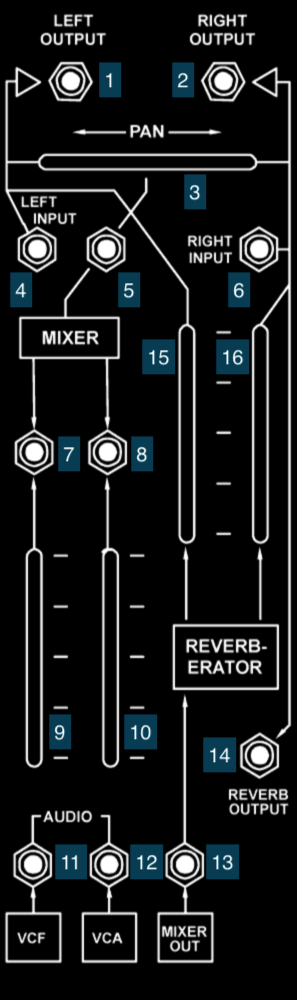

1. TTSH left output
2. TTSH right output
3. **MIXER** output pan slider
4. TTSH Left *input*; sums to **MIXER** and **REVERBERATOR**
5. **MIXER** output tap
6. TTSH Right *input*; sums to **MIXER** and **REVERBERATOR**
7. **MIXER** Input 1 tap
8. **MIXER** Input 2 tap
9. **MIXER** Input 1 mix amount
10. **MIXER** Input 2 mix amount
11. **MIXER** Input 1 (*default source*: **VCF** output)
12. **MIXER** Input 2 (*default source*: **VCA** output)
13. **REVERBERATOR** Input (*default source*: **MIXER** output)
14. **REVERBERATOR** output tap
15. **REVERBERATOR** left mix amount
16. **REVERBERATOR** right mix amount

#### Keyboard CV (KBD CV) / 4-in-1 / Left Speaker

On the lower left of the TTSH, next to the left speaker, there is a jack that allows external voltage to be multiplexed to all the **KBD CV** inputs on the synthesizer; on the original ARP 2600, this would be used to tap the control voltage *output* of the keyboard; on the TTSH, this is an easy way to have a single voltage *input* control, e.g. all three oscillators. In addition, there is a passive **4-in-1** jack that allows you to take any voltage and split it into three outputs using patch cables - the Tiny-Jax cables used on the original ARP 2600 couldn't be stacked. On the right of the speaker is a vertical slider for its volume.

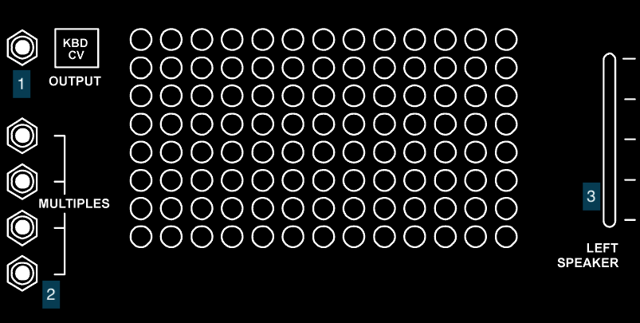

1. **KBD CV** jack
2. **4-in-1** jacks
3. TTSH left speaker volume

*Notes:*
- The **KBD CV** jacks on the TTSH are wired as a passive [bus](https://en.wikipedia.org/wiki/Busbar), which means they can serve as signal inputs *or* outputs. Patching an external signal (e.g. from the CV.OCD or the 8A) into *any* **KBD CV** jack will cause all the other outputs (and normalled connection points) to receive that signal.
- The **KBD CV** voltage is wired by default to control inputs on all three **VCO** modules and the **VCF** *without an attenuating slider*. This is by design, as a direct connection betweeen the frequency-dependent modules on the ARP 2600 and its keyboard maintained the 1 volt-per-octave tuning relationship. Later ARP keyboards (the Model 3604 and Model 3620) had the ability to change this voltage scaling on the keyboard before their control voltage was sent to the synthesizer. On the TTSH, if you want to use some of these modules with input from the **KDB CV** and some without, you need to insert a cable into the module input jacks to break the default connection.

#### Noise Generator (NOISE GEN)

The **NOISE GEN** for the TTSH provides a random audio source that can be used for a variety of interesting things. The two vertical sliders allow you to adjust between [white noise](https://en.wikipedia.org/wiki/White_noise) (constant power), [pink noise](https://en.wikipedia.org/wiki/Pink_noise) (1/f power), and [red noise](https://en.wikipedia.org/wiki/Brownian_noise) (1/f2), as well as control the output gain of the module.

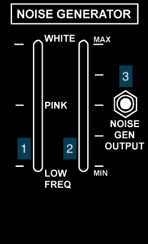

1. Noise quality slider
2. Noise gain slider
3. **NOISE GEN** output (*default destinations*: **VCO 2**, **VCO 3**, **VCF**, **S/H**)

#### VOLTAGE PROCESSORS

The **VOLTAGE PROCESSORS** module allows for four different control voltage sources to be modified in a variety of ways, including scaling, inverting, summing, offseting, and smoothing (the "lag" amount on the fourth control). None of the outputs are hard-wired, but can be used to create more complex control voltage sources.

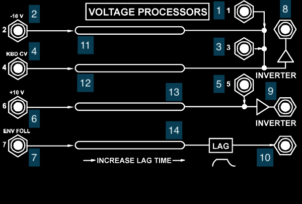

1. Processor input 1
2. Processor input 2 (*default source*: TTSH -10V DC)
3. Processor input 3
4. Processor input 4 (*default source*: **KBD CV**)
5. Processor input 5
6. Processor input 6 (*default source*: TTSH +10V DC)
7. Processor input 7 (*default source*: **ENV FOLL** output)
8. Inverter output 1
9. Inverter output 2
10. Lag output
11. Offset slider 1
12. Offset slider 2
13. Offset slider 3
14. Lag slider

#### Sample and Hold (S/H)

The sample and hold (**S/H**) module on the TTSH can be used to generate clocks and random audio sources by "sampling" an input voltage based on an internal or external clock (which does not have to be a clock at all). The internal controls allow for the generation of S/H control voltages with an amplitude and rate controlled by the vertical sliders. Input and output jacks for the switches and clocks of the module allow you to create more complex sample-and-hold systems for the TTSH which can simulate sequences, arpeggiators, and rhythmic voltage curves.

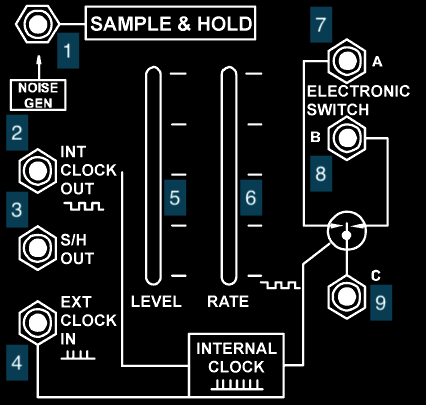

1. **S/H** input (*default source*: **NOISE GEN** output)
2. Internal clock output (*default destination*: **ADSR/AR**)
3. **S/H** output (*default destinations*: **VCO 1***, **VCO 2**)
4. External clock input
5. **S/H** level slider
6. Internal clock rate slider
7. Electronic Switch A
8. Electronic Switch B
9. Electronic Switch C

*Notes:*
- The "Electronic Switch" section (*7*, *8*, and *9*) of the **S/H** module is bi-directional, so it can function as either a flip-flop gate - the voltage at input C is sent to alternating outputs A and B - or an alternating switch - voltage inputs at A and B are sent to output C. In either case, the switch is controlled by the clock (internal or external) of the module.

#### Right Speaker / Power Switch / Headphone Output

On the lower right of the TTSH is the power switch for the synthesizer, next to the right speaker. The headphone jack for the synthesizer is there as well, just below the power switch. On the left of the speaker is a vertical slider for its volume. Plugging headphones into the TTSH will disable the internal speakers - the left and right volume sliders will then control the volume in the headphones.

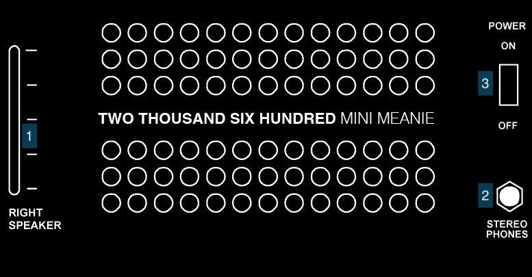

1. TTSH left speaker volume
2. Headphone jack
3. TTSH power switch

**Please leave the TTSH power switch in the "on" position and use the Furman power conditioner to turn on and off the synthesizer.**

## 1601 Sequencer

## Keystep

## Werkstatt

## Rumburack

[back to top](#top)

[back to synthesizers](./synths.md)

[return to main page](./index.md)
