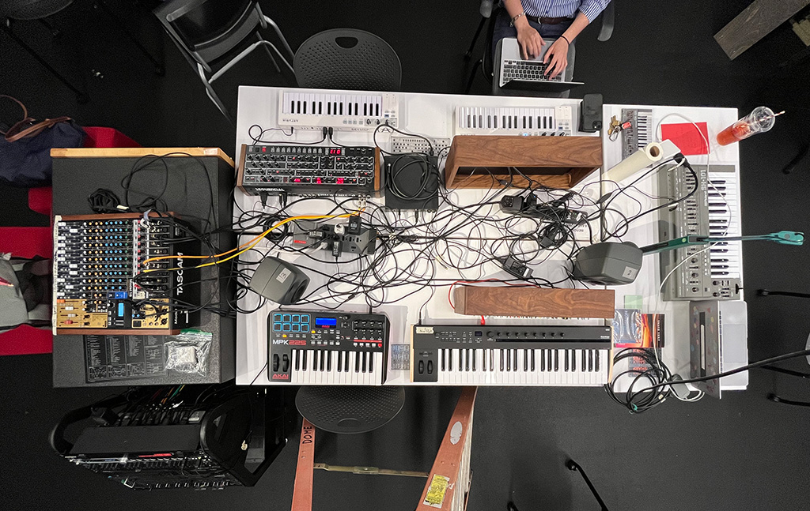
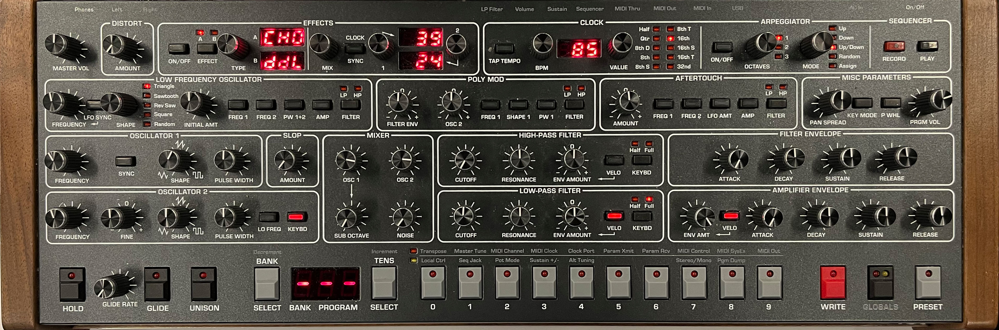

# The Center Table: Non-Modular Synthesizers

- Non-Modular Synthesizers
  - [Glossary](./glossary.md)
  - [Roland SH-101](#Roland-SH-101)
  - [Sequential Prophet 6](#Sequential-Prophet-6)
  - [Deckard's Dream MK2](#Deckard's-Dream-MK2)

The center table is home to all of the non-modular synthesizers in the lab.  These are [analog synthesizer](https://en.wikipedia.org/wiki/Analog_synthesizer) in various styles that follow the tradition of ["East Coast"](https://reverb.com/news/the-basics-of-east-coast-and-west-coast-synthesis) synthesis design, where the format for control of pitches are based on Western scales, often using a piano-esque layout.  These synths often focus on subtractive synthesis techniques where simple, richer waveforms like sawtooth and square waves, are carved away using filters to create custom sounds.  

**If you are confused where to start, each synthesizer on the central island has a picture printed with preset parameters of a setting that would produce a tone for you to explore from!**

## Roland SH-101

The [Roland SH-101](https://en.wikipedia.org/wiki/Roland_SH-101) is a monophonic [analog synthesizer](https://en.wikipedia.org/wiki/Analog_synthesizer).  It was produced from 1982-1986, and released in the US at $495 USD. Although originally designed to be paired with a keytar attachment, the low entry cost, small size, and easily accessible sequencer and arpeggiator led it to become a staple in the electronic house music scene of the 90s.  

The single voice the SH-101 produces can be mixed as a combination of a square wave, sawtooth wave, random, noise, and sub oscillators. There is an onboard envelope for the oscillators, and an LFO that can be controlled internally or externally to modulate various parameters. 

A scan of the original user manual can be found [here](http://dl.lojinx.com/analoghell/RolandSH101-OwnersManual.pdf).

### The Roland SH-101 is:
- [**Monophonic / monotimbral**](https://en.wikipedia.org/wiki/Polyphony_and_monophony_in_instruments#Monophonic) : the SH-101 was designed to only produce one note at a time with each note making the same type of "sound," or timbre.
- **Voltage-based** : like most modular synthesizers of the day, the SH-101 uses voltage for both transmitting [analog audio signals](https://en.wikipedia.org/wiki/Analog_signal) (e.g. the sound coming from the oscillators) and [control voltage](https://en.wikipedia.org/wiki/CV/Gate) to modify parameters of the synthesizer. These signals are *both* carried over dual-conductor wiring either internally within the synth or externally via "TS" patch cables. This allows you to treat audio signals as control voltage when using the synthesizer so that, for example, an oscillator can be used to "sweep" the cutoff frequency of a filter. The downside of this is that *you can accidentally patch a control voltage line into the signal path to the speakers*, which can damage both the speakers and your ears.
- **Subtractive** : the SH-101 makes sound based on the principles of [subtractive synthesis](https://en.wikipedia.org/wiki/Subtractive_synthesis) - the oscillators create waveforms rich in harmonic content which are then shaped by the filters and amplifiers. This is in contrast to [*additive* synthesizers](https://en.wikipedia.org/wiki/Additive_synthesis) where simple waveforms (e.g. sine waves) are combined to make complex tones. Subtractive synthesis, along with a default (keyboard-oriented) wiring pathway, is part of what makes the SH-101 a classic ["East Coast"](https://reverb.com/news/the-basics-of-east-coast-and-west-coast-synthesis) synthesizer.
- **Single source / single destination** : the single voice composed of the onboard oscillators only one patch point for the module's output. With this synthesizer, the single onboard filter is used to modify the signal combined through the mixer module.
- **Standalone and wearable design** : the SH-101 was intended to be used either as a wearable keytar instrument, where one could attach a short neck and strap to carry the synth around stage with a built in battery.  We do not have the external gear in the lab, but feel free to lie on your side next to the synth and pretend!

### The Modules

Here we will walk through the modules from left to right, top to bottom.

#### Top Row of Controls

The first knob in the top left is labelled "TUNE", which allows you to finely control the overall pitching of the synthesizer ±1 semitone.  This is particularly useful when trying to get the synthesizer to be "in tune" with other instruments or sound sources.

The next module is titled "MODULATOR", containing an "LFO/ CLICK RATE" slider and a "WAVE FORM" knob.  The slider controls the speed of the LFO for modulators and the internal clock for the arpeggiator and sequencer, while the knob controls which shape the lfo is taking to modulate your signal between a square wave, sawtooth wave, random, and noise.

The third module is "VCO", or voltage controlled oscillator, which contains a "MOD" slider, "RANGE" knob, "PULSE WIDTH" slider, and a small switch next to that.  The "MOD" slider controls how much the previous module's LFO controls the oscillator.  It can be thought of as depth, or as wet/dry control of the "MODULATOR" module over the oscillator.  The "RANGE" knob controls the octave that the synthesizer plays within.  The markings on this knob are delineated in feet, which is based on the custom of doubling the length of pipes in a pipe organ syncing up to lowering an octave, and vice versa.  The ["PULSE WIDTH"](https://www.keithmcmillen.com/blog/simple-synthesis-part-6-pulse-width-modulation/) slider controls the duty cycle of the square wave oscillator.  The small switch on the side decides whether you want the pulse modulation to be controlled via the LFO, through manual modulation, or using the envelope as a modulator.

The fourth module is the "SOURCE MIXER".  The first three and last sliders allow you to individually balance the volume of the square wave, sawtooth wave, sub, and noise generators with each other.  The switch paired with the "SUB OSC" mixer controls how many octaves you want the sub oscillator to play below that of the other oscillators.

Next is the "VCF", or voltage controlled filter, which is a single low pass filter containining sliders titled "FREQ", "RES", "ENV", "MOD", and "KYBD".  The frequency slider controls the cutoff frequency of the filter.  The resonance slider controls the resonance, often refered to as "Q", of the filter.  The "ENV" and "MOD" sliders control how deeply the envelope and modulator modules apply to the filter, respectfully.  The "KYBD" maps the frequency control of the filter to the keyboard, so as you play lower notes the filter is more closed, and as you play higher notes the filter opens up.

After that is the "VCA" (voltage controlled amplifier) module, which just contains a single switch.  The envelope setting applies the envelope to the shaping of the volume of each trigger of a note, while gate functionality makes the SH-101 recognize all pressed keys as on and all released as off.  Envelope mode allows the filter to control both the amplitude of a note itself, as well as the filter, while gate mode allows the envelope to alter the filter while the actual shape of the note being played is simply on or off at a constant amplitude.

At the end of the top row is the "ENV", or envelope module.  The 4 sliders control the parameters of a single [ADSR envelope generator](./glossary/Envelope-Generator).  The switch on the left allows you to select different ways to trigger the envelope: through the LFO, through the gate (which triggers once when any key is pressed and only becomes able to be retriggered after all keys are not being pressed), and through gate-and-trigger, which retriggers every time a new note is pressed.

#### Middle Row of Controls

The middle row of functionality controls the sequencing and arpeggiating functionality.  To record a sequence, you press the "LOAD" button, play a pattern, and then click "PLAY".  The rate of the sequence is controlled by the LFO/ CLK RATE slider in the in the "MODULATOR" module.  If you want to add a rest to a sequence, you press the rest button.  To add a legato transfer between notes, hold the legato button while playing the latter note (the one to be played into).  You can transpose the sequence by holding the "KEY TRANSPOSE" button and playing a different key on the keyboard while the cycle is playing.  For the arpeggiator, you can select between the patterns down (top note to bottom), up & down (bottom to top and back), and up (bottom to top). You can press the hold button to hold a sequence for you, and when the apreggiation is being held, it can be transposed as well.

#### Bottom Row of Controls

The bottom left section has the other internal controls.  At the top, there is an overall volume knob, and a portamento knob, which controls the amount of time that it takes the pitch to bend and transfer between notes when enabled. The switch labelled portamento has an "AUTO" setting, which only triggers portamento when playing legato (when held notes overlap).  The on setting causes portamento with every trigger, and off leads to no portamento.  The transpose switch is a quick control for switching ±1 octave on the fly.  Finally, the last 3 sliders control how much the mod wheel controls the VCO, VCF, and LFO.  The VCO (pitch bend) and VCF (cutoff of the filter) modulation is controlled with horizontal rotation of the mod wheel, while LFO (vibrato) is controlled by pushing the mod wheel forward, or away from the player.

#### External Ports

At the very top right, there are a few ports for external devices.  The "EXT. CLK IN" allows external devices to control the clock, and overrides the modulator's clock rate.  The "HOLD" port allows for a pedal to sustain notes, similarly to a piano.  The CV and GATE input and output ports allow you to control a modular synthesizer or to use use another synthesizer or your computer/ an arduino to control this synth.  The last 2 ports are to listen to the synth via headphones or an external output, as there are no onboard speakers.

## Sequential Prophet 6

The [Prophet-6 Desktop](https://www.sequential.com/product/prophet-6-desktop/) is a 6-voice analog synthesizer, developed by [Sequential](https://www.sequential.com/) as a modern reissue of their famed [Prophet-5](https://en.wikipedia.org/wiki/Prophet-5) synthesizer from 1978, which is generally controlled by an [Akai MPK-225](https://www.akaipro.com/mpk225) MIDI controller, but can also be controlled by a Roland [GI-10](https://www.soundonsound.com/reviews/roland-gi-10) Guitar-to-MIDI Interface.

The user manual can be found [here](https://yo41t1y5gos9jw8f3lptw0xo-wpengine.netdna-ssl.com/wp-content/uploads/2021/02/Prophet-6-Operation-Manual-2.1.pdf).

### The Sequential Prophet 6 is:

- [**Polyphonic / monotimbral**](https://en.wikipedia.org/wiki/Polyphony_and_monophony_in_instruments#Monophonic) : the Prophet 6 was designed to be played with an external keyboard controller with up to 6 notes at a time available.  Each note makes the same kind of "sound," or timbre. @@@@However, with a little bit of work, you can re-patch an ARP to leverage the four sound sources independently of one another to create more than one sound at a time.
- **Voltage-based** : the Prophet 6 uses analog voltage for transmitting [analog audio signals](https://en.wikipedia.org/wiki/Analog_signal) (e.g. the sound coming from the oscillators).  However, the synth's predecessor, the Prophet-5, was the first polyphonic synthesizer with fully programmable memory.  It essentially translated the physical interface to digitally the [control voltages](https://en.wikipedia.org/wiki/CV/Gate) linked to each unique parameter on the synthesizer. As such, the Prophet-6 has 500 preset configurations and 500 additional empty presets that you edit, save and override.
- **Subtractive** : the Prophet-6 makes sound based on the principles of [*subtractive synthesis*](https://en.wikipedia.org/wiki/Subtractive_synthesis) - the oscillators create waveforms rich in harmonic content which are then shaped by the filters and amplifiers. This is in contrast to [*additive* synthesizers](https://en.wikipedia.org/wiki/Additive_synthesis) where simple waveforms (e.g. sine waves) are combined to make complex tones. Subtractive synthesis, along with a default (keyboard-oriented) wiring pathway, is part of what makes the Prophet-6 a classic [*"East Coast"*](https://reverb.com/news/the-basics-of-east-coast-and-west-coast-synthesis) synthesizer.
- **Single source / single destination** : the modules on the Prophet 6 are mainly controlled onboard.  It has two primary oscillators that can be shaped and scaled on board, and the onboard mixer allows you to balance these oscillators, a sub-octave oscillator, and noise to taste.
- **Modular design** : the Prophet 6 was intended to be used as part of a  a standalone instrument. This allows the Prophet to be both as powerful as the full keyboard unit, yet much more portable.

### The Controllers
The Sequential Prophet 6 is controlled using MIDI input.  As such, two types of MIDI controllers are set up to operate the Prophet.  First is the Arturia Keystep, which is also used to control the ARP 2600 and the Korg M1 synthesizers in the audio lab.  This controller is based on a piano keyboard, and has a built in arpeggiator, sequencer, pitch bend slider, and mod wheel.  

The other MIDI controller that is currently operating the Prophet 6 is the Roland GI-10 MIDI-Guitar Interface.  This allows you to control the synthesizers using any electric guitar.  This interface uses a polyphonic 6-string pickup that translates the most prominant frequency being played on each string to a 6 voice MIDI message that is then sent to the Prophet.

To attach the Roland GK-2A to an electric guitar, first use double sided tape to attach the Roland GK-2A to the body of the guitar.  Then, slide the GK-2A's pickup under the strings adjacent to the pickups already in place so that the individual strings align directly above each of the individual pickups, as can be seen below.  Attach the pickup into place with a piece of scotch tape on either side, and you're ready to go!

## Deckard's Dream MK2

The [Deckard's Dream](https://black-corporation.com/product/deckards-dream-mk2/) is an 8-voice analog synthesizer, developed by the [Black Corporation](https://black-corporation.com/) as a modern reimagining of the Yamaha [CS-80](https://en.wikipedia.org/wiki/Yamaha_CS-80) synthesizer from 1977, which is controlled by a Roli [Seaboard Rise 25](https://roli.com/products/seaboard)/[MPE](https://www.midi.org/articles-old/midi-polyphonic-expression-mpe) keyboard controller.

The user manual can be found [here](https://images.thomann.de/pics/atg/atgdata/document/manual/454865_deckards_dream_manual_130.pdf).

### The Deckard's Dream MK2 is:

### The Controller

