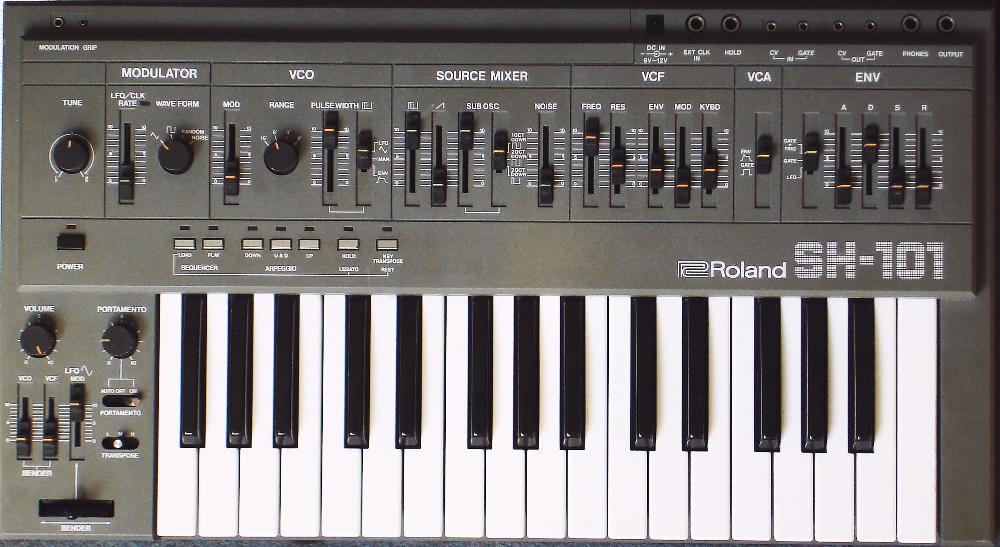

# The Center Table: Non-Modular Synthesizers

- Non-Modular Synthesizers
  - [Glossary](./glossary.md)
  - [Roland SH-101](#Roland-SH-101)
  - [Sequential Prophet 6](#Sequential-Prophet-6)
  - [Deckard's Dream MK2](#Deckard's-Dream-MK2)
  - [Roland GI-10 Guitar Synth](#GI-10)

## Roland SH-101

The [Roland SH-101](https://en.wikipedia.org/wiki/Roland_SH-101) is a monophonic [analog synthesizer](https://en.wikipedia.org/wiki/Analog_synthesizer).  It was produced from 1982-1986, and released in the US at $495 USD. Although originally designed to be paired with a keytar attachment, the low entry cost, small size, and easily accessible sequencer and arpeggiator led it to become a staple in the electronic house music scene of the 90s.  

The single voice the SH-101 produces can be mixed as a combination of a square wave, sawtooth wave, and sub oscillators. There is an onboard envelope for the  and LFO that can be used to control  

## Sequential Prophet 6
Test 

## Deckard's Dream MK2
Test

## Roland GI-10
Test

