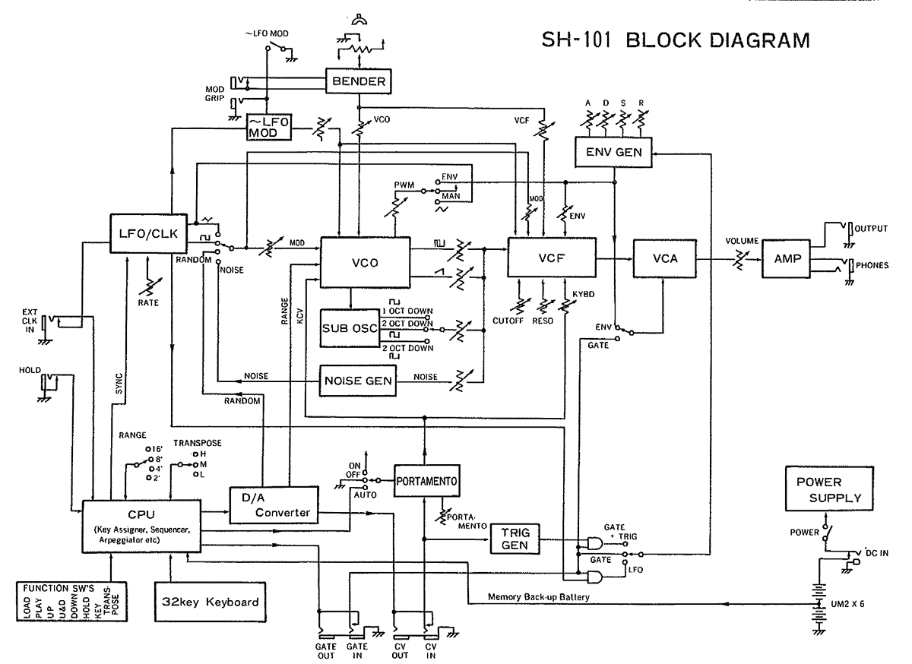
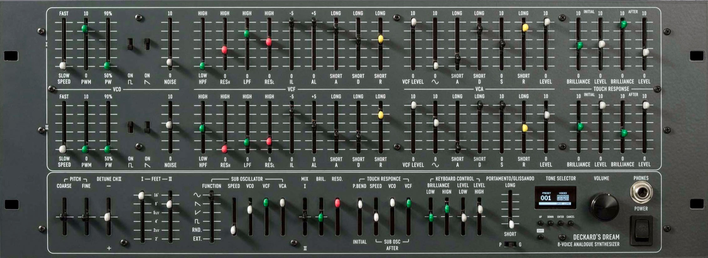

# The Center Table: Non-Modular Synthesizers

- Non-Modular Synthesizers
  - [Glossary](./glossary.md)
  - [Roland SH-101](#Roland-SH-101)
  - [Sequential Prophet 6](#Sequential-Prophet-6)
  - [Deckard's Dream MK2](#Deckard's-Dream-MK2)

The center table in the IDM audio lab is home to a group of non-modular synthesizers.  These are [analog synthesizers](https://en.wikipedia.org/wiki/Analog_synthesizer) in various styles that follow the tradition of ["East Coast"](https://reverb.com/news/the-basics-of-east-coast-and-west-coast-synthesis) synthesis design, where the format for control of pitches are based on Western scales, often assuming a piano-style control layout.  These synthesizers focus on subtractive synthesis techniques where simple, richer waveforms like sawtooth and square waves are carved away using filters to create custom sounds.  

**If you are confused where to start, each synthesizer on the central island has a picture printed with preset parameters of a setting that would produce a tone for you to explore from!**

## Roland SH-101

The [Roland SH-101](https://en.wikipedia.org/wiki/Roland_SH-101) is a monophonic synthesizer produced from 1982-1986, and released in the US at $495 USD. Although originally designed to be paired with a [keytar](https://en.wikipedia.org/wiki/Keytar) attachment, the low entry cost, small size, and easily accessible sequencer and arpeggiator led it to become a staple in electronic house music of the 80s and [90s](https://www.youtube.com/watch?v=ksU7GwykPXQ&t=33s&ab_channel=SunshineJones).  

The single voice the SH-101 produces can be mixed as a combination of a square wave, sawtooth wave, and subharmonic (1 or 2 octaves down) oscillators, as well as noise. There is a single envelope, filter, and VCA for the oscillators, as well as an LFO that can be controlled internally or externally to modulate various parameters. The SH-101's keyboard is not velocity sensitive, but the instrument contains a two-axis bend controller that can also modulate various parameters of the sound, as well as an adjustable [portamento](https://en.wikipedia.org/wiki/Portamento) control. Rounding things out, the SH-101 also contains some interesting compositional features, including an [arpeggiator](https://en.wikipedia.org/wiki/Arpeggio) and a simple step sequencer, both of which can be externally clocked. The SH-101 is a pre-MIDI device, and as such uses the [CV/gate](https://en.wikipedia.org/wiki/CV/gate) control standard common on other analog synthesizers of the day. 

The SH-101, like many Roland products, was designed for a market different from the userbase that eventually adopted it. Originally available in grey, deep blue, and fire engine red, the SH-101 was intended as an affordable, lightweight monosynth for [rock and pop keyboard players to play live](http://retrosynthads.blogspot.com/2013/03/roland-blue-sh-101-takes-you-where-you.html), and could be worn as a keytar, where one could attach a short neck and strap to carry the synth around stage with a built-in battery. We do not have the external gear in the lab, but feel free to lie on your side next to the synth and pretend!

A scan of the original user manual can be found [here](http://dl.lojinx.com/analoghell/RolandSH101-OwnersManual.pdf).

### SH 101 Architecture

Architecturally, the SH-101 is a fairly straightforward analog monosynth, with a VCO flowing through a VCF into a VCA; the keyboard controls, a single ADSR envelope, and a single LSO provide the control architecture. The SH-101 uses a VCO core chipset made by [Curtis Electromusic](https://en.wikipedia.org/wiki/CEM_and_SSM_chips) (the CEM3340), alongside Roland's proprietary IR3109 4-pole filter. While the synthesis itself is 100% analog, the keyboard interface and performance controls, as well as the arpeggiator and sequencer, supply voltages to the synthesizer via an 8-bit microprocessor (a Toshiba TMP80C49P-6).

Much like the ARP-2600, most of the SH-101 controls on the top panel are slider-based, and allow you to control the amount (or gain) of various parameters. In the *Source Mixer* section, for example, the sliders allow you to mix in the amount of the different waveforms; in the *VCF* section, you are using the sliders to determine how the frequency of the filter responds to the envelope, the LFO ("MOD") or the key being pressed.

## Sequential Prophet 6

The [Prophet-6 Desktop](https://www.sequential.com/product/prophet-6-desktop/) is a 6-voice analog synthesizer, developed by [Sequential](https://www.sequential.com/) as a modern reissue of their famed [Prophet-5](https://en.wikipedia.org/wiki/Prophet-5) synthesizer from 1978, which is generally controlled by an [Akai MPK-225](https://www.akaipro.com/mpk225) MIDI controller, but can also be controlled by a Roland [GI-10](https://www.soundonsound.com/reviews/roland-gi-10) Guitar-to-MIDI Interface.

The user manual can be found [here](https://yo41t1y5gos9jw8f3lptw0xo-wpengine.netdna-ssl.com/wp-content/uploads/2021/02/Prophet-6-Operation-Manual-2.1.pdf).

### The Sequential Prophet 6 is:

- [**Polyphonic / monotimbral**](https://en.wikipedia.org/wiki/Polyphony_and_monophony_in_instruments#Monophonic) : the Prophet 6 was designed to be played with an external keyboard controller with up to 6 notes at a time available.  Each note makes the same kind of "sound," or timbre. @@@@However, with a little bit of work, you can re-patch an ARP to leverage the four sound sources independently of one another to create more than one sound at a time.
- **Voltage-based** : the Prophet 6 uses analog voltage for transmitting [analog audio signals](https://en.wikipedia.org/wiki/Analog_signal) (e.g. the sound coming from the oscillators).  However, the synth's predecessor, the Prophet-5, was the first polyphonic synthesizer with fully programmable memory.  It essentially translated the physical interface to digitally the [control voltages](https://en.wikipedia.org/wiki/CV/Gate) linked to each unique parameter on the synthesizer. As such, the Prophet-6 has 500 preset configurations and 500 additional empty presets that you edit, save and override.
- **Subtractive** : the Prophet-6 makes sound based on the principles of [*subtractive synthesis*](https://en.wikipedia.org/wiki/Subtractive_synthesis) - the oscillators create waveforms rich in harmonic content which are then shaped by the filters and amplifiers. This is in contrast to [*additive* synthesizers](https://en.wikipedia.org/wiki/Additive_synthesis) where simple waveforms (e.g. sine waves) are combined to make complex tones. Subtractive synthesis, along with a default (keyboard-oriented) wiring pathway, is part of what makes the Prophet-6 a classic [*"East Coast"*](https://reverb.com/news/the-basics-of-east-coast-and-west-coast-synthesis) synthesizer.
- **Single source / single destination** : the modules on the Prophet 6 are mainly controlled onboard.  It has two primary oscillators that can be shaped and scaled on board, and the onboard mixer allows you to balance these oscillators, a sub-octave oscillator, and noise to taste.
- **Modular design** : the Prophet 6 was intended to be used as part of a  a standalone instrument. This allows the Prophet to be both as powerful as the full keyboard unit, yet much more portable.

### The Controllers
The Sequential Prophet 6 is controlled using MIDI input.  As such, two types of MIDI controllers are set up to operate the Prophet.  First is the Arturia Keystep, which is also used to control the ARP 2600 and the Korg M1 synthesizers in the audio lab.  This controller is based on a piano keyboard, and has a built in arpeggiator, sequencer, pitch bend slider, and mod wheel.  

The other MIDI controller that is currently operating the Prophet 6 is the Roland GI-10 MIDI-Guitar Interface.  This allows you to control the synthesizers using any electric guitar.  This interface uses a polyphonic 6-string pickup that translates the most prominant frequency being played on each string to a 6 voice MIDI message that is then sent to the Prophet.

To attach the Roland GK-2A to an electric guitar, first use double sided tape to attach the Roland GK-2A to the body of the guitar.  Then, slide the GK-2A's pickup under the strings adjacent to the pickups already in place so that the individual strings align directly above each of the individual pickups, as can be seen below.  Attach the pickup into place with a piece of scotch tape on either side, and you're ready to go!

## Deckard's Dream MK2

The [Deckard's Dream](https://black-corporation.com/product/deckards-dream-mk2/) is an 8-voice analog synthesizer, developed by the [Black Corporation](https://black-corporation.com/) as a modern reimagining of the Yamaha [CS-80](https://en.wikipedia.org/wiki/Yamaha_CS-80) synthesizer from 1977, which is controlled by a Roli [Seaboard Rise 25](https://roli.com/products/seaboard)/[MPE](https://www.midi.org/articles-old/midi-polyphonic-expression-mpe) keyboard controller.

The user manual can be found [here](https://images.thomann.de/pics/atg/atgdata/document/manual/454865_deckards_dream_manual_130.pdf).

### The Deckard's Dream MK2 is:

### The Controller

