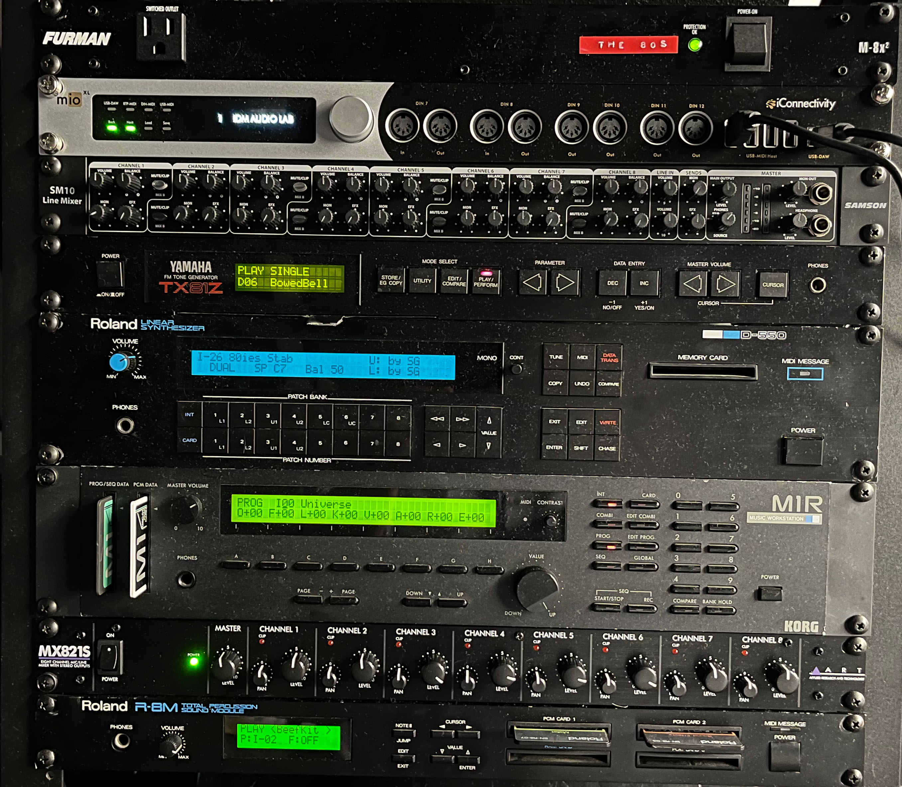
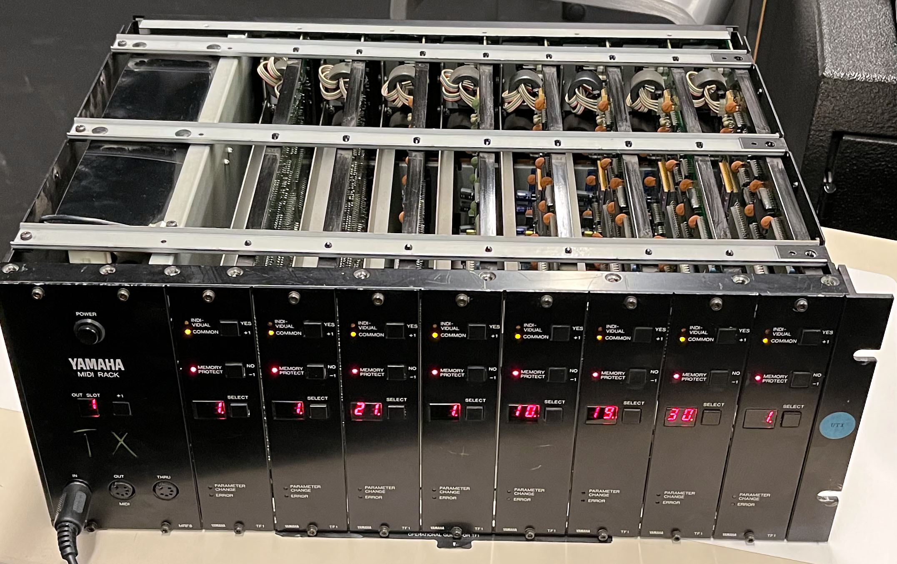

# The Eighties: Digital Synthesizers

- [Overview](#Overview)
- [Glossary](./glossary.md)
- The Synths
  - [Yamaha TX81Z](#TX81Z)
  - [Roland D-550](#D-550)
  - [Korg M1R](#M1R)
  - [Yamaha TX816](#TX816)
  - [Roland R-8M](#R-8M)
- [MIDI Interface](#MIDI-Interface)
- [Line Mixer](#Line-Mixer)

## Overview
 
The IDM audio lab contains a mobile rack (*"The 80s"*) of rackmount digital synthesis equipment, such as would be found in a typical professional recording studio circa 1989. The rack sits next to the mixer at the end of the center table; there is a MIDI keyboard (an [Akai MPK-225](https://www.akaipro.com/mpk225) wired into the MIDI interface at the top of the rack; there is also a USB cable for interfacing with a laptop. The audio from the line mixer at the top of the rack goes into channels 9 and 10 of the center table's mixer (the UFX-1204).

In its current configuration, the rack contains two FM synthesizers from Yamaha (a TX816 and a TX81Z), a hybrid digital wavetable / subtractive synthesizer (the Roland D-550), and two classic ["ROMplers"](https://en.wikipedia.org/wiki/Rompler): a Korg M1R workstation and a Roland R-8M percussion module. All of the 80s synthesizers' audio comes into a line mixer (a Samson SM10) at the top of the rack, and are controlled by a high end rackmound MIDI interface (an iConnectivity mioXL).

## TX81Z

The [**Yamaha TX81Z**](https://en.wikipedia.org/wiki/Yamaha_TX81Z), released in 1987, is one of the later Yamaha synthesizers to use [FM Synthesis](https://en.wikipedia.org/wiki/Frequency_modulation_synthesis) as its core sound generation technique (for an earlier FM synthesizer from Yamaha, see the [TX816](#TX816), below). Released as a rackmount (keyboard-less) unit that could be driven by MIDI, it was a quarter of the price of the contemporary DX-series FM synthesizer with a keyboard (the [DX7ii](https://www.vintagesynth.com/yamaha/dx7ii.php)). As such, it was incredibly popular with producers in low- to mid-budget recording studios, and its sounds (especially its bass sounds) are ubiquitous in electronic dance music from the era.

The TX81Z has 8-voice polyphony and has two significant improvements over the [original](https://en.wikipedia.org/wiki/Yamaha_DX7) in the Yamaha FM line: 

- The TX81Z is [multi-timbral](https://en.wikipedia.org/wiki/Timbrality), allowing for up to eight individual programs to be used simultaneously in "performance mode", with each program being assigned to a voice that responds to a different MIDI channel, and
- The core FM synthesizer inside the TX81Z can use eight different waveforms, not just sine waves as in the original DX series.

On the downside, the TX81Z has a smaller set of operators (4 instead of 6) in its synthesis architecture, with a correspondly lower number - 8 instead of 32 - of available "algorithms" (configurations of operator oscillators).

The original manual for the TX81Z can be found [here](http://thesnowfields.com/manuals/Yamaha%20TX81Z.pdf).

If you are interested in programming the TX81Z, there is a Max-for-live patch editor ("TX81Z_Luke.amxd") in the audiolab GitHub repository under [the 'testpatches' folder](https://github.com/IDMNYU/audiolab/tree/master/testpatches). There are also software editors for the TX81Z such as [Patch Base](https://coffeeshopped.com/patch-base/editor/yamaha/tx81z) and [Midi Quest](https://squest.com/Products/MidiQuest12/Instruments/YamahaTX81Z/) that can be used to program the synthesizer.

## D-550

Released in 1987, the [**Roland D-50**](https://en.wikipedia.org/wiki/Roland_D-50) synthesizer was Roland's first real foray into digital synthesis, coming a full four years after the Yamaha DX7 completely disrupted the (analog) synthesizer market. The D-50, and its rack version the **D-550** (such as we have here), used a synthesis technique that combined both the cutting edge world of sampling and the classic architecture of subtractive synthesis. Banking on the notion that the *attack* of a note is the most crucial for simulating real live instruments, the D-50/D-550 used 128kB (yes, *kilobytes*) of read-only sample memory to generate the attacks of its sounds - 100 very short waveforms recorded from violins, pianos, guitars, and other instruments. These short waveforms were then quickly blended into standard mathematical synthesizer waveforms (sine waves, sawtooth waves, etc.) that would continue the sound using a digital version of a classic subtractive (oscillator->filter->amplifier) architecture. 

This "something old, something new" synthesis technology - dubbed [Linear Arithmetic Synthesis](https://en.wikipedia.org/wiki/Linear_arithmetic_synthesis), was quite complex - each sound program could be made up of up to four sound sources across two layers, with extensive control over filter and amplifier envelopes, a ring modulator, LFOs, and other ways to parametrically modify the sound. In addition, the D-50/D-550 was the first digital synthesizer to contain onboard effects; leveraging Roland's extensive edge over its synthesizer competitors in the signal processing department, the D-50/D-550 allowed reverb and chorus to be added to any sound.

The D-50 was an incredibly influential synthesizer, paving the way for the later "ROMplers"; its sounds are quite [iconic](https://www.youtube.com/watch?v=3sXdYXYI_ZI&ab_channel=DoctorMix), and several of its presets became part of the "Synth Pad" and "Synth Effects" banks in the [General MIDI](https://en.wikipedia.org/wiki/General_MIDI#Synth_Pad) specification.

The original manual for the D-550 can be found [here](https://www.polynominal.com/site/studio/gear/synth/roland_d550/roland-d550-manual.pdf).

If you are interested in programming the D-550, [Patch Base](https://coffeeshopped.com/patch-base/editor/roland/d-550) and [Midi Quest](https://squest.com/Products/MidiQuest12/Instruments/RolandD-550/) both have software that can be used to program the synthesizer.

## M1R

The [**Korg M1**](https://en.wikipedia.org/wiki/Korg_M1) (and its rackmount version, the **M1R**) was released in 1988. The M1 is the bestselling synthesizer in the history of music technology (eclipsing the DX7); over a quarter million were manufactured, and core technology - using curated sets of pre-recorded samples as the primary waveforms - is still common today.

The M1/M1R is what became known as a [ROMpler](https://en.wikipedia.org/wiki/Rompler) - a [sampler](https://en.wikipedia.org/wiki/Sampler_(musical_instrument)) where the samples are curated and fixed by the manufacturer, and expanded via third-party cards; end user direct sampling ins't possible on the M1. The original M1/M1R shipped with 4MB of samples in ROM, with additional sounds available through expansion cards (a later version of the unit - the M1REX - had 8MB). The M1/M1R featured full samples (as opposed to the "attacks" in the D-50) and had a wide variety of curated sounds from instruments across the globe. As a result, the M1 is often credited for (or accused of being complicit in) the explosion of "world music"-influenced dance music in the late 1980s / early 1990s.

In addition to the high quality sounds at the core of its synthesis architecture, the Korg M1 was the first full-featured [music workstation](https://en.wikipedia.org/wiki/Music_workstation) on the market, with a complex multi-track sequencer, extensive MIDI capabilities, onboard effects, and the ability to store up to 7700 sequencer notes across multiple arrangements in non-volatile memory. This made the M1 capable of serving as an all-in-one studio for many composers, arrangers, and electronic music artists.

The original manual for the M1/M1R can be found [here](https://www.polynominal.com/site/studio/gear/synth/korg_m1r/korg-m1-m1r-manual.pdf).

If you are interested in programming the M1R, [Midi Quest](https://squest.com/Products/MidiQuest12/Instruments/KorgM1/) has software that can be used to program the synthesizer.

## TX816

The [**Yamaha TX816**](https://www.vintagesynth.com/yamaha/tx816.php) is a rackmount chassis designed by Yamaha to host up to eight different expansion boards  called TF1 modules, each of which is equivalent to a fully-fledged [DX7](https://en.wikipedia.org/wiki/Yamaha_DX7) without the keyboard. The TX816 proved highly popular in electronic / dance music-focused recording studios, as it allowed a producer to work with eight simultaneous channels of different FM instruments using a sequencer; many tracks associated with (and performed live with) a DX7 were in fact created with a TX816.

Each of the eight FM modules in the TX816 have their own audio output; in the IDM audio lab these outputs are all routed into the [ART Line Mixer](https://artproaudio.com/product/mx821s-eight-channel-mic-line-mixer-with-stereo-outputs/) in the 80s rack in between the M1R and the R-8M.

The owner's manual for the TX816 can be found [here](http://www.synthmanuals.com/manuals/yamaha/tx816/owners_manual/tx816e1.pdf), though this largely talks about the unit as housing for a system of modules rather than the synthesizer itself. Each module in the TX816 is the equivalent of a stand-alone DX7 listening to a different MIDI channel, so the original [DX7 manual](http://www.synthfool.com/docs/Yamaha/DX_Series/Yamaha%20DX7%20Operating%20Manual.pdf) may be a more relevant read.

If you are interested in programming the TX816, [Patch Base](https://coffeeshopped.com/patch-base/editor/yamaha/dx7) has DX7 programmer software that can be used to program each module of the TX816 individually, as does [Midi Quest](https://squest.com/Products/MidiQuest12/Instruments/YamahaDX7/).

## R-8M

The **Roland R-8M** is a rackmount version of the [**R-8**](https://www.vintagesynth.com/roland/r8.php) drum machine from 1989. Unlike the R-8, the R-8M consists only of the *sound module* part of the drum machine; it lacks the performance sequencer. The R-8M has 68 built-in ROM samples, expandable with additional cards on the front panel. These samples consist of recordings of both classic Roland electronic drum machines (e.g. the [TR-808](https://en.wikipedia.org/wiki/Roland_TR-808) and [TR-909](https://en.wikipedia.org/wiki/Roland_TR-909)) as well as high quality samples of acoustic drum and percussion instruments. These samples are arranged as *kits* that are mapped across the MIDI key range so that a single MIDI channel in a sequencer can play a full set of complementary drum sounds.

The orginal R-8M manual can be found [here](http://cdn.roland.com/assets/media/pdf/R-8M_OM.pdf). Midi Quest has an [editor](https://squest.com/Products/MidiQuest12/Instruments/RolandR-8M/) for the R-8M as well, although the factory kits and settings give you access to all the built-in sounds.

## MIDI Interface

An iConnectivity [mioXL](https://www.iconnectivity.com/mioxl) MIDI interface routes MIDI commands to all of the equipment in the 80s rack. The Akai MIDI controller on the table is patched into a front panel input, as is a USB cable for connecting a laptop. The presets on the MIDI interface, which can be recalled by scrolling and clicking with the main selector wheel, allow you to route MIDI to all the devices, or just individual items in the rack.

## Line Mixer

A [Samson SM10](http://www.samsontech.com/samson/products/mixers/sm-series/sm10/) Line Mixer at the top of the 80s rack collects all the audio signals from the equipment and puts out a final stereo feed, wired to channels 9 and 10 on the UFX1204 Mixer on the center table. **Please do not adjust the levels on the line mixer.**

[return to main page](./index.md)
