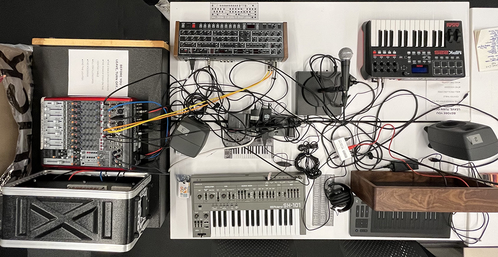
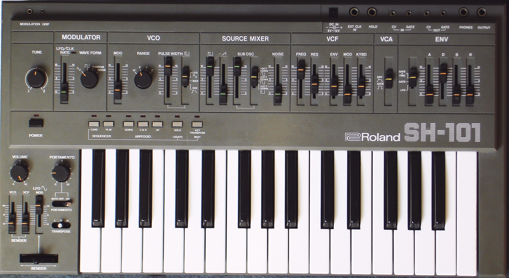
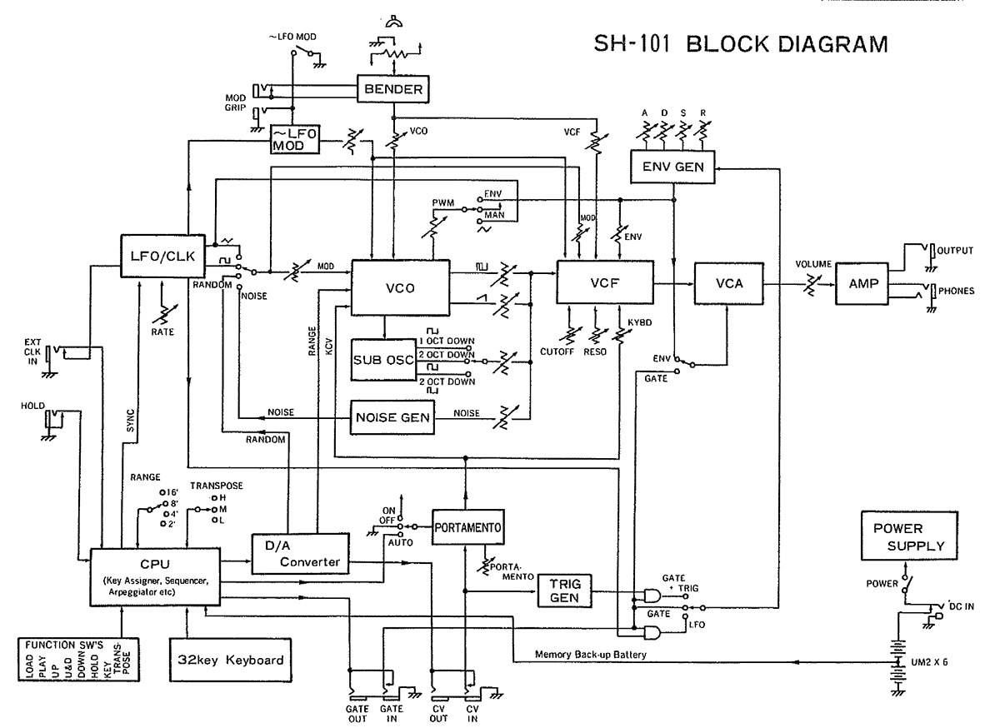
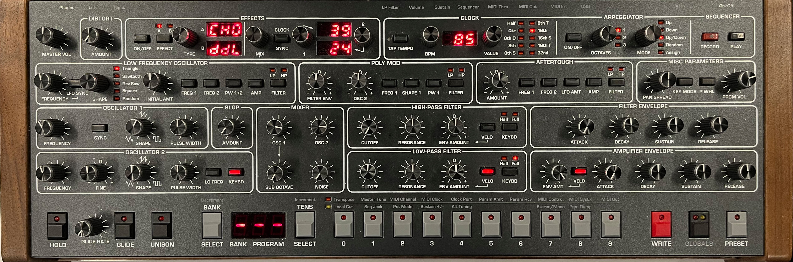
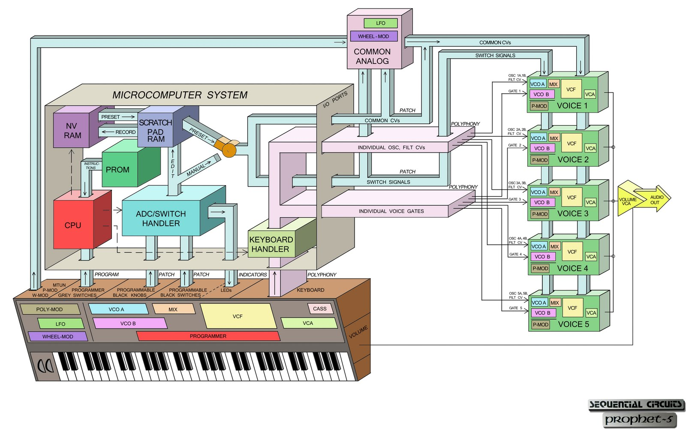
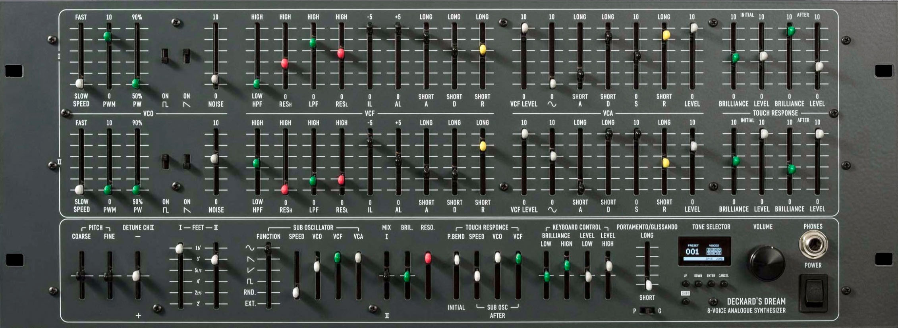
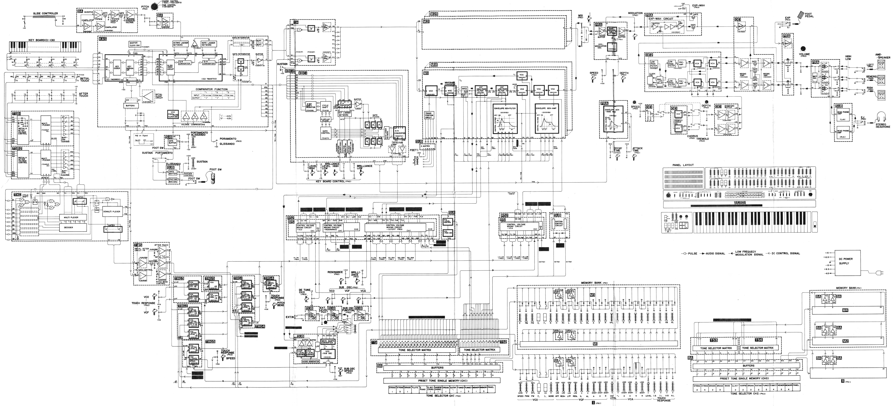

# The Center Table: Non-Modular Synthesizers

- [Overview](#overview)
- [Glossary](./glossary.md)
- The Synths
  - [Roland SH-101](#sh-101)
  - [Sequential Prophet 6](#prophet-6)
  - [Black Corporation Deckard's Dream MK2](#deckards-dream)

## Overview

The center table in the IDM audio lab is home to a group of non-modular synthesizers.  These are [analog synthesizers](https://en.wikipedia.org/wiki/Analog_synthesizer) in various styles that follow the tradition of ["East Coast"](https://reverb.com/news/the-basics-of-east-coast-and-west-coast-synthesis) synthesis design, where the format for control of pitches are based on Western scales, often assuming a piano-style control layout.  These synthesizers focus on subtractive synthesis techniques where simple, richer waveforms like sawtooth and square waves are carved away using filters to create custom sounds.  

**If you are confused where to start, each synthesizer on the central island has a picture printed with preset parameters of a setting that would produce a tone for you to explore from!**

## SH-101

The [Roland SH-101](https://en.wikipedia.org/wiki/Roland_SH-101) is a monophonic synthesizer produced from 1982-1986, and released in the US at $495 USD. Although originally designed to be paired with a [keytar](https://en.wikipedia.org/wiki/Keytar) attachment, the low entry cost, small size, and easily accessible sequencer and arpeggiator led it to become a staple in electronic house music of the 80s and [90s](https://www.youtube.com/watch?v=ksU7GwykPXQ&t=33s&ab_channel=SunshineJones).  

The single voice of the SH-101 contains a voltage-controlled oscillator that outputs a square wave, sawtooth wave, and subharmonic (1 or 2 octaves down) oscillator, as well as noise, each of which can be mixed together independently. There is a single envelope, filter, and VCA for the oscillators, as well as an LFO that can be controlled internally or externally to modulate various parameters. The SH-101's keyboard is not velocity sensitive, but the instrument contains a two-axis bend controller that can also modulate various parameters of the sound, as well as an adjustable [portamento](https://en.wikipedia.org/wiki/Portamento) control. Rounding things out, the SH-101 also contains some interesting compositional features, including an [arpeggiator](https://en.wikipedia.org/wiki/Arpeggio) and a simple step sequencer, both of which can be externally clocked. The SH-101 is a pre-MIDI device, and as such uses the [CV/gate](https://en.wikipedia.org/wiki/CV/gate) control standard common on other analog synthesizers of the day. 

The SH-101, like many Roland products, was designed for a market different from the userbase that eventually adopted it. Originally available in grey, deep blue, and fire engine red, the SH-101 was intended as an affordable, lightweight monosynth for [rock and pop keyboard players to play live](http://retrosynthads.blogspot.com/2013/03/roland-blue-sh-101-takes-you-where-you.html), and could be worn as a keytar, where one could attach a short neck and strap to carry the synth around stage with a built-in battery. We do not have the external gear in the lab, but feel free to lie on your side next to the synth and pretend!

A scan of the original user manual can be found [here](http://dl.lojinx.com/analoghell/RolandSH101-OwnersManual.pdf).

### SH-101 Architecture

Architecturally, the SH-101 is a fairly straightforward analog monosynth, with a VCO flowing through a VCF into a VCA; the keyboard controls, a single ADSR envelope, and a single LSO provide the control architecture. The SH-101 uses a VCO core chipset made by [Curtis Electromusic](https://en.wikipedia.org/wiki/CEM_and_SSM_chips) (the CEM3340), alongside Roland's proprietary IR3109 4-pole filter. While the synthesis itself is 100% analog, the keyboard interface and performance controls, as well as the arpeggiator and sequencer, supply voltages to the synthesizer via an 8-bit microprocessor (a Toshiba TMP80C49P-6).

Much like the ARP-2600, most of the SH-101 controls on the top panel are slider-based, and allow you to control the amount (or gain) of various parameters. In the *Source Mixer* section, for example, the sliders allow you to mix in the amount of the different waveforms; in the *VCF* section, you are using the sliders to determine how the frequency of the filter responds to the envelope, the LFO ("MOD") or the key being pressed.

## Prophet 6

The [Prophet-6 Desktop](https://www.sequential.com/product/prophet-6-desktop/) is a 6-voice analog synthesizer, released in 2015 by [Sequential](https://www.sequential.com/) as a modern reissue of their famed [Prophet-5](https://en.wikipedia.org/wiki/Prophet-5) synthesizer from 1978. The Prophet 6 in the IDM audio lab is the "desktop" (keyboard-less) model; you can control it via MIDI with either an [Arturia KeyStep](https://www.arturia.com/keystep/overview) MIDI controller or a Roland [GI-10](https://www.soundonsound.com/reviews/roland-gi-10) Guitar-to-MIDI Interface.

The Prophet line of synthesizers, developed by Dave Smith and John Bowen, were the first commercially-available fully polyphonic analog synthesizers to feature user-customizable [presets](https://en.wikipedia.org/wiki/Preset). Smith and Bowen accomplished this by inserting a digital microprocessor between the synthesizer's front-panel controls and the analog circuity of the voice boards making the actual sounds. This meant that the voltage supply to the various components of the synthesizer was coming from the *microprocessor* based on a continuous reading of the input knobs and switches, not the controls themselves. When a preset on a Prophet synthesizer is engaged, the stored settings in the microprocessor override the voltages from the front panel; when the user then tweaks a control, that control overrides the preset value (similar to "touch automation" in a DAW). This intuitive system massively simplified using a synthesizer in live performace, eliminating the need for repatching or extensive resetting of controls in between songs. This, and the full polyphony (matched only by the [Oberheim](https://oberheim.com/) sythesizers that were Sequential's main competitor), made the Prophet 5 and its successor instruments incredibly popular.

The user manual can be found [here](https://yo41t1y5gos9jw8f3lptw0xo-wpengine.netdna-ssl.com/wp-content/uploads/2021/02/Prophet-6-Operation-Manual-2.1.pdf).

### Prophet 6 Architecture

The Prophet 6 is very similar to its ancestor from 1978, which the addition of a few features, such as a digital effects processor, stereo outputs, and an arpeggiator / sequencer. The Prophet 6 also takes MIDI and has a USB interface, eliminating the need for CV/Gate and cassette interface on the original. (N.B. Dave Smith was one of the founding designers of the MIDI Specification, and the Prophet 600 from 1982 was the first US keyboard to feature MIDI as a standard feature.)

The Prophet 6, like most analog synthesizers, follows the typical architecture of VCO -> VCF -> VCA. The P6 has two oscillators per voice (Oscillator 1 and Oscillator 2), as well as a subharmonic oscillator that tracks Oscillator 1 an octave below, and a white noise source. Oscillator 2 can have a completely different base frequency than Oscillator 1, allowing per-key harmony, or it can be set to the same pitch and detuned. These sound sources are then mixed together and sent through the filters. The Prophet 6 has both a resonant lowpass and highpass filter, which can be fixed, track alongside the keyboard, be controlled by a filter envelope, an LFO, or a mix of all these options. The filters can be aligned to create a bandpass or notch effect. Finally, a second amplifier envelope controls the VCA, setting the shape of the overall note. Downstream from the synthesizer proper, the Prophet 6 can pan the voices algorithmically across a stereo field and add effects such as reverb, chorus, and. an (analog) distortion.

One of the signature features of the Prophet 5, which also exists on the Prophet 6, is a synthesis technique called *Poly Mod*, where the output of the filter envelope and/or the second oscillator can be blended into the control signal of several parameters of the synthesizer on a per-voice basis. This feedback system, easily accomplished on modular synthesizers but rare on non-modular synthesizers, allows for a wide variety of chaotic and unexpected sounds out of the Prophet synthesizer.

## Deckard's Dream

The [Deckard's Dream](https://black-corporation.com/product/deckards-dream-mk2/) is an 8-voice analog synthesizer, developed by the [Black Corporation](https://black-corporation.com/) as a modern reimagining of the Yamaha [CS-80](https://en.wikipedia.org/wiki/Yamaha_CS-80) synthesizer from 1977. The Deckard's Dream is a rack unit, and can be controlled via MIDI by an [Arturia KeyStep](https://www.arturia.com/keystep/overview) MIDI keyboard controller.

The Yamaha CS line of synthesizers, developed in the late 1970s and associated with artists such as Vangelis, were incredibly feature rich, and contained a number of innovations, particularly in the ways in which they could be [performed by a keyboard player](https://en.wikipedia.org/wiki/Keyboard_expression). Unlike most analog synthesizers of the day, the CS synthesizers supported both velocity sensitivity and per-key (or polyphonic) *aftertouch*, allowing a performer to play, e.g. a three note chord and then, by pressing hard on just the middle note, adjust the filter resonance on only that voice. The CS series also came with a ribbon controller across the top of the keyboard that could be mapped to filter sweeps and pitch bends. The CS-80, the synthesizer at the top of the line, could play 8 voices at once, had a number of presets (including 4 "mini-me" style user presets stored on small sliders inside a panel), and weighed 180lbs (82kg). In addition to the synthesizer itself, the CS-80 also had an effects section with a ring modulator.

While not an exact replica, the Deckard's Dream is a faithful modern reimaging of the CS-80, built from a DIY Kit. The rack interface supports MIDI/USB input, and (unlike the original) has presets, digital settings to control parameter ranges and tuning, and other modern features unavailable at the time.

The user manual for the Deckard's Dream can be found [here](https://images.thomann.de/pics/atg/atgdata/document/manual/454865_deckards_dream_manual_130.pdf).

### Deckard's Dream Architecture

The Deckard's Dream, like the CS-80 that inspired it, has 8 fully polyphonic voice boards. Each voice consists of two layers, each with their own oscillator, filter section (with filter envelope), and VCA (with amplitude envelope). Unlike most synthesizers of the day, there is extensive max/min mapping of both the velocity and aftertouch parameters of the keyboard to ranges of the filters and amplifiers. This allows you to design a sound where the keyboard note velocity increases the filter brightness but decreases the note volume. The Deckard's Dream (and the CS-80) also has a novel architectural adjustment to the synthesizer design where a sine wave can be introduce *independently* of the filter section before the VCA. This allows for you to high-pass one of the harmonic rich waveforms and then reintroduce a fundamental; this is one of the classic "sounds" of the CS synthesizers that was unique to the line.

[return to main page](./index.md)
