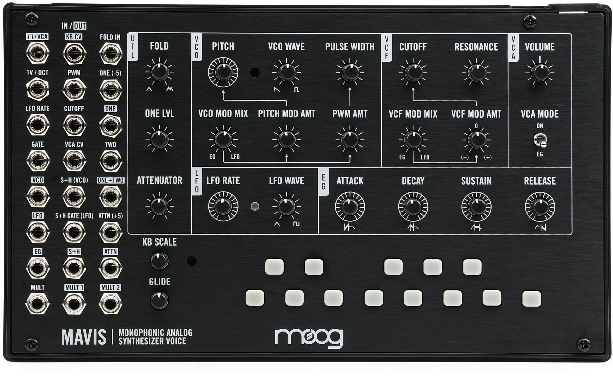

# IDM Equipment Room - Audio-Lab-to-go

- [Overview](#overview)
- [Moog Mavis](./mavis.md)

## Overview

The IDM Equipment room has a number of small analog synthesizers (and related gear) that can be checked out by students in courses using the Audio Lab.

## MAVIS

The [Moog Mavis](https://www.moogmusic.com/products/mavis) is a DIY synthesizer kid made by Moog that contains a semi-modular, one voice synthesizer. The kits in the IDM equipment room contain a power supply and pack of patch cables, allowing for experimentation.

[return to main page](./index.md)
