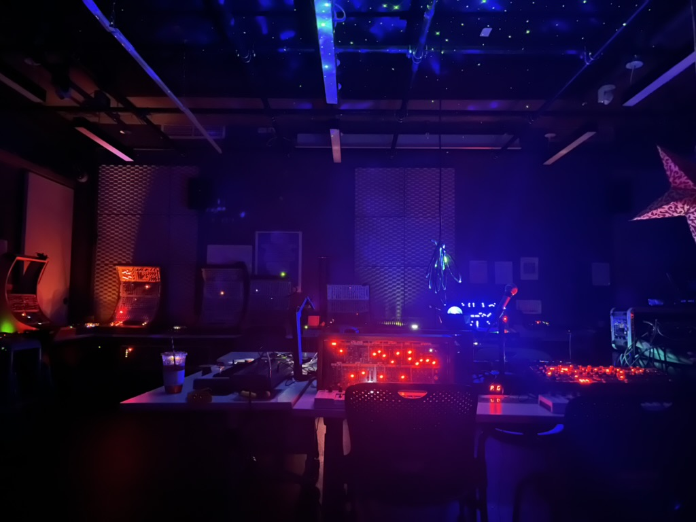

# NYU Integrated Design & Media
## Audio Lab website and studio manual
Information about the IDM Audio Lab (2MTC, Room 824)

Last updated Fall, 2026.

**[Policies, Rules, Reservations, Accessibility, and Contacts](./rules.md)**

**[The Synthesizers](./synths.md)**

**[The Multi-channel Audio System](./multichannel.md)**

**[The Piano](./piano.md)**

**[The Amps and the Pedals](./amps.md)**

**[Research](./research.md)**

**[Artist Residency Program](./artists.md)**

The only good system is a sound system.
