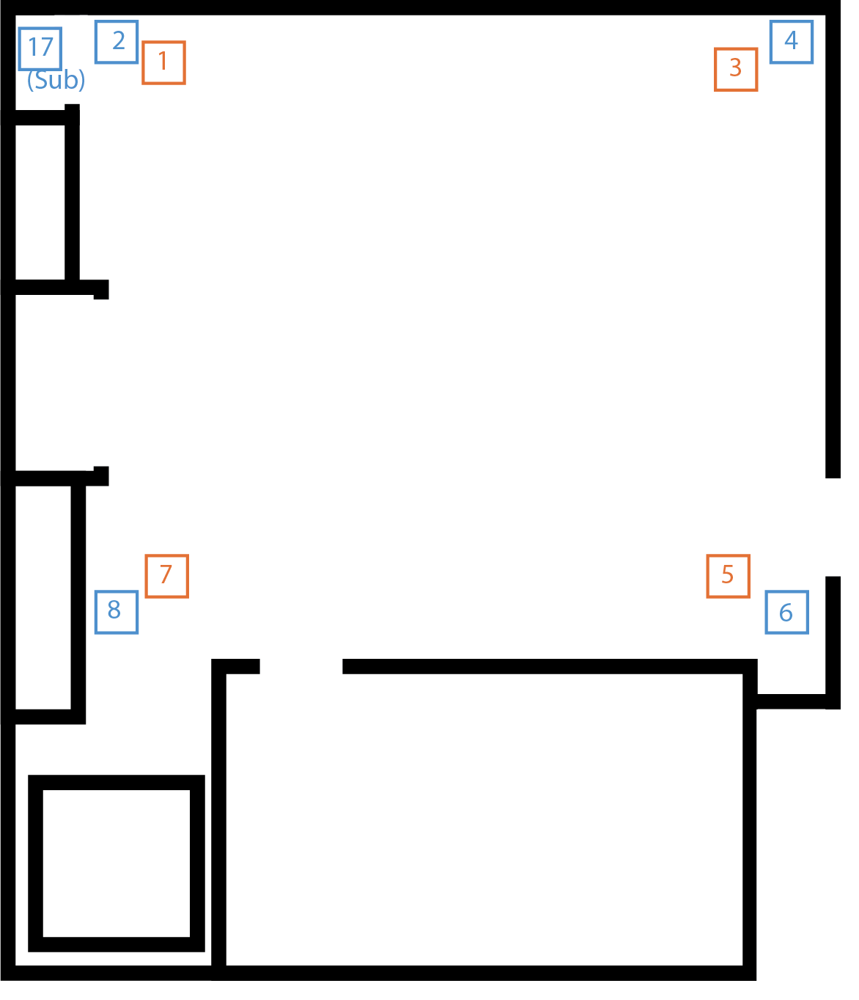
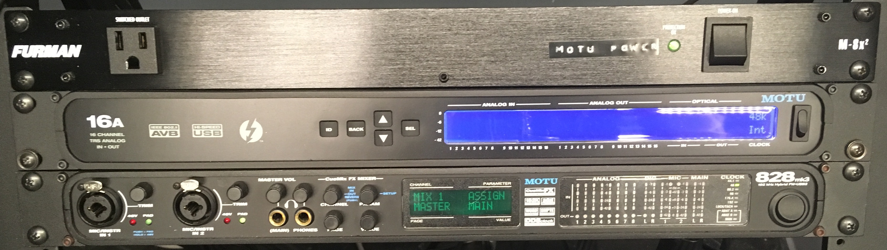
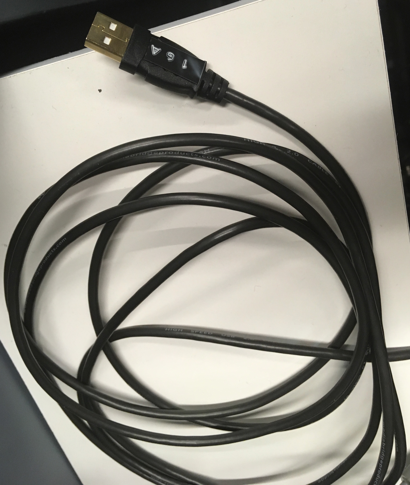
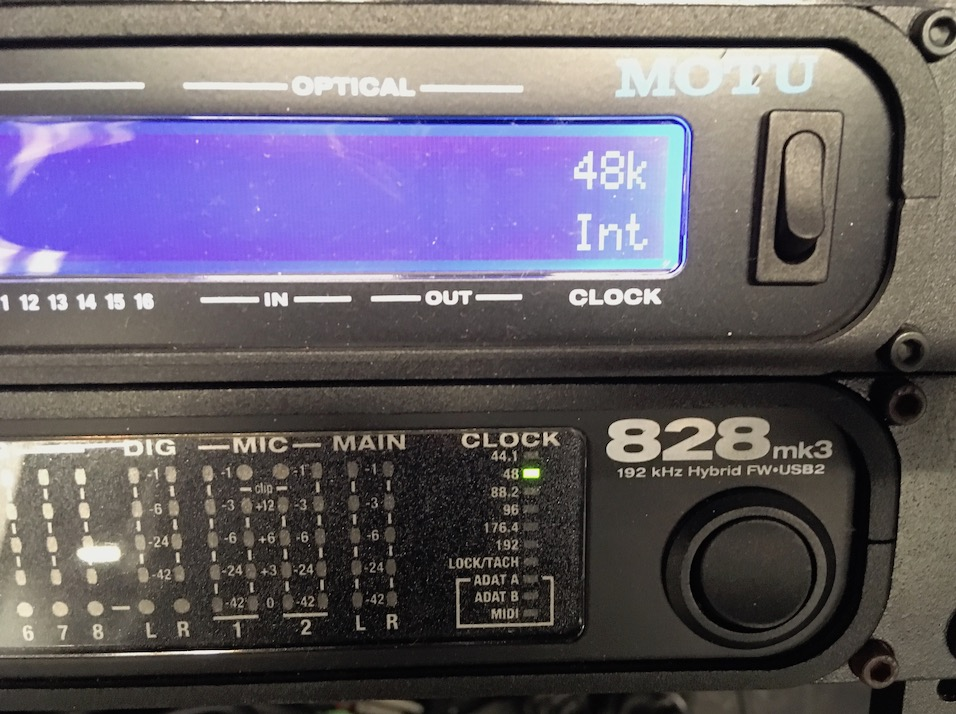
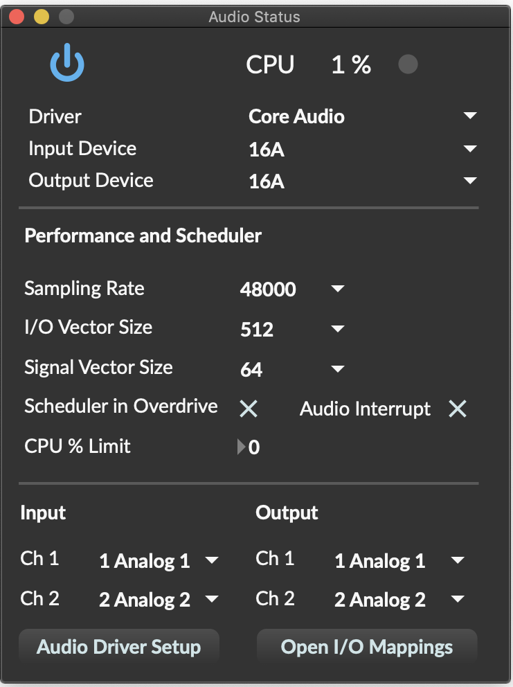

# The IDM Multi-Channel Audio System

- [Overview](#overview)
- [Quickstart](#quickstart)
- [Audio Interfaces](#interfaces)
- [Power Amplifiers](#amplifiers)
- [Computer Input and Output](#computer-input-and-output)

# Overview

The multi-channel audio system in the IDM audio lab consists of an **8.1 system** - 8 full-range speakers, 1 subwoofer - arrayed in a *double quad* configuration. Each corner of the lab has a full-range speaker (a [Micca COVO-S](https://www.miccatron.com/micca-covo-s-concentric-driver-speaker/)) high in the ceiling and low near the floor. The subwoofer (a [Genelec 7060B](https://www.genelec.com/studio-monitors/7000-series-studio-subwoofers/7060b-studio-subwoofer)) is at floor level in one corner of the room. 

The room layout below shows the speaker positions and audio channel numbers - the control room is at the bottom of the plan.

As the image above shows, the full-range speakers are numbered 1-8 and the subwoofer is numbered 17. The red-colored speakers (1, 3, 5, 7) are at ceiling level and the blue-colored speakers (2, 4, 6, 8, and 17) are near the floor.

The audio for the multi-channel system is controlled by an equipment rack in the closet at the back of the room. The top of the rack consists of a [Furman power conditioner](https://www.furmanpower.com/) and two audio interfaces - a [MOTU 16A](https://motu.com/products/avb/16a) and a [MOTU 828mk3](https://cdn-data.motu.com/manuals/firewire-usb-audio/828mk3_Hybrid_Manual_Mac.pdf). The bottom of the rack contains a pair of [QSC](https://www.qsc.com/) 8-channel power amplifiers.

[back to top](#top)

# Quickstart

To work with the system:
* Turn on the Furman power conditioner.
* Connect to the USB cable attached to the 16A.
* Select the MOTU 16A as your audio interface.
   * Outputs are 1-8 (full-range) and 17 (sub).
   * Inputs are 17-18 for the front-panel inputs on the MOTU 828mk3.
   
When you're finished:
* Shut down your audio software.
* Power off the Furman power conditioner.
* Unplug the USB cable, coil it and leave it on the white shelf in the closet for the next user.

Do not:
* Connect directly to the MOTU 828mk3. Only connect to the MOTU 16A.
* Change the sampling rate or other front-panel settings on either audio interface, or shut them off individually.
* Change the trim controls on the QSC amplifiers.

[back to top](#top)

# Interfaces

To work with the multi-channel system, **use the power switch on the Furman** to turn on the interfaces. **Do not switch off the interfaces individually**.

The audio interfaces are connected to one another via optical cable, with the 16A as the primary interface.

**You connect to the system using the USB cable connected to the 16A**, coiled on the shelf to the right. *Do NOT connect a computer directly to the 828mk3*; it is configured as an expander and acts like an extra set of channels for the 16A.

To work with the system, you will need to download and install the [MOTU AVB / Pro Audio Installer](https://motu.com/download) for your operating system. This will allow your computer to recognize the 16A interface.

**The system is designed to work at a 48kHz sampling rate**. If you are using a DAW that allows you to select a different rate for the 16A, you may encounter problems using the subwoofer or the mic inputs on the 828mk3. The interfaces list 48kHz as their sampling rate when operating normally:

[back to top](#top)

# Amplifiers

The full-range speakers are amplified by a pair of 8-channel power amplifiers at the bottom of the equipment rack. **Only the bottom amplifier is currently in use.**

[back to top](#top)

# Computer Input and Output

The MOTU 16A provides 16 channels of audio I/O into your computer. The 828mk3 acts as an expander, adding another 8 channels.

*16A Outputs:*
* Channels 1-8 are the full range speakers in the room.
   * The high speakers are channels 1,3,5,7.
   * The low speakers are channels 2,4,6,8.
* Channel 17 is the subwoofer, via an ADAT link to Main Out L on the 828mk3.

*16A Inputs:*
* Channels 17-18 are linked via ADAT to inputs 1 and 2 on the front panel of the 828mk3. 
  * The "Mic/Instr" Jacks on the front of the 828mk3 allow you to connect mic or line-level audio sources in the room; they appear as inputs 17-18 on the 16A. 
  * The knobs labeled *TRIM* next to each input allow you to adjust the gain for the input signal. 
  * Pressing the TRIM knob in will engage and disengage a 20dB pad, indicated by a green light next to the jack.
  * Pressing and holding the TRIM knob in for a few seconds will turn on and off 48V phantom power, indicated by a red light next to the jack.

To use the 16A, you need to make sure your audio software has it selected as an audio interface. In Max/MSP, your Audio Status window should look something like this:

To send outputs to the different speakers, you would use output channels 1-8 and 17 (for the subwoofer). Similarly, inputs 17 and 18 listen to the front-panel inputs on the 828mk3. In Max/MSP, your **adc~** and **dac~** objects can be assigned to read audio from and write audio to specific channels:

The [testpatches](https://github.com/IDMNYU/audiolab/tree/master/testpatches) folder of this Github repo has a number of patches to help you test the system.

[back to top](#top)

[return to main page](./index.md)
