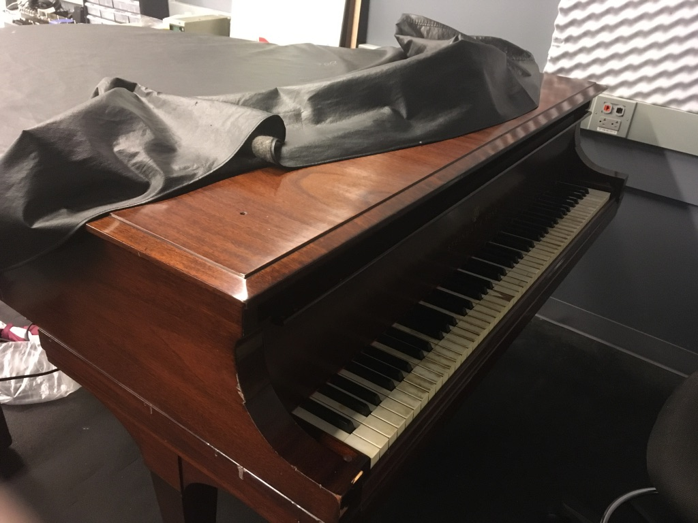

# The Piano

The Piano in the IDM Audio Lab is a 1922 [Steinway Model M](https://www.steinway.com/pianos/steinway/grand/model-m), donated by an alumna of Brooklyn Polytechnic to the school in the mid-1960s. It's there for you to play and record with.

Please follow these rules:
- Don't move the piano. The chassis it sits on will tear up the rubber flooring in the room and make it hard to put back.
- If you raise the lid, please close it when you're done.
- Replace the black protective cover when you're done.

[return to main page](./index.md)
