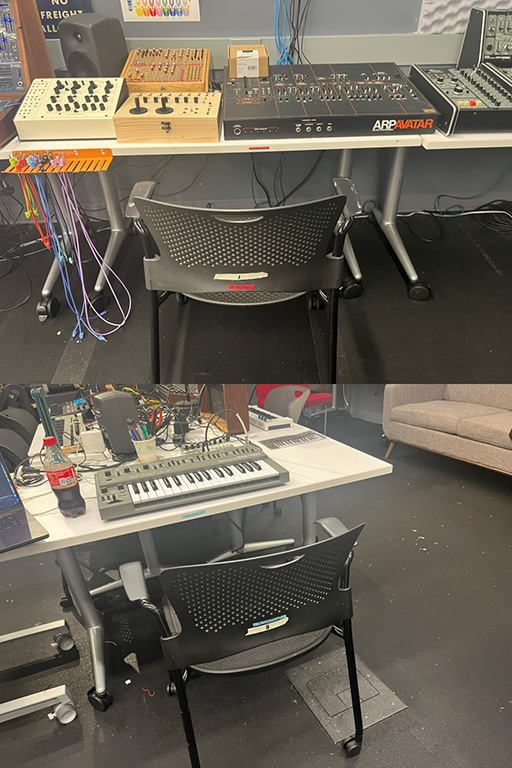
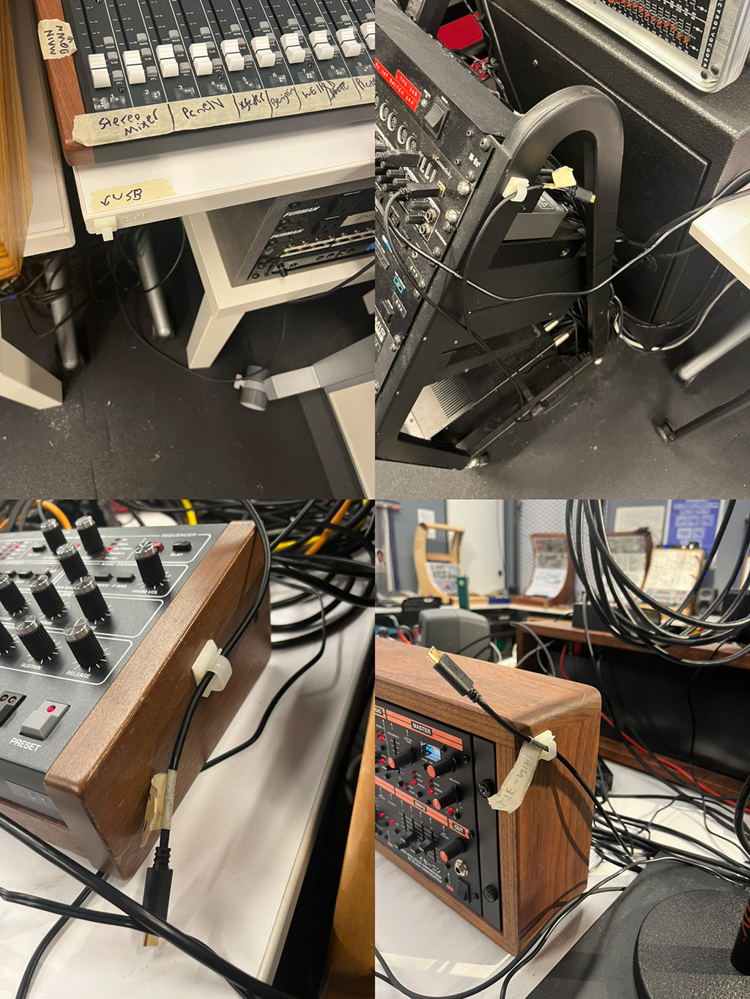

# IDM Audio Lab - READ THIS FIRST

- [Overview](#lab-overview)
- [Policies](#lab-policies)
- [Accessibility Plan](#accessibility-plan)
- [Reservations](#room-reservation-procedure)
- [Discord](#idm-audio-lab-discord)
- [Contact](#contact-emails)

## Lab Overview

*What the Audio Lab is:*

The IDM Audio Lab is **for the use of IDM faculty, students, staff, and guests working in sound**, whether for class assignments, sponsored research, or on their own creative projects. It is a shared space with a lot of different uses...

- Analog synthesizer studio
- Audio research lab
- Sound electronics workshop
- Multi-channel audio room

...each of which is supported by different equipment.

*What the Audio Lab is not:*

The IDM Audio Lab is **not a conventional recording studio**. If you need to record live musicians, do DAW-based audio production, etc., the audio lab in the [370 Jay Street Media Commons](https://www.nyu.edu/life/campus-resources/370-jay-street.html) is a more appropriate facility to use. In addition, NYU's academic programs in [Music Technology](https://steinhardt.nyu.edu/programs/music-technology) (Steinhardt), [Recorded Music](https://tisch.nyu.edu/clive-davis-institute) (Tisch), and the [Music Department](https://www.nyu-waverlylabs.org/) (FAS) have extensive facilities for recording, production, and digital music research.

The IDM Audio Lab is **not a commercial studio**. Under no circumstances can you bring clients in to work with the equipment and then charge them money.

## Lab Policies

In order to be authorized for Audio Lab access, you will need to be trained on the equipment either by Luke or the IDM audio GRA. We'll then send in your card ID and switch on your access to the space.

*Please observe the following rules while working in the Audio Lab*

- The Audio Lab is a **shared, multi-user space**. Please be respectful of other people's equipment and work that might be ongoing. If you need to set up additional equipment, please work with the IDM staff to install it safely and make sure it's clearly got your name on it. If you're working in the room at the same time as others and the volume becomes loud, be courteous of one another and switch to headphones.
- If you don't know how to use a particular setup and the directions aren't clear, **don't wing it**. Ask the audio GRA or one of the IDM faculty or staff for help.
- **No eating or drinking** in the room. The rest of the 8th floor of 2MTC is an open space where you can eat and drink all you want.
- **Don't ever leave the door propped open**, even if you run out for a minute. The 8th floor of 2MTC is used by the entire NYU community, and the Audio Lab has a lot of expensive equipment in it for use by the IDM program.
- **Masks are always welcome**, as per [NYU COVID-19 protocols](https://www.nyu.edu/life/safety-health-wellness/coronavirus-information.html). In addition, there are anti-viral wipes in the room that you can use to wipe down keyboards or other surfaces.

*Please observe the following rules when you're leaving the Audio Lab*

- Clean up after you're done.
- Turn the power off when you leave. **REMEMBER TO SWITCH POWER OFF ONLY ON THE POWER CONDITIONERS, CENTER TABLE POWER STRIPS, INSTRUMENT AMPLIFIERS, AND OSCILLOSCOPES.**
- Leave things so that they're ready for the next person. For the analog synthesizers, take your patch down and store your cables back in the rack; for the center table, normalize the mixing board.
- **DON'T UNPLUG THINGS!!!** Specifically:
    - Don't unplug electrical power for individual pieces of equipment, or use individual power switches on equipment that has them (e.g. the power speakers, the TTSH, the Prophet-6). The power conditioners and center table power strips should be the only way things are turned off and on.
    - Don't disconnect audio connections other than banana and mini jacks used in modular patching. If it's an audio cable running between a piece of equipment and a mixer, or between a mixer and loudspeakers, leave it alone. Please speak to an IDM staff member if you need to hook up new equipment or want to do something that you don't know how to do.
    - Don't disconnect the ground wires (gray banana jacks) woven between and among the Serge synthesizers. The Serge system depends on a common grounding connection between everything.
- Turn the lights off when you leave (switches are by the door), including the faerie lights and spots in the main lab (the switch is against the back wall to the right of the closet).
- Make sure the door is closed and locked when you leave.
- Make sure any equipment you've checked out gets returned to the IDM Equipment Room over in 370 Jay Street.
- Be sure to follow the **accessibility plan** (see below).

## Accessibility Plan

The IDM Audio Lab is designed to be an inclusive, accessible space, and a number of our users may have disabilities. To this end, please adhere to the following guidelines:

- Return all rolling chairs to their places pushed into the tables, which are marked by glitter tape stripes matching the stripes on the backs of the chairs. There are eight chairs in total marked in that way:

- Hang up all the USB cables in the room to their clips to make it easier to reach and access:

## Room Reservation Procedure

Users of the Audio Lab need to be either enrolled in a course that uses the studio, be part of the synth club, or be working on a capstone / thesis project related to sound, with access approved by Luke and Eric. Students in courses and the Synth Club have weekly blocks of time to work in the lab. For the Spring of 2026, these times are:

- *IDM Sound Studio* - Tuesday, Wednesday, Thursday, and Saturday all day
- *Synth Club* - meetings 4-6 on Thursdays, open hours Friday and Sunday all day

Card access for the IDM Audio Lab is automatically granted for students in IDM audio courses and in the Synth Club who have passed the training.

Other students interested in working in the room (e.g. for capstone or thesis work) must be approved to do so by Luke and Eric.

## IDM Audio Lab Discord

The IDM Audio Lab has a Discord channel. Reach out to Luke for the invite link.

## Contact Emails

Who to write for help:

- R. Luke DuBois - IDM Research Director - dubois@nyu.edu
- Craig Fahner - IDM Faculty - craig.fahner@nyu.edu
- Kelly Heaton - IDM Adjunct Faculty, *Analog Heaven* - kbh8174@nyu.edu
- Moira Zhang - IDM Audio GRA - fz2384@nyu.edu
- Jason Wallach - IDM Audio Lab Designer-in-Residence - jmw792@nyu.edu
- Eric Maiello - IDM Administrative Director (*for room access issues only*) - em1680@nyu.edu

[return to main page](./index.md)
