# IDM Serge Synthesizers

- [Serge system overview](#serge-system-overview)
- [Random\*Source Serge](#random-source-serge) ( [La Bestia II](#panel-1-la-bestia-ii) / [Edelweiss II](#panel-2-edelweiss-ii) / [Mantra](#panel-3-mantra) / [TKB](#panel-4-tkb) / [Panel 5](#panel-5-custom) / [Panel 6](#panel-6-custom) )
- [73-73 Serge](#73-75-serge) ( [Homebuilt Panel 1](#homebuilt-panel-1) / [Homebuilt Panel 2](#homebuilt-panel-2) / [Voice Panel](#voice-panel) / [Control Panel](#control-panel))
- [Ian Fritz Panels](#ian-fritz-panels) ( [The Timbre Tantrum](#panel-1-the-timbre-tantrum) / [Chaos Theory](#panel-2-chaos-theory) )
- [STS Panels](#sts-panels) ( [Red Control](#red-control) )
- [CGS Panels](#cgs-panels) ( [Black Swamp](#black-swamp) / [Programmer](#programmer) )
- [Benjolin](#benjolin)
- [Shelfisizer](#the-shelfisizer) ( [2019 Panel](#2019-panel) / [Shelfisequencer](#shelfisequencer) / [2020 Panel](#2020-panel) )
- [Additional Equipment](#additional-equipment) ( [Vermona DRM1](#vermona-drm1) / [Variable Force Generator](#variable-force-generator) / [Converter Boxes](#converter-boxes) / [CV.OCD](#cv-ocd) / [Oscilloscopes](#oscilloscopes) )

## Serge System Overview

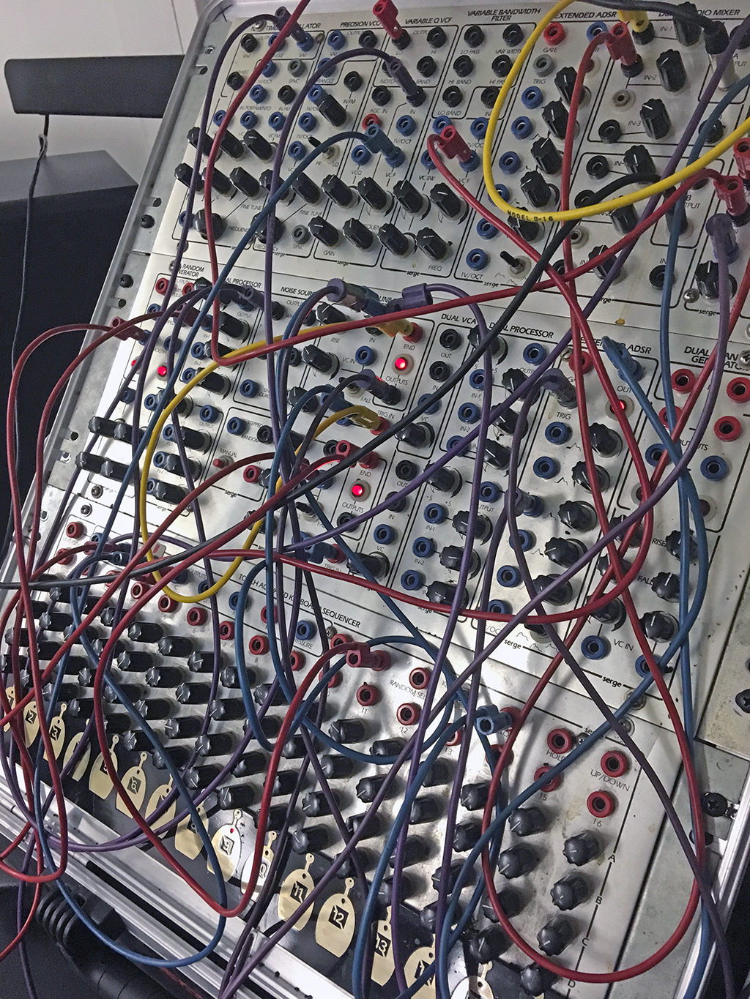

[Serge synthesizers](https://en.wikipedia.org/wiki/Serge_synthesizer) are [analog modular synthesizers](https://en.wikipedia.org/wiki/Analog_synthesizer) based on the designs of [**Serge Tcherepnin**](https://en.wikipedia.org/wiki/Serge_Tcherepnin). Tcherepnin, while working at CalArts in the 1970s, developed his unique approach to synthesizer design after meeting with [Don Buchla](https://en.wikipedia.org/wiki/Don_Buchla) and working with composer [Morton Subotnick](https://en.wikipedia.org/wiki/Morton_Subotnick). Tcherepnin realized that modular synthesizers available at the time were far too expensive to be affordable for students and hobbyists, and so he set out to develop a modular system that was low cost and emphasized flexibility. Working with a team of CalArts students, including Rich Gold, Randy Cohen, and Rex Probe, the first Serge systems (dubbed "The People's Synthesizer") were built in Tcherepnin's home in 1973. Tcherepnin made a number of innovative decisions to keep costs down, such as the use of (cheaper) banana jacks instead of audio connectors, and the ["paperfacing"](http://djjondent.blogspot.com/2013/12/two-panel-vintage-paperface-serge.html) of his synthesizer panels so that the aluminum could be pre-drilled in a grid regardless of the customer's desired module configuration.

In addition, unlike his competitors, Tcherepnin also sold his systems as *kits*, where the customer would receive a circuit board, a face plate and decal label, a Ziploc bag of discrete electronic components, and detailed assembly instructions. This DIY approach - similar to [HeathKit radios](https://shop.heathkit.com/page/homepage) popular at the time - allowed Serge synthesizers to be purchased for a fraction of the cost of a Buchla system if the buyer didn't mind doing some soldering. Many licensed Serge systems today are still sold as kits, with a number of builders, such as our friends at [Patch Point](https://www.patch-point.com/) in Berlin and [Low-Gain Electronics](http://www.lowgain-audio.com/) in Minneapolis available to professionaly assemble the kits into finished synthesizers using high quality components.

Tcherepnin's designs found commercial success as a low-cost alternative to other modular synthesis systems available at the time. His company (Serge Modular Music Systems) sold synthesizers under the **Serge** name until 1986. Tcherepnin then licensed his designs *non-exclusively* to a number of manufacturers, such as [Sound Transform Systems](https://electronicmusic.fandom.com/wiki/Sound_Transform_Systems) in the USA (the corporate successor to SMMS, run by Tcherepnin's former student and employee Rex Probe), [Elby Designs](https://www.elby-designs.com/index.html) in Australia, [Random\*Source](http://randomsource.net/) in Germany, [the Human Comparator](http://73-75.com) in Sweden, and [Loudest Warning](http://loudestwarning.co.uk) in the UK. In addition, a number of synthesizer designers, such as [Bugbrand](https://bugbrand.co.uk), [Modcan](http://www.modcan.com/), [Ciat-Lonbarde](https://ciat-lonbarde.net), and [Kilpatrick Audio](http://kilpatrickaudio.com/), continue to develop new synths using a Serge-inspired or Serge-compatible format.

The [Serge-Fans](http://www.serge-fans.com/history.htm) web page (which doubles as an information site for Sound Transform Systems) is a great resource to learn more about the history of these synthesizers.

Ken Stone's [Serge Modular](http://serge.synth.net/) site is another great resource, containing links to original manuals, price lists, circuit descriptions, and panel art.

In addition, there's a nice video interview by Waveshaper Media with Tcherepnin [here](https://www.youtube.com/watch?v=To_gkk9GEpQ).

A scan of a 1976 manual for the Serge synthesizers, written by Rich Gold, Darrel Johansen, and Marina LaPalma, can be found [here](./pdf/serge_goldbook.pdf).

### What makes a Serge a Serge?

Serge synthesizers have a number of technical characteristics that set them apart from other modular systems of their day, as well as modern modular synthesizers that use the [Eurorack](https://en.wikipedia.org/wiki/Eurorack) format:
- Serge synthesizers are designed to be arrayed horizontally into panels that are **4U** (four [rack units](https://en.wikipedia.org/wiki/Rack_unit)) high, the same as [Buchla](https://en.wikipedia.org/wiki/Buchla_Electronic_Musical_Instruments) systems but distinct from [Moog](https://en.wikipedia.org/wiki/Moog_synthesizer) systems (5U) or Eurorack systems (3U). As a result of this sizing standard, Buchla- and Serge-style synthesizers are sometimes referred to generically as "4U" modular systems. \*
- Serge systems use **4mm [banana connectors](https://en.wikipedia.org/wiki/Banana_connector)** for all their patchcord connectivity, with a common [ground connection](https://en.wikipedia.org/wiki/Ground_(electricity)) used across all the modules in the system. The use of single conductor wires means that, when patching with a Serge, you're connecting the positive current wire only. This is in contrast to most other modular systems, which use two-conductor audio cables such as 1/4" or 3.5mm [phone jacks](https://en.wikipedia.org/wiki/Phone_connector_(audio)) - used on most modern synths - for connectivity. Serge modules (and other synths that use banana jacks) tend to work with lower impedance signals to mitigate the cross-talk that occurs from the modules' audio circuitry all sharing the same ground plane.
- Tcherepnin designed his synthesizers with **no hard distinction between audio signals and control voltages**. This was a fairly radical departure from contemporary systems, which either had separate modules for generating different types of signals (Moog) or used different cabling standards to keep different kinds of voltages separate (Buchla). In Serge systems, an oscillator can be listened to, or slowed down below 20Hz to create a time-varying [low-frequency oscillator](https://en.wikipedia.org/wiki/Low-frequency_oscillation). By a similar token, Serge modules that generate ramps, triggers, random signals, and even voltage sequences can be sped up to audio rate to generate triangle waves, square waves, noise, or arbitrary waveforms. Instead of dictating the *use* of any given signal generated by the synthesizer, Serge systems distinguish between the *type* of voltage generated - AC, DC, or pulse - without implying how it should be patched and at what frequency it should be used.
- Serge modules often perform multiple functions depending on which connections are active. For example, envelope generators in Serge systems can also be wired to function as oscillators, envelope followers, filters, or gates. Tcherepnin referred to this feature of his synthesizers as **"patch programmability"**, and this flexibility is considered to be one of the hallmarks of Serge modular systems. The Serge [Dual Universal Slope Generator](https://www.elby-designs.com/webtek/cgs/serge/cgs114/cgs114_dusg.html) from 1976 epitomizes this sensibility, and there are several Eurorack modules on the market (e.g. MakeNoise [MATHS](http://www.makenoisemusic.com/modules/maths) and the Befaco [Rampage](https://www.befaco.org/en/rampage/)) that feature similar multiuse capabilities.

> \* *Form factor trivia*: unlike the Eurorack standard - which was developed largely to address issues like this - there's no standard form factor / power connector / electrical supply standard for 4U synthesizers. Buchla (and the few third-party manufacturers of Buchla clones and new Buchla-compatible modules) make fairly interoperable equipment that is distinct from Serge-style systems, which have themselves diverged in the years since Tcherepnin began licensing designs to other manufacturers in 1986. The R\*S modules we use in the IDM Audio Lab are designed to be compatible (more-or-less) with "original" Serge equipment (including modules made by Sound Transform Systems), but other Serge-style designs vary. Charlie Kerr (the designer of the *Loudest Warning* Serge-style modules) has a [specification](http://www.clsound.com/theloudestwarnin.html) that is popular with an increasing number of other 4U designers, but this is far from universal, and commercial 4U manufacturers such as Kilpatrick Audio have created their own specifications.

In terms of overall design, Serge modular systems are considered, alongside Buchla, to be classic ["West Coast"](https://reverb.com/news/the-basics-of-east-coast-and-west-coast-synthesis) synthesizers:
- They feature a (comparably) large selection of heterogenous modules, to encourage experimentation through a limitless variety of possible connections. This is in contrast to "East Coast" synthesizers which tend to feature oscillators, filters, and amplifiers designed to be patched in sequence and triggered synchronously.
- They emphasize distortion - frequency and ring modulation, waveshaping - as a synthesis technique to make richer harmonic content from simple waveforms, as opposed to the subtractive synthesis used in "East Coast" synthesizers, with their emphasis on filters shaping harmonically rich oscillators.
- They offer sequencing and other automatic behaviors, as well as modules that avoid specific musical conventions but have capabilities that can be used for musical effects, such as sample-and-hold circuits, slew rate limiters, shift registers, and frequency dividers. This is in lieu of the Western keyboard-centric performance setups common in "East Coast" synthesizers.

### Interface standards

Serge synthesizers are made up of **modules** that are 4U (7") tall and multiples of 1" wide. Most (but not all) Serge systems group modules into a single, full rack-width aluminum face (called a "panel"), usually housed in an enclosure (often refered to as a "boat"). Each panel contains up to 16 inches worth of modules and has a single power connector on the rear. The separation between individual modules on a panel is indicated by the panel graphics, usually with a module's name at the top or bottom, and a visual indicator such as a black rounded rectangle or a gap in the decal around the module.

Modules may have **inputs**, **outputs**, or both, depending on their function. In general, outputs on Serge synthesizers appear *above* and/or *to the right* of the inputs, and are usually visually indicated on the panel graphics. In the image above, the lower portion of the module (where the knobs are) contain the inputs, while the upper area (bounded by a rectangle) contain the output jacks.

Interface elements on Serge modules consist of jacks (points of connection), LEDs, knobs, toggle switches, push buttons, and, on the TKB module, capacitive touch strips. Interface elements are usually labeled.

Jacks are colored based on the type of voltage they send (or expect to receive). Tcherepnin's original design called for three types of voltage connection with color codes:

| Voltage Type  | Description     | Voltage Range | Jack Color |
| ------------- | --- |           ---            |     ---|
| AC            | Bipolar continuous (analog) | -2.5V to 2.5V | Black or Brown |
| DC            | Unipolar continuous (analog) | 0 to 5V       | Blue or Gray |
| Pulse \*      | Unipolar discrete (digital) | 0 *or* 5V      | Red |

\* **Serge "Pulse" jacks send and receive more than pulses** - a better way to think of them is as "*digital*", "*binary*", or "*boolean*" signals, insofar as their voltage state is either HIGH (5V) or LOW (0V). Pulse jacks are used for gates, PWM / square waves, comparator / switching signals, as well as pulses.

Some modules have additional colors, such as lavender jacks for passive connectors on the 73-75 Adapter module and orange for the AC-coupled (-5V or 5V) comparator jack on the Random\*Source Smooth / Stepped Generator module. Elby Designs (a licensed Serge manufacturer in Australia) uses an [additional set of colors](https://www.elby-designs.com/webtek/panther/panther-jacks.htm) to specify inputs versus outputs, with the standard Serge colors of black, blue, and red being used for input jacks, while white, green, and yellow are used for the corresponding outputs.

As noted above, these conventions describe the *kind* of voltage being delivered, not *how* you're going to use it. In the image above, the output area of the module has black, blue, and red jacks, but all of them can be used to generate either audio patched into the speakers or control voltage patched into another module.

Patching the output of a module delivering one type of voltage into a module jack that expects a *different* type can have unpredictable results. In general, patching a DC (blue/gray) jack into an AC (black/brown) jack will work as expected, though some modules (such as the Mixer) are designed to only modify signals in the audio range, so a slow-moving DC signal may end up getting filtered out. Patching an AC (black/brown) source into a DC (blue/gray) destination may have unusual results - the negative voltage in the signal may end up getting clipped to 0V or rectified (flipped into positive voltage). Modules with   pulse (red) destinations will "fire" when an incoming AC or DC voltage source crosses above 2.5V or so, but processing voltage from a pulse (red) source through a DC or AC processing module may transform the signal in a way that eliminates its ability to trigger anything.

Serge modules use small knobs to control parameters, often in conjunction with control voltage. Knobs that *scale* (multiply) an input voltage and knobs that *offset* (add to) an input voltage are distinguished on the panel graphics. Serge scalar knobs are usually *bipolar* and can apply negative scaling by moving the knob to the left. The zero (12 o'clock) position scales the incoming voltage to 0.

Serge modules that work with frequency as a parameter (oscillators, filters, slope generators) often have CV inputs for both linear frequency (scaled by a knob) and [1 volt-per-octave](https://en.wikipedia.org/wiki/CV/gate) standard control voltage, allowing the module to be accurately tuned and played by, e.g. a MIDI-to-CV converter. 

Modules are connected by **patching** within and between module jacks using banana cables.

Banana cables can be stacked by inserting one cable into the back or side of another. The cables in the IDM Audio Lab are stored against the wall in the modular synthesizer area, and are color-coded by length.

In addition, a box labeled "shorting bars!!!" contain small plastic blocks with two banana connectors that can be used to connect two adjacent jacks on most Serge modules.

As mentioned above, patching using banana jacks means that you're only connecting the positive (+) end of the audio signal. The negative (-) signals are fed among the sythesizers using common grounding wires. In the Audio Lab, these are visible as gray banana cables strung around the backs (and sometimes the front) of the equipment. These cables ground the modular synthesizers, the patchbay to the 8A audio interface, the format converter boxes, and the oscilloscopes together.

**Do not remove or re-plug ground wires - this may prevent the equipment from working properly.**

[back to top](#top)

## Random Source Serge

The **Random\*Source Serge** was built for IDM in 2018-2019 by Darrin Wiener at Patch Point in Berlin. It's currently configured with four [R\*S "shop" panels](http://randomsource.net/serge_panels) (prebuilt configurations of modules) in a custom zebrawood rack case: a La Bestia II, an Edelweiss II, a Mantra, and a TKB (Touch Activated Keyboard Sequencer). There are also two custom panels of individual modules ("Panel 5" and "Panel 6") housed in a separate case. These panels incorporate many of the module designs sold by Serge Modular Music Systems prior to Tcherepnin's exit from the company in 1986, with a number of innovations by Random\*Source and custom modifications for IDM by Darrin and his colleagues.

### Panel 1 (La Bestia II)

#### New Timbral Oscillator

The **New Timbral Oscillator (NTO)** first appeared in 1976, and was (along with a simpler module called the "Precision VCO") the closest thing Tcherepnin designed to an East Coast-style [Voltage Controlled Oscillator](https://en.wikipedia.org/wiki/Voltage-controlled_oscillator).

1. Rising sawtooth wave (DC OUTPUT)
2. Triangle wave (DC OUTPUT)
3. Sine wave (AC OUTPUT)
4. Variable waveform, controlled by *6*, *9*, *12* (AC OUTPUT)
5. Square wave / pulse (labeled "Puls") (Pulse OUTPUT)
6. CV to control the "variable" waveform of *4* (sums with *12*) (DC INPUT)
7. First 1V/Oct CV of oscillator frequency (sums with *8*, *18* x *19*, *20*, and *21*) (DC INPUT)
8. Second 1V/Oct CV of oscillator frequency (sums with *7*, *18* x *19*, *20*, and *21*) (DC INPUT)
9. Scaling knob for *6*
10. [Linear FM](https://en.wikipedia.org/wiki/Frequency_modulation_synthesis) "Modulator" signal (AC INPUT)
11. First ["Portamento"](https://en.wikipedia.org/wiki/Portamento) (frequency slew limiter) CV (sums with *14* and *17*) (DC INPUT)
12. Adjustment for "variable" waveform of *4* (sums with *6* x *9*)
13. CV to control the amount of linear FM *10* (sums with *16*) (DC INPUT)
14. Second Portamento CV (sums with *11* and *17*) (DC INPUT)
15. [Oscillator Sync](https://en.wikipedia.org/wiki/Oscillator_sync) signal for Saw Output *1* (DC INPUT, triggers at 2.5V).
16. Manual control of the amount of linear FM *10* (sums with *13*)
17. Manual Portamento control (sums with *11* and *14*)
18. Linear frequency CV input (scaled by *19*, sums with *7*, *8*, *20*, and *21*) (DC INPUT)
19. Scaling knob for *18*
20. Fine tuning knob for the VCO's base frequency (sums with *7*, *8*, *18* x *19*, and *21*)
21. Coarse tuning knob for the VCO's base frequency (sums with *7*, *8*, *18* x *19*, and *20*)

*Notes:*
- Four of the five waveform outputs (*1-5*) represent the standard waveforms used in classic analog subtractive synthesis (Sine, Saw, Triangle, Square), with a fifth output allowing for a variable waveform. Be aware that these outputs are **not of the same voltage type** - the Sine and Variable outputs are the only AC ones. Also note that the NTO produces mathematically accurate (as opposed to "good-sounding") oscillators, intended to be usable as source of control voltage (Saw, Triangle) and pulses ("Puls") as well as audio. As a result, the harmonically rich waveforms (especially the Saw) will sound brighter than the equivalent waveforms on, e.g. a Moog.
- The frequency control of the NTO is a summing bus of the multiple voltage inputs. If you want two different voltages interacting to control the oscillator's frequency, using *both* 1V/OCT inputs (*7* and *8*) will give you a cleaner addition of signals than stacking banana cables into one input.
- Like all Serge modules, feedback is an excellent technique to experiment with, by patching, e.g. the Sine output *3* into the modulator input for the Linear FM *10*.

#### Mixer

The **Mixer** is a utility module that allows you to mix up to three AC sources to a single output using a [high quality operational amplifier](https://www.njr.com/MUSES/) developed by NJR. The mixer is AC-coupled, so it will filter out static (and slow-moving) voltages. The DC-coupled version is called the "Control Voltage Processor".

1. Mixed signal (AC OUTPUT)
2. Phase switch for first input (IN 1)
3. First mixer input (AC INPUT)
4. Second mixer input (AC INPUT)
5. Third mixer input (AC INPUT)
6. Scaling knob for *3*
7. Scaling knob for *4*
8. Scaling knob for *5*

*Notes:*
- The phase switch (*2*) is a **three-way** switch - the middle position will turn the first input signal *off*.
- The scaling knobs (*6-8*) are **logarithmic** audio pots, so 12 o'clock is half power (0.707), not half gain (0.5).
- As mentioned above, this module is **AC-coupled**, so slow control voltages will be filtered. In addition, positive-biased audio rate signals will come out with their DC offset removed. For example, if you input the Saw output of the NTO into the mixer, the incoming signal (0-5V DC) will come out -2.5V to 2.5V AC.

#### Wave Multipliers

The **Wave Multipliers** module appeared in 1976 and is considered an important circuit for achieving the "West Coast" sound of the Serge modular. The module contains three self-contained distortion effects that work by shaping the amplitude of the incoming audio signal. Quoting from the 1982 Serge catalog, Tcherepnin describes the three Wave Multipliers:

> The uppermost section is the simplest of the three multiplier sections. but it has two switchable effects. With the switch 
> set at the "HI" position, the module functions to "square-up" an incoming signal. This is not the same as a simple 
> comparator squaring function, though, since there is a rounded flattening of the signal peaks: an effect somewhat similar to 
> overdriving a tube amplifier (except that in this version the process is voltage controllable!). With the switch in the "LO" 
> position, the module is a linear gain controlled VCA. This is useful for various functions such as amplitude modulation and 
> for gating signals into the other sections.
>
> The middle Wave Multiplier provides a sweep of the odd harmonics (1, 3, 5, 7, 9, 11 and 13th) when a sine wave is applied to 
> its input and the knob is turned up or a control voltage is swept from low to high. This effect is similar to overblowing a 
> wind pipe closed at one end, and thus the module can be used to produce the sounds of various wind instruments. A second 
> input is included to allow two signals to be mixed before processing, a technique that we have found to be very usable. This 
> module can be used to explore timbral areas beyond the range of ring modulation because there are more varied harmonics than 
> the sum and difference tones.
>
> The bottom Wave Multiplier performs non-linear wavehaping known as full-wave rectification, but with sophisticated level-
> compensating conditioning as well. Actually the circuit uses three full-wave rectifier sections linked in a very refined 
> controllable format. Each section can double the frequency of a sine or triangle wave applied to its input. Thus sweeping 
> the CV input over its range will produce a smooth timbral transition using the even harmonics (second, fourth, and eighth). 
> Many other partials are present in this basic sound, however, and the sonorities are very rich and varied. A notable feature 
> of this multiplier is that the full-wave rectification is not accompanied by a reduction in the output amplitude. There is 
> no alteration of the essential level of the sound. There are two inputs to provide mixing before processing, and two 
> outputs. One output is a "squared up" version of the other. This output resembles voltage controlled pulse width modulation 
> (only much more interesting). 

1. CV input for Multiplier 1 amount (DC INPUT)
2. Processed output of Multiplier 1 (AC OUTPUT)
3. Scaling knob for Multiplier 1 amount
4. Signal input for Multiplier 1 (AC INPUT)
5. High/Low distortion switch for Multiplier 1
6. Processed output of Multiplier 2 (AC OUTPUT)
7. CV input for Multiplier 2 amount (DC INPUT)
8. Second signal input for Multiplier 2 (DC INPUT)
9. Scaling knob for Multiplier 2 amount
10. First signal input for Multiplier 2 (AC INPUT)
11. Second processed ("squared-up") output for Multiplier 3 (DC OUTPUT)
12. First processed output for Multiplier 3 (AC OUTPUT)
13. CV input for Multiplier 2 amount (DC INPUT)
14. Second signal input for Multiplier 3 (AC INPUT)
15. Scaling knob for Multiplier 3 amount
16. First signal input for Multiplier 3 (AC INPUT)

*Notes:*
- The first multiplier can be used in *low* mode as an ordinary [VCA](https://en.wikipedia.org/wiki/Variable-gain_amplifier), and in *high* mode as a simple "clipping" [distortion](https://en.wikipedia.org/wiki/Distortion_(music)) unit. The second multiplier emphasizes odd harmonics through [wave folding](https://www.keithmcmillen.com/blog/simple-synthesis-part-8-wavefolding/); the third emphasizes even harmonics through [full wave rectification](https://www.hackaudio.com/digital-signal-processing/distortion-effects/full-wave-rectification/).
- The second multiplier has a DC-coupled second input (*8*) which allows you to mix an LFO signal in with the input voltage to add to the distortion effect.
- Using the multipliers in series or in feedback (patching an output back into the input) can create some pretty crazy sounds.

#### Smooth / Stepped Generator #1

The **Smooth / Stepped Generator (SSG)** was designed by Tcherepnin in 1974. Along with the Dual Universal Slope Generator, it's one of the most versatile circuits in the canonical Serge system. Depending on how an SSG is patched, it can function as a [slew limiter](https://en.wikipedia.org/wiki/Slew_rate) (envelope follower / lowpass filter), a sample-and-hold circuit, a triangle wave oscillator, or a low-pass gate. When combined with its sidecar **Noise Source** - a small circuit of three jacks - the SSG can be used to develop a wide variety of fluctuating and quantized random voltages, similar to the Buchla 266 [Source of Uncertainty](http://fluxmonkey.com/historicBuchla/266-uncertainty.htm).

The module is divided into two halves: the "Smooth" side at the top, and the "Stepped" at the bottom. In between the two, a Coupler circuit outputs a comparator voltage of the two sides. The sidecar Noise Source provides three different types of random sources to work with, either with the SSG or with other modules in the system.

1. CV input for the Smooth sides's rate (DC INPUT)
2. CV output for the Smooth side (DC OUTPUT)
3. Scaling knob for *1*
4. Cycle trigger (sends a pulse at the end of a cycle set by the Smooth rate) (Pulse OUTPUT)
5. Knob for Smooth rate amount (sums with *1* x *3*)
6. Signal input for the Smooth side (AC INPUT)
7. Hold jack - when set high, Smooth output *2* will freeze and no longer track the module's input (Pulse INPUT)
8. Sample jack - when set high, Stepped output *14* will sample and hold Stepped input *10* (Pulse INPUT)
9. CV input for the Stepped side's rate (DC INPUT)
10. Signal input for the Stepped side (AC INPUT)
11. Scaling knob for *9*
12. Cycle trigger (sends a pulse at the end of a cycle set by the Stepped rate) (Pulse OUTPUT)
13. Knob for Stepped rate amount (sums with *9* x *11*)
14. CV output for the Stepped module (DC OUTPUT)
15. "Hot" Coupler output - +5V if Stepped output is higher than the Smooth output; -5V if not (*AC* Pulse OUTPUT)
16. Regular Coupler output - +5V if Stepped output is higher than the Smooth output; 0V if not (Pulse OUTPUT)
17. White noise source (AC OUTPUT)
18. Pink noise source (AC OUTPUT)
19. Sample-and-hold "dirty saw" source (DC OUTPUT)

*Notes:*
- The Smooth side can easily self-oscillate in a triangle pattern by patching the cycle trigger (*4*) into the input (*6*). The rate knob and CV inputs (*5*, *1*, *3*) control the speed of this oscillation. The triangle waveform will appear at the CV output jack (*2*).
- The Stepped side will also internally self-oscillate - by patching cycle trigger *12* to input *10* and adjusting the frequency via *13*, *9*, and *11*. However, no signal will appear at output jack *14* until you send pulses into the Sample jack (*8*). These pulses can come from anywhere, e.g. from the Cycle output of the Smooth side, or from another module. This creates a classic [sample-and-hold](https://en.wikipedia.org/wiki/Sample_and_hold) circuit where the internal oscillating waveform is being "sampled" by the trigger pulse at the Sample jack and "held" as the output voltage at jack *14*.
- By a similar token, *any* input can be used on either side of the SSG. In this case, the Smooth side will work as a [low-pass filter](https://en.wikipedia.org/wiki/Low-pass_filter) with the maximum slew (or smoothing amount) controlled by the rate; the Stepped side will sample-and-hold any input signal - simple waveforms will create different staircase effects based on the frequency difference between the incoming waveform and the "sampling" being performed.
- The sidecar Noise Source module provides ideal outputs to experiment with as inputs for either side of the SSG. The Smooth side can be used to generate slow, time-varying random voltages, while the Stepped side, when sampling a random signal, can be used to create classic "bleep-bloop" noises when patched in as the frequency of an oscillator.
- Sending an audio signal into the input (*6*) of the Smooth side of the SSG and sending an envelope into the CV input (*1*) will, depending where the rate knob (*5*) is set, allow you to use the module as a [low-pass gate](https://electronicmusic.fandom.com/wiki/Lowpass_gate), where the gain on the signal rises with the cutoff frequency of the filter. This setup is great for simulating natural sounding instruments such as percussion where the timbre brightens with the attack of the sound.
- The three Noise Source outputs generate [white noise](https://en.wikipedia.org/wiki/White_noise), [pink or 1/f noise](https://en.wikipedia.org/wiki/Pink_noise), and a "dirty saw" - a circuit designed by Tcherepnin containing a sawtooth wave that wobbles in frequency and has low-amplitude noise injected in its signal.
- The SSG is quite a complex module, and the Serge fans site has [an entire 4-page article](http://www.serge-fans.com/wiz_SSG1.htm) dedicated to patching ideas using it.

#### Dual Slopes #1

The **Dual Slopes** are the Random\*Source implementation of a 1976 Serge module called the **Dual Transient Generator** (some Serge licensees still use that name; STS sells a related module called the **Voltage-Controlled Timegen Oscillator**). The module consists of the circuit for a Dual Universal Slope Generator (DUSG - see below) with a simplified panel interface, optimized for generating harmonically linked oscillators and clock pulses. The module contains two sides:
- on the left, an envelope generator that's internally wired to act as a self-clocking oscillator. This outputs a falling sawtooth and a pulse (square wave) at a specified frequency. 
- on the right, a second envelope generator that can be triggered either manually or at the end of the left oscillator's slope. This side outputs a triangle wave with controllable rise and fall times.
- both sides can also act as a slew limiter (envelope follower) on a signal input.

1. Ramp output for the left-hand slope generator (DC OUTPUT)
2. Ramp output for the right-hand slope generator (DC OUTPUT)
3. Pulse output for the left-hand slope generator (Pulse OUTPUT)
4. Pulse output for the right-hand slope generator (Pulse OUTPUT)
5. Trigger "link switch", internally patching a pulse generated at the end of the left envelope to trigger the right envelope
6. External trigger input for the right-hand slope generator (Pulse INPUT)
7. Signal input to the left-hand slope generator, causing it to act as a low-pass filter / envelope follower (AC INPUT)
8. Signal input to the right-hand slope generator, causing it to act as a low-pass filter / envelope follower (AC INPUT)
9. 1V-per-octave CV input to control the self-clocking frequency of the left-hand slope generator (sums with *11*) (DC INPUT)
10. Control knob for the Rise time on the right-hand slope - a higher value is a faster rise
11. Control knob for the self-clocking frequency of the left-hand slope (sums with *9*)
12. Control knob for the Fall time on the right-hand slope - a higher value is a faster fall
13. CV input to control the Fall time on the left-hand slope (scaled by *15*) (DC INPUT)
14. CV input to control either the Rise or Fall time on the right-hand slope (scaled by *16*) (DC INPUT)
15. Scaling knob for *13*
16. Scaling knob for *16*
17. Switch to set whether *14* x *16* controls the Rise or the Fall on the right-hand slope

*Notes:*
- A very common use of the Dual Slopes is as a **master clock**. The pulse outputs (*3* and *4*) can be used to drive the Sequencer / Programmer, the TKB, the "sample" on an SSG, or the trigger inputs on slope generators and filters.
- The Dual Slopes module highlights Tcherepnin's design mantra that the *distinction between control voltage and audio-rate signals is an artificial one*. The module can generate low frequency ramps and pulse trains, as well as audio-rate waveforms.
- The Dual Slopes module is optimized to leverage a side effect of Serge (and other "West Coast") envelope generators: an envelope, once triggered, *can't be retriggered until it has finished its cycle.* As a result, if the right side of the Dual Slopes has a rise and fall time that's greater than the interval the left side is clocking at, the right-hand slope generator will act as a **frequency divider**, triggering its waveform at 1/2, 1/3, 1/4, etc. of the left side's frequency. To hear this effect, turn the left-hand oscillator up to audio rate, turn on the trigger link switch, and listen to the pulse outputs generated by the right (*4*). By manipulating the rise and fall times of the right-hand slope (*10* and *12*), you can generate a [subhamonic series](https://en.wikipedia.org/wiki/Undertone_series) of the left side's frequency.

#### Variable Slope Voltage Controlled Filter

Tcherepnin avoided implementing standard audio filters like those found on Moog and ARP synthesizers until 1976, preferring instead to focus on slew limiters, comparators, waveshapers, and other circuits that felt to him more natural as a designer. The **Variable Slope Voltage Controlled Filter (VCFS)** is a 12dB/octave [state-variable filter](https://en.wikipedia.org/wiki/State_variable_filter) that allows for voltage control over the slope of the filter, as well as its frequency. 

1. Bandpass filter output (AC OUTPUT)
2. High-pass filter output (AC OUTPUT)
3. Low-pass filter output (AC OUTPUT)
4. Filter input 1 (AC INPUT)
5. Filter input 2 (AC INPUT)
6. Mix knob to control the blend between inputs 1 and 2
7. Q knob for the ["quality"](https://en.wikipedia.org/wiki/Q_factor) (resonance) of the filter. This interacts with the slope to generate the specific behavior of the filter.
8. 1-volt-per-octave CV input to control the filter frequency (sums with *10* x *12* and *14*) (DC INPUT)
9. Voltage control input for the filter's slope (scaled by *11* and summed with *13*) (DC INPUT)
10. CV input for linear control of the filter frequency (scaled by *12* and sums with *8* and *14*)
11. Scaling knob for *9*.
12. Scaling knob for *10*.
13. Knob to set the base slope of the filter
14. Knob to set the base frequency of the filter

*Notes:*
- Patching an envelope signal into either the 1V/OCT (*8*) or linear frequency inputs (*10*) allows you to use the VCFS as a low-pass gate.
- Dynamically adjusting the slope of the VCFS using the CV input *9* using a slow-moving control voltage is a great way to make a filter effect that sounds natural.
- Patching the bandpass output *1* back into the filter at input 2 (*5*) with a separate input signal at input 1 (*4*) will create a resonant ["comb"](https://en.wikipedia.org/wiki/Comb_filter) at the filter's frequency, where the strength of the effect can be varied with the mix control (*6*).

#### Variable Q Voltage Controlled Filter #1

The **Variable Q Voltage Controlled Filter (VCFQ)**, sometimes referred to as the **Variable Resonance Filter**, is a 12dB/octave 2-pole state-variable filter that features low-pass, high-bass, band-pass, and band-reject outputs, voltage control over frequency and Q (resonance) of the filter, and multiple inputs, include one with automatic gain control and a pulse input that generates an impulse into the filter. The VCFQ is an **extended range** design, with a switch that allows it to filter sub-audio control voltage signals.

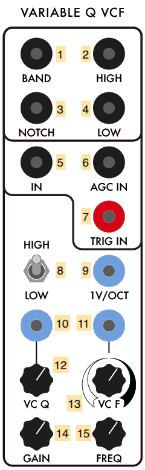

1. Bandpass filter output (AC OUTPUT)
2. High-pass filter output (AC OUTPUT)
3. Notch (band-reject) filter output (AC OUTPUT)
4. Low-pass filter output (AC OUTPUT)
5. Filter input (AC INPUT)
6. Filter input with automatic gain control (AC INPUT)
7. Pulse input to "ring" the filter - output will be the impulse response (Pulse INPUT)
8. High/Low switch to choose the range of the filter between audio ("HIGH") and sub-audio ("LOW") frequencies
9. 1-volt-per-octave CV input to control the filter frequency (sums with *11* x *13* and *15*) (DC INPUT)
10. Voltage control input for the filter's Q (summed with *12*) (DC INPUT)
11. CV input for linear control of the filter frequency (scaled by *13* and sums with *9* and *15*)
12. Knob to set the base Q of the filter
13. Scaling knob for *11*
14. Gain control knob for the filter
15. Knob to set the base frequency of the filter

*Notes:*
- The VCFQ can [self-oscillate](https://en.wikipedia.org/wiki/Self-oscillation) by patching the band-pass output (*1*) into the input (*5*). As you increase the Q, the band-pass output will approach a sine wave. The various outputs of the filter will be 90 degrees out of phase with one another.
- The pulse input *7* can be used to generate filtered percussion straight from a clock source.
- The LOW (extended range) mode of the filter allows you to modify control voltage to get filter-like characterists, e.g. ringing cause by high resonance in the filter.
- The Serge-Fans site has an explanation of [how to use two VCFQs](http://www.serge-fans.com/wiz_filt.htm) in series as a Moog-style 4-pole filter.

#### Stereo Mixer #1

The **Stereo Mixer** is Random\*Source's take on Tcherepnin's **Dual Channel Stereo Mixer (DCSM)** developed in the early 1980s. First and foremost, the module has 1/4" TRS jacks to output to non-Serge audio equipment. The module allows for voltage-controlled panning of its two inputs into a stereo output; it also allows for voltage control of the two input channel gains, allowing it to be used as a **Dual VCA**.

1. 1/4" TRS output of the left channel
2. 1/4" TRS output of the right channel
3. Left channel output (AC OUTPUT)
4. Right channel output (AC OUTPUT)
5. Auxiliary input for the left channel - bypasses panning and gain (AC INPUT)
6. Auxiliary input for the right channel - bypasses panning and gain (AC INPUT)
7. Channel 1 input (AC INPUT)
8. Channel 2 input (AC INPUT)
9. Panning voltage control for channel 1 (summed with *11*) (AC INPUT)
10. Panning voltage control for channel 2 (summed with *12*) (AC INPUT)
11. Panning knob for channel 1
12. Panning knob for channel 2
13. CV gain input for channel 1 (summed with *15*) (DC INPUT)
14. CV gain input for channel 2 (summed with *16*) (DC INPUT)
15. Gain control knob for channel 1
16. Gain control knob for channel 2

*Notes:*
- By lowering the gain knobs and hard-panning channels 1 and 2 to the left and right, respectively, the Stereo Mixer can be used as a Dual Voltage-Controlled Amplifier, with the banana jack outputs for "left" and "right" (*3* and *4*) fed back into the Serge system.
- The CV input for panning is bipolar (AC), not unipolar (DC). To have a DC voltage pan across the entire range, set the knobs opposite their indicator arrows. For channel 1, set knob *11* to the far right - a DC voltage at *13* will pan the signal to the left as it rises. For channel 2, do the opposite: set knob *12* to the far *left*, and a DC voltage input at *14* will pan the channel signal to the right.
- The voltage at the output stage of the module is significantly higher than the rest of the synthesizer in order for the TRS outputs to match professional line level (+4dBU). This includes the banana jacks!
- In the IDM Audio Lab, the TRS outputs of the Stereo Mixer are wired to inputs 1 and 2 on the Tascam mixer.

### Panel 2 (Edelweiss II)

#### Dual Universal Slope Generator #1

The **Dual Universal Slope Generator (DUSG)**, like the SSG, is one of the more complex Serge modules, developed in 1976 by combining the first generation Envelope Generator module with the Positive and Negative Slew modules. The DUSG can be used as an envelope generator, a low-pass filter / envelope follower, an oscillator, a harmonic subdivider, and a pulse delay. The module has two halves that are almost, but not quite, identical. DUSG #1 on the Random\*Source Serge is a "contemporary" model, with a pulse output on the top half.

1. CV Slope Output (DC OUTPUT)
2. Secondary slope output - a square wave output on the top half; an inverted bipolar output on the bottom half (Pulse OUTPUT / AC OUTPUT)
3. Gate output (Pulse OUTPUT)
4. Signal input for envelope follower (AC INPUT)
5. 1 volt-per-octave input for slope generator (DC INPUT)
6. CV input for envelope rise (scaled by *8* and summed with *10*) (DC INPUT)
7. CV input for envelope fall (scaled by *9* and summed with *11*) (DC INPUT)
8. Scaling knob for *6*
9. Scaling knob for *7*
10. Base knob for rise time (summed with *6* x *8*)
11. Base knob for fall time (summed with *7* x *9*)
12. Envelope trigger input (Pulse INPUT)

*Notes:*
- A pulse sent into input *12* of the DUSG will fire a single **envelope** at output *1* and *2*, based on the rise and fall times of the slope generator.
- Voltage sent into the signal input (*4*) of the DUSG will be slew-limited (smoothed) based on the rise and fall times of the slope generator to create a DC signal at output *1* and *2*. The DUSG performs full-wave rectification of the input signal first, so negative input voltage from a bipolar source will be flipped positive before smoothing to perform as an **envelope follower**.
- Connecting the gate output *3* to the pulse input *12* of the DUSG will make the module function as an **oscillator**, generating a triangle wave shaped by the rise and fall times at output *1*. Output *2* will put out a different waveform - the red jack on the top slope generator puts out a square wave, and the bottom slope generator outputs an AC inverted triangle wave, centered around 0V.
- If the rise and fall time add to a greater period than a pulse wave sent to the pulse input *12*, the DUSG can be used as a **harmonic subdivider**. generating an oscillator at 1/2, 1/3, etc. the frequency of the incoming signal.
- The DUSG can be used as a [monostable](https://en.wikipedia.org/wiki/Monostable) **pulse delay**, where a pulse at input *12* will echo at output *3* at the end of the rise and fall times.

#### Control Voltage Processor

The **Control Voltage Processor**, originally called the **Dual Processor**, is one of Tcherepnin's original 1973 modules, and functions as a mixer / scalar for control voltages. The module is split into two halves, with up to three sources in each half that can be scaled independently, with an overall scalar for each half.

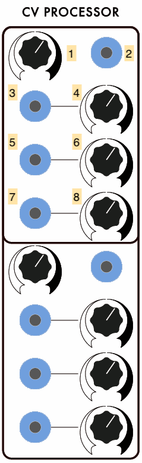

1. Overall scaling knob or the output voltage
2. Output of the control voltage processor (DC OUTPUT)
3. First CV input (DC INPUT)
4. Scalar knob for *3*
5. Second CV input (DC INPUT)
6. Scalar knob for *5*
7. Third CV input (DC INPUT)
8. Scalar knob for *7*

*Notes:*
- The Control Voltage Processor will also mix bipolar (AC) sources, similar to the Mixer module. 
- A static DC signal can be used to "bias" an AC source.

#### Dual Universal Slope Generator #2

The **Dual Universal Slope Generator (DUSG)**, like the SSG, is one of the more complex Serge modules, developed in 1976 by combining the first generation Envelope Generator module with the Positive and Negative Slew modules. The DUSG can be used as an envelope generator, a low-pass filter / envelope follower, an oscillator, a harmonic subdivider, and a pulse delay. The module has two identical halves. DUSG #2 on the Random\*Source Serge is a "classic" model, with an inverted bipolar output in addition to the slope output.

1. CV Slope Output (DC OUTPUT)
2. Secondary inverted bipolar output (AC OUTPUT)
3. Gate output (Pulse OUTPUT)
4. Signal input for envelope follower (AC INPUT)
5. 1 volt-per-octave input for slope generator (DC INPUT)
6. CV input for envelope rise (scaled by *8* and summed with *10*) (DC INPUT)
7. CV input for envelope fall (scaled by *9* and summed with *11*) (DC INPUT)
8. Scaling knob for *6*
9. Scaling knob for *7*
10. Base knob for rise time (summed with *6* x *8*)
11. Base knob for fall time (summed with *7* x *9*)
12. Envelope trigger input (Pulse INPUT)

*Notes:*
- A pulse sent into input *12* of the DUSG will fire a single **envelope** at output *1* and *2*, based on the rise and fall times of the slope generator.
- Voltage sent into the signal input (*4*) of the DUSG will be slew-limited (smoothed) based on the rise and fall times of the slope generator to create a DC signal at output *1* and *2*. The DUSG performs full-wave rectification of the input signal first, so negative input voltage from a bipolar source will be flipped positive before smoothing to perform as an **envelope follower**.
- Connecting the gate output *3* to the pulse input *12* of the DUSG will make the module function as an **oscillator**, generating a triangle wave shaped by the rise and fall times at output *1*. Output *2* will put out a different waveform - an AC inverted triangle wave, centered around 0V.
- If the rise and fall time add to a greater period than a pulse wave sent to the pulse input *12*, the DUSG can be used as a **harmonic subdivider**. generating an oscillator at 1/2, 1/3, etc. the frequency of the incoming signal.
- The DUSG can be used as a [monostable](https://en.wikipedia.org/wiki/Monostable) **pulse delay**, where a pulse at input *12* will echo at output *3* at the end of the rise and fall times.

#### Pulse Divider

The **Pulse Divider** is based on a design by [Ken Stone](https://www.elby-designs.com/webtek/cgs/cgs.htm), who developed a series of Serge-compatible modules in the 1980s and 1990s under the moniker the "Cat Girl Synth", or **CGS**. PCBs for CGS modules are still sold by Elby Designs in Australia. The Pulse Divider takes a pulse input and outputs triggers on numerical subdivisions, allowing the user to have, e.g. a clock signal input generate a polyrhythmic output.

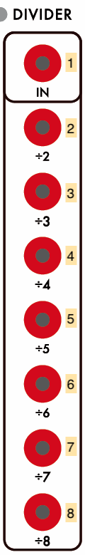

1. Pulse input for divider (Pulse INPUT)
2. Outputs a pulse every 2nd pulse (Pulse OUTPUT)
3. Outputs a pulse every 3rd pulse (Pulse OUTPUT)
4. Outputs a pulse every 4th pulse (Pulse OUTPUT)
5. Outputs a pulse every 5th pulse (Pulse OUTPUT)
6. Outputs a pulse every 6th pulse (Pulse OUTPUT)
7. Outputs a pulse every 7th pulse (Pulse OUTPUT)
8. Outputs a pulse every 8th pulse (Pulse OUTPUT)

*Notes:*
- The Pulse Divider can be used to bifurcate a (fast) master clock into multiple slower clocks. For example, if you send the pulse output of a Dual Slopes into the Pulse Divider input *1*, and think of that pulse as your 16th notes, then output *2* will be your 8th notes, output *4* will be your quarter notes, output *6* will be dotted-quarter notes, etc.
- When used with an audio-rate signal as input (e.g. a square wave), the outputs of the Pulse Divider generate the first eight subharmonics of the input signal.

#### Boolean Logic

The **Boolean Logic** module is another design by Ken Stone, intended to expand on the comparator modules in the original Serge systems. It consists of two basic inverters at the top and bottom, and three submodules that set output voltages HIGH or LOW based on control voltage inputs:

- the AND comparator will output a HIGH value when both of its inputs are over 2.5V
- the OR comparator will output a HIGH value when either of its inputs are over 2.5V
- the XOR comparator will output a HIGH value when either, but not both, of its inputs are over 2.5V

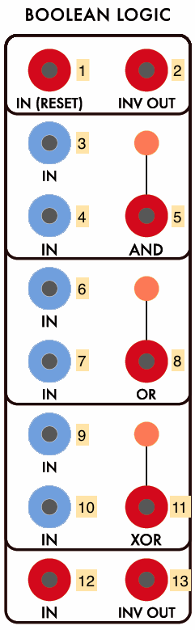

1. Input for top inverter (Pulse INPUT)
2. Output for the top inverter - a HIGH input at *1* will cause a LOW output, and vice versa (Pulse OUTPUT)
3. Input 1 for the AND comparator (DC INPUT)
4. Input 2 for the AND comparator (DC INPUT)
5. Output for the AND comparator (Pulse OUTPUT)
6. Input 1 for the OR comparator (DC INPUT)
7. Input 2 for the OR comparator (DC INPUT)
8. Output for the OR comparator (Pulse OUTPUT)
9. Input 1 for the XOR comparator (DC INPUT)
10. Input 2 for the XOR comparator (DC INPUT)
11. Output for the XOR comparator (Pulse OUTPUT)
12. Input for bottom inverter (Pulse INPUT)
13. Output for the bottom inverter - a HIGH input at *12* will cause a LOW output, and vice versa (Pulse OUTPUT)

*Notes:*
- The outputs will retain a HIGH voltage as long as the "true" state persists at the inputs, making the outputs function as gates rather than pulses.
- When used with the inverters, the AND/OR/XOR values can be transformed into NAND/NOR/XNOR values.

#### Divide-by-N Comparator

The **Divide-by-N Comparator (N COM)** is a circuit designed by Tcherepnin in 1979. The circuit is in two sections which have linked functionality. The bottom half of the module is a signal comparator, with a pulse output when one voltage rises above another. The top half counts the pulses from the bottom half, emitting its own pulses every *N* steps (hence the name) in increments up to 31. An additional output generates a "staircase" DC wave that rises with the number of steps coming from the comparator.

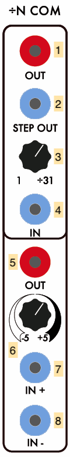

1. "Divide-by-N" output pulse divider output (Pulse OUTPUT)
2. Staircase output (DC OUTPUT)
3. Knob for setting number of steps in the pulse divider (1-31)
4. CV input for setting number of steps in the pulse divider (sums with *3*)
5. Comparator output (Pulse OUTPUT)
6. Offset knob for comparator threshold (sums with *8*)
7. Positive (+) comparator input; if this signal is greater than (*6* + *8*), pulse output *5* will fire and the pulse divider will increment
8. Negative (-) comparator input (sums with *6*); if this signal is less than *7*, pulse output *5* will fire and the pulse divider will increment

*Notes:*
- The lower half of the N COM module is fairly straightforward; the pulse output *5* will fire whenever the + voltage (*7*) exceeds the - voltage (*8*, which can be offset by the value at knob *6*).
- Unlike the Boolean Logic comparators which generate binary true/false voltages, the trigger circuit on the N COM is a [Schmitt trigger](https://en.wikipedia.org/wiki/Schmitt_trigger), so it has hysteresis and will only fire once per threshold crossing.
- The upper half of the N COM increments its internal counter everytime the lower half fires its pulse circuit. The values set by knob *3* and CV *4* set the number of steps in its pulse divider. When the count of pulses reaches that value, the pulse divider output *1* fires and the counter resets.
- The staircase output *2* is one of the most musically interesting devices in the Serge system; Tcherepnin decided to expose the signal counter used in the internal circuitry of the pulse divider and scale it by a specific voltage, in steps of 1/6V (i.e. from 0 to 5.1666V at 31 steps), so that it can be used directly as a [whole tone scale](https://en.wikipedia.org/wiki/Whole_tone_scale) when patched into a 1 volt-per-octave input on an oscillating circuit. This voltage can be scaled to other fixed musical intervals as desired.

#### Smooth / Stepped Generator #2

The **Smooth / Stepped Generator (SSG)** was designed by Tcherepnin in 1974. Along with the Dual Universal Slope Generator, it's one of the most versatile circuits in the canonical Serge system. Depending on how an SSG is patched, it can function as a [slew limiter](https://en.wikipedia.org/wiki/Slew_rate) (envelope follower / lowpass filter), a sample-and-hold circuit, a triangle wave oscillator, or a low-pass gate. SSG #2 on the Random\*Source Serge system has no sidecar noise circuit, but can receive voltage from elsewhere in the system to create different random effects.

The module is divided into two halves: the "Smooth" side at the top, and the "Stepped" at the bottom. In between the two, a Coupler circuit outputs a comparator voltage of the two sides.

1. CV input for the Smooth sides's rate (DC INPUT)
2. CV output for the Smooth side (DC OUTPUT)
3. Scaling knob for *1*
4. Cycle trigger (sends a pulse at the end of a cycle set by the Smooth rate) (Pulse OUTPUT)
5. Knob for Smooth rate amount (sums with *1* x *3*)
6. Signal input for the Smooth side (AC INPUT)
7. Hold jack - when set high, Smooth output *2* will freeze and no longer track the module's input (Pulse INPUT)
8. Sample jack - when set high, Stepped output *14* will sample and hold Stepped input *10* (Pulse INPUT)
9. CV input for the Stepped side's rate (DC INPUT)
10. Signal input for the Stepped side (AC INPUT)
11. Scaling knob for *9*
12. Cycle trigger (sends a pulse at the end of a cycle set by the Stepped rate) (Pulse OUTPUT)
13. Knob for Stepped rate amount (sums with *9* x *11*)
14. CV output for the Stepped module (DC OUTPUT)
15. "Hot" Coupler output - +5V if Stepped output is higher than the Smooth output; -5V if not (*AC* Pulse OUTPUT)
16. Regular Coupler output - +5V if Stepped output is higher than the Smooth output; 0V if not (Pulse OUTPUT)

*Notes:*
- The Smooth side can easily self-oscillate in a triangle pattern by patching the cycle trigger (*4*) into the input (*6*). The rate knob and CV inputs (*5*, *1*, *3*) control the speed of this oscillation. The triangle waveform will appear at the CV output jack (*2*).
- The Stepped side will also internally self-oscillate - by patching cycle trigger *12* to input *10* and adjusting the frequency via *13*, *9*, and *11*. However, no signal will appear at output jack *14* until you send pulses into the Sample jack (*8*). These pulses can come from anywhere, e.g. from the Cycle output of the Smooth side, or from another module. This creates a classic [sample-and-hold](https://en.wikipedia.org/wiki/Sample_and_hold) circuit where the internal oscillating waveform is being "sampled" by the trigger pulse at the Sample jack and "held" as the output voltage at jack *14*.
- By a similar token, *any* input can be used on either side of the SSG. In this case, the Smooth side will work as a [low-pass filter](https://en.wikipedia.org/wiki/Low-pass_filter) with the maximum slew (or smoothing amount) controlled by the rate; the Stepped side will sample-and-hold any input signal - simple waveforms will create different staircase effects based on the frequency difference between the incoming waveform and the "sampling" being performed.
- The sidecar Noise Source module provides ideal outputs to experiment with as inputs for either side of the SSG. The Smooth side can be used to generate slow, time-varying random voltages, while the Stepped side, when sampling a random signal, can be used to create classic "bleep-bloop" noises when patched in as the frequency of an oscillator.
- Sending an audio signal into the input (*6*) of the Smooth side of the SSG and sending an envelope into the CV input (*1*) will, depending where the rate knob (*5*) is set, allow you to use the module as a [low-pass gate](https://electronicmusic.fandom.com/wiki/Lowpass_gate), where the gain on the signal rises with the cutoff frequency of the filter. This setup is great for simulating natural sounding instruments such as percussion where the timbre brightens with the attack of the sound.
- The SSG is quite a complex module, and the Serge fans site has [an entire 4-page article](http://www.serge-fans.com/wiz_SSG1.htm) dedicated to patching ideas using it.

#### Random Source

The **Random Source** is the eponymous design of the company that designed its PCB in Berlin; it combines two of Tcherepnin's noise modules: the **Random Voltage Generator (RVG)** (left column of the module) and the **Noise Source** (right column). The RVG behaves as a pre-patched Smooth / Stepped Generator fed with noise; the Noise Source provides a variety of noise sources to work with as well as a built-in sample-and-hold circuit.

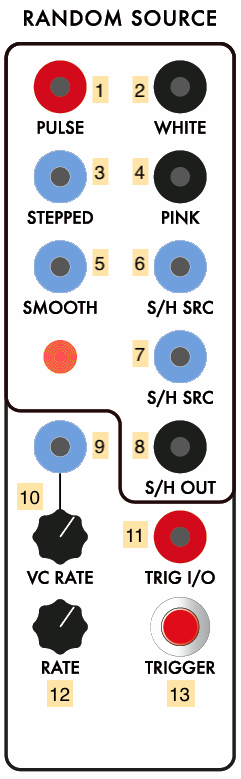

1. Pulse output - generates random pulses at the module rate (specified by *9* x *10* + *12*) (Pulse OUTPUT)
2. Full-spectrum [white noise](https://en.wikipedia.org/wiki/White_noise) (AC OUTPUT)
3. Stepped random output - generates discrete random voltages at the module rate (DC OUTPUT)
4. [Pink Noise](https://en.wikipedia.org/wiki/Pink_noise) (AC OUTPUT)
5. Smooth random output - generates continuous, low-pass filtered random voltages at the module rate (DC OUTPUT)
6. "Dirty saw" - a circuit designed by Tcherepnin containing a sawtooth wave that wobbles in frequency and has low-amplitude noise injected in its signal (DC OUTPUT)
7. Unipolar sample-and-hold output using *6* as its source and trigger *11* or *13* to sample the voltage (DC OUTPUT)
8. Bipolar sample-and-hold output using *6* as its source and trigger *11* or *13* to sample the voltage (AC OUTPUT)
9. CV input to set the rate of random outputs *1*, *3*, and *5* (scaled by *10* and sums with *12*) (DC INPUT)
10. Scalar knob for *9*
11. Pulse input for the sample-and-hold outputs *7* and *8* (Pulse INPUT) 
12. Base rate for random outputs *1*, *3*, and *5* (sums with *9* x *10*)
13. Button to trigger the sample-and-hold outputs *7* and *8*

*Notes:*
- The outputs of the module can be patch-programmed into the rate input *9*. This will create a second-order randomness where the speed of the random generator is itself changing randomly.
- Pressing button *13* will cause jack *11* to *output* a pulse - hence its label "TRIG I/O". You can use this as a utility trigger button throughout the system, either to test parts of your Serge patch or in performace.

### Panel 3 (Mantra)

#### Sequencer / Programmer

The **Sequencer / Programmer** module is Random\*Source's interpretation of a variety of Serge modules developed over the years. Serge 4-, 5-, 7-, and 8-stage **Sequencing Programmer** modules allowed for multiple stages of preset voltages that could be recalled either manually or in sequence from a pulse input. These stages were often arranged in rows, so that "preset 1" could recall up to four different voltages for different uses. This module is an eight stage, two row configuration.

1. CV output for the "A" row of presets (DC OUTPUT)
2. CV output for the "B" row of presets (DC OUTPUT)
3. CV output for the difference between the "A" and "B" voltages (DC OUTPUT)
4. Gate output corresponding to manual button presses (Pulse OUTPUT)
5. Reset - sets sequencer to first stage (Pulse INPUT)
6. Up/Down - reverses direction of sequencer when HIGH (Pulse INPUT)
7. Hold - temporarily disables sequencer when HIGH (Pulse INPUT)
8. Clock - advances sequence one stage (Pulse INPUT)
9. Sequencer on/off switch; off position only allows manual presets
10. Buttons for manual presets
11. "A" row of CV knobs for each preset stage
12. "B" row of CV knobs for each preset stage

*Notes:*
- The Sequencer / Programmer can be used as an 8-button mini-keyboard, with the rows of presets corresponding to notes in a melody, scales, or any other control voltage value you need.
- The buttons on the programmer control the starting point of the sequencer, allowing you to make it loop through only some of the presets in sequence to make a pattern that's less than 8 steps long.
- Like most Serge modules, the Sequencer / Programmer can be sequenced at high frequency, causing the CV outputs to generate a voltage curve made up of the preset stages that can be heard as a waveform or used as a periodic control signal.

#### Dual Universal Slope Generator XL

The **Dual Universal Slope Generator XL (DUSG-XL)** is an expanded version of the Dual Universal Slope Generator. Like the SSG, it is one of the more complex Serge modules, developed in 1976 by combining the first generation Envelope Generator module with the Positive and Negative Slew modules. The DUSG can be used as an envelope generator, a low-pass filter / envelope follower, an oscillator, a harmonic subdivider, and a pulse delay. The module has two (nearly) identical halves, along with a sidecar circuit that performs a peak / trough function on the generated slopes against a secondary signal.

1. Signal input for envelope follower (AC INPUT)
2. 1 volt-per-octave input for slope generator (DC INPUT)
3. CV input for envelope rise (scaled by *6* and summed with *5* and *8*) (DC INPUT)
4. CV input for envelope fall (scaled by *7* and summed with *5* and *9*) (DC INPUT)
5. CV input for both rise and fall (summed with *3* x *6* + *8* and *4* x *7* + *9*) (DC INPUT)
6. Scaling knob for *3*
7. Scaling knob for *4*
8. Base knob for rise time (summed with *3* x *6* and *5*)
9. Base knob for fall time (summed with *4* x *7* and *5*)
10. CV Slope Output (DC OUTPUT)
11. Unipolar sinusoid output (DC OUTPUT)
12. Inverted bipolar output (AC OUTPUT)
13. Gate output that goes HIGH at the start of fall stage (Pulse OUTPUT)
14. Square wave (pulse) output (Pulse OUTPUT)
15. Gate / end output (Pulse OUTPUT)
16. Envelope trigger input (Pulse INPUT)
17. Peak comparator 2nd input (DC INPUT)
18. Peak voltage output - the higher of *10* (top half) and *17* (DC OUTPUT)
19. Trough voltage output - the lower of *10* (bottom half) and *20* (DC OUTPUT)
20. Trough comparator 2nd input (DC INPUT)

*Notes:*
- A pulse sent into input *16* of the DUSG-XL will fire a single **envelope** at output *10* based on the rise and fall times of the slope generator.
- Voltage sent into the signal input (*1*) of the DUSG-XL will be slew limited (smoothed) based on the rise and fall times of the slope generator to create a DC signal at output *10*. The DUSG XL performs full-wave rectification of the input signal first, so negative input voltage from a bipolar source will be flipped positive before smoothing to perform as an **envelope follower**.
- Connecting the gate output *15* to the trigger input *16* of the DUSG-XL will make the module function as an **oscillator**, generating a triangle wave shaped by the rise and fall times at output *10*. Outputs *11*, *12*, and *14* (top half) output different waveforms - a sinusoid tracking the rise fall stages, an AC inverted triangle wave centered around 0V, and a pulse (square) wave.
- If the rise and fall time add to a greater period than a pulse wave sent to the trigger input *16*, the DUSG-XL can be used as a **harmonic subdivider**. generating oscillators at 1/2, 1/3, etc. the frequency of the incoming signal.
- The DUSG-XL can be used as a [monostable](https://en.wikipedia.org/wiki/Monostable) **pulse delay**, where a pulse at input *16* will echo at output *15* at the end of the rise and fall times.
- The DUSG-XL's additional outputs allow for a lot of experimentation with both control- and audio-rate use of the module. For example, output *13* is a square wave that goes HIGH at the start of the fall stage of the envelope. Playing with the relative lengths of the rise and fall will alter the [duty cycle](https://en.wikipedia.org/wiki/Duty_cycle) of this signal when used as an oscillator. Attaching an LFO to the rise and fall times of the envelope allows for a form of **pulse-width modulation** to occur with this output.
- The DUSG-XL has a sidecar circuit that outputs **peak** (highest) and **trough** (lowest) signal comparisons of the two halves' output ramps with secondary inputs. This can be used for a variety of thresholding (at control rate) or modulation / distortion (at audio rate) effects.
- The CV control for the rise and fall times of the envelopes has an additional "Both" input (*5*) on the DUSG-XL, that allows for controlling the **overall duration** of the envelope shape while maintaining the relative timings of the rise and fall.

#### Active Processor

The **Active Processor (Active Pro)** is based on Tcherepnin's design of the same name from 1979. It consists of a linear, DC-coupled, 2-input crossfader that can mix control voltages and/or audio signals using equal gain (as opposed to equal power) circuitry. The bottom section contains a ["flip-flop"](https://en.wikipedia.org/wiki/Flip-flop_(electronics)) circuit with two outs that alternates which output is set to HIGH based on pulses at the input.

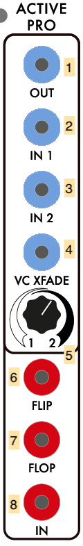

1. Crossfaded signal (DC OUTPUT)
2. Signal input 1 (DC INPUT)
3. Signal input 2 (DC INPUT)
4. Crossfade position voltage (sums with *5*) (DC INPUT)
5. Crossfade position knob (sums with *4*)
6. Flip (odd) gate (Pulse OUTPUT)
7. Flop (even) gate (Pulse OUTPUT)
6. Flip-flop input (Pulse INPUT)

*Notes:*
- The Active Processor, in a pinch, can be used as a linear **VCA** by patching one signal into the second input (*2*), setting the control knob *5* fully to the left, and sending an amplitude envelope into *4*.
- The Flip-Flop circuit, when fed a pulse train or square wave at audio rate, will generate two signals an octave lower and 180 degrees [out of phase](https://en.wikipedia.org/wiki/Phase_(waves)) with one another.

#### Smooth / Stepped Generator #3

The **Smooth / Stepped Generator (SSG)** was designed by Tcherepnin in 1974. Along with the Dual Universal Slope Generator, it's one of the most versatile circuits in the canonical Serge system. Depending on how an SSG is patched, it can function as a [slew limiter](https://en.wikipedia.org/wiki/Slew_rate) (envelope follower / lowpass filter), a sample-and-hold circuit, a triangle wave oscillator, or a low-pass gate. When combined with its sidecar **Noise Source** - a small circuit of three jacks - the SSG can be used to develop a wide variety of fluctuating and quantized random voltages, similar to the Buchla 266 [Source of Uncertainty](http://fluxmonkey.com/historicBuchla/266-uncertainty.htm).

The module is divided into two halves: the "Smooth" side at the top, and the "Stepped" at the bottom. In between the two, a Coupler circuit outputs a comparator voltage of the two sides. The sidecar Noise Source provides three different types of random sources to work with, either with the SSG or with other modules in the system.

1. CV input for the Smooth sides's rate (DC INPUT)
2. CV output for the Smooth side (DC OUTPUT)
3. Scaling knob for *1*
4. Cycle trigger (sends a pulse at the end of a cycle set by the Smooth rate) (Pulse OUTPUT)
5. Knob for Smooth rate amount (sums with *1* x *3*)
6. Signal input for the Smooth side (AC INPUT)
7. Hold jack - when set high, Smooth output *2* will freeze and no longer track the module's input (Pulse INPUT)
8. Sample jack - when set high, Stepped output *14* will sample and hold Stepped input *10* (Pulse INPUT)
9. CV input for the Stepped side's rate (DC INPUT)
10. Signal input for the Stepped side (AC INPUT)
11. Scaling knob for *9*
12. Cycle trigger (sends a pulse at the end of a cycle set by the Stepped rate) (Pulse OUTPUT)
13. Knob for Stepped rate amount (sums with *9* x *11*)
14. CV output for the Stepped module (DC OUTPUT)
15. "Hot" Coupler output - +5V if Stepped output is higher than the Smooth output; -5V if not (*AC* Pulse OUTPUT)
16. Regular Coupler output - 5V if Stepped output is higher than the Smooth output; 0V if not (Pulse OUTPUT)
17. White noise source (AC OUTPUT)
18. Pink noise source (AC OUTPUT)
19. Sample-and-hold "dirty saw" source (DC OUTPUT)

*Notes:*
- The Smooth side can easily self-oscillate in a triangle pattern by patching the cycle trigger (*4*) into the input (*6*). The rate knob and CV inputs (*5*, *1*, *3*) control the speed of this oscillation. The triangle waveform will appear at the CV output jack (*2*).
- The Stepped side will also internally self-oscillate - by patching cycle trigger *12* to input *10* and adjusting the frequency via *13*, *9*, and *11*. However, no signal will appear at output jack *14* until you send pulses into the Sample jack (*8*). These pulses can come from anywhere, e.g. from the Cycle output of the Smooth side, or from another module. This creates a classic [sample-and-hold](https://en.wikipedia.org/wiki/Sample_and_hold) circuit where the internal oscillating waveform is being "sampled" by the trigger pulse at the Sample jack and "held" as the output voltage at jack *14*.
- By a similar token, *any* input can be used on either side of the SSG. In this case, the Smooth side will work as a [low-pass filter](https://en.wikipedia.org/wiki/Low-pass_filter) with the maximum slew (or smoothing amount) controlled by the rate; the Stepped side will sample-and-hold any input signal - simple waveforms will create different staircase effects based on the frequency difference between the incoming waveform and the "sampling" being performed.
- The sidecar Noise Source module provides ideal outputs to experiment with as inputs for either side of the SSG. The Smooth side can be used to generate slow, time-varying random voltages, while the Stepped side, when sampling a random signal, can be used to create classic "bleep-bloop" noises when patched in as the frequency of an oscillator.
- Sending an audio signal into the input (*6*) of the Smooth side of the SSG and sending an envelope into the CV input (*1*) will, depending where the rate knob (*5*) is set, allow you to use the module as a [low-pass gate](https://electronicmusic.fandom.com/wiki/Lowpass_gate), where the gain on the signal rises with the cutoff frequency of the filter. This setup is great for simulating natural sounding instruments such as percussion where the timbre brightens with the attack of the sound.
- The three Noise Source outputs generate [white noise](https://en.wikipedia.org/wiki/White_noise), [pink or 1/f noise](https://en.wikipedia.org/wiki/Pink_noise), and a "dirty saw" - a circuit designed by Tcherepnin containing a sawtooth wave that wobbles in frequency and has low-amplitude noise injected in its signal.
- The SSG is quite a complex module, and the Serge fans site has [an entire 4-page article](http://www.serge-fans.com/wiz_SSG1.htm) dedicated to patching ideas using it.

#### Dual Slopes #2

The **Dual Slopes** are the Random\*Source implementation of a 1976 Serge module called the **Dual Transient Generator** (some Serge licensees still use that name; STS sells a related module called the **Voltage-Controlled Timegen Oscillator**). The module consists of the circuit for a Dual Universal Slope Generator (DUSG - see below) with a simplified panel interface, optimized for generating harmonically linked oscillators and clock pulses. The module contains two sides:
- on the left, an envelope generator that's internally wired to act as a self-clocking oscillator. This outputs a falling sawtooth and a pulse (square wave) at a specified frequency. 
- on the right, a second envelope generator that can be triggered either manually or at the end of the left oscillator's slope. This side outputs a triangle wave with controllable rise and fall times.
- both sides can also act as a slew limiter (envelope follower) on a signal input.

1. Ramp output for the left-hand slope generator (DC OUTPUT)
2. Ramp output for the right-hand slope generator (DC OUTPUT)
3. Pulse output for the left-hand slope generator (Pulse OUTPUT)
4. Pulse output for the right-hand slope generator (Pulse OUTPUT)
5. Trigger "link switch", internally patching a pulse generated at the end of the left envelope to trigger the right envelope
6. External trigger input for the right-hand slope generator (Pulse INPUT)
7. Signal input to the left-hand slope generator, causing it to act as a low-pass filter / envelope follower (AC INPUT)
8. Signal input to the right-hand slope generator, causing it to act as a low-pass filter / envelope follower (AC INPUT)
9. 1V-per-octave CV input to control the self-clocking frequency of the left-hand slope generator (sums with *11*) (DC INPUT)
10. Control knob for the Rise time on the right-hand slope - a higher value is a faster rise
11. Control knob for the self-clocking frequency of the left-hand slope (sums with *9*)
12. Control knob for the Fall time on the right-hand slope - a higher value is a faster fall
13. CV input to control the Fall time on the left-hand slope (scaled by *15*) (DC INPUT)
14. CV input to control either the Rise or Fall time on the right-hand slope (scaled by *16*) (DC INPUT)
15. Scaling knob for *13*
16. Scaling knob for *16*
17. Switch to set whether *14* x *16* controls the Rise or the Fall on the right-hand slope

*Notes:*
- A very common use of the Dual Slopes is as a **master clock**. The pulse outputs (*3* and *4*) can be used to drive the Sequencer / Programmer, the TKB, the "sample" on an SSG, or the trigger inputs on slope generators and filters.
- The Dual Slopes module highlights Tcherepnin's design mantra that the *distinction between control voltage and audio-rate signals is an artificial one*. The module can generate low frequency ramps and pulse trains, as well as audio-rate waveforms.
- The Dual Slopes module is optimized to leverage a side effect of Serge (and other "West Coast") envelope generators: an envelope, once triggered, *can't be retriggered until it has finished its cycle.* As a result, if the right side of the Dual Slopes has a rise and fall time that's greater than the interval the left side is clocking at, the right-hand slope generator will act as a **frequency divider**, triggering its waveform at 1/2, 1/3, 1/4, etc. of the left side's frequency. To hear this effect, turn the left-hand oscillator up to audio rate, turn on the trigger link switch, and listen to the pulse outputs generated by the right (*4*). By manipulating the rise and fall times of the right-hand slope (*10* and *12*), you can generate a [subhamonic series](https://en.wikipedia.org/wiki/Undertone_series) of the left side's frequency.

#### Variable Q Voltage Controlled Filter #2

The **Variable Q Voltage Controlled Filter (VCFQ)**, sometimes referred to as the **Variable Resonance Filter**, is a 12dB/octave 2-pole state-variable filter that features low-pass, high-bass, band-pass, and band-reject outputs, voltage control over frequency and Q (resonance) of the filter, and multiple inputs, include one with automatic gain control and a pulse input that generates an impulse into the filter. The VCFQ is an **extended range** design, with a switch that allows it to filter sub-audio control voltage signals.

1. Bandpass filter output (AC OUTPUT)
2. High-pass filter output (AC OUTPUT)
3. Notch (band-reject) filter output (AC OUTPUT)
4. Low-pass filter output (AC OUTPUT)
5. Filter input (AC INPUT)
6. Filter input with automatic gain control (AC INPUT)
7. Pulse input to "ring" the filter - output will be the impulse response (Pulse INPUT)
8. High/Low switch to choose the range of the filter between audio ("HIGH") and sub-audio ("LOW") frequencies
9. 1-volt-per-octave CV input to control the filter frequency (sums with *11* x *13* and *15*) (DC INPUT)
10. Voltage control input for the filter's Q (summed with *12*) (DC INPUT)
11. CV input for linear control of the filter frequency (scaled by *13* and sums with *9* and *15*)
12. Knob to set the base Q of the filter
13. Scaling knob for *11*
14. Gain control knob for the filter
15. Knob to set the base frequency of the filter

*Notes:*
- The VCFQ can [self-oscillate](https://en.wikipedia.org/wiki/Self-oscillation) by patching the band-pass output (*1*) into the input (*5*). As you increase the Q, the band-pass output will approach a sine wave. The various outputs of the filter will be 90 degrees out of phase with one another.
- The pulse input *7* can be used to generate filtered percussion straight from a clock source.
- The LOW (extended range) mode of the filter allows you to modify control voltage to get filter-like characterists, e.g. ringing cause by high resonance in the filter.
- The Serge-Fans site has an explanation of [how to use two VCFQs](http://www.serge-fans.com/wiz_filt.htm) in series as a Moog-style 4-pole filter.

#### Equal Power XFader

The Random\*Source **Equal Power XFader (XFader)** is a design based on Tcherepnin's **Cross-Fader** module for the Serge. It crossfades two audio (AC) signals, with an additional control for overall gain and a 1/4" TRS output to connect to external audio equipment. 

1. 1/4" TRS output for the crossfader
2. Crossfaded signal (AC OUTPUT)
3. Signal input 1 (AC INPUT)
4. Signal input 2 (AC INPUT)
5. Crossfade ("Xfade") position voltage (sums with *6*) (DC INPUT)
6. Crossfade position knob (sums with *5*)
7. Voltage control input for overall gain (sums with *8*) (DC INPUT)
8. Overall gain knob (sums with *7*).

*Notes:*
- Like the Active Processor, the XFader can be used as a **VCA**, by applying an envelope signal to either the crossfade CV input *5* or the overall gain CV input *7*.
- Unlike the Active Processor, the XFader is AC-coupled, and will reject static or slow-moving DC signals.
- Also unlike the Active Processor, the XFader uses equal-power (as opposed to equal gain) crossfading, using [Blackmer](http://www.thatcorp.com/2180-series_Pre-Trimmed_Blackmer_IC_Voltage-Controlled_Amplifiers.shtml) VCAs as signal amplifiers.
- Like the Stereo Mixer, the voltage at the output of the module is significantly higher than the rest of the synthesizer in order for the TRS outputs to match professional line level (+4dBU). This includes the output banana jack *2*.
- in the IDM Audio Lab, the TRS output on the XFader is wired to input 5 on the Tascam Mixer.

### Panel 4 (TKB)

#### Touch Activated Keyboard Sequencer

The Serge **Touch Activated Keyboard Sequencer (TKB)** had its debut in 1976, and is considered one of the most historically influential of Tcherepnin's designs. A combination 16-stage preset manager with 4 rows, sequencer, and keyboard controller, this single module takes up an entire panel in our Serge system. It was the most expensive item in the Serge Modular Music Systems catalog, selling in 1982 for $900 pre-assembled ($2,400 in 2019 dollars).

Tcherepnin, like Don Buchla, rejected implementing Western-style keyboard controllers with white keys and black keys, arranged according to the chromatic scale. Instead, Tcherepnin used capacitive touch pads arranged in an evenly spaced pattern, similar to the touch strips on the [Buchla model 112](http://synthmuseum.com/buchla/buc11201.html). The touch pads on the TKB output the voltage presets set by four rows of knobs (A, B, C, and D) above the pads, as well as a voltage based on the "pressure" applied to the key.

Unlike the Buchla touch controllers, the Serge TKB doubles as a sophisticated sequencer, with pulse output triggers above each stage, the ability to reverse direction, and so forth. It also includes a vertical clock to generate one long (64-value) set of voltages from the four independent rows, a random selector input, and many other features.

1. "ABCD" 64-stage output, driven by the clock and vertical clock (*15* and *16*) (DC OUTPUT)
2. CV output for the "A" row of presets (DC OUTPUT)
3. CV output for the "B" row of presets (DC OUTPUT)
4. CV output for the "C" row of presets (DC OUTPUT)
5. CV output for the "D" row of presets (DC OUTPUT)
6. "Key Vert" CV out - voltage corresponds to the specific key pad pressed in 1/6V increments (similar to the staircase output on the N COM) (DC OUTPUT)
7. Pulse output when a key is pressed (Pulse OUTPUT)
8. CV output for key "pressure" - in reality, this corresponds more to the surface area of the pad covered by finger contact than actual pressure (DC OUTPUT)
9. Reset input - sets the sequencer stage back to 1 (Pulse INPUT)
10. Vertical reset input - sets the vertical clock back to "A" (Pulse INPUT)
11. Random input - causes the sequencer to jumb to a random position (Pulse INPUT)
12. Keyboard on/off switch - when set to "off", the TKB will only respond to external triggers and not the keyboard
13. Up/Down input - when set HIGH, the sequencer will reverse direction (Pulse INPUT)
14. Hold input - when set HIGH, the sequencer will pause and ignore clock pulses (Pulse INPUT)
15. Clock input - pulses will advance the (horizontal) sequencer (Pulse INPUT)
16. Vertical clock input to advance the row of presets used for the "ABCD" output *1* (Pulse INPUT)
17. Glide switch - when on, the knobs on row "B" set a portamento (glide) value for the presets on row "A"
18. Pulse outputs for each stage of the sequencer (Pulse OUTPUT)
19. "A" row of CV knobs for each preset stage
20. "B" row of CV knobs for each preset stage
21. "C" row of CV knobs for each preset stage
22. "D" row of CV knobs for each preset stage
23. Capacitive touch pads (the "keys") for the TKB

*Notes:*
- The TKB allows you to program 4 sequences of preset knobs to control any CV input on the Serge system - scales and melodies for oscillators, but also filter cutoff frequencies, envelope durations, and anything else that you may want to automate. The TKB's clock is typically driven by a pulse generator (such as a Dual Slopes), but clock pulses can come from anywhere, such as the Pulse output of the Random Source module.
- By using the pulse outputs for the individual sequence stages (*18*), you can trigger external events on other modules. You can also use these outputs, in combination with the Up/Down gate *13* and the "Flip/Flop" on the Active Processor to create smaller loops of sequences within the TKB.
- The keyboard pressure output *8* puts out a fairly noisy voltage based on capacitance. Patching it into a DUSG or SSG will allow you to smooth this out as well as add lag to the key (e.g. for keyboard-driven slow fades or filter sweeps).
- The TKB can be sequenced at audio rate, and the preset rows can be used as an arbitrary 16-stage waveform for an oscillator.

[back to top](#top)

### Panel 5 (Custom)

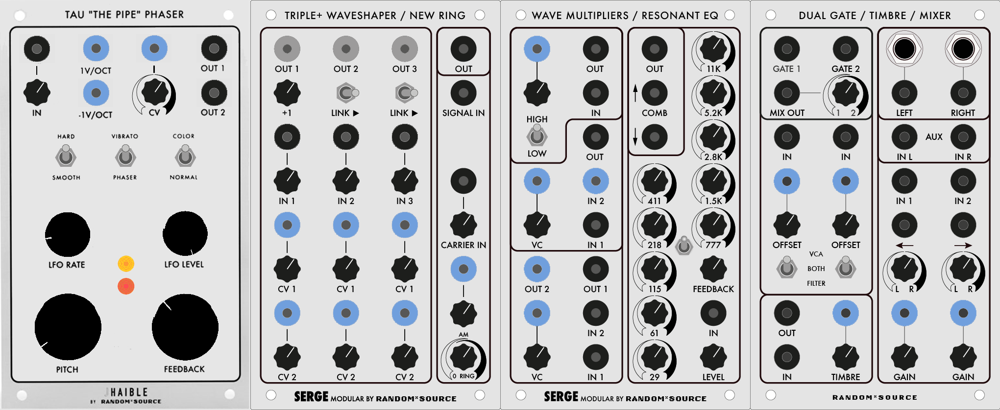

#### Tau "The Pipe" Phaser

The **Tau Phaser** was invented by reknowned electronic music instrument designer [Jrgen Haible](http://jhaible.com/legacy/) (1964-2011). It consists of a 20-pole, stereo [Phaser](https://en.wikipedia.org/wiki/Phaser_(effect)) that leverages voltage control to allow other modules in the Serge system to dynamically modulate its parameters. The Phaser was designed to mimic the effects of classic Analog phasers from the 1970s such as the phase shifter on the [ARP Quadra](https://en.wikipedia.org/wiki/ARP_Quadra), with the addition of a feedback stage that allowed for [flanging](https://en.wikipedia.org/wiki/Flanging) effects that go beyond the ["Leslie speaker"](https://en.wikipedia.org/wiki/Leslie_speaker)-style sound of most phaser circuits. Originally designed to be used as an [effect pedal](https://www.modezero.com/jh-tau-phaser.htm), the Tau Phaser was refactored by Random\*Source to fit in a Serge 4U module.

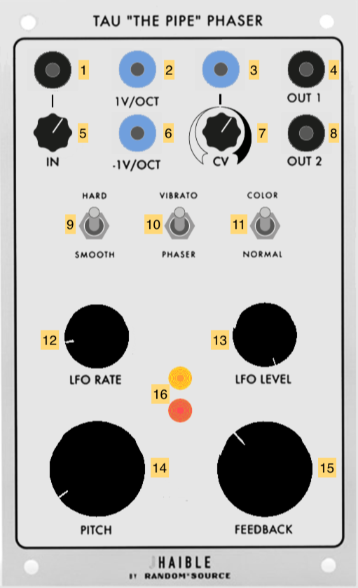

1. Signal input (AC INPUT)
2. 1 volt-per-octave input for phaser "pitch" (sums with *6* and *14*) (AC INPUT)
3. CV input for LFO rate (scaled by *7*, sums with *12*) (AC INPUT)
4. Audio output 1 (180 degrees out-of-phase with *8*) (AC OUTPUT)
5. Input scaling knob
6. *inverted* 1 volt-per-octave input for phaser "pitch" (sums with *2* and *14*) (AC INPUT)
7. CV scaling knob
8. Audio output 2 (180 degrees out-of-phase with *4*) (AC OUTPUT)
9. Hard/Smooth switch to change LFO waveform from saw ("hard") to sine ("smooth")
10. Vibrato/Phaser switch - in "Vibrato" mode, the filters are bypassed for an amplitude modulation effect
11. Color/Normal switch - in "Color" mode, the feedback stage is engaged to create flanging effects
12. LFO Rate knob (sums with *3*x*7*)
13. LFO Level (depth) knob
14. Pitch knob for feedback stage (sums with *2* and *6*)
15. Feedback amount knob
16. LEDs showing amplitude of outputs *4* and *8*

*Notes:*
- The Tau Phaser can get **very loud** when the "color" is switched on to engage the feedback. At its highest feedback setting, it can self-oscillate with no input signal.

#### Triple + Waveshaper / New Ring (TWS+)

The **Triple + Waveshaper / New Ring (TWS+)** is a module with updated versions of Tcherepnin's original **Triple Waveshaper** and **Ring Modulator** (both of which are on the 73-75 Serge). The **Triple + Waveshaper** consists of three waveshapers that distort an input signal, with voltage control of the shaping curve and "gang" switches that allow them to be used in series. A fourth, fixed waveshaping circuit can be dialed in to further transform the signal. The **New Ring** allows for both amplitude and ring modulation effects by multiplying an audio input signal with an AC or DC "carrier" signal.

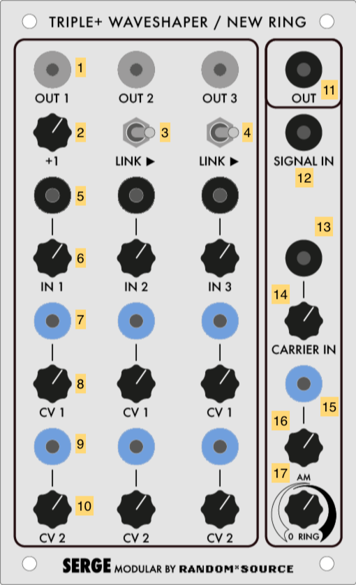

1. Waveshaper 1-3 outputs (AC or DC OUTPUT depending on input)
2. Strength knob of 4th ("+") waveshaper in series after Waveshaper 1
3. Link switch putting Waveshaper 2 in series after Waveshaper 1
4. Link switch putting Waveshaper 3 in series after Waveshaper 2
5. Input signal for Waveshaper 1-3 (AC INPUT)
6. Gain knob for Waveshaper 1-3
7. CV 1 input for Waveshaper 1-3
8. Scalar knob for CV 1
9. CV 2 input for Waveshaper 1-3
10. Scalar knob for CV 2
11. Ring modulator output (AC OUTPUT)
12. Audio input for ring modular (AC INPUT)
13. Bipolar "carrier" input for ring modulator (AC INPUT)
14. Gain knob for *13*
15. Unipolar "carrier" input for ring modular (DC INPUT)
16. Scaling knob for *15*
17. Crossfader knob between DC and AC carrier inputs

*Notes:*
- The TWS+ transfer function circuits will, when turned all the way up, transform a sawtooth wave into a sine wave, according to the T2 [Chebyshev polynomial](https://en.wikipedia.org/wiki/Chebyshev_polynomials). The intensity of the shaping control (*7*x*8* + *9*x*10*) determines the amount of waveshaping. With a sawtooth wave input, this determines which harmonics are subtracted.
- A sine wave sent into the same transfer function will have its frequency doubled. A harmonically rich signal will distort in complex ways as the transfer function of a waveshaper circuit exhibits nonlinear behavior.
- The outputs of the TWS+ can be linked, so that all three waveshapers can distort the same signal. The link order is from 1-4-2-3, with Waveshaper 4 accessible by fading in knob *2*.
- The TWS+ is also excellent for shaping low-frequency signals to generate interesting control voltages. For example, you could feed one waveshaper in the TWS with the output of an Envelope Generator and a second with an oscillator, using the output of the first as the *CV input* of the second.
- Two bipolar input signals in the New Ring will cause [**ring modulation**](https://en.wikipedia.org/wiki/Ring_modulation), with the result being the sum and difference of the two input spectra.
- A bipolar input signal and a unipolar carrier signal will cause [**amplitude modulation**](https://en.wikipedia.org/wiki/Amplitude_modulation), which retains the audio spectrum as well as the sidebands.
- An envelope signal at the DC input (*15*) will cause the module to function as a [**VCA**](https://en.wikipedia.org/wiki/Variable-gain_amplifier).
- If both input signals are unipolar, the Ring Modulator will multiply the signals, allowing, for example, two envelope generators running at different frequencies to create a signal made up of their interference patterns.
- The bipolar carrier input (*13*) is *AC-coupled* and will filter out slow-moving (<20Hz) signals. The unipolar carrier input (*15*) will work with any frequency but will perform [full-wave rectification](https://en.wikipedia.org/wiki/Rectifier#Full-wave_rectification) on AC signals, flipping them positive.

#### Wave Multipliers / Resonant Equalizer

The **Wave Multipliers** module appeared in 1976 and is considered an important circuit for achieving the "West Coast" sound of the Serge modular. The module contains three self-contained distortion effects that work by shaping the amplitude of the incoming audio signal. Quoting from the 1982 Serge catalog, Tcherepnin describes the three Wave Multipliers:

> The uppermost section is the simplest of the three multiplier sections. but it has two switchable effects. With the switch 
> set at the "HI" position, the module functions to "square-up" an incoming signal. This is not the same as a simple 
> comparator squaring function, though, since there is a rounded flattening of the signal peaks: an effect somewhat similar to 
> overdriving a tube amplifier (except that in this version the process is voltage controllable!). With the switch in the "LO" 
> position, the module is a linear gain controlled VCA. This is useful for various functions such as amplitude modulation and 
> for gating signals into the other sections.
>
> The middle Wave Multiplier provides a sweep of the odd harmonics (1, 3, 5, 7, 9, 11 and 13th) when a sine wave is applied to 
> its input and the knob is turned up or a control voltage is swept from low to high. This effect is similar to overblowing a 
> wind pipe closed at one end, and thus the module can be used to produce the sounds of various wind instruments. A second 
> input is included to allow two signals to be mixed before processing, a technique that we have found to be very usable. This 
> module can be used to explore timbral areas beyond the range of ring modulation because there are more varied harmonics than 
> the sum and difference tones.
>
> The bottom Wave Multiplier performs non-linear wavehaping known as full-wave rectification, but with sophisticated level-
> compensating conditioning as well. Actually the circuit uses three full-wave rectifier sections linked in a very refined 
> controllable format. Each section can double the frequency of a sine or triangle wave applied to its input. Thus sweeping 
> the CV input over its range will produce a smooth timbral transition using the even harmonics (second, fourth, and eighth). 
> Many other partials are present in this basic sound, however, and the sonorities are very rich and varied. A notable feature 
> of this multiplier is that the full-wave rectification is not accompanied by a reduction in the output amplitude. There is 
> no alteration of the essential level of the sound. There are two inputs to provide mixing before processing, and two 
> outputs. One output is a "squared up" version of the other. This output resembles voltage controlled pulse width modulation 
> (only much more interesting). 

The Serge **Resonant Equalizer** was designed by Tcherepnin in 1979, and consists of a bank of ten parallel bandpass filters, deliberately tuned at a non-integer harmonic interval of a [major seventh](https://en.wikipedia.org/wiki/Major_seventh). The individual filters can boost or cut, and a feedback circuit allows them to resonate as a [comb filter](https://en.wikipedia.org/wiki/Comb_filter), similar to the [Buchla 296](https://modularsynthesis.com/roman/buchla296/296psp.htm). 

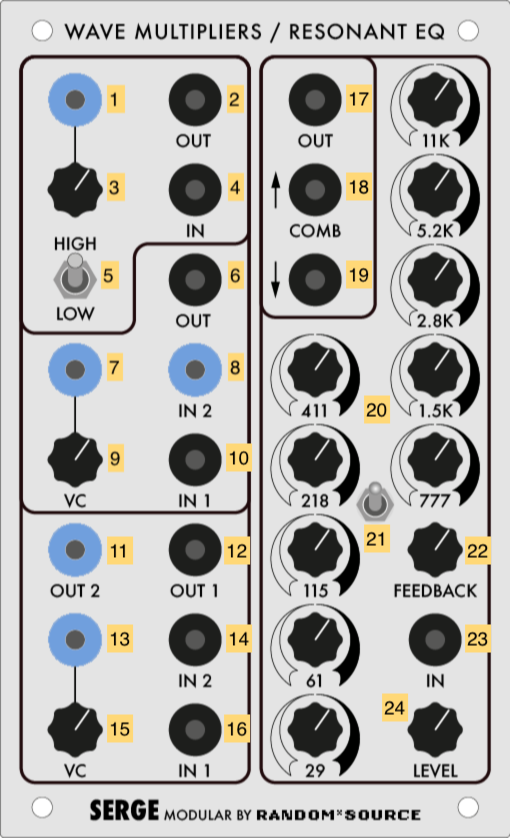

1. CV input for Multiplier 1 amount (DC INPUT)
2. Processed output of Multiplier 1 (AC OUTPUT)
3. Scaling knob for Multiplier 1 amount
4. Signal input for Multiplier 1 (AC INPUT)
5. High/Low distortion switch for Multiplier 1
6. Processed output of Multiplier 2 (AC OUTPUT)
7. CV input for Multiplier 2 amount (DC INPUT)
8. Second signal input for Multiplier 2 (DC INPUT)
9. Scaling knob for Multiplier 2 amount
10. First signal input for Multiplier 2 (AC INPUT)
11. Second processed ("squared-up") output for Multiplier 3 (DC OUTPUT)
12. First processed output for Multiplier 3 (AC OUTPUT)
13. CV input for Multiplier 2 amount (DC INPUT)
14. Second signal input for Multiplier 3 (AC INPUT)
15. Scaling knob for Multiplier 3 amount
16. First signal input for Multiplier 3 (AC INPUT)
17. Output of Resonant EQ (AC OUTPUT)
18. Positive "Comb" output of Resonant EQ (AC OUTPUT)
19. Negative "Comb" output of Resonant EQ (AC OUTPUT)
20. Boost-cut knobs for the ten bandpass filters (29Hz, 61Hz, 115Hz, 218Hz, 411Hz, 777Hz, 1.5kHz, 2.8kHz, 5.2kHz, 11kHz)
21. Phase switch for the feedback stage
22. Feedback amount knob
23. Audio input for the Resonant EQ (AC INPUT)
24. Gain knob for the Resonant EQ input

*Notes:*
- The first multiplier can be used in *low* mode as an ordinary [VCA](https://en.wikipedia.org/wiki/Variable-gain_amplifier), and in *high* mode as a simple "clipping" [distortion](https://en.wikipedia.org/wiki/Distortion_(music)) unit. The second multiplier emphasizes odd harmonics through [wave folding](https://www.keithmcmillen.com/blog/simple-synthesis-part-8-wavefolding/); the third emphasizes even harmonics through [full wave rectification](https://www.hackaudio.com/digital-signal-processing/distortion-effects/full-wave-rectification/).
- The second multiplier has a DC-coupled second input (*8*) which allows you to mix an LFO signal in with the input voltage to add to the distortion effect.
- Using the multipliers in series or in feedback (patching an output back into the input) can create some pretty crazy sounds.
- the Resonant EQ can be used to simulate the body of acoustic instruments by creating complex frequency resonances from a synthesized input signal.
- the Resonant EQ bands can all resonate at high gains, independently of the feedback stage of the circuit. 
- An inverted phase at switch *21* will cause the comb filter outputs of the Resonant EQ to "thin" the sound rather than resonate.

#### Dual Lowpass Gate / Timbre / Stereo Mixer #2 (DONKS)

The **Dual Lowpass Gate / Timbre / Stereo Mixer (DONKS)** is a combination of three amplitude processing modules. The **Dual Lowpass Gate** is modeled after the Buchla [Quad Lopass Gate Model 292](https://www.modulargrid.net/u/buchla-quad-voltage), developed as part of the "200 Series" in the 1970s; the Lowpass Gate uses [Vactrol](https://en.wikipedia.org/wiki/Resistive_opto-isolator) opto-isolators to create a combination VCF/VCA. The **Timbre** module is based on Buchla's wavefolder circuit used in the [Complex Wave Generator Model 259](https://modularsynthesis.com/roman/buchla259/259cwg.htm) as well as the oscillator in the [Music Easel](https://buchla.com/music-easel/); similar to the Serge Wave Multipliers, the module performs harmonic distortion on an input signal to create a more complex waveform. The **Stereo Mixer** is Random\*Source's take on Tcherepnin's **Dual Channel Stereo Mixer (DCSM)** developed in the early 1980s. First and foremost, the module has 1/4" TRS jacks to output to non-Serge audio equipment. The module allows for voltage-controlled panning of its two inputs into a stereo output; it also allows for voltage control of the two input channel gains, allowing it to be used as a **Dual VCA**.

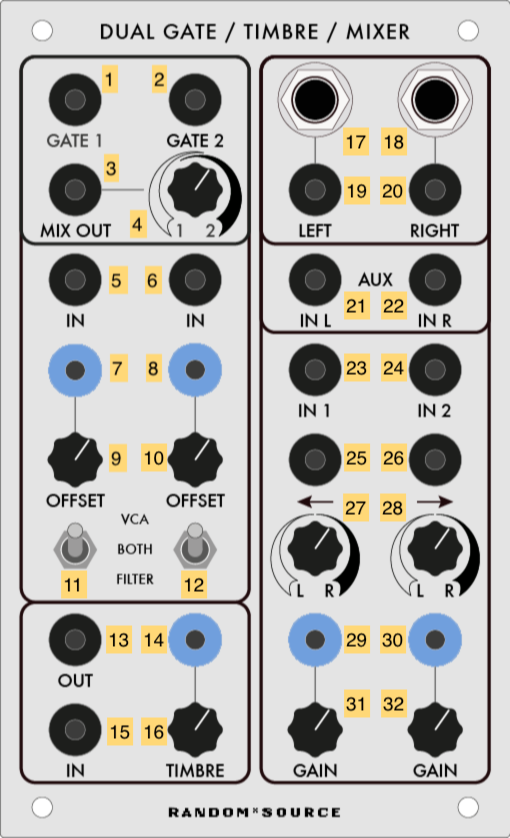

1. Output for Lowpass Gate channel 1 (AC OUTPUT)
2. Output for Lowpass Gate channel 2 (AC OUTPUT)
3. Lowpass Gate mix output (AC OUTPUT)
4. Crossfader knob for *3*
5. Lowpass Gate channel 1 input (AC INPUT) 
6. Lowpass Gate channel 2 input (AC INPUT) 
7. CV gain input for Lowpass Gate channel 1 input (DC INPUT) 
8. CV gain input for Lowpass Gate channel 2 input (DC INPUT) 
9. Gain control knob for Lowpass Gate channel 1 input (DC INPUT) 
10. Gain control knob for Lowpass Gate channel 1 input (DC INPUT) 
11. Mode switch for Lowpass Gate channel 1
12. Mode switch for Lowpass Gate channel 2
13. Signal output for Timbre module (AC OUTPUT)
14. CV distortion input for Timbre module (scaled by *16*) (DC INPUT)
15. Signal input for Timbre module (AC INPUT)
16. Distortion knob for Timbre module
17. 1/4" TRS output of the Stereo Mixer left channel
18. 1/4" TRS output of the Stereo Mixer right channel
19. Stereo Mixer left channel output (AC OUTPUT)
20. Stereo Mixer right channel output (AC OUTPUT)
21. Auxiliary input for the Stereo Mixer left channel - bypasses panning and gain (AC INPUT)
22. Auxiliary input for the Stereo Mixer right channel - bypasses panning and gain (AC INPUT)
23. Stereo Mixer channel 1 input (AC INPUT)
24. Stereo Mixer channel 2 input (AC INPUT)
25. Panning voltage control for Stereo Mixer channel 1 (summed with *11*) (AC INPUT)
26. Panning voltage control for Stereo Mixer channel 2 (summed with *12*) (AC INPUT)
27. Panning knob for Stereo Mixer channel 1
28. Panning knob for Stereo Mixer channel 2
29. CV gain input for Stereo Mixer channel 1 (summed with *15*) (DC INPUT)
30. CV gain input for Stereo Mixer channel 2 (summed with *16*) (DC INPUT)
31. Gain control knob for Stereo Mixer channel 1
32. Gain control knob for Stereo Mixer channel 2

*Notes:*
- The Dual Lowpass Gate's mode switch allows you to change it between a full-range VCF, where the CV input sweeps a filter; a VCA, where the CV input boosts the signal; or both. The "sound" of a Lowpass Gate, where amplitude is linked to cutoff frequency, is great for making percussive sounds.
- By lowering the gain knobs and hard-panning channels 1 and 2 to the left and right, respectively, the Stereo Mixer can be used as a Dual Voltage-Controlled Amplifier, with the banana jack outputs for "left" and "right" (*3* and *4*) fed back into the Serge system.
- The CV input for panning on the Stereo Mixer is bipolar (AC), not unipolar (DC). To have a DC voltage pan across the entire range, set the knobs opposite their indicator arrows. For channel 1, set knob *11* to the far right - a DC voltage at *13* will pan the signal to the left as it rises. For channel 2, do the opposite: set knob *12* to the far *left*, and a DC voltage input at *14* will pan the channel signal to the right.
- The voltage at the output stage of the Stereo Mixer is significantly higher than the rest of the synthesizer in order for the TRS outputs to match professional line level (+4dBU). This includes the banana jacks!
- In the IDM Audio Lab, the TRS outputs of the "Stereo Mixer" are wired to inputs 3 and 4 on the Tascam mixer.

[back to top](#top)

### Panel 6 (Custom)

#### Dual Precision Oscillator / Peak & Trough

The **Precision Oscillator (PCO)**, along with the more complex NTO, first appeared in 1976, and the closest thing Tcherepnin designed to an East Coast-style [Voltage Controlled Oscillator](https://en.wikipedia.org/wiki/Voltage-controlled_oscillator). This Random\*Source panel includes two PCOs, one of which can run in the sub-audio range; it also includes an updated versino of the original (1973) **Peak and Trough (P&T)** module.

1. Rising sawtooth wave (DC OUTPUT)
2. Triangle wave (DC OUTPUT)
3. Sine wave (AC OUTPUT)
4. Square wave / pulse (labeled "Puls") (Pulse OUTPUT)
5. Linear frequency CV input (scaled by *6*, sums with *8*, *9*, *10*, and *11*) (DC INPUT)
6. Scaling knob for *18*
7. [Oscillator Sync](https://en.wikipedia.org/wiki/Oscillator_sync) signal for Saw Output *1* (DC INPUT, triggers at 2.5V).
8. 1V/Oct CV of oscillator frequency (sums with *9*, *5* x *6*, *10*, and *11*) (DC INPUT)
9. CV to control the amount of linear FM *10* (DC INPUT)
10. [Linear FM](https://en.wikipedia.org/wiki/Frequency_modulation_synthesis) "Modulator" signal (AC INPUT)
11. Fine tuning knob for the VCO's base frequency (sums with *5* x *6*, *8*, *9*, and *10*)
12. Coarse tuning knob for the VCO's base frequency (sums with *5* x *6*, *8*, *9*, and *10*)
13. (Top PCO only) Second 1V/Oct CV of oscillator frequency (sums with *5* x *6*, *8*, *9*, and *10*) (DC INPUT)
14. (Bottom PCO only) High-frequency (20Hz-20kHz) / Low-frequency (0.03Hz-30Hz) switch
15. Peak voltage output - the highest of the three inputs *16* (AC OUTPUT)
16. Peak voltage comparator inputs (AC INPUT)
17. Trough voltage output - the lowest of the three inputs *18* (AC OUTPUT)
18. Trough voltage comparator inputs (AC INPUT)

*Notes:*
- The four waveform outputs (*1-4*) represent the standard waveforms used in classic analog subtractive synthesis (Sine, Saw, Triangle, Square). Be aware that these outputs are **not of the same voltage type** - the Sine output is the only AC one. Also note that the PCO produces mathematically accurate (as opposed to "good-sounding") oscillators, intended to be usable as source of control voltage (Saw, Triangle) and pulses ("Puls") as well as audio. As a result, the harmonically rich waveforms (especially the Saw) will sound brighter than the equivalent waveforms on, e.g. a Moog.
- The frequency control of the PCO is a summing bus of the multiple voltage inputs. If you want two different voltages interacting to control the oscillator's frequency, you can use *both* 1V/OCT inputs on the top oscillator (*8* and *13*) to get you a cleaner addition of signals than stacking banana cables.
- Like all Serge modules, feedback is an excellent technique to experiment with, by patching, e.g. the Sine output *3* into the modulator input for the Linear FM *10*.

#### "Son of Storm Tide" Flanger

The **"Son of Storm Tide" (SOST)** is a solid-state analog [Flanger](https://en.wikipedia.org/wiki/Flanging), and was invented, like the Tau Phaser, by electronic music instrument designer [Jrgen Haible](http://jhaible.com/legacy/) (1964-2011). Originally designed to be used as a [rackmount effect](http://jhaible.com/legacy/sonofstormtide/sonofstormtide.html), the SOST exposes the standard controls of a flanger (delay time, feedback, the parameters of the internal LFO) to voltage control, allowing the effect to be manipulated and sequenced by other modules. In addition, sections of the internal circuitry are exposed to user control, including the ability to tap the stereo outputs independently and bypass half of the BBD circuit for a shorter delay time. Finally, the SOST includes an internal envelope follower in addition to an LFO, allowing the effect depth to be controlled by tracking the input signal. This allows the SOST to be used for effects such as pitched [comb filtering](https://en.wikipedia.org/wiki/Comb_filter) to make plucked string sounds, or to create pitch shifting effects that would be difficult to accomplish with an ordinary flanger.

1. Signal input 1 (AC INPUT)
2. Input 1 gain knob
3. Signal input 2 (AC INPUT)
4. Input 2 gain knob
5. Signal output 1 (AC OUTPUT)
6. Short / long delay switch 1
7. Signal output 2 (AC OUTPUT)
8. Short / long delay switch 2
9. All-pass filter switch
10. Invert phase switch
11. 1V/Oct CV input for delay time (summed with *12* x *13* and *31*, as well as the internal LFO) (DC INPUT)
12. Linear CV input for delay time (summed with *11* and *31* and scaled by *13*) (DC INPUT)
13. Scaling knob for *12*
14. LFO signal direct output (DC OUTPUT)
15. LFO mode (waveform) selector switch
16. LFO rate CV input (scaled with *17* and summed with *18*) (DC INPUT)
17. Scaling knob for *16*
18. LFO rate knob (summed with *16* x *17*)
19. LFO "mod" (depth) knob
20. Envelope follower release (decay) time knob
21. Envelope follower amount knob
22. Envelope follower invert switch
23. CV control for envelope follower (scaled with *24*) (DC INPUT)
24. Scaling knob for *23*
25. Dry/wet mix amount knob
26. Short / long delay switch for flanger feedback stage
27. Invert switch for the second BBD phase
28. Fine tune control for the base delay of the flanger
29. Q control for the feedback stage of the flanger (higher value is a more resonant filter)
30. "Bounce" value - a Haible-designed control where the envelope follower and LFO interact to create a rubber-band or bouncing effect
31. "Manual" (fundamental delay) value for the flanger

*Notes:*
- The internal LFO of the flanger can be tapped at output *14* to syncronize other processes on the synthesizer to the flanger.
- The flanger can be driven directly by an external waveform by setting the LFO mod value *19* to zero and patching a time-varying signal into either of the delay time control inputs *11* or *12*. As with any time-domain delay effect, a sudden change in delay time will cause the signal pitch to rise or fall.
- The various long/short and invert switches tap and invert the polarity on the different analog [bucket-brigade device](https://en.wikipedia.org/wiki/Bucket-brigade_device) chips in the circuit, allowing for a wide variety of sounds.

#### Dual Slopes #3 / Extended ADSR #1

The **Dual Slopes** are the Random\*Source implementation of a 1976 Serge module called the Dual Transient Generator. The module consists of the circuit for a Dual Universal Slope Generator (DUSG) with a simplified panel interface, optimized for generating harmonically linked oscillators and clock pulses. The module contains two sides, both with AR-style ramp generators that can be switched to cycle; these generators can be triggered by a pulse input, or patched to slew limit (envelope follow) an input signal. Unlike the other R\*S Dual Slopes in the IDM Audio Lab, this version of the module does not automatically allow for clocking the right slope generator to the left slope generator.

The **Extended ADSR** is based on Tcherepnin's 1976 design; this was his first to adopt the common [ADSR](https://en.wikipedia.org/wiki/Envelope_(music)) topology used in envelope generator made by contemporary "East Coast" synthesizer manufacturers such as Moog and ARP to simulate the shape of common acoustic instruments. As with most of Tcherepnin's designs, the superficial architecture of the module is made far more complex through its ability to be driven at audio rate and for all stages (including a "delay" stage for the onset of the envelope) to be changed dynamically via voltage control.

1. Ramp output for the left-hand slope generator (DC OUTPUT)
2. Ramp output for the right-hand slope generator (DC OUTPUT)
3. Pulse output for the left-hand slope generator (Pulse OUTPUT)
4. Pulse output for the right-hand slope generator (Pulse OUTPUT)
5. Cycle switch, internally connecting the envelope circuits to indvidually act as oscillators
6. External trigger input for the left-hand slope generator (Pulse INPUT)
7. External trigger input for the right-hand slope generator (Pulse INPUT)
8. Signal input to the left-hand slope generator, causing it to act as a low-pass filter / envelope follower (AC INPUT)
9. Signal input to the right-hand slope generator, causing it to act as a low-pass filter / envelope follower (AC INPUT)
10. 1V-per-octave CV input to control the self-clocking frequency of the slope generators (DC INPUT)
11. Control knob for the Rise time on the left-hand slope - a higher value is a faster rise
12. Control knob for the Rise time on the right-hand slope - a higher value is a faster rise
13. Control knob for the Fall time on the left-hand slope - a higher value is a faster fall
14. Control knob for the Fall time on the right-hand slope - a higher value is a faster fall
15. CV input to control either the Rise or Fall time on the left-hand slope (scaled by *19*) (DC INPUT)
16. CV input to control either the Rise or Fall time on the left-hand slope (scaled by *19*) (DC INPUT)
17. Switch to set whether *16* x *19* controls the Rise or the Fall on the left-hand slope
18. Switch to set whether *16* x *19* controls the Rise or the Fall on the right-hand slope
19. Scaling knob for *15*
20. Scaling knob for *16*
21. Gate input for the ADSR generator (Pulse INPUT)
22. Trigger input for the ADSR generator (Pulse INPUT)
23. Envelope CV output of the ADSR (DC OUTPUT)
24. Envelope delay time CV and knob (DC INPUT)
25. Envelope attack time CV and knob (DC INPUT)
26. Envelope decay time CV and knob (DC INPUT)
27. Envelope sustain level CV and knob (DC INPUT)
28. Envelope release time CV and knob (DC INPUT)
29. CV input scaling *all* envelope parameters simultaneously (DC INPUT)
30. Curve select switch (logarithmic / linear / exponential)

*Notes:*
- A very common use of the Dual Slopes is as a **master clock**. The pulse outputs (*3* and *4*) can be used to drive the Sequencer / Programmer, the TKB, the "sample" on an SSG, or the trigger inputs on slope generators and filters.
- The Dual Slopes module highlights Tcherepnin's design mantra that the *distinction between control voltage and audio-rate signals is an artificial one*. The module can generate low frequency ramps and pulse trains, as well as audio-rate waveforms.
- The Extended ADSR can be triggered with a "Trigger" pulse, which will cause it to generate a three-stage ramp based on the attack, decay, and release times,  or a "Gate" signal which will allow the envelope to be held at the sustain level.
- The CV input *29* to the Extended ADSR allows it to trigger at audio rate. You can use a signal inverter on a utility module such as the Boolean Logic to patch the module as an oscillator.

#### Extended ADSR #2 / Stereo Mixer #3

The **Extended ADSR** is based on Tcherepnin's 1976 design; this was his first to adopt the common [ADSR](https://en.wikipedia.org/wiki/Envelope_(music)) topology used in envelope generator made by contemporary "East Coast" synthesizer manufacturers such as Moog and ARP to simulate the shape of common acoustic instruments. As with most of Tcherepnin's designs, the superficial architecture of the module is made far more complex through its ability to be driven at audio rate and for all stages (including a "delay" stage for the onset of the envelope) to be changed dynamically via voltage control.

The **Stereo Mixer** is Random\*Source's take on Tcherepnin's **Dual Channel Stereo Mixer (DCSM)** developed in the early 1980s. First and foremost, the module has 1/4" TRS jacks to output to non-Serge audio equipment. The module allows for voltage-controlled panning of its two inputs into a stereo output; it also allows for voltage control of the two input channel gains, allowing it to be used as a **Dual VCA**.

1. Gate input for the ADSR generator (Pulse INPUT)
2. Trigger input for the ADSR generator (Pulse INPUT)
3. Envelope CV output of the ADSR (DC OUTPUT)
4. Envelope delay time CV and knob (DC INPUT)
5. Envelope attack time CV and knob (DC INPUT)
6. Envelope decay time CV and knob (DC INPUT)
7. Envelope sustain level CV and knob (DC INPUT)
8. Envelope release time CV and knob (DC INPUT)
9. CV input scaling *all* envelope parameters simultaneously (DC INPUT)
10. Curve select switch (logarithmic / linear / exponential)
11. 1/4" TRS output of the left channel
12. 1/4" TRS output of the right channel
13. Left channel output (AC OUTPUT)
14. Right channel output (AC OUTPUT)
15. Auxiliary input for the left channel - bypasses panning and gain (AC INPUT)
16. Auxiliary input for the right channel - bypasses panning and gain (AC INPUT)
17. Channel 1 input (AC INPUT)
18. Channel 2 input (AC INPUT)
19. Panning voltage control for channel 1 (summed with *11*) (AC INPUT)
20. Panning voltage control for channel 2 (summed with *12*) (AC INPUT)
21. Panning knob for channel 1
22. Panning knob for channel 2
23. CV gain input for channel 1 (summed with *15*) (DC INPUT)
24. CV gain input for channel 2 (summed with *16*) (DC INPUT)
25. Gain control knob for channel 1
26. Gain control knob for channel 2

*Notes:*
- The Extended ADSR can be triggered with a "Trigger" pulse, which will cause it to generate a three-stage ramp based on the attack, decay, and release times,  or a "Gate" signal which will allow the envelope to be held at the sustain level.
- The CV input *29* to the Extended ADSR allows it to trigger at audio rate. You can use a signal inverter on a utility module such as the Boolean Logic to patch the module as an oscillator.
- By lowering the gain knobs and hard-panning channels 1 and 2 to the left and right, respectively, the Stereo Mixer can be used as a Dual Voltage-Controlled Amplifier, with the banana jack outputs for "left" and "right" (*3* and *4*) fed back into the Serge system.
- The CV input for panning is bipolar (AC), not unipolar (DC). To have a DC voltage pan across the entire range, set the knobs opposite their indicator arrows. For channel 1, set knob *11* to the far right - a DC voltage at *13* will pan the signal to the left as it rises. For channel 2, do the opposite: set knob *12* to the far *left*, and a DC voltage input at *14* will pan the channel signal to the right.
- The voltage at the output stage of the module is significantly higher than the rest of the synthesizer in order for the TRS outputs to match professional line level (+4dBU). This includes the banana jacks!
- Unlike the other two Stereo Mixer modules in the IDM Audio Lab, the TRS outputs of this module are unpatched, allowing the module to be used as a Dual VCA within the Serge system.

[back to top](#top)

## 73-75 Serge

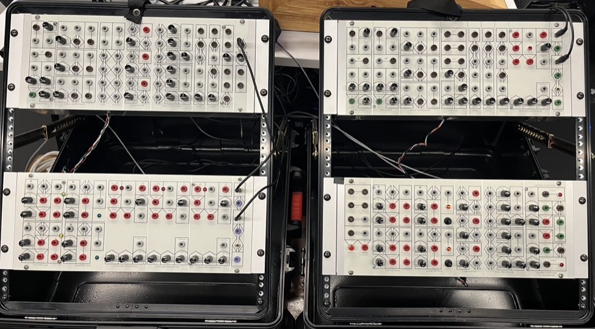

The **73-75 Serge** is a 4-panel system built from a series of kits designed by the Human Comparator in Stockholm as part of their *73-75* project, which aims to revisit the original Serge Modular DIY designs. The first two panels (called the "Homebuilt" system) were built by Luther Bradfute, and contain a "greatest hits" of Serge modules from the first generation of Tcherepnin's synthesizers, built in his home and sold as kits while he was still working at CalArts from 1973-1975. The second two panels, dubbed the "Voice" and "Control" panels, were built by Matt Gerken, and contain modules oriented towards sound generation and event processing, respectively. In general, these modules are simpler than found on the Random\*Source panels, but contain many examples of Tcherepnin's innovative designs.

### Homebuilt Panel 1

#### Oscillator

The 73-75 **Oscillator** has two sets of oscillator outputs - a variable waveform that goes from sine to sawtooth, and a pure sawtooth waveform (the circuit's [oscillator core](https://www.perfectcircuit.com/signal/learning-synthesis-oscillators)). Both outputs can be tapped as AC or DC signals, and the oscillator can be [synced](https://en.wikipedia.org/wiki/Oscillator_sync).

1. Bipolar variable waveform, controlled by *3* and *4* (AC OUTPUT)
2. Unipolar variable waveform, controlled by *3* and *4* (DC OUTPUT)
3. Control knob for variable waveform shape (sine to square - sums with *4*)
4. CV input for variable waveform shape (sums with *3*) (DC INPUT)
5. Unipolar sawtooth waveform (DC OUTPUT)
6. Bipolar sawtooth waveform (AC OUTPUT)
7. CV frequency 1 (scaled by *9*, sums with *8* x *10* and *12*) (DC INPUT)
8. CV frequency 2 (scaled by *10*, sums with *7* x *9* and *12*) (DC INPUT)
9. Scalar knob for *7*
10. Scalar knob for *8*
11. Oscillator sync input for sawtooth outputs *5* and *6* (AC INPUT)
12. Knob for base oscillator frequency (sums with *7* x *9* and *8* x *10*)

*Notes:*
- The 73-75 Oscillator was developed before Tcherepnin adopted the 1 volt-per-octave standard used by Moog synthesizers. As a result, it has a different frequency scaling from the newer circuit designs used in the Random\*Source modules.
- The Oscillator has two separate CV inputs (*7* and *8*) with independent scaling (*9* and *10*) to modulate the frequency of the oscillators. This allows for, e.g. an audio-rate FM input as well as a set of voltages from a sequencer.
- The variable waveform output transitions smoothly from a sawtooth to a (nearly) sine wave output by using a waveshaping circuit similar to that found on the Triple Waveshaper. The output can be patched through a "square-up" module (such as the Triple Comparator or the Square module on the Shelfisizer) to create a square wave or pulse train; it can also be patched into the Dual Negative Slew to create a triangle waveform.

#### Triple Waveshaper

The Serge **Triple Waveshaper (TWS)**, along with the Wave Multipliers (found on the Random\*Source system), are considered classic examples of modules that perform "West Coast" synthesizer distortion. Consisting of three sets of [waveshapers](https://en.wikipedia.org/wiki/Waveshaper) with CV control, the modules are designed to be patch-programmed to interact with one another in different ways. 

1. Signal to be waveshaped (AC INPUT)
2. Waveshaper CV 2 (DC INPUT)
3. Waveshaper CV 1 (DC INPUT)
4. Knob for waveshaper amount (summed with *2* and *3*)
5. Bipolar output (AC OUTPUT)
6. Unipolar output (DC OUTPUT)

*Notes:*
- The TWS transfer function circuit will, when turned all the way up, transform a sawtooth wave into a sine wave, according to the T2 [Chebyshev polynomial](https://en.wikipedia.org/wiki/Chebyshev_polynomials). The intensity of the shaping control (*2* + *3* + *4*) determines the amount of waveshaping. With a sawtooth wave input, this determines which harmonics are subtracted.
- A sine wave sent into the same transfer function will have its frequency doubled. A harmonically rich signal will distort in complex ways as the transfer function of a waveshaper circuit exhibits nonlinear behavior.
- The outputs of the TWS can be patch-programmed in series, so that all three waveshapers can distort the same signal.
- The TWS is also excellent for shaping low-frequency signals to generate interesting control voltages. For example, you could feed one waveshaper in the TWS with the output of an Envelope Generator and a second with an oscillator, using the output of the first as the *CV input* of the second.

#### Peak / Trough

The 73-75 **Peak / Trough** is quite simple, but exemplifies Tcherepnin's instrument design aesthetic of "letting the circuit suggest the sound, rather than the sound suggest the circuit". The module has two sides: the left side (the "Peak") outputs the *highest* signal that appears at its inputs; the right side (the "Trough") outputs the *lowest*.

1. "Peak" (highest) signal of the left-side inputs (DC OUTPUT)
2. "Trough" (lowest) signal of the right-side inputs (DC OUTPUT)
3. Inputs for "Peak" circuit (DC INPUT)
4. Inputs for "Trough" circuit (DC OUTPUT)

*Notes:*
- The Peak / Trough module is designed for generating complex signals - whether to be used as voltages or audio - by inputing multiple inputs at different frequencies (e.g. from an Envelope Generator).
- The module can be used to combine gates / pulses as well - the "Peak" side will go HIGH if any input sends a pulse; the "Trough" side will stay LOW unless all the patched inputs are HIGH.

#### Triple Comparator

The **Triple Comparator** is Tcherepnin's first "Boolean" module, consisting of three identical circuits that send a pulse output HIGH whenever their "+" input rises above their "-" input. A knob can set a fixed DC threshold instead of a varying "-" input.

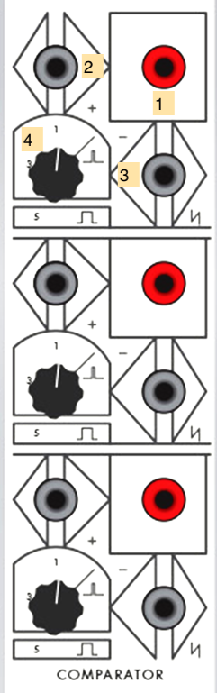

1. Comparator result - HIGH if *2* > *3* + *4*; LOW otherwise (Pulse OUTPUT)
2. "+" signal (DC INPUT)
3. "-" signal (sums with *4*) (DC INPUT)
4. "-" threshold knob (sums with *3*)

*Notes:*
- The Triple Comparator's pulse output can trigger an envelope, advance a sequencer, or generate a ramp by sending its pulse output through a slew module, in response to the ways in which its input signals interact.
- The Triple Comparator can easily be used to "square up" an input signal (*2*) against a threshold (*4*), to create an audio square wave, a gate, or a pulse. Sending a DC sawtooth signal from the Oscillator module into the "+" input (*2*), for example, will output a square wave, with the "-" level, set by knob *4*, signal input *3*, or both, determining the [pulse width](https://en.wikipedia.org/wiki/Pulse-width_modulation) of the output signal.
- The Triple Comparator's outputs are continuous boolean signal comparators, not Schmitt triggers, so the output voltage will remain HIGH as long as the "+" signal is greater than the "-" signal.

#### Dual Processor

The **Dual Processor** is a first-generation Tcherepnin design that has survived, more-or-less unchanged, as a standard module in the Serge repertoire (on our Random\*Source system, it's called the **Control Voltage Processor**). It functions as a mixer / scalar for control voltages. The module is split into two halves, with up to three sources in each half that can be scaled independently, with an overall scalar for each half.

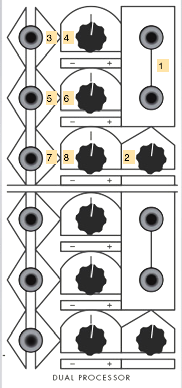

1. Output of the control voltage processor (DC OUTPUT)
2. Overall scaling knob or the output voltage
3. First CV input (DC INPUT)
4. Scalar knob for *3*
5. Second CV input (DC INPUT)
6. Scalar knob for *5*
7. Third CV input (DC INPUT)
8. Scalar knob for *7*

*Notes:*
- The Dual Processor will also mix bipolar (AC) sources, similar to an audio mixer. 
- A static DC signal can be used to "bias" an AC source.

#### Ring Modulator

The Serge **Ring Modulator** was one of Tcherepnin's earliest designs, and allows for the multiplication of bipolar and unipolar signals to create a variety of effects. A control knob controls the strength of the effect.

1. Output of Ring Modulator (AC OUTPUT)
2. Bipolar Y (Modulator) source (AC INPUT)
3. Unipolar Y (Modulator) source (DC INPUT)
4. Bipolar X (Carrier) source (AC INPUT)
5. Unipolar X (Carrier) source (DC INPUT)
6. Effect control knob - fades from X input only to XY (fully modulated)

*Notes:*
- Two bipolar input signals will cause [**ring modulation**](https://en.wikipedia.org/wiki/Ring_modulation), with the result being the sum and difference of the two input spectra.
- A bipolar input signal in one input and a unipolar input signal in the other will cause [**amplitude modulation**](https://en.wikipedia.org/wiki/Amplitude_modulation), which retains the carrier (bipolar) spectrum as well as the sidebands.
- If an audio-rate bipolar signal is used as the X signal (*4*), an envelope signal at the unipolar Y input (*3*) will cause the module to function as a [**VCA**](https://en.wikipedia.org/wiki/Variable-gain_amplifier).
- If both input signals are unipolar, the Ring Modulator will multiply the signals, allowing, for example, two envelope generators running at different frequencies to create a signal made up of their interference patterns.
- The bipolar inputs (*2* and *4*) are *AC-coupled* and will filter out slow-moving (<20Hz) signals. The unipolar inputs (*3* and *5*) will work with any frequency but will perform [full-wave rectification](https://en.wikipedia.org/wiki/Rectifier#Full-wave_rectification) on AC signals, flipping them positive.

#### Gate

The 1973 Serge **Gate** module was Tcherepnin's first [**VCA**](https://en.wikipedia.org/wiki/Variable-gain_amplifier) design, allowing the amplitude of input signals to be modified by a second envelope signal. The module has inputs for both linear and logarithmic amplitude scaling as well as an overall gain control.

1. VCA output (AC OUTPUT)
2. Bipolar input (sums with *3*) (AC INPUT)
3. Unipolar input (sums with *2*) (DC INPUT)
4. Linear CV gain (DC INPUT)
5. Logarithmic CV gain (DC INPUT)
6. Scaling knob for overall gain (scales with *4* and *5*)

*Notes:*
- The Gate module can be used as a simple VCA by connecting an audio signal to *2* and the output of an envelope generator to *4* or *5*, depending on the amplitude response you need.
- The unipolar input *3* can be used for control voltage scaling.

#### Reverb

The 1973 Serge **Reverb** unit uses a mounted [spring reverberation](https://en.wikipedia.org/wiki/Reverberation#Spring_reverberators) tank on the back of the panel to add a reverb effect to the incoming signal.

1. Mixed reverb outputs (AC OUTPUT)
2. Mix control knob
3. Direct reverb outputs (AC OUTPUT)
4. Reverb input (AC INPUT)

*Notes:*
- The Reverb module can create a wet/dry mix, or you can directly tap the reverb tank outputs at *3*.

#### Preamp

The Serge *Preamp* provides a gain stage to allow a high-impedance signal to be input into the Serge system.

1. 1/4" TRS input to the preamplifier
2. Gain control knob
3. Amplified outputs (AC OUTPUT)

*Notes:*
- The Preamp isn't, strictly-speaking, necessary to bring external signals into a Serge system - the Low-Gain converter boxes will work just fine. However, it will help with signals that are high-impedance or deliver a low volume, such as the output of an electric guitar.

### Homebuilt Panel 2

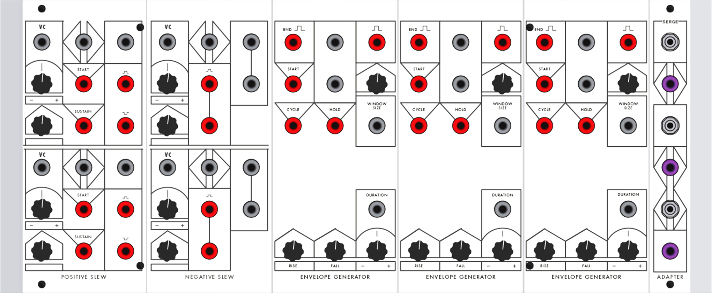

#### Dual Positive Slew

The **Dual Positive Slew** is the forerunner to the Dual Universal Slope Generator (DUSG - found on our Random\*Source Serge), and is an early example of Tcherepnin's desire to make modules that perform more than one function with the same circuit. It can perform [slew limiting](https://en.wikipedia.org/wiki/Slew_rate) on a rising input signal to function as the first half of an envelope follower (the Dual Negative Slew providing the other half). It can also be patched to oscillate as a rising sawtooth LFO or generate a rising envelope. The module contains two identical circuits laid out in an upper and lower half.

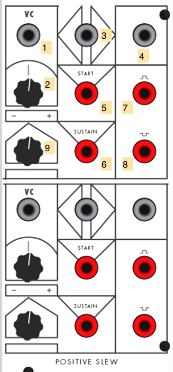

1. CV input for slew limiter amount (scaled by *2*, sums with *9*) (DC INPUT)
2. Scaling knob for *1*
3. Input signal (DC INPUT)
4. Output signal (DC OUTPUT)
5. "Start" envelope trigger (Pulse INPUT)
6. "Sustain" envelope trigger (Pulse INPUT)
7. Gate signal (Pulse OUTPUT)
8. End signal (Pulse OUTPUT)
9. Slew base amount (sums with *1* x *2*)

*Notes:*
- The simplest use of the Positive Slew is as an **envelope follower** that limits rising signals. Voltage sent into input *3* will have a lag on rising signals correlated to the slew limiter amount (*9* + *1* x *2*).
- A pulse at the "Start" trigger will create a rising ramp envelope at *4*, the speed of which is controlled by the slew amount. During the ramp, the gate output *7* will go HIGH. At the end of the ramp, the output signal will drop and the end signal *8* will pulse. Patching *8* back into *5* will turn the positive slew into a rising sawtooth **oscillator**.
- A pulse at the "Sustain" trigger will perform the same as the "Start" trigger, with the exception that the ramp output and gate (*4* and *7*) will remain HIGH at the end of the slew time.
- The Positive Slew adds an interesting distortion to audio signals as, unlike a low-pass filter, it leaves falling signals untouched.
- The Dual Positive Slew is designed to be used with the Dual Negative Slew to perform bidirectional envelope following or create a complete attack-sustain-release (ASR) envelope generator.

#### Dual Negative Slew

The **Dual Negative Slew** is the complement to the Dual Positive Slew, and like its counterpart was incorporated by Tcherepnin into the Dual Universal Slope Generator in 1976. It can perform [slew limiting](https://en.wikipedia.org/wiki/Slew_rate) on a falling input signal to function as the second half of an envelope follower (the Dual Positive Slew providing the other half). It can also be patched to oscillate as a falling sawtooth LFO or generate a falling envelope. The module contains two identical circuits laid out in an upper and lower half.

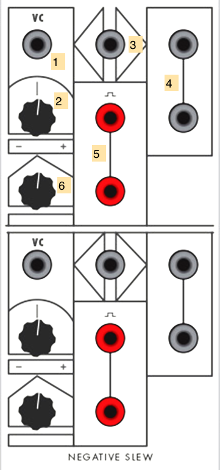

1. CV input for slew limiter amount (scaled by *2*, sums with *6*) (DC INPUT)
2. Scaling knob for *1*
3. Input signal (DC INPUT)
4. Output signal (DC OUTPUT)
5. "End" trigger (Pulse OUTPUT)
6. Slew base amount (sums with *1* x *2*)

*Notes:*
- The simplest use of the Negative Slew is as an **envelope follower** that limits falling signals. Voltage sent into input *3* will have a lag on rising signals correlated to the slew limiter amount (*6* + *1* x *2*).
- A pulse at input *3* will create a high voltage output at *4* that gradually falls to 0v at the slew amount, upon which the end trigger *5* will fire a pulse. Patching *6* back into *1* will turn the negative slew into a falling sawtooth **oscillator**.
- The Negative Slew adds an interesting distortion to audio signals as, unlike a low-pass filter, it leaves rising signals untouched.
- The Dual Negative Slew is designed to be used with the Dual Positive Slew to perform bidirectional envelope following or create a complete attack-sustain-release (ASR) envelope generator.

#### Envelope Generator #1, #2, #3

The 1973 **Envelope Generator (EG)** modules generate attack-release envelopes, with added features to make them usable as oscillators and sample-and-hold modules. The three EG modules in the 73-75 system are identical.

1. "Start" trigger for the envelope generator (Pulse INPUT)
2. "End" trigger for the envelope generator (Pulse OUTPUT)
3. Envelope signal (DC OUTPUT)
4. Gate signal (Pulse OUTPUT)
5. Knob to set window size of gate (summed with *6*)
6. CV input to set window size of gate (summed with *5*) (DC INPUT)
7. "Cycle" trigger for the envelope generator (Pulse INPUT)
8. "Hold" trigger for the envelope generator (Pulse INPUT)
9. CV input for overall duration (sums with *10* and scales *11* and *12*) (DC INPUT)
10. Base duration for EG (sums with *9* and scales *11* and *12*)
11. Fall time for envelope (scaled by *9* + *10*)
12. Rise time for envelope (scaled by *9* + *10*)

*Notes:*
- The EG can be used as a basic **envelope generator** by sending a pulse to the start input *1*. The voltage at *3* will rise and fall according to the envelope parameters (*9*-*12*), and a gate signal at *4* will go HIGH for all or part of the envelope, depending on the window size setting (*5* + *6*). The end trigger *2* will pulse when the envelope has completed its run.
- The Cycle input, when set HIGH, wil cause the EG to generate a new envelope immediately after the last one completes; this allows you to use the module as a triangle wave **oscillator**. Patching the end trigger *4* into the start trigger *1* accomplishes more or less the same thing.
- The Hold input, when set HIGH, will *freeze* all the EG's outputs and pause the timing of the rise/fall cycle. This can be used to create a [**sample-and-hold**](https://en.wikipedia.org/wiki/Sample_and_hold) effect if the envelope output is patched, e.g. into the frequency of an oscillator.
- The duration, by being CV controllable, allows you to dynamically shorten and lengthen the entire envelope based on external voltage.
- The envelope generator, like most of Tcherepnin's timing circuits (c.f. the Dual Slopes on the Random\*Source Serge) cannot be retriggered until they've completed their envelope. Driving the EG with a pulse train, and then setting the duration of the envelope to greater than the wavelength of the pulses, allows you to use the EG as a [**subharmonic oscillator**](https://en.wikipedia.org/wiki/Undertone_series), generating tones at 1/2, 1/3, etc. the frequency of the input.

#### Adapter

The **Adapter** is a passive utility module that converts between banana jacks and 3.5mm / 1/8" connectors. There are three pairs of connectors in the module, and each converter can be used as an input or an output to the Serge.

1. 1/8" connector
2. Banana connector (any INPUT or OUTPUT)

*Notes:*
- The Adapter module is passive, and won't perform any filtering, attenuation, AC coupling, or preamplification on the signal in either direction. In the IDM Audio Lab, it's equivalent to the Low-Gain converter boxes.
- In the IDM Audio Lab, the top 1/8" jack on the Adapter module is wired to input 6 on the Tascam mixer.

### Voice Panel

#### Oscillator #1, #2

The 73-75 **Oscillators** have two sets of oscillator outputs - a variable waveform that goes from sine to sawtooth, and a pure sawtooth waveform (the circuit's [oscillator core](https://www.perfectcircuit.com/signal/learning-synthesis-oscillators)). Both outputs can be tapped as AC or DC signals, and the oscillators can be [synced](https://en.wikipedia.org/wiki/Oscillator_sync).

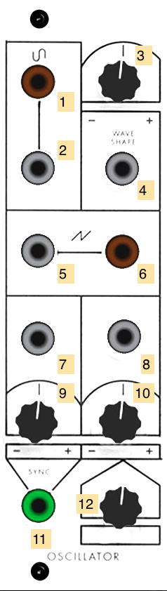

1. Bipolar variable waveform, controlled by *3* and *4* (AC OUTPUT)
2. Unipolar variable waveform, controlled by *3* and *4* (DC OUTPUT)
3. Control knob for variable waveform shape (sine to square - sums with *4*)
4. CV input for variable waveform shape (sums with *3*) (DC INPUT)
5. Unipolar sawtooth waveform (DC OUTPUT)
6. Bipolar sawtooth waveform (AC OUTPUT)
7. CV frequency 1 (scaled by *9*, sums with *8* x *10* and *12*) (DC INPUT)
8. CV frequency 2 (scaled by *10*, sums with *7* x *9* and *12*) (DC INPUT)
9. Scalar knob for *7*
10. Scalar knob for *8*
11. Oscillator sync input for sawtooth outputs *5* and *6* (AC INPUT)
12. Knob for base oscillator frequency (sums with *7* x *9* and *8* x *10*)

*Notes:*
- The 73-75 Oscillator was developed before Tcherepnin adopted the 1 volt-per-octave standard used by Moog synthesizers. As a result, it has a different frequency scaling from the newer circuit designs used in the Random\*Source modules.
- The Oscillator has two separate CV inputs (*7* and *8*) with independent scaling (*9* and *10*) to modulate the frequency of the oscillators. This allows for, e.g. an audio-rate FM input as well as a set of voltages from a sequencer.
- The variable waveform output transitions smoothly from a sawtooth to a (nearly) sine wave output by using a waveshaping circuit similar to that found on the Triple Waveshaper. The output can be patched through a "square-up" module (such as the Triple Comparator or the Square module on the Shelfisizer) to create a square wave or pulse train; it can also be patched into the Dual Negative Slew to create a triangle waveform.

#### Triple Waveshaper

The Serge **Triple Waveshaper (TWS)**, along with the Wave Multipliers (found on the Random\*Source system), are considered classic examples of modules that perform "West Coast" synthesizer distortion. Consisting of three sets of [waveshapers](https://en.wikipedia.org/wiki/Waveshaper) with CV control, the modules are designed to be patch-programmed to interact with one another in different ways. 

1. Signal to be waveshaped (AC INPUT)
2. Waveshaper CV 2 (DC INPUT)
3. Waveshaper CV 1 (DC INPUT)
4. Knob for waveshaper amount (summed with *2* and *3*)
5. Bipolar output (AC OUTPUT)
6. Unipolar output (DC OUTPUT)

*Notes:*
- The TWS transfer function circuit will, when turned all the way up, transform a sawtooth wave into a sine wave, according to the T2 [Chebyshev polynomial](https://en.wikipedia.org/wiki/Chebyshev_polynomials). The intensity of the shaping control (*2* + *3* + *4*) determines the amount of waveshaping. With a sawtooth wave input, this determines which harmonics are subtracted.
- A sine wave sent into the same transfer function will have its frequency doubled. A harmonically rich signal will distort in complex ways as the transfer function of a waveshaper circuit exhibits nonlinear behavior.
- The outputs of the TWS can be patch-programmed in series, so that all three waveshapers can distort the same signal.
- The TWS is also excellent for shaping low-frequency signals to generate interesting control voltages. For example, you could feed one waveshaper in the TWS with the output of an Envelope Generator and a second with an oscillator, using the output of the first as the *CV input* of the second.

#### Filter

The original Serge **Filter** is a two-pole state-variable filter with independent lowpass, bandpass, and highpass outputs. 

1. Highpass outputs (AC OUTPUT)
2. Bandpass outputs (AC OUTPUT)
3. Lowpass outputs (AC OUTPUT)
4. Filter input (AC INPUT)
5. Filter gain control knob
6. Filter center / cutoff frequency knob (summed with *7* x *8*)
7. Filter CV scaling knob (multiplied with *8*)
8. Filter CV input (multiplied with *7*) (DC INPUT)
9. Q (filter quality) knob

*Notes:*
- Unlike Tcherepnin's later filter designs (such as the **VCFQ**), this filter lacks volt/octave scaling.
- The 73-75 Filter, like all Serge filter circuits, can filter both audio range signals and low frequency control voltages.

#### Gate #1, #2

The 1973 Serge **Gate** module was Tcherepnin's first [**VCA**](https://en.wikipedia.org/wiki/Variable-gain_amplifier) design, allowing the amplitude of input signals to be modified by a second envelope signal. These modules have inputs for both linear and logarithmic amplitude scaling as well as an overall gain control.

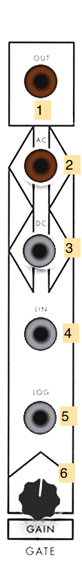

1. VCA output (AC OUTPUT)
2. Bipolar input (sums with *3*) (AC INPUT)
3. Unipolar input (sums with *2*) (DC INPUT)
4. Linear CV gain (DC INPUT)
5. Logarithmic CV gain (DC INPUT)
6. Scaling knob for overall gain (scales with *4* and *5*)

*Notes:*
- The Gate modules can be used as a simple VCA by connecting an audio signal to *2* and the output of an envelope generator to *4* or *5*, depending on the amplitude response you need.
- The unipolar input *3* can be used for control voltage scaling.

#### Ring Modulator

The Serge **Ring Modulator** was one of Tcherepnin's earliest designs, and allows for the multiplication of bipolar and unipolar signals to create a variety of effects. A control knob controls the strength of the effect.

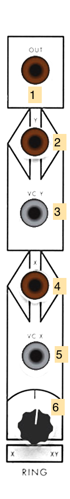

1. Output of Ring Modulator (AC OUTPUT)
2. Bipolar Y (Modulator) source (AC INPUT)
3. Unipolar Y (Modulator) source (DC INPUT)
4. Bipolar X (Carrier) source (AC INPUT)
5. Unipolar X (Carrier) source (DC INPUT)
6. Effect control knob - fades from X input only to XY (fully modulated)

*Notes:*
- Two bipolar input signals will cause [**ring modulation**](https://en.wikipedia.org/wiki/Ring_modulation), with the result being the sum and difference of the two input spectra.
- A bipolar input signal in one input and a unipolar input signal in the other will cause [**amplitude modulation**](https://en.wikipedia.org/wiki/Amplitude_modulation), which retains the carrier (bipolar) spectrum as well as the sidebands.
- If an audio-rate bipolar signal is used as the X signal (*4*), an envelope signal at the unipolar Y input (*3*) will cause the module to function as a [**VCA**](https://en.wikipedia.org/wiki/Variable-gain_amplifier).
- If both input signals are unipolar, the Ring Modulator will multiply the signals, allowing, for example, two envelope generators running at different frequencies to create a signal made up of their interference patterns.
- The bipolar inputs (*2* and *4*) are *AC-coupled* and will filter out slow-moving (<20Hz) signals. The unipolar inputs (*3* and *5*) will work with any frequency but will perform [full-wave rectification](https://en.wikipedia.org/wiki/Rectifier#Full-wave_rectification) on AC signals, flipping them positive.

#### Envelope Generator

The 1973 **Envelope Generator (EG)** module generates attack-release envelopes, with added features to make them usable as oscillators and sample-and-hold modules.

1. "Start" trigger for the envelope generator (Pulse INPUT)
2. "End" trigger for the envelope generator (Pulse OUTPUT)
3. Envelope signal (DC OUTPUT)
4. Gate signal (Pulse OUTPUT)
5. Knob to set window size of gate (summed with *6*)
6. CV input to set window size of gate (summed with *5*) (DC INPUT)
7. "Cycle" trigger for the envelope generator (Pulse INPUT)
8. "Hold" trigger for the envelope generator (Pulse INPUT)
9. CV input for overall duration (sums with *10* and scales *11* and *12*) (DC INPUT)
10. Base duration for EG (sums with *9* and scales *11* and *12*)
11. Fall time for envelope (scaled by *9* + *10*)
12. Rise time for envelope (scaled by *9* + *10*)

*Notes:*
- The EG can be used as a basic **envelope generator** by sending a pulse to the start input *1*. The voltage at *3* will rise and fall according to the envelope parameters (*9*-*12*), and a gate signal at *4* will go HIGH for all or part of the envelope, depending on the window size setting (*5* + *6*). The end trigger *2* will pulse when the envelope has completed its run.
- The Cycle input, when set HIGH, wil cause the EG to generate a new envelope immediately after the last one completes; this allows you to use the module as a triangle wave **oscillator**. Patching the end trigger *4* into the start trigger *1* accomplishes more or less the same thing.
- The Hold input, when set HIGH, will *freeze* all the EG's outputs and pause the timing of the rise/fall cycle. This can be used to create a [**sample-and-hold**](https://en.wikipedia.org/wiki/Sample_and_hold) effect if the envelope output is patched, e.g. into the frequency of an oscillator.
- The duration, by being CV controllable, allows you to dynamically shorten and lengthen the entire envelope based on external voltage.
- The envelope generator, like most of Tcherepnin's timing circuits (c.f. the Dual Slopes on the Random\*Source Serge) cannot be retriggered until they've completed their envelope. Driving the EG with a pulse train, and then setting the duration of the envelope to greater than the wavelength of the pulses, allows you to use the EG as a [**subharmonic oscillator**](https://en.wikipedia.org/wiki/Undertone_series), generating tones at 1/2, 1/3, etc. the frequency of the input.

#### Adapter

The **Adapter** is a passive utility module that converts between banana jacks and 3.5mm / 1/8" connectors. There are three pairs of connectors in the module, and each converter can be used as an input or an output to the Serge.

1. 1/8" connector
2. Banana connector (any INPUT or OUTPUT)

*Notes:*
- The Adapter module is passive, and won't perform any filtering, attenuation, AC coupling, or preamplification on the signal in either direction. In the IDM Audio Lab, it's equivalent to the Low-Gain converter boxes.

### Control Panel

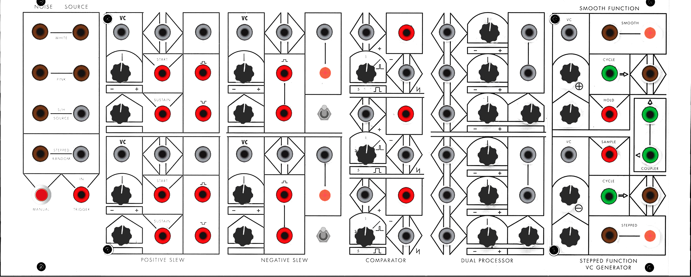

#### Noise Source

The **Noise Source** is the forerunner to the noise generator circuits used throughout the different generations of Serge designs, including the Noise Source attached to the SSG modules on the R\*S Serge panels, as well as the Random Source module. It generates white and pink noise as well as Tcherepnin's "dirty saw" source designed for use with a sample-and-hold; it can also generate stepped random voltages.

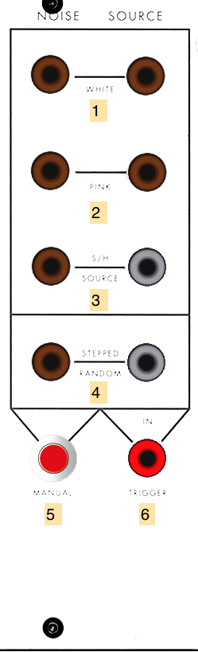

1. White noise output (AC OUTPUT)
2. Pink noise output (AC OUTPUT)
3. S/H Source ("dirty saw") (left jack: AC OUTPUT; right jack: DC output)
4. Stepped random voltage output (left jack: AC OUTPUT; right jack: DC output)
5. Manual random voltage trigger button
6. Random voltage trigger input (Pulse INPUT)

*Notes:*
- The Noise Source module provides ideal outputs to experiment with as inputs for any CV input on the other modules, allowing to create generative, ever-varying sounds. The stepped voltage output, which samples the white noise signal upon being triggered, can be used to create classic bleep-bloop noises when patched in as the frequency of an oscillator.

#### Dual Positive Slew

The **Dual Positive Slew** is the forerunner to the Dual Universal Slope Generator (DUSG - found on our Random\*Source Serge), and is an early example of Tcherepnin's desire to make modules that perform more than one function with the same circuit. It can perform [slew limiting](https://en.wikipedia.org/wiki/Slew_rate) on a rising input signal to function as the first half of an envelope follower (the Dual Negative Slew providing the other half). It can also be patched to oscillate as a rising sawtooth LFO or generate a rising envelope. The module contains two identical circuits laid out in an upper and lower half.

1. CV input for slew limiter amount (scaled by *2*, sums with *9*) (DC INPUT)
2. Scaling knob for *1*
3. Input signal (DC INPUT)
4. Output signal (DC OUTPUT)
5. "Start" envelope trigger (Pulse INPUT)
6. "Sustain" envelope trigger (Pulse INPUT)
7. Gate signal (Pulse OUTPUT)
8. End signal (Pulse OUTPUT)
9. Slew base amount (sums with *1* x *2*)

*Notes:*
- The simplest use of the Positive Slew is as an **envelope follower** that limits rising signals. Voltage sent into input *3* will have a lag on rising signals correlated to the slew limiter amount (*9* + *1* x *2*).
- A pulse at the "Start" trigger will create a rising ramp envelope at *4*, the speed of which is controlled by the slew amount. During the ramp, the gate output *7* will go HIGH. At the end of the ramp, the output signal will drop and the end signal *8* will pulse. Patching *8* back into *5* will turn the positive slew into a rising sawtooth **oscillator**.
- A pulse at the "Sustain" trigger will perform the same as the "Start" trigger, with the exception that the ramp output and gate (*4* and *7*) will remain HIGH at the end of the slew time.
- The Positive Slew adds an interesting distortion to audio signals as, unlike a low-pass filter, it leaves falling signals untouched.
- The Dual Positive Slew is designed to be used with the Dual Negative Slew to perform bidirectional envelope following or create a complete attack-sustain-release (ASR) envelope generator.

#### Dual Negative Slew

The **Dual Negative Slew** is the complement to the Dual Positive Slew, and like its counterpart was incorporated by Tcherepnin into the Dual Universal Slope Generator in 1976. It can perform [slew limiting](https://en.wikipedia.org/wiki/Slew_rate) on a falling input signal to function as the second half of an envelope follower (the Dual Positive Slew providing the other half). It can also be patched to oscillate as a falling sawtooth LFO or generate a falling envelope. The module contains two identical circuits laid out in an upper and lower half.

1. CV input for slew limiter amount (scaled by *2*, sums with *6*) (DC INPUT)
2. Scaling knob for *1*
3. Input signal (DC INPUT)
4. Output signal (DC OUTPUT)
5. "End" trigger (Pulse OUTPUT)
6. Slew base amount (sums with *1* x *2*)
7. Loop switch (shorts *5* to *3*)

*Notes:*
- The simplest use of the Negative Slew is as an **envelope follower** that limits falling signals. Voltage sent into input *3* will have a lag on rising signals correlated to the slew limiter amount (*6* + *1* x *2*).
- A pulse at input *3* will create a high voltage output at *4* that gradually falls to 0v at the slew amount, upon which the end trigger *5* will fire a pulse. Patching *6* back into *1* will turn the negative slew into a falling sawtooth **oscillator**.
- The Negative Slew adds an interesting distortion to audio signals as, unlike a low-pass filter, it leaves rising signals untouched.
- The Dual Negative Slew is designed to be used with the Dual Positive Slew to perform bidirectional envelope following or create a complete attack-sustain-release (ASR) envelope generator.

#### Triple Comparator

The **Triple Comparator** is Tcherepnin's first "Boolean" module, consisting of three identical circuits that send a pulse output HIGH whenever their "+" input rises above their "-" input. A knob can set a fixed DC threshold instead of a varying "-" input.

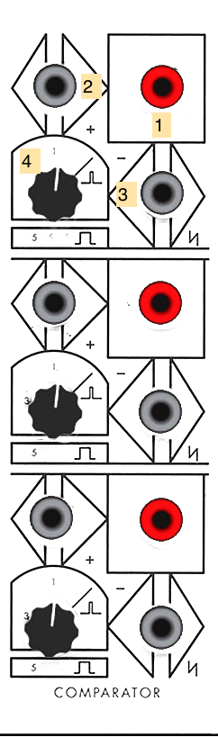

1. Comparator result - HIGH if *2* > *3* + *4*; LOW otherwise (Pulse OUTPUT)
2. "+" signal (DC INPUT)
3. "-" signal (sums with *4*) (DC INPUT)
4. "-" threshold knob (sums with *3*)

*Notes:*
- The Triple Comparator's pulse output can trigger an envelope, advance a sequencer, or generate a ramp by sending its pulse output through a slew module, in response to the ways in which its input signals interact.
- The Triple Comparator can easily be used to "square up" an input signal (*2*) against a threshold (*4*), to create an audio square wave, a gate, or a pulse. Sending a DC sawtooth signal from the Oscillator module into the "+" input (*2*), for example, will output a square wave, with the "-" level, set by knob *4*, signal input *3*, or both, determining the [pulse width](https://en.wikipedia.org/wiki/Pulse-width_modulation) of the output signal.
- The Triple Comparator's outputs are continuous boolean signal comparators, not Schmitt triggers, so the output voltage will remain HIGH as long as the "+" signal is greater than the "-" signal.

#### Dual Processor

The **Dual Processor** is a first-generation Tcherepnin design that has survived, more-or-less unchanged, as a standard module in the Serge repertoire (on our Random\*Source system, it's called the **Control Voltage Processor**). It functions as a mixer / scalar for control voltages. The module is split into two halves, with up to three sources in each half that can be scaled independently, with an overall scalar for each half.

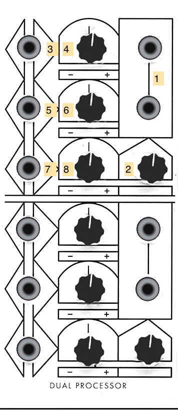

1. Output of the control voltage processor (DC OUTPUT)
2. Overall scaling knob or the output voltage
3. First CV input (DC INPUT)
4. Scalar knob for *3*
5. Second CV input (DC INPUT)
6. Scalar knob for *5*
7. Third CV input (DC INPUT)
8. Scalar knob for *7*

*Notes:*
- The Dual Processor will also mix bipolar (AC) sources, similar to an audio mixer. 
- A static DC signal can be used to "bias" an AC source.

#### Smooth Stepped Generator

The **Smooth Function / Stepped Function VC Generator**, later renamed the **Smooth / Stepped Generator (SSG)**, was designed by Tcherepnin in 1974. Along with the Dual Universal Slope Generator, it's one of the most versatile circuits in the canonical Serge system. Depending on how an SSG is patched, it can function as a [slew limiter](https://en.wikipedia.org/wiki/Slew_rate) (envelope follower / lowpass filter), a sample-and-hold circuit, a triangle wave oscillator, or a low-pass gate. When combined with its sidecar **Noise Source** - a small circuit of three jacks - the SSG can be used to develop a wide variety of fluctuating and quantized random voltages, similar to the Buchla 266 [Source of Uncertainty](http://fluxmonkey.com/historicBuchla/266-uncertainty.htm).

The module is divided into two halves: the "Smooth" side at the top, and the "Stepped" at the bottom. In between the two, a Coupler circuit outputs a comparator voltage of the two sides.

1. Signal output for the Smooth side (AC OUTPUT)
2. Knob for Smooth rate amount (sums with *3* x *4*)
3. Scaling knob for *4*
4. CV input for the Smooth sides's rate (DC INPUT)
5. Signal input for the Smooth side (AC INPUT)
6. Cycle trigger (sends a pulse at the end of a cycle set by the Smooth rate) (Pulse OUTPUT)
7. Hold jack - when set high, Smooth output *1* will freeze and no longer track the module's input (Pulse INPUT)
8. Signal output for the Stepped module (AC OUTPUT)
9. Knob for Stepped rate amount (sums with *10* x *11*)
10. Scaling knob for *11*
11. Signal input for the Stepped side (AC INPUT)
12. Signal input for the Stepped side (AC INPUT)
13. Cycle trigger (sends a pulse at the end of a cycle set by the Stepped rate) (Pulse OUTPUT)
14. Sample jack - when set high, Stepped output *12* will sample and hold Stepped input *8* (Pulse INPUT)
15. "Hot" Coupler output - +5V if Smooth output is higher than the Stepped output; -5V if not (*AC* Pulse OUTPUT)
16. Inverted "Hot" Coupler output - +5V if Stepped output is higher than the Smooth output; -5V if not (*AC* Pulse OUTPUT)

*Notes:*
- The Smooth side can easily self-oscillate in a triangle pattern by patching the cycle trigger (*6*) into the input (*5*). The rate knob and CV inputs (*2*, *3*, *4*) control the speed of this oscillation. The triangle waveform will appear at the voltage output jack (*1*).
- The Stepped side will also internally self-oscillate - by patching cycle trigger *13* to input *8* and adjusting the frequency via *9*, *10*, and *11*. However, no signal will appear at output jack *12* until you send pulses into the Sample jack (*14*). These pulses can come from anywhere, e.g. from the Cycle output of the Smooth side, or from another module. This creates a classic [sample-and-hold](https://en.wikipedia.org/wiki/Sample_and_hold) circuit where the internal oscillating waveform is being "sampled" by the trigger pulse at the Sample jack and "held" as the output voltage at jack *14*.
- By a similar token, *any* input can be used on either side of the SSG. In this case, the Smooth side will work as a [low-pass filter](https://en.wikipedia.org/wiki/Low-pass_filter) with the maximum slew (or smoothing amount) controlled by the rate; the Stepped side will sample-and-hold any input signal - simple waveforms will create different staircase effects based on the frequency difference between the incoming waveform and the "sampling" being performed.
- Sending an audio signal into the input (*5*) of the Smooth side of the SSG and sending an envelope into the CV input (*4*) will, depending where the rate knob (*2*) is set, allow you to use the module as a [low-pass gate](https://electronicmusic.fandom.com/wiki/Lowpass_gate), where the gain on the signal rises with the cutoff frequency of the filter. This setup is great for simulating natural sounding instruments such as percussion where the timbre brightens with the attack of the sound.
- The SSG is quite a complex module, and the Serge fans site has [an entire 4-page article](http://www.serge-fans.com/wiz_SSG1.htm) dedicated to patching ideas using it.

[back to top](#top)

## Ian Fritz Panels

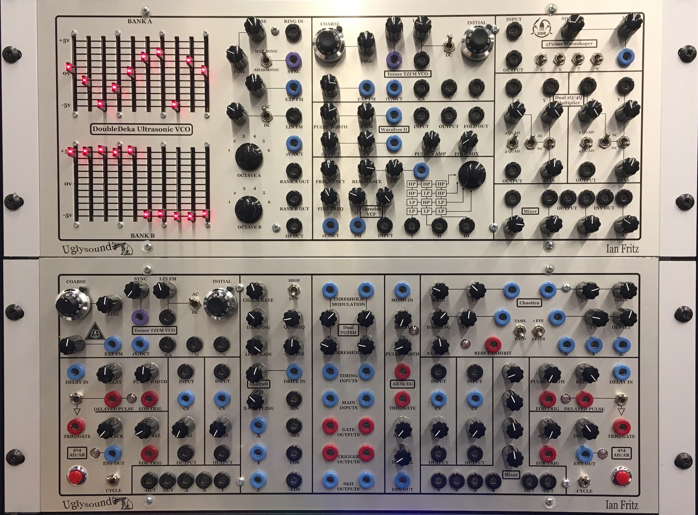

The **Ian Fritz Panels** were developed by Paul Akin at Uglysound Electronics (USE) in 2014, and consist of Serge-compatible implementations of synthesis, signal processing, and control circuits designed by [Ian Fritz](http://ijfritz.byethost4.com/). Fritz has been developing and publishing open-source analog synthesizer designs since 1998, and is considered, along with Jrgen Haible and Ken Stone, to be one of the most important contributors to the DIY analog synthesizer community. Fritz's designs focus on pushing the technical and creative repertoire of what are considered core analog synthesis modules - oscillators, filters, waveshapers, envelope generators, amplifiers, and noise generators are all reconsidered by Fritz and featured in these panels. In many ways the opposite of the 73-75 Serge, Fritz's modules contain more complex circuitry than found in Tcherepnin's designs, but retain the Serge sensibility of patch programmability - each module has many potential uses and can be connected with the other modules in the studio in an infinite number of ways.

*Note: The Fritz panels deviate from the Serge standard somewhat in terms of panel layout and user interface conventions. Paul Akin's implementation of Fritz's designs include a number of UI elements - sliders, ten-turn dials, stepped potentiometers - that don't appear on original Serge equipment. More importantly, the Fritz modules are not always contained in vertical slices, and the layout of "outputs over inputs" on a module is not followed - in fact, it's often reversed, with module outputs at the bottom of the panel in a layout similiar to many Eurorack systems. When working with the Fritz panels, you may need to double-check your connections to make sure your inputs and outputs are correct.*

### Panel 1 (The Timbre Tantrum)

#### DoubleDeka Ultrasonic VCO

The **DoubleDeka Ultrasonic VCO** was Ian Fritz's first [published synthesizer circuit](http://ijfritz.byethost4.com/DD_web.pdf). Unlike most modern VCOs, this design uses an ultrasonic oscillator core - the primary oscillator is above the range of human hearing. A pair of frequency dividers allow you to lower the pitch into two (subharmonically related) frequencies, each of which is then synthesized by a ten-step waveform outlined by the slide potentiometers on the interface. These slider banks represent actual steps in the output wave, similar to a breakpoint function generator such as the [Buchla MARF](https://modularsynthesis.com/roman/buchla248/248marf.htm), and unlike organ drawbars, where the sliders would represent the strengths of different harmonics in the signal.

Early synthesizers (and some electric organs) used electronic or mechanical ultrasonic oscillators, and would generate an audible frequency either through frequency division or [heterodyning](https://en.wikipedia.org/wiki/Heterodyne), in a manner similar to a Theremin. Fritz's technique is designed to be more stable and accurate over a wide range of frequencies than traditional VCO designs. In addition, the DoubleDeka contains an unusual oscillator sync circuit and a "digital" ring modulator that allow for the creation of a wide range of sounds.

1. Waveform sliders for Bank A
2. Waveform sliders for Bank B
3. Coarse frequency knob (summed with *4* and *13*)
4. Fine frequency knob (summed with *3* and *13*)
5. Signal input for ring modulator (AC INPUT)
6. Oscillator sync input (AC INPUT)
7. Harmonic / aharmonic switch for oscillator sync
8. Scaling knob for exponential FM input
9. Exponential Frequency Modulation (FM) input (scaled by *8*)
10. Scaling knob for linear FM input
11. AC/DC switch for linear FM input
12. Linear Frequency Modulation (FM) input (scaled by *10*) (AC INPUT)
13. 1V-per-octave input (summed with *3* and *4*) (DC INPUT)
14. Bank A signal output (AC OUTPUT)
15. Bank B signal output (AC OUTPUT)
16. Bank A octave selection knob
17. Bank B octave selection knob
18. High frequency oscillator core output (AC OUTPUT)

*Notes:*
- The DoubleDeka VCO is considerably more precise and stable than most analog VCO circuits, due to Fritz's research into [temperature compensation](http://ijfritz.byethost4.com/sy_cir7.htm) circuitry.
- At a low (subsonic) frequency, the DoubleDeka can serve as a dual, frequency-synchronized 10-step sequencer with the oscillator output used to drive another parameter elsewhere on the Serge system.

#### Teezer TZFM VCO

The **Teezer Through-Zero FM VCO** is Fritz's design for a sawtooth-core oscillator that can do true, bipolar (or "through zero") [frequency modulation](https://en.wikipedia.org/wiki/Frequency_modulation), using an entirely analog signal path. Typical analog FM circuits were designed to create sonic effects ranging from vibrato to noisy, warped timbres using a second oscillator as a modulating source. These signals typically summed into the existing DC voltage chain controlling the oscillator's frequency, meaning that they only modulated the oscillator in a positive direction. To generate "true" [FM synthesis](https://en.wikipedia.org/wiki/Frequency_modulation_synthesis), as developed by [John Chowning](https://en.wikipedia.org/wiki/John_Chowning) and most famously implemented on *digital* synthesizers such as the [Yamaha DX7](https://en.wikipedia.org/wiki/Yamaha_DX7), the frequency of the primary oscillator needs to be able to go negative as well. 

The [Teezer VCO](http://ijfritz.byethost4.com/teezer_board_a_doc.pdf), by allowing for bipolar FM, can be used to synthesize sounds with the full repertoire of FM effects, including rich sidebands that behave in a nonlinear fashion that can be used to create brassy tones, bell sounds, and other rich, time-varying spectra. The VCO has outputs for triangle, sine, and sawtooth waveforms, and ten-turn precision dials can be used to set the base frequency of both the primary oscillator and the FM circuitry.

1. Coarse frequency knob (sums with *2* and *11*)
2. Fine frequency knob (sums with *1* and *11*)
3. Sync scaling knob
4. Sync signal input (scaled by *3*) (AC INPUT)
5. Linear FM scaling knob
6. Linear Frequency Modulation (FM) input (scaled by *5*, sums with *8*) (AC INPUT) 
7. AC/DC switch for linear FM input
8. Initial FM frequency knob (sums with *5* x *6*)
9. Exponential Frequency Modulation (FM) input (scaled by *10*) (DC INPUT)
10. Exponential FM scaling knob
11. 1V-per-octave input (sums with *1* and *2*) (DC INPUT)
12. Triangle waveform output (AC OUTPUT)
13. Sine waveform output (AC OUTPUT)
14. Sawtooth waveform output (AC OUTPUT)

*Notes:*
- The Teezer VCO is considerably more precise and stable than regular analog VCO circuits, due to Fritz's research into [temperature compensation](http://ijfritz.byethost4.com/sy_cir7.htm) circuitry.

#### Wavolver II

The **Wavolver II** is one of Fritz's unique [waveshaping circuits](http://ijfritz.byethost4.com/sy_cir6.htm), designed in the spirit of Tcherepnin's Wave Multipiers and Triple Waveshaper, as well as the wavefolder circuit on the Buchla Music Easel. Akin's description of the module explains:

> The Wavolver is a novel, versatile waveshaper that generates a special kind of double-pulse waveform along with an extra 
> folded-wave section added between the pulses. It generates a wide range of timbres from a gentle sine or triangle wave to a 
> very rich signal with multiple zero-crossings per cycle.
> 
> The module can be driven by any continuously varying signal. For simplicity let's assume a Tri wave at the input. The 
> circuitry works by only passing the input signal when its amplitude (positive or negative) is above a threshold set by the 
> Pulse Width control. When it's below the threshold the output signal is zero. This is shown on the left side of the 
> following figure. The signal consists of steeple-shaped pulses that can be swept from narrow for high harmonic content to 
> full width, which results in a triangle wave ("Width" and "Width mod" controls). This represents a wider range of timbres 
> than from the familiar rectangular pulse generators, which give a square waves at full width.
> 
> In addition to the double-pulse generator, the Wavolver has circuitry to generate a series of evolving folded waves between 
> the pulses. These are mixed into the output via the "Fold mix" control. The right side of the above figure illustrates the 
> folding at a 50% level for two different pulse widths. The folder output is available separately to allow individual 
> processing of the double pulses and the folds.
> 
> The double-pulse signal consists of a positive pulse and a negative one, and the resulting signal has odd harmonics only. 
> The capability to produce waves with strong, odd-only harmonics is practically never seen in classical VCO/waveshaper 
> designs. There is a wide area of timber space available here that has been largely ignored. Adding the folder output 
> produces high-energy even harmonics in the signal's spectrum.
> 
> In the Wavolver II there are several ways to modify the basic waveforms discussed above. First, the amplitude of the second 
> pulse can be continuously tuned from -5V (as shown above) to +5V ("Pulse 2 amp" control). At full positive amplitude, the 
> signal has two identical positive pulses, resulting in a signal at twice the frequency of the driving signal. Waves with 
> the second harmonic stronger than the fundamental are musically useful, as some acoustic instruments (bowed strings) share 
> this characteristic.
> 
> Another way to change the basic waveforms is to add a DC voltage offset to the input signal ("Offset" and "Offset mod" 
> controls). A positive offset makes the first pulse stronger and wider and at the same time it make the second pulse weaker 
> and narrower. Again, this adds even harmonics into the output spectrum and results in some interesting timbres, especially 
> when modulated. The graphic below illustrates these modifications.
> 
> Finally, the waveshape can be modulated by modulating the input waveform.

1. Pulse width knob (sums with *2* x *3*)
2. Pulse width modulation scaling knob
3. Pulse width modulation (PWM) signal input (sums with *1*, scaled by *3*) (DC INPUT)
4. Waveshaper signal input (AC INPUT)
5. Waveshaper signal output (AC OUTPUT)
6. Folded signal output (AC OUTPUT)
7. Waveshaper strength knob (sums with *8* x *9*)
8. Waveshaper CV scaling knob
9. Waveshaper strength input (sums with *7*, scaled by *8*) (DC INPUT)
10. PWM 2nd order strength knob
11. Folded signal mix knob

*Notes:*
- The Wavolver can work with control voltage input as well as audio, allowing you to use it to transform and distort e.g. a parameter for use elsewhere in the system.

#### Threeler VCF

The **Threeler Voltage-Controlled Filter** is a three-stage series of first-order [state-variable](https://en.wikipedia.org/wiki/State_variable_filter) filters where each stage can be tapped independently and chained together in either highpass or lowpass configurations. This allows you to combine the stages to create highly resonant lowpass, highpass, and bandpass topologies while also having access to outputs of the individual filters. As Fritz outlines in the module's [design document](http://ijfritz.byethost4.com/Threeler_board_doc.pdf), the Threeler's filter circuit emphasizes nonlinear resonances and is intended to be used creatively, rather than as an equalization module.

1. Filter coarse frequency knob (sums with *2* and *3*)
2. Filter fine frequency knob (sums with *1* and *3*)
3. 1V-per-octave frequency input (sums with *1* and *2*) (DC INPUT)
4. Filter resonance knob (sums with *5* x *6*)
5. Filter resonance CV scaling knob (sums with *5*, scaled by *6*)
6. Filter resonance CV input (sums with *4*, scaled by *5*) (DC INPUT)
7. Filter series selector knob
8. FM CV scaling knob
9. Frequency Modulation (FM) signal input (DC INPUT)
10. Filter input scaling knob
11. Filter input (AC INPUT)
12. Filter stage 1 output (AC OUTPUT)
13. Filter stage 2 output (AC OUTPUT)
14. Filter stage 3 output (AC OUTPUT)

*Notes:*
- The Threeler, like the Serge Resonant Equalizer, is great for creating natural sounding resonation.
- The filters in the Threeler, like the Serge VCFQ, can [self-oscillate](https://en.wikipedia.org/wiki/Self-oscillation) to create a sinusoidal output.

#### 5Pulser Waveshaper

The **5Pulser Waveshaper**, like the Wavolver II, is one of Fritz's waveshaper designs inspireed by "West Coast" synthesizer modules by Tcherepnin and Buchla. The [circuit](http://ijfritz.byethost4.com/sy_cir8.htm) is designed to take a sawtooth input and output [pulse trains](https://en.wikipedia.org/wiki/Pulse_wave) at different frequency combinations (set by switches). The resulting sound is an overdriven kind of effect. Like all waveshaper circuits, the 5Pulser is amplitude dependent, so a wide variety of effects can be acheived by using other input waveforms or sounds that change dynamically over time.

1. Signal input (AC INPUT)
2. Waveshaper output (AC OUTPUT)
3. Waveshaping strength knob (sums with *4* x *5*)
4. Waveshaping CV scaling knob
5. Waveshaping CV input (sums with *3*, scaled by *4*) (DC INPUT)
6. Waveshaper harmonic switches

*Notes:*
- The 5Pulser can work with control voltage input as well as audio, allowing you to use it to transform and distort e.g. a parameter for use elsewhere in the system.

#### Dual 2Q/4Q Multiplier

Fritz's **Dual 2Q/4Q Multiplier** is a module that multiplies a pair of AC or DC signals for use as either a standard VCA ("two-quadrant") or as a [ring modulator](https://en.wikipedia.org/wiki/Ring_modulation) ("four-quadrant"). A bias control allows for amplitude modulation effects such as tremolo. The module contains two identical circuits.

1. X signal input (AC or DC INPUT - set by *6*)
2. X signal scaling knob
3. Y signal input (AC or DC INPUT - set by *7*)
4. Y signal scaling knob
5. 2-quadrant / 4-quadrant mode switch
6. X AC/DC switch
7. Y AC/DC switch
8. Signal output (AC OUTPUT)
9. Y signal bias knob

*Notes:*
- The 2Q/4Q Multiplier's selection switches (*5*, *6*, and *7*) allow you to choose whether to create amplitude or ring modulation effects *independently* of the type of input signals your using. In other words, unlike the Serge VCA and ring modulator circuits, a DC input can be used to ring modulate an AC carrier, or an AC signal can be used as an amplitude envelope without the artifacts caused by inverting the carrier signal.

#### Mixer

The **Mixer** on the Fritz panels, like the Mixer on the Random\*Source Serge, allows for the buffered scaling and mixing of multiple AC signals. On this Mixer module, four inputs can be mixed with attenuation knobs, and the module offers both a regular output and an inverted one with the signal 180-degrees out of phase.

1. Signal input 1 (AC INPUT)
2. Input 1 gain knob
3. Signal input 2 (AC INPUT)
4. Input 2 gain knob
5. Signal input 3 (AC INPUT)
6. Input 3 gain knob
7. Signal input 4 (AC INPUT)
8. Input 4 gain knob
9. Mixer output (AC OUTPUT)
10. Inverted mixer output (AC OUTPUT)

*Notes:*
- The knobs on Fritz's Mixer module are **logarithmic** rather than **linear** potentiometers, so 12 oclock is half power (0.707), not half gain (0.5). 
- The Fritz Mixer modules are **AC-coupled** and will filter out low-frequency DC signals and remove the offset of DC signals running at audio rate.

### Panel 2 (Chaos Theory)

#### Teezer TZFM VCO

The **Teezer Through-Zero FM VCO** is Fritz's design for a sawtooth-core oscillator that can do true, bipolar (or "through zero") [frequency modulation](https://en.wikipedia.org/wiki/Frequency_modulation), using an entirely analog signal path. Typical analog FM circuits were designed to create sonic effects ranging from vibrato to noisy, warped timbres using a second oscillator as a modulating source. These signals typically summed into the existing DC voltage chain controlling the oscillator's frequency, meaning that they only modulated the oscillator in a positive direction. To generate "true" [FM synthesis](https://en.wikipedia.org/wiki/Frequency_modulation_synthesis), as developed by [John Chowning](https://en.wikipedia.org/wiki/John_Chowning) and most famously implemented on *digital* synthesizers such as the [Yamaha DX7](https://en.wikipedia.org/wiki/Yamaha_DX7), the frequency of the primary oscillator needs to be able to go negative as well. 

The [Teezer VCO](http://ijfritz.byethost4.com/teezer_board_a_doc.pdf), by allowing for bipolar FM, can be used to synthesize sounds with the full repertoire of FM effects, including rich sidebands that behave in a nonlinear fashion that can be used to create brassy tones, bell sounds, and other rich, time-varying spectra. The VCO has outputs for triangle, sine, and sawtooth waveforms, and ten-turn precision dials can be used to set the base frequency of both the primary oscillator and the FM circuitry.

1. Coarse frequency knob (sums with *2* and *11*)
2. Fine frequency knob (sums with *1* and *11*)
3. Sync scaling knob
4. Sync signal input (scaled by *3*) (AC INPUT)
5. Linear FM scaling knob
6. Linear Frequency Modulation (FM) input (scaled by *5*, sums with *8*) (AC INPUT) 
7. AC/DC switch for linear FM input
8. Initial FM frequency knob (sums with *5* x *6*)
9. Exponential Frequency Modulation (FM) input (scaled by *10*) (DC INPUT)
10. Exponential FM scaling knob
11. 1V-per-octave input (sums with *1* and *2*) (DC INPUT)
12. Triangle waveform output (AC OUTPUT)
13. Sine waveform output (AC OUTPUT)
14. Sawtooth waveform output (AC OUTPUT)

*Notes:*
- The Teezer VCO is considerably more precise and stable than regular analog VCO circuits, due to Fritz's research into [temperature compensation](http://ijfritz.byethost4.com/sy_cir7.htm) circuitry.

#### 4x4 AD/AR / Dual VCA / Mixer

The **4x4 (All-In Plus) Attack-Decay/Attack-Release** is an extension to the All-In EG module, and in many ways is Fritz's answer to the Serge Dual Universal Slope Generator - a [multi-function circuit](http://ijfritz.byethost4.com/sy_cir12_4x4.htm) that can be used as an envelope generator, an oscillator, or a monostable delay. The module as designed by Akin also includes a **Dual Voltage-Controlled Amplifier** and a four-input **Mixer**.

The 4x4 AD/AR has four input modes and four output signals. A trigger/gate input will generate an envelope with an attack and decay (trigger) or release (gate) time set by the knobs. A manual trigger button can be used to generate an AR envelope as well. A pulse is generated at the end of the envelope, and a "cycle" switch allows the module to run as an oscillator either as an LFO or in the audible frequency range. 

In addition, the module contains a pulse delay circuit, which can be used independently or to trigger the envelope generator. The delay is [monostable](https://en.wikipedia.org/wiki/Monostable), so a new trigger sent into the circuit before a delayed pulse is completed will reset the delay circuit.

The Dual VCA circuit consists of a pair of signal amplifier circuits with AC input and output, CV envelope input, and a bias control. The Mixer on this side of the panel has no attenuation knobs and will mix up to four input signals at [unity gain](https://en.wikipedia.org/wiki/1), with regular and inverted signal outputs.

1. Envelope delay time input (DC INPUT)
2. Envelope delay time scaling knob
3. Pulse width knob
4. Pulse-to-EG enable switch
5. Delayed pulse input (Pulse INPUT)
6. Delayed pulse output (Pulse OUTPUT)
7. Trigger/gate input (Pulse INPUT)
8. Attack time knob
9. Decay / release time knob
10. Envelope CV output (DC OUTPUT)
11. End-of-envelope trigger (Pulse OUTPUT)
12. Cycle switch
13. Manual envelope trigger button
14. VCA signal input (AC INPUT)
15. VCA CV input (DC INPUT)
16. VCA bias knob
17. VCA signal output (AC OUTPUT)
18. Mixer input 1 (AC INPUT)
19. Mixer input 2 (AC INPUT)
20. Mixer input 3 (AC INPUT)
21. Mixer output (AC OUTPUT)
22. Mixer inverted output (AC OUTPUT)

*Notes:*
- The input to the pulse delay is a DC signal input, and will trigger the delay based on a transition of 1.5V or more.
- The Fritz Mixer modules are **AC-coupled** and will filter out low-frequency DC signals and remove the offset of DC signals running at audio rate.

#### ChaQuO

The Fritz **Chaos Generator and Quadrature Oscillator** is designed to generate chaotic signals, defined by Fritz as "signals that have varying degrees of interesting irregularity without actually becoming random." The [circuit](http://ijfritz.byethost4.com/Chaos/ChaQuO_board_doc.pdf) developed by Fritz uses a [quadrature oscillator](http://electronic-projects.50webs.com/quadrature-oscillator-circuit.htm) - which generates a sine and a cosine wave - to drive a circuit that simulates a [double potential-well](https://pdfs.semanticscholar.org/5e2c/50bedd4fedd174da2223d4280b99a2b7562b.pdf) problem in quantum mechanics, which exhibitss chaotic behavior. The module outputs three chaotic signals as well as the raw and inverteed signals for the quadrature oscillator.

1. Chaos rate knob
2. High/low frequency switch
3. Chaos damping knob
4. Quadrature oscillator coarse frequency knob
5. Quadrature oscillator fine frequency knob
6. Loop gain knob
7. Drive scaling knob
8. Drive CV input (scaled with *7*) (DC INPUT)
9. X-coupling strength knob
10. X chaos output (DC OUTPUT)
11. Y chaos output (DC OUTPUT)
12. Z chaos output (DC OUTPUT)
13. Sine quadrature output (AC OUTPUT)
14. Inverted sine quadrature output (AC OUTPUT)
15. Cosine quadrature output (AC OUTPUT)
16. Inverted cosine quadrature output (AC OUTPUT) 

*Notes:*
- The quadrature oscillator outputs can be used independently of the chaos generator for spatial control or other LFO tasks within the Serge system where it might be useful to have complimentary (90 degree out-of-phase) waveforms - when the sine wave peaks in either a positive or negative directions, the cosine wave is at zero, and vice versa.

#### Dual TGTSH

The **Dual Threshold/Gate/Trigger/Sample/Hold** is a Fritz [circuit](http://ijfritz.byethost4.com/Chaos/ch_cir3.htm) that combines a sample-and-hold circuit with a trigger/gate output that actuates based on comparing a timing signal crossing a threshold. This allows you to use an LFO signal to sample a secondary signal, drive a sequencer, or trigger an envelope. The module contains two identical halves.

1. Threshold CV input (DC INPUT)
2. Threshold CV scaling knob
3. Threshold knob (sums with *1* x *2*)
4. Timing CV input (DC INPUT)
5. Main CV input (DC INPUT)
6. Gate output (Pulse OUTPUT)
7. Trigger output (Pulse OUTPUT)
8. Sample-and-hold output (CV OUTPUT)

*Notes:*
- The TGTSH can take a pulse signal in its timing input, allowing it to be used as a simple sample-and-hold module similar to the Serge SSG.

#### All-In EG

The **All-In Envelope Generator** is a simple attack-decay or attack-decay-release envelope generator that can be driven by a trigger/gate signal or, through a secondary circuit, by any input signal that crosses a positive 1.5V threshold. The DC input, in addition, runs through a monostable delay circuit, allowing an envelope to be triggered some time after a threshold event.

1. Monostable delay CV/triggeer input (DC INPUT)
2. Delay time knob
3. Pulse width knob
4. Delayed pulse output (Pulse OUTPUT)
5. Envelope generator trigger/gate input (Pulse INPUT)
6. Attack time knob
7. Decay / release time knob
8. Envelope signal (DC OUTPUT)

*Notes:*
- The monostable input *1* will trigger the envelope generator if the pulse output *4* is connected to the EG trigger input *5* via a shorting bar.

#### Chaotica

The **Chaotica** circuit by Ian Fritz generates [complex control voltages](http://ijfritz.byethost4.com/Chaos/ch_cir6_chaotica.htm) through a series of nonlinear elements that can be controlled independently via a variety of parameterss to create three chaotic CV signals.

1. Chaos rate knob
2. Chaos CV scaling knob
3. Chaos CV input (scaled by *2*, sums with *1*) (DC INPUT)
4. Gain CV input (scaled by *5*, sums with *6*) (DC INPUT)
5. Gain CV scaling knob
6. Gain knob
7. Damping  knob
8. Damping CV scaling knob
9. Damping CV input (scaled by *8*, sums with *7*) (DC INPUT)
10. Offset CV input (scaled by *11*, sums with *12*) (DC INPUT)
11. Offset CV scaling knob
12. Offset knob
13. Non-linear drive amount knob
14. Reset trigger (Pulse INPUT)
15. Tame/wild switch
16. 1 eye / 2 eyes switch
17. X chaos output (DC OUTPUT)
18. Y chaos output (DC OUTPUT)
19. Z chaos output (DC OUTPUT)

*Notes:*
- The Chaotica module is designed to generate signal curves that simulate the chaotic systems theorized by [Henri Poincar](https://en.wikipedia.org/wiki/Henri_Poincar%C3%A9).

#### 4x4 AD/AR / Dual VCA / Mixer

The **4x4 (All-In Plus) Attack-Decay/Attack-Release** is an extension to the All-In EG module, and in many ways is Fritz's answer to the Serge Dual Universal Slope Generator - a [multi-function circuit](http://ijfritz.byethost4.com/sy_cir12_4x4.htm) that can be used as an envelope generator, an oscillator, or a monostable delay. The module as designed by Akin also includes a **Dual Voltage-Controlled Amplifier** and a four-input **Mixer**.

The 4x4 AD/AR has four input modes and four output signals. A trigger/gate input with generate an envelope with an attack and decay (trigger) or release (gate) time set by the knobs. A manual trigger button can be used to generate an AR envelope as well. A pulse is generated at the end of the envelope, and a "cycle" switch allows the module to run as an oscillator either as an LFO or in the audible frequency range. 

In addition, the module contains a pulse delay circuit, which can be used independently or to trigger the envelope generator. The delay is [monostable](https://en.wikipedia.org/wiki/Monostable), so a new trigger sent into the circuit before a delayed pulse is completed will reset the delay circuit.

The Dual VCA circuit consists of a pair of signal amplifier circuits with AC input and output, CV envelope input, and a bias control. The Mixer on this side of the panel has attenuation knobs and will mix up to four input signals, with regular and inverted signal outputs.

1. Envelope delay time input (DC INPUT)
2. Envelope delay time scaling knob
3. Pulse width knob
4. Pulse-to-EG enable switch
5. Delayed pulse input (Pulse INPUT)
6. Delayed pulse output (Pulse OUTPUT)
7. Trigger/gate input (Pulse INPUT)
8. Attack time knob
9. Decay / release time knob
10. Envelope CV output (DC OUTPUT)
11. End-of-envelope trigger (Pulse OUTPUT)
12. Cycle switch
13. Manual envelope trigger button
14. VCA signal input (AC INPUT)
15. VCA CV input (DC INPUT)
16. VCA bias knob
17. VCA signal output (AC OUTPUT)
18. Mixer input 1 gain knob
19. Mixer input 2 gain knob
20. Mixer input 3 gain knob
21. Mixer input 4 gain knob
22. Mixer input 1 (AC INPUT)
23. Mixer input 2 (AC INPUT)
24. Mixer input 3 (AC INPUT)
25. Mixer input 4 (AC INPUT)
26. Mixer output (AC OUTPUT)
27. Mixer inverted output (AC OUTPUT)

*Notes:*
- The input to the pulse delay is a DC signal input, and will trigger the delay based on a transition of 1.5V or more.
- The knobs on Fritz's Mixer module are **logarithmic** rather than **linear** potentiometers, so 12 oclock is half power (0.707), not half gain (0.5). 
- The Fritz Mixer modules are **AC-coupled** and will filter out low-frequency DC signals and remove the offset of DC signals running at audio rate.

[back to top](#top)

## STS Panels

The **Red Control** panel is a ["Shop Panel"](http://www.serge-fans.com/shop.html) designed by Sound Transform Systems (STS), the successor to Tcherepnin's original company in the United States, led by Tcherepnin's former employee (and student) Rex Probe. Our Red Control was originally built in the late 1990s and contains a number of Tcherepnin's designs not found elsewhere in the IDM Audio Lab, including his 1979 Quantizer module and the 1974 Analog Shift Register. 

### Red Control

#### Quantizer (TKB)

The 1979 Serge **Quantizer**, which allows for input voltages defining pitch using the 1V/octave standard to be [quantized](https://en.wikipedia.org/wiki/Quantization_(signal_processing)) to specific melodic intervals, was one of the last modules Tcherepnin designed for his original company. It allows for the selection of four different even divisions of an octave and supports eight channels of quantization: four with direct panel access, and another four designed to be wired into the row outputs of a TKB. In the IDM Audio Lab, these last four channels are wired instead to a small breakout box to the right of the case.

1. CV Inputs to the first four channels of the quantizer (DC INPUT)
2. CV Outputs carrying the quantized signals for the first four inputs (DC OUTPUT)
3. 1/3 scale select CV control (has an *OR* relationship with *4*) (Pulse INPUT)
4. 1/3 scale select switch  (has an *OR* relationship with *3*)
5. 1/6 scale select CV control (has an *OR* relationship with *6*) (Pulse INPUT)
6. 1/6 scale select switch  (has an *OR* relationship with *5*)
7. CV Outputs carrying the quantized signals fro the breakout box (DC OUTPUT)

*Notes:*
- The scale select CV inputs and switches (*3*, *4*, *5*, and *6*) allow you to select four different quantizer scales:
    - a standard 12-TET [chromatic scale](https://en.wikipedia.org/wiki/Chromatic_scale) (both scale selectors LOW)
    - a scale of major 3rds  (1/3 selector HIGH; 1/6 selector LOW)
    - a [whole-tone](https://en.wikipedia.org/wiki/Whole_tone_scale) scale (major 2nds) (1/3 selector LOW; 1/6 selector HIGH)
    - a scale that alternates half steps and minor thirds (both scale selectors HIGH)
- In order to use the CV pulse inputs for the scale selectors, the switches for the scales need to be LOW.
- The module's analog circuitry quantizes input voltages to even subdivisions (or patterns) across the full 5V CV range of the Serge system; for a digital quantizer that can do more complex scales, see the Quant module on the 2020 Shelfisizer panel.

#### Dual Analog Shift Register

The **Analog Shift Register (ASR)** module first appeared in 1974 and is considered one of Tcherepnin's most innovative designs. From the [catalog](https://serge.synth.net/documents/datasheet/ControlModules2.jpg), the ASR "is a sequential sample and hold module for producing arabesque-like forms in musical space". The pulse input samples an input voltage and 'shifts' it across three outputs, allowing for a four part delayed canon of voltage values that can be used to create delayed copies of voltage sequences. The Red Control panel contains two identical ASR modules.

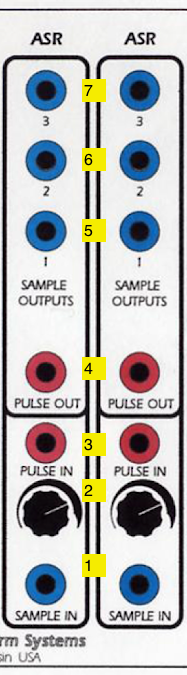

1. CV Input to be sampled (DC INPUT)
2. Scaling knob for *1*
3. Trigger input to sample and shift (Pulse INPUT)
4. Trigger output to synchronize events *after* the sampling (Pulse OUTPUT)
5. Shift register output #1 - this will put out the last sampled input voltage (DC OUTPUT)
6. Shift register output #2 - this will put out the voltage that was previously at output #1 (DC OUTPUT)
7. Shift register output #3 - this will put out the voltage that was previously at output #2 (DC OUTPUT)

*Notes:*
- The two ASR modules can be ganged to allow for six shift stages.
- The pulse output *4* can be used to synchronize events *after* the ASR samples a voltage; this may be useful to make up for the small timing discepancy caused by the sampling circuit, which uses a hold capacitor and takes a non-zero amount of time to sample the input and shift everything down.

#### Dual Transient Generator

The **Dual Transient Generator (DTG)** is the original 1976 Serge design of the module called **Dual Slopes** on the Random\*Source Serge panels. The module consists of the circuit for a Dual Universal Slope Generator (DUSG - see below) with a simplified panel interface, optimized for generating harmonically linked oscillators and clock pulses. The module contains two sides, each of which is capable of producing clock pulses, slew-limited ramps, and various oscillators when set to cycle.

1. Ramp output for the left-hand slope generator (DC OUTPUT)
2. Ramp output for the right-hand slope generator (DC OUTPUT)
3. Pulse output for the left-hand slope generator (Pulse OUTPUT)
4. Pulse output for the right-hand slope generator (Pulse OUTPUT)
5. Cycle switch for the left-hand generator, causing it to self-oscillate
6. Cycle switch for the right-hand generator, causing it to self-oscillate 
7. External trigger input for the left-hand slope generator (Pulse INPUT)
8. External trigger input for the right-hand slope generator (Pulse INPUT)
9. Control knobs for the Rise time for each slope - a higher value is a faster rise
10. Control knobs for the Fall time for each slope - a higher value is a faster fall
11. Scaling knob for *12*
12. CV input multiplier for the slew circuit, which will shorten or lengthen the rise and fall time (DC INPUT)

*Notes:*
- A very common use of the DTG is as a **master clock**. The pulse outputs (*3* and *4*) can be used to drive the Sequencer / Programmer, the TKB, the "sample" on an SSG, or the trigger inputs on slope generators and filters.
- The DTG module highlights Tcherepnin's design mantra that the *distinction between control voltage and audio-rate signals is an artificial one*. The module can generate low frequency ramps and pulse trains, as well as audio-rate waveforms.
- The DTG module is optimized to leverage a side effect of Serge (and other "West Coast") envelope generators: an envelope, once triggered, *can't be retriggered until it has finished its cycle.* As a result, the rise and fall time of the slew circuit will determine the frequency of the clock if it is set to cycle.
- Unlike the Dual Slops (and full DUSG), the DTG lacks a signal input for envelope following.

#### Random Source

The **Random Source** module is the STS circuit that combines two of Tcherepnin's noise modules: the **Random Voltage Generator (RVG)** (left column of the module) and the **Noise Source** (right column). The RVG behaves as a pre-patched Smooth / Stepped Generator fed with noise; the Noise Source provides a variety of noise sources to work with as well as a built-in sample-and-hold circuit.

1. Pulse output - generates random pulses at the module rate (specified by *9* x *10* + *12*) (Pulse OUTPUT)
2. Full-spectrum [white noise](https://en.wikipedia.org/wiki/White_noise) (AC OUTPUT)
3. Stepped random output - generates discrete random voltages at the module rate (DC OUTPUT)
4. [Pink Noise](https://en.wikipedia.org/wiki/Pink_noise) (AC OUTPUT)
5. Smooth random output - generates continuous, low-pass filtered random voltages at the module rate (DC OUTPUT)
6. "Dirty saw" - a circuit designed by Tcherepnin containing a sawtooth wave that wobbles in frequency and has low-amplitude noise injected in its signal (DC OUTPUT)
7. Unipolar sample-and-hold output using *6* as its source and trigger *10* or *12* to sample the voltage (DC OUTPUT)
8. CV input to set the rate of random outputs *1*, *3*, and *5* (scaled by *10* and sums with *12*) (DC INPUT)
9. Scalar knob for *8*.
10. Pulse input for the sample-and-hold output *7* (Pulse INPUT) 
11. Base rate for random outputs *1*, *3*, and *5* (sums with *8* x *9*)
12. Button to trigger the sample-and-hold output *7*

*Notes:*
- The outputs of the module can be patch-programmed into the rate input *8*. This will create a second-order randomness where the speed of the random generator is itself changing randomly.
- Pressing button *12* will cause jack *10* to *output* a pulse. You can use this as a utility trigger button throughout the system, either to test parts of your Serge patch or in performace.

#### Smooth / Stepped Generator

The **Smooth / Stepped Generator (SSG)** was designed by Tcherepnin in 1974. Along with the Dual Universal Slope Generator, it's one of the most versatile circuits in the canonical Serge system. Depending on how an SSG is patched, it can function as a [slew limiter](https://en.wikipedia.org/wiki/Slew_rate) (envelope follower / lowpass filter), a sample-and-hold circuit, a triangle wave oscillator, or a low-pass gate. When combined with its sidecar **Noise Source** - a small circuit of three jacks - the SSG can be used to develop a wide variety of fluctuating and quantized random voltages, similar to the Buchla 266 [Source of Uncertainty](http://fluxmonkey.com/historicBuchla/266-uncertainty.htm).

The module is divided into two halves: the "Smooth" side at the top, and the "Stepped" at the bottom. In between the two, a Coupler circuit outputs a comparator voltage of the two sides.

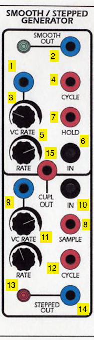

1. CV input for the Smooth sides's rate (DC INPUT)
2. CV output for the Smooth side (DC OUTPUT)
3. Scaling knob for *1*
4. Cycle trigger (sends a pulse at the end of a cycle set by the Smooth rate) (Pulse OUTPUT)
5. Knob for Smooth rate amount (sums with *1* x *3*)
6. Signal input for the Smooth side (AC INPUT)
7. Hold jack - when set high, Smooth output *2* will freeze and no longer track the module's input (Pulse INPUT)
8. Sample jack - when set high, Stepped output *14* will sample and hold Stepped input *10* (Pulse INPUT)
9. CV input for the Stepped side's rate (DC INPUT)
10. Signal input for the Stepped side (AC INPUT)
11. Scaling knob for *9*
12. Cycle trigger (sends a pulse at the end of a cycle set by the Stepped rate) (Pulse OUTPUT)
13. Knob for Stepped rate amount (sums with *9* x *11*)
14. CV output for the Stepped module (DC OUTPUT)
15. Coupler output - +5V if Stepped output is higher than the Smooth output; 0V if not (Pulse OUTPUT)

*Notes:*
- The Smooth side can easily self-oscillate in a triangle pattern by patching the cycle trigger (*4*) into the input (*6*). The rate knob and CV inputs (*5*, *1*, *3*) control the speed of this oscillation. The triangle waveform will appear at the CV output jack (*2*).
- The Stepped side will also internally self-oscillate - by patching cycle trigger *12* to input *10* and adjusting the frequency via *13*, *9*, and *11*. However, no signal will appear at output jack *14* until you send pulses into the Sample jack (*8*). These pulses can come from anywhere, e.g. from the Cycle output of the Smooth side, or from another module. This creates a classic [sample-and-hold](https://en.wikipedia.org/wiki/Sample_and_hold) circuit where the internal oscillating waveform is being "sampled" by the trigger pulse at the Sample jack and "held" as the output voltage at jack *14*.
- By a similar token, *any* input can be used on either side of the SSG. In this case, the Smooth side will work as a [low-pass filter](https://en.wikipedia.org/wiki/Low-pass_filter) with the maximum slew (or smoothing amount) controlled by the rate; the Stepped side will sample-and-hold any input signal - simple waveforms will create different staircase effects based on the frequency difference between the incoming waveform and the "sampling" being performed.
- The Random Source module provides ideal outputs to experiment with as inputs for either side of the SSG. The Smooth side can be used to generate slow, time-varying random voltages, while the Stepped side, when sampling a random signal, can be used to create classic "bleep-bloop" noises when patched in as the frequency of an oscillator.
- Sending an audio signal into the input (*6*) of the Smooth side of the SSG and sending an envelope into the CV input (*1*) will, depending where the rate knob (*5*) is set, allow you to use the module as a [low-pass gate](https://electronicmusic.fandom.com/wiki/Lowpass_gate), where the gain on the signal rises with the cutoff frequency of the filter. This setup is great for simulating natural sounding instruments such as percussion where the timbre brightens with the attack of the sound.
- The SSG is quite a complex module, and the Serge fans site has [an entire 4-page article](http://www.serge-fans.com/wiz_SSG1.htm) dedicated to patching ideas using it.

#### Control Voltage Processor

The **Control Voltage Processor (CV PRO)** is a mixer for control voltages, similar to 1/2 of the equivalent modules on the Random\*Source panels or the 73-75 Serge Panels. Set up for mixing three inputs, it can be thought of as a DC-coupled equivalent of the Mixer module.

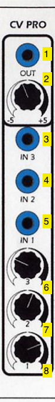

1. Mixed CV output (DC OUTPUT)
2. Overall scaling knob for *1*
3. CV Input 3 (DC INPUT)
4. CV Input 2 (DC INPUT)
5. CV Input 1 (DC INPUT)
6. Scaling knob for *3*
7. Scaling knob for *4*
8. Scaling knob for *5*

*Notes:*
- This module can be used for the buffered mixing of control voltages to create, e.g. a complex LFO control signal from multiple sources. While it can be used to mix audio-rate control signals, it is DC coupled and will rectify an AC input signal.

#### Dual Universal Slope Generator

The **Dual Universal Slope Generator (DUSG)**, like the SSG, is one of the more complex Serge modules, developed in 1976 by combining the first generation Envelope Generator module with the Positive and Negative Slew modules. The DUSG can be used as an envelope generator, a low-pass filter / envelope follower, an oscillator, a harmonic subdivider, and a pulse delay.

1. CV Slope Output (DC OUTPUT)
2. Bipolar output (inverted mirror of *1*) (AC OUTPUT)
3. Gate output (Pulse OUTPUT)
4. Signal input for envelope follower (AC INPUT)
5. 1 volt-per-octave input for slope generator (DC INPUT)
6. CV input for envelope rise or fall (scaled by *8* and summed with *9* and/or *10*) (DC INPUT)
7. Selector switch for the CV input; can be set to effect the rise, fall, or both
8. Scaling knob for *6*
9. Base knob for rise time (summed with *6* x *8*)
10. Base knob for fall time (summed with *6* x *8*)
11. Envelope trigger input (Pulse INPUT)

*Notes:*
- A pulse sent into input *11* of the DUSG will fire a single **envelope** at output *1* and *2*, based on the rise and fall times of the slope generator.
- Voltage sent into the signal input (*4*) of the DUSG will be slew-limited (smoothed) based on the rise and fall times of the slope generator to create a DC signal at output *1* and *2*. The DUSG performs full-wave rectification of the input signal first, so negative input voltage from a bipolar source will be flipped positive before smoothing to perform as an **envelope follower**.
- Connecting the gate output *3* to the pulse input *11* of the DUSG will make the module function as an **oscillator**, generating a triangle wave shaped by the rise and fall times at output *1*. Output *2* will put out a different waveform - the red jack on the top slope generator puts out a square wave, and the bottom slope generator outputs an AC inverted triangle wave, centered around 0V.
- If the rise and fall time add to a greater period than a pulse wave sent to the pulse input *11*, the DUSG can be used as a **harmonic subdivider**. generating an oscillator at 1/2, 1/3, etc. the frequency of the incoming signal.
- The DUSG can be used as a [monostable](https://en.wikipedia.org/wiki/Monostable) **pulse delay**, where a pulse at input *11* will echo at output *3* at the end of the rise and fall times.

#### Extended ADSR

The **Extended ADSR (ExADSR)** is based on Tcherepnin's 1976 design; this was his first to adopt the common [ADSR](https://en.wikipedia.org/wiki/Envelope_(music)) topology used in envelope generator made by contemporary "East Coast" synthesizer manufacturers such as Moog and ARP to simulate the shape of common acoustic instruments. As with most of Tcherepnin's designs, the superficial architecture of the module is made far more complex through its ability to be driven at audio rate and for all stages (including a "delay" stage for the onset of the envelope) to be changed dynamically via voltage control.

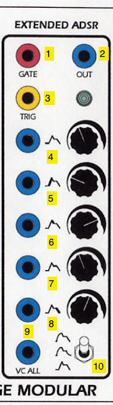

1. Gate input for the ADSR generator (Pulse INPUT)
2. Trigger input for the ADSR generator (Pulse INPUT)
3. Envelope CV output of the ADSR (DC OUTPUT)
4. Envelope delay time CV and knob (DC INPUT)
5. Envelope attack time CV and knob (DC INPUT)
6. Envelope decay time CV and knob (DC INPUT)
7. Envelope sustain level CV and knob (DC INPUT)
8. Envelope release time CV and knob (DC INPUT)
9. CV input scaling *all* envelope parameters simultaneously (DC INPUT)
10. Curve select switch (logarithmic / linear / exponential)

*Notes:*
- The Extended ADSR can be triggered with a "Trigger" pulse, which will cause it to generate a three-stage ramp based on the attack, decay, and release times,  or a "Gate" signal which will allow the envelope to be held at the sustain level.
- The CV input *29* to the Extended ADSR allows it to trigger at audio rate. You can use a signal inverter on a utility module such as the Boolean Logic to patch the module as an oscillator.
- The control knobs on the Red Control ExADSR are the reverse of the Random\*Source panels - a low value on this panel is to the right, not the left.

[back to top](#top)

## CGS Panels

The **Black Swamp** and **Programmer** are Serge panels with a complex pedigree, consisting of a variety of sequencing and logic modules designed to create rhythmic CV and trigger patterns. 

[Ken Stone](http://www.synthpanel.com/), one of Australia's best-known synthesizer designers, developed a series of DIY  modules in the late 1980s. Dubbed **CGS** (for Cat Girl Synthesizer), these were available as mail order kits and were among the first DIY synthesizer projects to be published on the World Wide Web. Many of the kits were licensed copies of Tcherepnin's original Serge designs, and were for many years the only way to acquire Serge DIY kits. However, most of the modules were of Stone's invention, and several (such as the Pulse Divider and Boolean Logic) were licensed and adopted in commercial Serge panels (including our Random\*Source Serge).

[Elby Designs](https://www.elby-designs.com/) is the Tcherepnin-licensed manufacturer of Serge kits and synthesizers in Australia. Founded by Laurie Biddulph (L B = Elby) in 2003, Elby manufactures and sells DIY kits for Stone's CGS modules alongside licensed Serge modules in both 4U and 3U (so-called "EuroSerge") format. Beginning in 2010, Biddulph began offering full panels of curated CGS modules under the moniker BoCGS ("Best of Cat Girl Synth"). One of these panels was called the **Sequencer With Arbitary Manipulated Pulses** (or **SWAMP**), and consisted of four CGS modules - [CGS31](https://www.elby-designs.com/webtek/cgs/cgs31/cgs31_digital_noise.html) (Digital Noise), [CGS13](https://www.elby-designs.com/webtek/cgs/cgs13/cgs13_gated_comparator.html) (Gated Comparator), [CGS36](https://www.elby-designs.com/webtek/cgs/cgs36/cgs36_pulse_divider.html) (Pulse Divider and Boolean Logic), and [CGS59](https://www.elby-designs.com/webtek/cgs/cgs59/cgs59.htm) (Programmer-Sequencer).

In 2015, [Jon Peters](https://synthcube.com/cart/tojpeters-en), a California-based DIY synth designer and builder, created and [published](https://muffwiggler.com/forum/viewtopic.php?t=147603&sid=6b482df30b92286ccaeadb84) a modified SWAMP design called the **Black Swamp**, which took Biddulph's panel layout and Stone's PCBs and added a variety of modifications and extra features, mounted onto a black (rather than silver) aluminum plate. A year later, Charlie Kerr at [Loudest Warning](http://www.loudestwarning.co.uk/) - the Tcherepnin-licensed Serge manufacturer for the UK - did a [limited edition run](https://loudestwarning.tumblr.com/post/151796333376/here-is-the-front-of-the-black-swamp) of fully built and tested Black Swamp panels; we have one of these panels.

Another of Stone's designs, [CGS359](https://www.elby-designs.com/webtek/cgs/cgs359/cgs359.htm), is an update of Stone's earlier Programmer-Sequencer (itself adapted from Tcherepnin's  Serge Programmer module), designed to be built out in an arbitrary number of stages. Our **Programmer**, built in 2020 by Finlay Shakespeare at [Future Sound Systems](http://futuresoundsystems.co.uk/) in the UK as part of a [limited run](https://reverb.com/item/32308687-cgs-serge-programmer-sequencer-for-4u-banana-modular-systems) of panels, is a 16-stage version with a number of additional features.

The Black Swamp and Programmer are incredible examples of the iterative design made posssible by open-source, DIY synthesizer communities such as those working around the Serge modular format.

### Black Swamp

#### Boolean Logic

The unlabelled leftmost module on the Black Swamp is Ken Stone's **Boolean Logic** module (one half of [CGS36](https://www.elby-designs.com/webtek/cgs/cgs36/cgs36_pulse_divider.html)). One of his designs that is often incorporated in Serge panels, it was intended to expand on the comparator modules in the original Serge systems (such as the Triple Comparator on the 73-75 Serge). This version of the module consists of two submodules that set output voltages HIGH or LOW based on pairs of control voltage inputs:

- the AND comparator will output a HIGH value when both of its inputs are over 2.5V
- the OR comparator will output a HIGH value when either of its inputs are over 2.5V

Finally, a basic inverter at the bottom outputs the inverse of its input, acting as a NOT gate.

1. Output for the AND comparator (Pulse OUTPUT)
2. Input 1 for the AND comparator (Pulse INPUT)
3. Input 2 for the AND comparator (Pulse INPUT)
4. Output for the OR comparator (Pulse OUTPUT)
5. Input 1 for the OR comparator (Pulse INPUT)
6. Input 2 for the OR comparator (Pulse INPUT)
7. Output for the inverter (Pulse OUTPUT)
8. Input for the inverter (Pulse INPUT)

*Notes:*

- Despite being labeled as Pulse inputs, the comparator inputs (*2*, *3*, *5*, and *6*) on the Boolean Logic module will respond to DC inputs with a ~2.5V threshold for whether a signal is considered "true" or "false".
- The outputs will retain a HIGH voltage as long as the "true" state persists at the inputs, making the outputs function as gates rather than pulses.
- When used with the inverter, the AND/OR values can be transformed into NAND/NOR values.

#### Digital Noise

Ken Stone's **Digital Noise** module ([CGS31](https://www.elby-designs.com/webtek/cgs/cgs31/cgs31_digital_noise.html)) differs from the standard Serge Noise source (as used in the SSG and Random Source modules) in a few important ways. First, it is a *digital*, rather than *analog*, noise source, which means that the oscillator core of the module is a pseudo-random digital pulse train generated by a [phase-locked loop](https://en.wikipedia.org/wiki/Phase-locked_loop) IC, a trio of XOR gates, and a shift register. This allows the module to provide filtered white and pink noise outputs, but also random gate signals and the ability to be externally clocked to generate random values at any frequency.

The Black Swamp version of the module has a number of modifications compared to the original, including two random gates instead of one, direct access to the internal oscillator clock, and the ability to operate at a much lower frequency (below .01Hz) to create slow random pulse trains / digital "dust" effects.

1. White noise output (AC OUTPUT)
2. Pink noise output (AC OUTPUT)
3. Random Gate 1 output (Pulse OUTPUT)
4. Random Gate 2 output (Pulse OUTPUT)
5. External clock input / internal clock output (Pulse INPUT / OUTPUT)
6. Internal / external clock switch
7. CV rate input for internal clock (DC INPUT)
8. CV rate knob for internal clock (summed with *7*)

*Notes:*

- The internal / external clock switch *6* changes the behavior of jack *5* from an input to an output. When the Digital Noise is using its internal oscillator clock, a pulse train at the frequencyset by *7* and *8* is *output* from the jack; when the external clock is selected, the jack serves as the clock *input* for the module - each pulse sent into this jack will cause a single random value to be output jacks *1* through *4*.
- The two random gate outputs (*3* and *4*) are taps of the exclusive OR gates used in generating the digital noise, and can be used as two independent clock-synchronized gate signals or pulse trains. For any given clock cycle, each gate output has approximately a 50% likelihood of changing state (going from "low" to "high" or vice versa).

#### Pulse Divider

The **Pulse Divider** module (the second half of [CGS36](https://www.elby-designs.com/webtek/cgs/cgs36/cgs36_pulse_divider.html)) is another of Ken Stone's modules that appears regularly on Serge panels from other manufacturers (including our Random\*Source Serge). The module takes a pulse input and outputs triggers on numerical subdivisions, allowing the user to have, e.g. a clock signal input generate a polyrhythmic output. The Black Swamp version of the module contains two additional switches as well as LED indicators for the subdivision outputs.

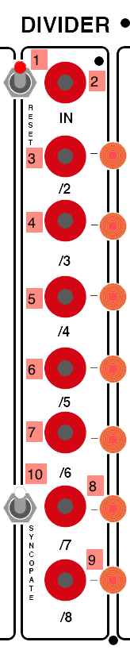

1. Reset switch for the division counters on the module
2. Pulse input for divider (Pulse INPUT)
3. Outputs a pulse every 2nd pulse (Pulse OUTPUT)
4. Outputs a pulse every 3rd pulse (Pulse OUTPUT)
5. Outputs a pulse every 4th pulse (Pulse OUTPUT)
6. Outputs a pulse every 5th pulse (Pulse OUTPUT)
7. Outputs a pulse every 6th pulse (Pulse OUTPUT)
8. Outputs a pulse every 7th pulse (Pulse OUTPUT)
9. Outputs a pulse every 8th pulse (Pulse OUTPUT)
10. "Syncopate" switch that resets the division counters every 7th pulse

*Notes:*

- The Pulse Divider can be used to bifurcate a (fast) master clock into multiple slower clocks. For example, if you send the pulse output of a Dual Slopes into the Pulse Divider input *2*, and think of that pulse as your 16th notes, then output *3* will be your 8th notes, output *5* will be your quarter notes, output *7* will be dotted-quarter notes, etc.
- When used with an audio-rate signal as input (e.g. a square wave), the outputs of the Pulse Divider generate the first eight subharmonics of the input signal.
- The Black Swamp version of the module contains two additional switches: switch *1* allows the user to reset the internal clock manually; switch *10*, when engaged, causes the module to automatically reset its internal clock on every 7th pulse, generating a "syncopated" feel.

#### Gated Comparator

Ken Stone's **Gated Comparator** ([CGS13](https://www.elby-designs.com/webtek/cgs/cgs13/cgs13_gated_comparator.html)) is one of his more novel designs. In Stone's words:

> The idea for this project came when I was listening to some music in which part of the background was jumping between
> octaves in a semi-random fashion. Feeding noise into a comparator was my immediate thought, but I soon realized this 
> wasn't going achieve what I wanted. I needed to be able to control when these jumps could occur. As such, some form of 
> memory element was required, into which the level could be clocked when required.
>
> I have used an 8 stage digital shift register as the memory element. Each clock pulse, the remembered level (logic 0 
> or logic 1) is moved into the next stage "bucket brigade" fashion, and the new value stored in the first memory cell. 
> The result is a random level (on or off) at a predetermined time at the first output, plus time delayed versions of 
> previous levels across the remaining outputs.

At its core, the module takes in a CV input and a clock signal. When a clock trigger arrives, the CV signal is compared against a reference voltage, and sets the first stage of the comparator "high" or "low" (this is similar to the Onebang module on the Shelfisizer). The previous value for stage 1 is then shifted down to stage 2, the stage 2 value to stage 3, and so forth, giving 8 bits of comparator memory. These values can be used to trigger different modules elsewhere in the system; they can also be combined as bits in a "random" signal output and mixed together using the knobs next to each stage to create a CV output. The module also has functions for looping the recorded states.

Jon Peters made a number of modifications to the Gated Comparator on the Black Swamp, including the addition of an interface to manually load the comparator's memory and a push-pull switch on each knob to bypass individual bits in the signal outputs.

1. Loop enable switch - "on" *disables* new input signals at *11* from being loaded into memory
2. Disable jack - a high gate signal will temporarily disable the loop and allow new input (Pulse INPUT)
3. Load momentary switch - allows for the manual loading of the comparator at the bit set by the rotary dial *6*
4. Comp output - outputs the raw comparator value based on input *11* as a square wave / gate (Pulse OUTPUT)
5. Loop input. When the loop enable switch *1* is on, this can receive a gate signal to set bit 1
6. Rotary switch for manual loading - selects which bit the load switch *3* or the loop trigger *7* will load
7. Loop load input for manually loading bits into the memory (Pulse INPUT)
8. Range knob that acts as a master attenuator for the module's CV outputs
9. Sensitivity  knob for the comparator threshold (adds to *16* x *10*)
10. Sensitivity scaling knob for CV threshold (multiplies with *16*, adds to *9*)
11. CV input to the comparator (DC INPUT)
12. Random output of the comparator - treats each stage as a bit in an 8-bit signal that is converted to noise (DC OUTPUT)
13. Inverted random output - same as *12* but with the bit order flipped (DC OUTPUT)
14. Mix output - the eight comparator states are scaled by knobs in row *19* and summed (scaled by *8*) (DC OUTPUT)
15. Inverted mix output - same as *14* with the signal inverted (scaled by *8*) (DC OUTPUT)
16. CV input for setting a varying comparator level (multiplied by *10*, added to *9*) (DC INPUT)
17. Clock input to load the comparator and shift the bits (Pulse INPUT)
18. Individual stage outputs of the shift register (Pulse OUTPUT)
19. Attenuator knobs for each stage when sent to the CV outputs- pulling a knob will disable its bit from being used in either the mix (*14* / *15*) or random (*12* / *13*) outputs

*Notes:*
- The Gated Comparator is quite complex, and can be used to generate a wide variety of rhythmic sequences, both as triggers and as melodies. There is an excellent guide to the CGS version of the module [here](https://github.com/TuesdayNightMachines/CGS-Serge-Modular-Synth/blob/master/CGS%20Gated%20Comparator/CGS%20Gated%20Comparator%20Guide.md) that may be helpful.
- The lights on the comparator will switch color when the module is "enabled" versus in loop mode (switch *1*)
- The CV outputs will only change values when a new clock signal at *17* is present; when the module is not in loop mode, the clock causes the signal at input *11* to be compared, with that value set to bit one; the other bits with then shift down. 
- When the loop mode is "enabled" (via switch *1*) you can connect the output of bit 8's trigger output to the loop in jack *5* to create a never ending loop. This can also be used to chain multiple comparator modules.
- The use of a comparator to generate complex control signals is a popular technique, and can be seen in Eurorack circuits such as Rob Hordijk's [Benjolin](http://www.analoguehaven.com/epochmodular/benjolin/).

#### TRK / Programmer / Sequencer / Random / Vertical Sequencer

The final module in the Black Swamp consists of a heavily modified version of Ken Stone's **Programmer / Sequencer** module ([CGS59](https://www.elby-designs.com/webtek/cgs/cgs59/cgs59.htm)), itself a variant on the Tcherepnin's original Sequencing Programmer modules, such as the Sequencer / Programmer on our Random\*Source Serge.

Stone's 8-stage Programmer / Sequencer consists of 8 stages of presets, with rows of knobs to set four values for each preset, similar ot the TKB. Unlike the R\*S TKB and Sequencer / Programmer, however, the module has trigger *inputs* for each preset stage as well as outputs, allowing it to be used as a general-purpose recall system, as well as a conventional sequencer.

Jon Peters added substantial functionality to the Programmer / Sequencer in the original SWAMP, merging in a number of other CGS modules including a [Sequential Switch](https://www.elby-designs.com/contents/en-us/p718_CGS28_-_Sequential_Switch.html) and [Quad Logic Gates](https://www.elby-designs.com/contents/en-us/p1121_CGS39_-_Quad_Logic_Gate.html), allowing for vertical sequencing and different behaviors of the gate outputs; a [Noise](https://www.elby-designs.com/webtek/cgs/serge/cgs97/cgs97_noise.html) module to allow for random sequencing; and an 8-pad [Touch Responsive Keyboard (TRK)](https://www.elby-designs.com/webtek/cgs/serge/cgs86/cgs86_trk.html), replacing the stage select buttons and allowing the module to be used as a keyboard in a manner similar to the TKB. In addition, he added expanded output voltage range to the preset knobs, along with a "solo" mode to allow three rows to remain sequencing while the fourth is controlled  by the keyboard.

1. "A" row of CV knobs for each preset stage. Pulling a knob out puts the column into high range mode.
2. "B" row of CV knobs for each preset stage
3. "C" row of CV knobs for each preset stage
4. "D" row of CV knobs for each preset stage
5. Gate outputs for each stage of the sequencer (Pulse OUTPUT)
6. Stage select inputs for each preset stage (Pulse INPUT)
7. Three-way select switch for each stage's gate output behavior - the right position causes the gate to last for the duration of the clock pulse; the center position causes no gate to be output; the left position starts the gate output when the clock pulse goes low
8. Three-way switch for the stage's behavior when selected by an "up" sequence trigger - the down position causes the stage to *run*, which outputs its preset values; the center position sets the stage to *stop*, halting the sequencer until it is reset; the up position sets the stage to *skip* to the next preset in the sequence
9. Three-way switch for the stage's behavior when selected by an "down" sequence trigger - the down position causes the stage to *run*, which outputs its preset values; the center position sets the stage to *stop*, halting the sequencer until it is reset; the up position sets the stage to *skip* to the next preset in the sequence
10. Capacitive touch pads (the "keys") for the TRK - touching a key selects its corresponding stage
11. CV output for the "A" row of presets (DC OUTPUT)
12. CV output for the "B" row of presets (DC OUTPUT)
13. CV output for the "C" row of presets (DC OUTPUT)
14. CV output for the "D" row of presets (DC OUTPUT)
15. "ABCD" 32-stage output, caussed by wrapping through the rows, with the reset row selectable by switch *16* (DC OUTPUT)
16. Reset selection switch for the vertical clock, allowing the user to select whether output *15* wraps through two, three, or all four rows on the sequencer
17. Momentary toggle switch to reset the vertical clock
18. Trigger output for the TRK - sends a pulse when a key is pressed (Pulse OUTPUT)
19. Gate output for the sequencer - sends combined gate values based on the settings of each stage's switch *7* (Pulse OUTPUT)
20. Random input - causes the sequencer to jumb to a random position (Pulse INPUT)
21. Up input - pulses will advance the (horizontal) sequencer to the right (Pulse INPUT)
22. Down input - pulses will advance the (horizontal) sequencer to the left (Pulse INPUT)
23. CV output for key "pressure" on the TRK - in reality, this corresponds more to the surface area of the pad covered by finger contact than actual pressure (DC OUTPUT)
24. Gate output for the TRK - sends a high value as long as a key is pressed (Pulse OUTPUT)
25. Solo mode switch - in solo mode, rows A, B, and C are sequenced while row D is controlled by the TRK
26. Stop input - a high voltage at this jack will disable the sequencer and park it at the "ghost" stage - CV outputs will continue at their last value (Pulse INPUT)

*Notes:*

- The Programmer / Sequencer allows you to preset 4 sequences of knobs to control any CV input on the Serge system - scales and melodies for oscillators, but also filter cutoff frequencies, envelope durations, and anything else that you may want to automate. The module's clock is typically driven by a pulse generator (such as a Dual Slopes), but clock pulses can come from anywhere, such as the gate outputs of the Noise module.
- By using the pulse outputs for the individual sequence stages (*5*), you can trigger external events on other modules. You can also use these outputs, in combination with the stage select inputs (*6*), to create smaller loops of sequences within the system.
- The TRK's keyboard pressure output *23* puts out a fairly noisy voltage based on capacitance. Patching it into a DUSG or SSG will allow you to smooth this out as well as add lag to the key (e.g. for keyboard-driven slow fades or filter sweeps).
- The Programmer / Sequencer can be sequenced at audio rate, and the preset rows can be used as an arbitrary 8-stage waveform for an oscillator.
- Pulling out an "A" knob (*1*) on a preset column expands the voltage scaling of the preset, allowing for a wider range of parameter control than the range Stone used in the original CGS module.

### Programmer

The CGS **Programmer**, like the Serge TKB, is a 16-stage combination sequencer / preset manager with four rows per stage. Unlike the TKB, the Programmer has no keyboard, and instead can trigger stages by manual buttons (like the R\*S Sequencer / Programmer) or by trigger inputs available for each stage. Like the Programmer-Sequencer in the Black Swamp (also based on Stone's core Programmer design), the Programmer has Run/Skip/Stop functionality for each stage, as well as trigger inputs for seqeuencing in either direction.

1. Gate outputs for each stage of the sequencer (Pulse OUTPUT)
2. Trigger selection switch for each stage - enabled will cause the stage to also output a trigger at *17* when selected
3. Stage select inputs for each preset stage (Pulse INPUT)
4. "A" row of CV knobs for each preset stage
5. "B" row of CV knobs for each preset stage
6. "C" row of CV knobs for each preset stage
7. "D" row of CV knobs for each preset stage
8. Three-way switch for the stage's behavior when selected by an "left" sequence trigger *12* - the up position causes the stage to *run*, which outputs its preset values; the center position sets the stage to *stop*, halting the sequencer until it is reset; the down position sets the stage to *skip* to the next preset in the sequence
9. Three-way switch for the stage's behavior when selected by an "right" sequence trigger *11* - the up position causes the stage to *run*, which outputs its preset values; the center position sets the stage to *stop*, halting the sequencer until it is reset; the down position sets the stage to *skip* to the next preset in the sequence
10. Preset selection buttons for each stage
11. Right input - pulses will advance the sequencer to the right (Pulse INPUT)
12. Left input - pulses will advance the sequencer to the left (Pulse INPUT)
13. CV output for the "A" row of presets (AC OUTPUT)
14. CV output for the "B" row of presets (AC OUTPUT)
15. CV output for the "C" row of presets (AC OUTPUT)
16. CV output for the "D" row of presets (AC OUTPUT)
17. Trigger output for the TRK - sends a pulse when a stage is selected and that stage's selection switch *2* is enabled (Pulse OUTPUT)
18. Push output for the programmer - sends a high value as long as a button is pushed (Pulse OUTPUT)

*Notes:*

- The Programmer allows you to preset 4 sequences of knobs to control any CV input on the Serge system - scales and melodies for oscillators, but also filter cutoff frequencies, envelope durations, and anything else that you may want to automate. The module's clock is typically driven by a pulse generator (such as a Dual Slopes), but clock pulses can come from anywhere, such as the gate outputs of the Noise module.
- By using the pulse outputs for the individual sequence stages (*1*), you can trigger external events on other modules. You can also use these outputs, in combination with the stage select inputs (*3*), to create smaller loops of sequences within the system.
- Unlike the other programmer modules in our Serge system, this Programmer outputs bidirectional (AC) CV signals, with 0 volts at the mid range of each potentiometer. This allows for a wider range of control voltages that can subtract as well as add from a base value on a module.

[back to top](#top)

## Benjolin

The **Benjolin** is a DIY synthesizer design published in 2009 by [Rob Hordijk](https://www.youtube.com/watch?v=F5muc9OBXeE&ab_channel=BiyiAmez) (1958-2022). The schematics [as published](https://electro-music.com/forum/topic-40834.html) were intended to be used by DIY builders and educators, and is a scaled down version of a previous instrument designed by Hordijk called the **Blippo Box**. The central premise of the Benjolin is to use a "chaotic" circuit in feedback with a traditional 2 VCO / 1 VCF synthesizer to create unexpected rhythms, melodies, and sounds. As described on this PatchPierre [blog post](http://patchpierre.blogspot.com/2014/11/the-benjolin-explained-by-tuesday-night.html), the instrument's chaotic input comes from a circuit called a **Rungler**, which is an 8-step shift register using the two oscillators as a sample-and-hold (one providing the signal, the other the clock). Because the VCO waveforms are running at a much faster rate than the Rungler is sampling, the result is a chaotic (but potentially rhythmic) control signal that can then be fed back into the controls of the oscillators and filter. This feedback-network approach makes for a novel, West coast-inspired instrument. 

Many versions of the Benjolin exist - standalone and Eurorack, pre-built and DIY (e.g. [here](https://afterlateraudio.com/products/benjolin-v2), [here](https://www.modulargrid.net/e/epoch-modular-benjolin), and [here](https://synthplex.com/store/index.php?route=product/product&product_id=66)), some with added features or modifications. The Benjolin in the IDM Audio Lab is a double unit (two matched Benjolin circuits) with a mixer and [Accutronics reverb](http://www.accutronicsreverb.com/main/?skin=sub01_05_1.html) in a Serge format, built by [Grant Wilkinson](https://www.instagram.com/muncky/). The output of the Benjolin is fed to channel 7 on the mixer in the studio.

1. Rungler external clock (active when *14* is set to "Ext") (Pulse INPUT)
2. External audio input for the filter (AC INPUT)
3. Output of a comparator with the two oscillators as input, resulting in a variable-width square wave (Pulse OUTPUT)
4. XOR of the shift register's bits; can be used as a random gate (Pulse OUTPUT)
5. Shift register bit 1 raw output (Pulse OUTPUT)
6. Filter direct output (AC OUTPUT)
7. Osc2 square wave output (AC OUTPUT)
8. Osc1 square wave output (AC OUTPUT)
9. Shift register bit 2 raw output (Pulse OUTPUT)
10. Rungler direct output (Pulse OUTPUT)
11. Osc2 triangle wave output (AC OUTPUT)
12. Osc1 triangle wave output (AC OUTPUT)
13. Clock mode (external/internal) output (Pulse OUTPUT)
14. Clock mode switch
15. Loop switch; disables new input into the Rungler shift register, causing it to loop its input
16. Filter mode switch; when set to "internal", input *2* is disabled and the Benjolin oscillators are input into the filter
17. Control knob for amount of external audio let into the filter
18. Q value for the filter
19. CV input for the filter frequency (scaled by *20*) (DC INPUT)
20. Scaling knob for *19*
21. Knob controlling the amount of Rungler output fed to the filter frequency
22. Knob for the output gain of the filter to the mixer
23. CV input for Osc2 frequency (scaled by *24*) (DC INPUT)
24. Scaling knob for *23*
25. Knob controlling the amount of Rungler output fed to the Osc2 frequency
26. Knob for the output gain of Osc2 to the mixer
27. CV input for Osc1 frequency (scaled by *25*) (DC INPUT)
28. Scaling knob for *27*
29. Knob controlling the amount of Rungler output fed to the Osc1 frequency
30. Knob for the output gain of Osc1 to the mixer
31. "Dry" Benjolin output (AC OUTPUT)
32. "Wet" output from the Accutronics reverb chip (AC OUTPUT)
33. External reverb input (AC INPUT)
34. CV input for reverb amount (scaled by *38*) (DC INPUT)
35. CV input for reverb feedback amount (summed with *37*) (DC INPUT)
36. External input switch for reverb (down disables input *33*)
37. Feedback control knob for reveb (summed with *35*)
38. CV scaling knob for reverb amount (scales input *34*)
39. Wet/dry mix knob for reverb (affects 3.5mm output jack on the top of the unit)
40. Tilt knob - controls amount of left versus right Benjolin circuit sent to the reverb
41. Overall level knob for left-hand Benjolin circuit
42. Overall level knob for right-hand Benjolin circuit

*Notes:*
- The Benjolin has 3.5mm outputs at the top of the box for the direct output of each Benjolin as well as the mixed / reverberated output.
- The Benjolin PLS 1 / PLS 2 audio outputs (*7*, *8*) are *AC-coupled* (like a conventional synthesizer's square wave oscillator) and so won't "trigger" other Serge modules that require a pulse input. You can feed these into any comparator circuit (e.g. the **Boolean Logic**) to get a pulse signal.
- The Benjolin's two halves can be patch-programmed to cross-modulate, creating twice the chaos!

[back to top](#top)

## The Shelfisizer

**The Shelfisizer** is an open-source project by Luke DuBois inspired by Serge modular systems but also hybrid analog synthesis / microcontroller systems such as the [Buchla 200e](https://buchla.com/systems-design/). These modules use 16mHz [Adafruit Metro Mini](https://www.adafruit.com/product/2590) microcontrollers and simple monolithic IC chips to handle much of the logic that definies the module's behavior, leaving discrete components for the parts of the modules that actually generate analog signals. The use of microcontrollers makes it simple to prototype modules that require an understanding of "state", such as pattern memory or hysteresis, and the use of CMOS ICs allows for a design that has a much lower part count than typical analog synthesizer modules.

Shelfisizer designs, including microcontroller software, circuit diagrams, and panel graphics can be found on the [Shelfisizer GitHub page](https://github.com/IDMNYU/shelfisizer).

### 2019 Panel

#### Pulse

The **Pulse** module on the Shelfisizer is a 16-stage, 4-row [**sequencer**](https://en.wikipedia.org/wiki/Music_sequencer) with boolean (on/off) states for each stage of each row. The Arduino in the module saves the current sequence as long as the module has power, and a 4-button interface allows you to dynamically program in patterns for the 4 output rows, as well as a numbe of other functions. The module generates pulses in response to an external clock which advances the current step in the sequence.

1. "A" sequence (Pulse OUTPUT)
2. "B" sequence (Pulse OUTPUT)
3. "C" sequence (Pulse OUTPUT)
4. "D" sequence (Pulse OUTPUT)
5. "Page" button
6. "Select" button
7. "Up" button
8. "Down" button
9. External clock (Pulse INPUT)
10. Interface LEDs

*Notes:*
- Pulses sent to the Clock input *9* will advance the sequencer on step at a time. Pulses will be sent out of *1*-*4* at sequence stages that are programmed to be "on" for those rows. This is similar in behavior to the sequencer on a simple drum machine.
- The internal software has seven pages which can be cycled through by pressing the page button *5*. The first shows the current stage by lighting one LED among the sixteen on the panel. Pages 2-5 allow you to program the patterns for outputs A, B, C, and D. The up and down buttons (*7* and *8*) will move a cursor on the LED display, causing the currently selected stage LED to flicker. The select button *6* will invert the current state of that row at that stage, turning on "on" to an "off" and vice versa. The 6th and 7th pages allow you to set the start and end points of the sequence, allowing you to make a sequence that is shorter than 16 stages, begins on a step other than 1, and so on.
- When page 1 is active (i.e. the LEDs are showing the current stage of the sequencer) the "up" button will cause the sequence to jump to a random stage, the "down" button will reverse the direction of the sequencer, and the "select" button will reset the sequence to stage 1.

#### Onebang

The Shelfisizer's **Onebang** module generates rhythmic output by comparing up to six input voltages (labeled as A-F) against a threshold, sending out pulses on a clock input. There are 12 modes of operation, which change the way in which the input voltages generate pulses.

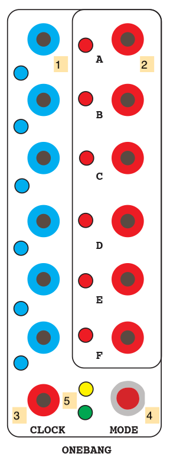

1. CV inputs A-F (DC INPUT)
2. Trigger outputs A-F (Pulse OUTPUT)
3. External clock (Pulse INPUT)
4. Mode button
5. Mode indicator LEDs

*Notes:*
- The Onebang module decides if a input voltage is HIGH or not based on a ~2.5V threshold.
- The Onebang module has 12 modes of operation:
  - 0: if the input voltage on a channel is HIGH, an internal bit is set on the Arduino. On the next clock, a pulse will be fired on that channel and the bit will be reset.
  - 1: similar to 0, but with [hysteresis](https://en.wikipedia.org/wiki/Hysteresis). The input voltage needs to go LOW again before a new pulse will fire on that channel.
  - 2: the input value is a probability for a pulse, i.e. the higher the control voltage, the more likely a pulse will occur on the next clock.
  - 3: each clock pulse causes one trigger to occur across the entire module; the input with the highest voltage will cause the module to fire a pulse at its output.
  - 4: on a clock pulse, pairs of inputs (A/B, C/D, E/F) are compared, with the higher voltage inputs sending a pulse.
  - 5: similar to 4, but with hysteresis, i.e. the comparator relationship has to change for a new pulse to be sent.
  - 6: on a clock pulse, the voltage at input A determines which output (A-F) fires; 0 volts at the input will cause output A to pulse; 5 volts will fire output F; values in between will span all six outputs.
  - 7: similar to 6, but inputs A and D determine pulses on three outputs each (A-C and D-F).
  - 8: inputs A/B and D/E are compared as boolean variables for AND, OR, and XOR operations across outputs A-C and D-F.
  - 9: similar to 8, but with hysteresis, requiring that the output state change before a second pulse can be fired.
  - 10: similar to 8, but with inputs C and F setting the HIGH threshold for the boolean operations.
  - 11: similar to 10, but with hysteresis, requiring that the output state change before a second pulse can be fired.
- The Onebang module is intended to be used experimentally to generate different rhythms. Patching LFOs of different frequencies and phases into the inputs can create a wide variety of rhythms very quickly.

#### Dust / Dirt

The **Dust / Dirt** module is the one part of the 2019 Shelfisizer that generates AC voltage ("audio"). It has two modes, allowing it to act either as a pulse triggered, noisy 6-voice drum machine (DIRT), or as a six-channel noise generator with specific characteristics for each channel (DUST).

1. Trigger inputs for each channel (Mode 0 only) (Pulse INPUT)
2. Drum / noise outputs for each channel (AC OUTPUT)
3. Knobs to control channel parameter
4. LFO rate knob
5. LFO depth knob
6. Mode switch

*Notes:*
- The Dust/Dirt module generates digital noise from the Arduino microcontroller through a bank of analog filters. The digital noise algorithm and the analog filter topology are unique to each channel:
  - L1: "kick" noise through a low-pass filter at a 50Hz cutoff.
  - H1: "snare" noise through a high-pass filter at a 2.3kHz cutoff.
  - B1: "tom" noise through a band-pass filter at 429Hz.
  - L2: "thud" noise through a low-pass filter at a 14Hz rolloff.
  - H2: "scratch" noise through a high-pass filter at a 482Hz cutoff.
  - B2: "ring" noise through a band-pass filter at 4kHz.
- The Arduino in the Dust/Dirt module uses a [Linear-Feeedback Shift Register](https://en.wikipedia.org/wiki/Linear-feedback_shift_register#Galois_LFSRs) technique to generate noise by flipping bits on the digital output pins of the microcontroller. The frequency response of this noise is comparable to the noise generated using a [Zener diode](https://en.wikipedia.org/wiki/Noise_generator#Zener_diode), a common technique in analog synthesizer circuits.
- In mode 0 (DIRT), the module behaves like a drum machine, with pulse inputs firing short bursts of noise. The parameter knobs for each channel control the average sustain of each "drum" envelope.
- In mode 1 (DUST), the module channels continuously output noise, and the trigger inputs are ignored. In this mode, the parameter knobs for each channel control the probability of the noise.
- An internal sine LFO in the Arduino software modulates the sustain / probability of the noise in the two modes. Knobs *4* and *5* control the LFO rate and depth, respectively.

#### Lookup

The **Lookup** module contains a circle of 16 preset knobs (numbered 0-15) that can be accessed by three independent channels of input voltage (A, B, and C). The input voltage switches which preset voltage will appear at the output using a 74HC4067 CMOS multiplexer, making the module work like a sequencer that can be arbitrarily indexed by control voltage. Two mode switches allow for four different behaviors from the module.

1. CV inputs for channels A, B, and C (DC INPUT)
2. Preset voltages for channels A, B, and C (DC OUTPUT)
3. Preset value knobs 0-15.
4. Mode switch 1.
5. Mode switch 2.
6. LED display to show which preset knob is currently being output on which channel. This is a 4-bit display in [Gray code](https://en.wikipedia.org/wiki/Gray_code).

*Notes:*
- The four modes of operation for the Lookup module are:
  - Mode 0 (switches *4* and *5* both down): each channel can independently index all 16 presets.
  - Mode 1 (switch *4* up, *5* down): channel A indexes presets 0-15, while channel B indexes presets 0-7 and channel C indexes presets 8-15.
  - Mode 2 (switch *4* down, *5* up): channel A indexes presets 0-7, channel B 8-11, and channel C 12-15.
  - Mode 3 (switches *4* and *5* both up): channel A acts as a pulse input, with channel B representing the probabilistic center and C the bandwidth of a random selection of presets. Output channels A, B, C each send a random preset voltage selected using this algorithm, with the random selection done less narrowly on channel A, more narrowly on B, and most narrowly on C.
- Using control voltage to index a row of presets allows the waveform of the input to change the pattern of the sequence. A sawtooth wave will run through the preset values sequentially; a triangle wave will move through them in a palindrome motion; a square wave will jump between the first and last values; a noise source will randomly select them.

#### Square

The **Square** module is a simple, six-channel "square up" circuit using LM393/LM339 comparators. Any positive AC voltage input will be raised to 5V, with negative voltages pulled up to 0V.

1. Voltage inputs 1-6 (AC INPUT)
2. "Squared-up" outputs 1-6 (Pulse OUTPUT)

*Notes:*
- the Square module will convert any bipolar waveform into a square / pulse wave.
- the Square module is also useful for *normalizing* pulses generated by other modules in the Serge system to 5V.
- the Square module can be used as an easy way to generate a clock pulse train from an LFO.

#### Shift

The **Shift** module is a dual, 4-stage **Analog Shift Register**, inspired by the 1975 Serge [**ASR**](https://www.modulargrid.net/s/serge-asr) and borrowing a low parts count sample-and-hold design by [Chris McDowell](https://www.kickstarter.com/projects/671510748/superlf398-low-parts-count-sample-and-hold) for each stage. 

An analog shift register functions as a cascading sample-and-hold, where a sampled input voltage appears at the first output; when a new voltage is sampled, this first voltage moves to the second output, while the new voltage appears at the first output, and so on. The Shift module uses LF398 sample-and-hold ICs with polypropylene hold capacitors. It has four stages on two sides (L and R), which can be combined for an eight-stage system. Tcherepnin's ASR was, along with the N COM, one of his most obviously "musical" designs, as the cascaded outputs could be patched to different oscillators to create pitch delays, canons or so-called ["Arabesque"](https://en.wikipedia.org/wiki/Arabesque_(classical_music)) melodies.

1. CV input to be sampled (DC INPUT)
2. Sample trigger (Pulse INPUT)
3. "Carry" pulse (Pulse OUTPUT)
4. Manual trigger button
5. ASR stage 1 (DC OUTPUT)
6. ASR stage 2 (DC OUTPUT)
7. ASR stage 3 (DC OUTPUT)
8. ASR stage 4 (DC OUTPUT)

*Notes:*
- The Shift module creates a four-stage discrete "memory" of an input voltage, allowing it to be used programatically for melodies, rhythms, or other sonic parameters in your Serge patch.
- Like most Serge modules, the Shift module can be sampled at audio rate; this can result in the shift outputs resembling slightly out-of-phase waveforms.
- The carry pulse on the Shift module (*3*) will fire when all four stages of the ASR have completed shifting; because sample-and-hold circuits take a non-zero amount of time to acquire voltage, this pulse may be a few microseconds behind the sample trigger (*2*), and can be used to synchronize events that need to take place *after* the module has done a sample-and-shift of its voltages.

### Shelfisequencer

#### Shelfisequencer

The **Shelfisequencer** is a three-row trigger/gate sequencer panel, modeled after the original 1973 Serge ["gate" sequencer](http://www.serge.synth.net/modules/r16_seq/index.html) and successive designs by [Ken Stone](https://www.elby-designs.com/webtek/cgs/cgs89/cgs89_gate_sequencer.html). The panel has three trigger inputs and three CV inputs which, depending on the selected mode of operation, allow it to be used as a standard step sequencer or a CV-controlled triggering device, with three different firing patterns. The red and white jacks on the right send out 5 volt pulses in turn - by stacking banana cables in the outputs you can design complex rhythmic patterns.

1. Trigger inputs for rows A, B, and C (Pulse INPUT)
2. CV inputs for rows A, B, and C (DC INPUT)
3. Three-way mode switch 1 (Gate, trigger, unique trigger)
4. Three-way mode switch 2 (Index, direct drive, direction)
5. Three-way mode switch 3 (Horizontal scroll, regular, vertical scroll)
6. Sequence stage outputs (Pulse OUTPUT)
7. Reset button

*Notes:*
- The Shelfisequencer panel is great for triggering envelopes, advancing clocks, or triggering sounds on the DRM1 drum synthesizer. It works naturally with any Serge clock source (such as a Dual Slopes). The Serge Pulse Divider module can be used with the Shelfisequencer to have each row advance at a different - but rhythmically related - speed.
- The Shelfisequencer's output jacks (*6*) are all Pulse outputs - the alternation of white and red jacks is to make it easier to recognize which step of the sequencer you're working with. The lights on the panel are tri-color LEDs which indicate the row being activated - RED is for row 1, GREEN for row 2, BLUE for row 3. Rows firing on the same step will create hybrid colors - YELLOW for rows 1 and 2, CYAN for rows 2 and 3, PURPLE for rows 1 and 3, WHITE for all three rows.
- The Shelfisequencer has three 3-way switches (*3*, *4*, and *5*) which determine how it operates:
   - Mode switch 1 (*3*) controls whether the panel outputs trigger pulses (CENTER), gate signals (LEFT), or unique trigger pulses only (RIGHT). The CENTER setting causes the panel to behave like a normal trigger sequencer. The LEFT setting keeps the current "stage" of each row HIGH allowing you to use it as a gate signal. The RIGHT setting will only send trigger pulses when the sequencer's stage (current output) has changed - this will filter out repeat triggering in a manner similar to hysteresis.
   - Mode switch 2 (*4*) controls the behavior of the CV row inputs (*2*). The CENTER setting causes the panel to sequence based on the trigger inputs in a linear fashion, with the CV input serving as a *reset trigger* - a high voltage will cause the row to reset to step 1. The LEFT setting treats the CV input as a *positional index* - 0 volts will cause trigger outputs at step 1 and 5 volts will trigger step 16, with voltages in between allowing you to "scan" the sequencer. The RIGHT setting treats the CV input as a *direction signal*, with 0 volts causing the sequecer to quickly scan backwards, and 5 volts causing it to quickly scan forwards; fine-tuning the voltage input - or using an LFO - allow for the sequencing of patters with syncopated timing characteristics.
   - Mode switch 3 (*5*) controls whether each row sequence in isolation (CENTER) or whether each row uses all 48 outputs, scanning in either a horizontal (LEFT) or vertical (RIGHT) wrapping pattern.

### 2020 Panel

#### Quant #1, #2

The **Quant** modules are a pair of two-channel CV quantizers similar in basic function to the Serge Quantizer module on the Red Control panel, insofar as they take incoming control signals that use the 1V/octave standard and quantize them to musical scales. Unlike Tcherepnin's analog circuit, however, the Quant module is *digital*, and is closer in design to other digital modules such as Craig Lee's PIC microcontroller-based [8-channel Quantizer](https://www.clsound.com/quantizer.html).

The Quant modules support 32 different scales with quarter tone (24 note / octave) resolution:

- Chromatic scales
    - 0: Chromatic 12-TET
    - 1: Quarter-tone 24-TET
- Western diatonic scales and modes
    - 2: Major scale / Ionian mode
    - 3: (Natural) minor scale / Aeolian mode
    - 4: Harmonic minor scale
    - 5: Melodic (ascending) / Jazz minor scale
- Pentatonic scales
    - 6: Major pentatonic / Gng 
    - 7: Minor pentatonic / Y 
    - 8: Japanese Yo scale / "blues major" / Udayaravichandrika
    - 9: Japanese In scale / Karnataka Shuddha Saveri
    - 10: Indonesian Slendro-Djawar scale
- Messaien's modes of limited transposition
    - 11: First mode / whole-tone scale (T T T T T T)
    - 12: Second mode / octatonic diminished scale (S T S T S T S T)
    - 13: Third mode (T S S T S S T S S)
    - 14: Fourth mode (S S m3 S S m3 S)
    - 15: Fifth mode (S M3 S S M3 S)
    - 16: Sixth mode (T T S S T T S S)
    - 17: Seventh mode (S S S T S S S S T S)
- Heptatonic scales
    - 18: Istrian heptatonic (S T S T S P4)
- Fixed pattern scales (sim. to analog quantizers)
    - 19: Minor 3rd scale
    - 20: Major 3rd scale
    - 21: "Augmented" scale
- Maqam
    - 22: Maqam Bayati   (Jins Bayati + Jins Nahawand)
    - 23: Maqam Hijaz   (Jins Hijaz + Jins Rast)
    - 24: Maqam Jiharkah   (Jins Jiharkah + Jins Upper Rast)
    - 25: Maqam Husayni 'Ushrayan   (Jins Bayati on la + Jins Bayati on re)
    - 26: Maqam Rast   (Jins Rast + Jins Upper Rast)
    - 27: Maqam Shadd 'Araban    (Jins hizaj + Jins Nakriz)
    - 28: Maqam Huzam   (Jins Sikah + Jins hijaz + Jins Rast)
    - 29: Maqam Nawa Athar    (Jins Nikriz + Jins Hijazkar)
    - 30: Maqam Rahat Al-Arwar   (Jins Sikah + Jins Hijaz + Jins Rast)
    - 31: Maqam Saba   (Jins Saba + Jins Hijaz + Jins 'Ajam)

1. Quantized CV output A (DC INPUT)
2. Quantized CV output B (DC INPUT)
3. Smoothing knob - lowpass filters the outgoing CV to reduce jitter on note transitions
4. Root knob - allows for the transposition of any scale within the quantizer
5. Dual switch - when LOW, shuts off the second (B) channel of the quantizer, doubling the maximum response frequency of the left (A) channel
6. Mode switch - when LOW, the quantizer will continuously track the input CV voltage at *10* and *11*; when HIGH, the quantizer will act as a sample-and-hold circuit based on trigger pulses at *8* and *9*, where it will latch onto the input CV upon receiving a trigger and hold a quantized output voltage until the next trigger
7. Scale select switches - the five switches are binary encoders for a 5-bit (0-31) value that selects the scale to quantize to; these switches, when set HIGH, will light corresponding LEDs (red, yellow, green, blue, and white). An index label on the side of the rack shows the values with their color scheme
8. Sample trigger A (Pulse INPUT)
9. Sample trigger B (Pulse INPUT)
10. CV input A (DC INPUT)
11. CV input B (DC INPUT)

*Notes:*
- The two sides of each Quant module (A and B) will exhibit the same behavior in terms of scale and other parameters. The two channels share a microcontroller - disabling the B channel by setting the dual switch *5* LOW will double the sampling rate of the quantizer and may give better results for fast moving voltages.
- The Quant works withing a 0-5V range (the standard range of Serge DC signals). Input voltages outside of that range will be clipped.

#### Envy

The **Envy** module is a digitally generated dual envelope generator, inspired to some degree by the [Buchla 248 MARF](https://modularsynthesis.com/roman/buchla248/248marf.htm). The module uses an AHDSR (Attack / Hold / Decay / Sustain / Release) configuration that supports ARP-style concurrent Gate and Trigger inputs, in which a Trigger pulse will restart the envelope even if the Gate signal is still HIGH. The envelope's overall duration can be fine-tuned, and the curvature of the envelope can be continuously varied from logarithmic to linear to exponential. Finally, the envelope generator has a three-way switch to scale the duration of the envelope by 10 or 100 times, allowing for very long envelopes.

1. Envelope output A (DC OUTPUT)
2. End output A (Pulse OUTPUT)
3. Envelope output B (DC OUTPUT)
4. End output B (Pulse OUTPUT)
5. Attack time knob and CV (DC INPUT)
6. Hold time knob and CV (DC INPUT)
7. Decay time knob and CV (DC INPUT)
8. Sustain level knob and CV (DC INPUT)
9. Release time knob and CV (DC INPUT)
10. Curve knob and CV (counterclockwise is logarithmic, midway is linear, clockwise is exponential) (DC INPUT)
11. Duration scaling knob and CV (DC INPUT)
12. Duration mode switch - middle is normal, up is 10x duration, down is 100x duration
13. Trigger input A (Pulse INPUT)
14. Gate input A (Pulse INPUT)
15. Trigger input B (Pulse INPUT)
16. Gate input B (Pulse INPUT)

*Notes:*
- The end jacks (*2* and *4*) sit HIGH when the envelope is not underway; as a result they can be used to patch-program the module to cycle by connecting them to the trigger inputs (*13* and *15*).
- The duration mode switch *12* will multiply the duration of the envelope by 10 or 100 times its normal duration - this can be used to create envelopes that last up to 60 minutes in duration.
- The two channels of the Envy module will have the same envelope characteristics.

#### Shoosh

The **Shoosh** module is a simple, two-channel VCA based on a [design by Damien Clarke](https://damienclarke.me/effects-pedals/shoosh/) that uses a [vactrol](https://en.wikipedia.org/wiki/Resistive_opto-isolator) to create a characteristic response curve. The VCA control voltage illuminates an internal LED which reduces resistance across a photocell in the main signal path.

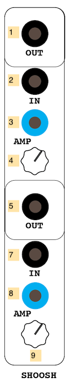

1. Output signal (AC OUTPUT)
2. Input signal (AC INPUT)
3. CV amplitude amount (scales with *4*) (DC INPUT)
4. Gain knob

*Notes:*
- The use of LEDs and photocells to control resistance in analog audio circuits was (and remains) a popular technique for amplitude-based effects such as tremolo effects and compressors, due to their non-linear (and slightly slewed) response that gives the effect a more natural character. The Buchla Lowpass Gate circuit on R*\S Panel V uses vactrols in a similar way.

#### Odds

The **Odds** is a six-channel implementation of a [Bernoulli Gate](https://mutable-instruments.net/modules/branches/) - a "coin toss" circuit with variable weighting, allowing input pulses to translate to voltage sent to one of two possible output jacks based on the results of a random value. The panel also has a utility 4-stage sequencer module and a common-mode input which will fire all outputs. The module can be set to send out pulses or set steady values at the output jacks.

1. Utility 4-stage sequencer outputs 1-4 - any Pulse input at any channel will advance the clock and cycle through the outputs (Pulse OUTPUT)
2. Input pulse A-F (Pulse INPUT)
3. Probability knob A-F - clockwise values will make the right output ("tails") more likely than the left ("heads")
4. Left output ("heads") jack (Pulse OUTPUT)
5. Right output ("tails") jack (Pulse OUTPUT)
6. Common pulse input - this will fire a coin toss on all six channels (Pulse INPUT)
7. Mode switch - LOW sets the outputs to send pulses; HIGH sets the outputs to hold their state

*Notes:*
- The Common input *6* can be used to generate multiple randomly selected pulses or gates simultaneously
- The Mode switch *7* can be used to have the module send continuous voltages for, e.g. control of gates

#### Drive

The **Drive** module is a dual, diode-clipping distortion circuit based on the [MXR Distortion Plus](https://www.electrosmash.com/mxr-distortion-plus-analysis) effect pedal. The overdrive amount can be voltage-controlled.

1. Output signal (AC OUTPUT)
2. Input signal (AC INPUT)
3. CV distortion amount (scales with *4*) (DC INPUT)
4. Drive knob

*Notes:*
- Like most guitar-style distortion circuits, the Drive will clip a simple waveform, creating additional overtones in a harmonic signal.

#### Nic75

The **Nic75** module is based on an [envelope follower circuit](https://www.nicolascollins.com/texts/electronotes.pdf) designed by [Nicolas Collins](https://www.nicolascollins.com/) and published in [Electronotes](http://electronotes.netfirms.com/) in 1975. The circuit is similar to the Serge DUSG insofar as it can be used both to generate a tracking envelope on an input signal and a slewed envelope curve from a trigger pulse; in addition, the circuit contains an attack detector which will send a pulse when the input envelope exceeds a threshold. The module has two followers built with slightly different component values - the lower half has a slightly longer slew response than the upper half.

1. Output envelope curve (DC OUTPUT)
2. Trigger output when an attack is detected (Pulse OUTPUT)
3. Input value for the envelope follower (AC INPUT)
4. Trgger input to generate an Attack-Release (AR) envelope (Pulse INPUT)
5. Attack knob - higher value is a faster attack
6. Release knob - higher value is a slower release
7. Gain knob - scales in the input voltage
8. Threshold knob - controls the threshold for an attack pulse at *2*

*Notes:*
- The Nic75 circuit is designed to reduce the "ripple" effect in simple envelope followers where the attack phase of an input instrument causes an unstable follower output without extensive lowpass filtering, which creates the opposite problem where short attacks disappear and aren't tracked properly. By separating the Attack and Release characteristics of the follower within the circuit, this can be mitigated.

[back to top](#top)

## Additional Equipment

The IDM Audio Lab has some additional equipment to support the analog synthesizers, integrated alongside the Serge system.

### Vermona DRM1

The [**Vermona DRM1 MkIII**](https://www.vermona.com/en/products/drums-percussion/product/drm1-mkiii/) is an 8-voice analog drum synthesizer developed by Vermona. A Serge-compatible patch panel sits in the rack above it. 

The DRM1 synthesizer can receive input both via MIDI (using the MOTU MIDI interface) and analog trigger signals from the Serge equipment sent in to the red jacks on the left size of the patch panel. MIDI commands allow the synthesizer to behave in a velocity-sensitive manner; analog triggers will sound each voice of the synthesizer at full volume. In addition, buttons on the left of the DRM1 (next to each row of controls) can be used to trigger each voice in the synthesizer to preview the sound.

The synthesizer outputs audio directly to the audio mixer (on channels 11 and 12) *and* via the black jacks on the right side of the patch panel. Toggle switches on the panel allow you to route each drum's output individually or mixed together to the two stereo jacks on the far right of the panel.

### Variable Force Generator

The [**Variable Force Generator**](https://www.low-gain.com/shop/p/vfg), developed by Logan Erickson at [Low-Gain Electronics](https://www.low-gain.com/), is a small, Serge-compatible keyboard with capactive touch pads that generates both gate and CV voltages. Each "key" on the VFG will sent a 5V gate signal when pressed, as well as a DC control voltage (0-5V) based on the amount of force applied to the key; the maximum for each key is set by the knob above it.

### Converter Boxes

The Low-Gain Electronics [**Format Jumbler Utility Boxes**](https://www.low-gain.com/shop/p/utl2) allow you to convert between 1/4" and 3.5mm input signals and banana jacks for the Serge equipment. These boxes are bi-directional passive converters and will not boost or attenuate the signal in any direction. As a result, signals sent into the boxes may be too loud or too quiet for the destination equipment.

### CV OCD

The [CV.OCD](https://six4pix.net/product/cvocd/), designed by [Sixty Four Pixels](https://six4pix.net/), takes MIDI signals and converts them into scaled control voltages for the Serge equipment. The CV.OCD outputs 3.5mm (Eurorack) jacks, so you can use the Low-Gain Converter boxes to output banana-jack signals. The CV.OCD is configured to take MIDI from the MOTU MIDI Interface and send the following output voltages:

<ol type="A">
  <li>Continous signal representing the pitch for a MIDI Note on Channel 1 (1V/Oct standard)</li>
  <li>Continous signal representing the pitch for a MIDI Note on Channel 2 (1V/Oct standard)</li>
  <li>Continous signal representing the pitch for a MIDI Note on Channel 3 (1V/Oct standard)</li>
  <li>Continous signal representing the pitch for a MIDI Note on Channel 4 (1V/Oct standard)</li>
</ol>

<ol start="1">
    <li>Trigger (pulse) signal representing a MIDI Note on Channel 1</li>
    <li>Trigger (pulse) signal representing a MIDI Note on Channel 2</li>
    <li>Trigger (pulse) signal representing a MIDI Note on Channel 3</li>
    <li>Trigger (pulse) signal representing a MIDI Note on Channel 4</li>
</ol>

<ol start="5">
    <li>Gate (high on note ON, low on note OFF) signal representing a MIDI Note on Channel 1</li>
    <li>Gate (high on note ON, low on note OFF) signal representing a MIDI Note on Channel 2</li>
    <li>Gate (high on note ON, low on note OFF) signal representing a MIDI Note on Channel 3</li>
    <li>Gate (high on note ON, low on note OFF) signal representing a MIDI Note on Channel 4</li>
</ol>

<ol start="9">
    <li>Quarter-Note Pulse signal from MIDI real-time messages</li>
    <li>Eigth-Note Pulse signal from MIDI real-time messages</li>
    <li>Sixteenth-Note Pulse signal from MIDI real-time messages</li>
    <li>Thirty-Second-Note Pulse signal from MIDI real-time messages</li>
</ol>

### Oscilloscopes

The IDM Audio Lab has a collection of four oscilloscops (three analog, one digital). The three analog oscilloscopes (two B&K [Model 1470s](https://archive.org/details/1470Manual/mode/1up?view=theater), one [Model 1479B](https://spwindustrial.com/b-k-precision-30-mhz-dual-trace-oscilloscope-1479b/)) can be used to visualize analog signals from the synthesizer equipment as well as do creative work such as [oscillographics](https://steemit.com/art/@bardionson/how-i-make-oscilloscope-art). The digital oscilloscope (a [Siglent SDS1072CML](https://www.siglent.eu/product/1139175/siglent-sds1072cml-70mhz-dual-channel-oscilloscope)) can be used for more elaborate analysis functions including signal data storage to a USB drive.

**IMPORTANT**: Unlike the rest the equipment in the IDM audio lab, the oscilloscopes **MUST BE SWITCHED ON MANUALLY AND SWITCHED OFF AFTER USE**. The analog oscilloscopes are vintage and use CRT displays; they can burn out (or worse, explode) if left on for long periods of time. Similarly, the digital oscillosope is a high-speed (150mHz) analysis device with electronics that can burn out over time.

[back to top](#top)

[back to synthesizers](./synths.md)

[return to main page](./index.md)
