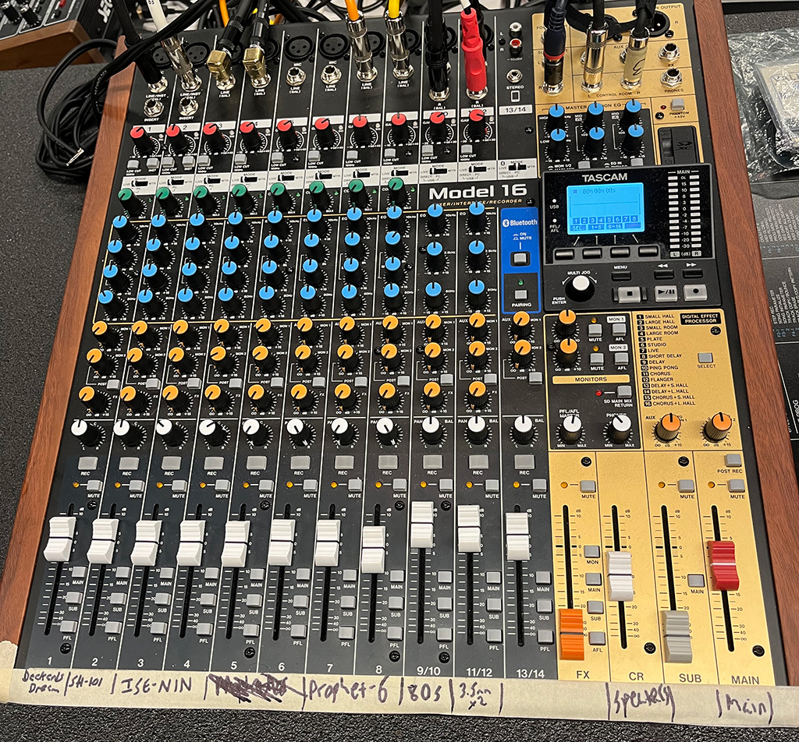

# The IDM Analog Synthesizers

- [Overview](#overview)
- [Studio Basics](#studio-basics)
- The Synthesizers
  - [Glossary](./glossary.md)
  - [Serge system](./serge.md)
  - [ARP 2600 system](./arp.md)
  - [Non-modular synths](./centertable.md)

# Overview

IDM has a collection of analog synthesizers for the users of the Audio Lab to work with, set up as a self-contained studio of modular synthesizers on one side of the room, with a second set of non-modular synthesizers on the center table. The lab has two main types of modular synthesizers, based on the 1970s-era designs of Serge Tcherepnin ([**Serge**](https://en.wikipedia.org/wiki/Serge_synthesizer)) in California and Alan Robert Pearlman ([**ARP**](https://en.wikipedia.org/wiki/ARP_Instruments)) in Massachusetts, as well as a small collection of non-modular synthesizers. The various systems are described in these pages. Our collection includes:

- a large (6-panel) Serge modular system built for IDM by [Patch Point](https://www.patch-point.com/) in Berlin, using PCBs designed by [Random\*Source](http://randomsource.net/) based on the "4th Generation" Serge systems from 1979-1980, as well as two modules based on signal processors designed by [Jürgen Haible](http://jhaible.com/).
- a smaller (2-panel) Serge modular system built by [Luther Bradfute](https://www.lbradfute.com/) in Tennessee based on the 'Homebuilt' panels from the [73-75](http://www.73-75.com/) project by [The Human Comparator](http://www.thehumancomparator.net/) in Stockholm. This synthesizer uses the designs from the original 1973 Serge modular systems developed by Tcherepnin at CalArts.
- a second 2-panel [73-75](http://www.73-75.com/) system built by Matt Gerken in Ohio, consisting of a 'Voice' and 'Control' panel; like the 'Homebuilt', these panels are based on Tcherepnin's first-generation designs.
- two panels of modules by noted synthesizer designer [Ian Fritz](http://ijfritz.byethost4.com/), produced in Serge-compatible format by Paul Akin at [Uglysound Electronics](https://www.facebook.com/uglysoundelectronics/photos/a.541139732601896/560792510636618/?type=1&theater). 
- a [Red Control](https://sergemodularinfo.blogspot.com/p/red-control.html) panel built by Rex Probe / Sound Transform Systems in the late 1990s, based on 1979-era Serge designs.
- two Serge-format panels based on Ken Stone's [CGS modules](https://www.elby-designs.com/webtek/cgs/cgs.htm): a [Black Swamp](https://www.muffwiggler.com/forum/viewtopic.php?t=147603) panel designed by Jon Peters, based on the CGS [SWAMP](https://www.modulargrid.net/s/cgs-swamp), built by Charlie Kerr at [Loudest Warning](http://www.loudestwarning.co.uk/); and a 16-stage CGS [Programmer Sequencer](https://www.elby-designs.com/webtek/cgs/cgs359/cgs359.htm) designed and built by Finlay Shakespeare at [Future Sound Systems](http://futuresoundsystems.co.uk/).
- the [Shelfisizer](https://github.com/IDMNYU/shelfisizer), a set of Arduino-based Serge-compatible modules designed and built by Luke.
- a [Benjolin](https://modularsynthesis.com/hordijk/benjolin/benjolin.htm) synthesizer designed by Rob Hordijk, built in Serge format by Grant Wilkinson.
- a [Variable Force Generator](https://www.low-gain.com/shop/p/vfg) Serge-format CV/Gate controller built by Logan Erickson / Low-Gain Electronics.
- a [Vermona DRM1 MKIII](https://www.vermona.com/en/products/drums-percussion/product/drm1-mkiii/) analog drum synthesizer, with a custom patchbay built by Luke to interface with the Serge system.
- a [TTSH](http://build.thehumancomparator.net/), an open-source reimagining of the 1971 ARP 2600, designed by The Human Comparator and custom-built for Luke by Patch Point.
- an open source design of an [ARP 1601 Sequencer](https://modwiggler.com/forum/viewtopic.php?t=138862&start=0), also built by Patch Point.
- a [Moog Werkstatt-01](https://www.moogmusic.com/products/werkstatt-01-cv-expander) monophonic analog synthesizer.
- a Bastl Instruments [Rumburack 2.0](https://bastl-instruments.com/eurorack/full-systems/rumburack-2-0) hybrid analog-digital modular synthesizer.
- an [Etherwave Plus](https://www.moogmusic.com/products/etherwave-plus-theremin), a modern kit [Theremin](https://en.wikipedia.org/wiki/Theremin) developed by [Moog Music](https://www.moogmusic.com/).
- a [Prophet-6 Desktop](https://www.sequential.com/product/prophet-6-desktop/) 6-voice analog synthesizer, developed by [Sequential](https://www.sequential.com/) as a modern reissue of their famed [Prophet-5](https://en.wikipedia.org/wiki/Prophet-5) synthesizer from 1978, controlled by an [Akai MPK-225](https://www.akaipro.com/mpk225) MIDI controller.
- a [Deckard's Dream](https://black-corporation.com/product/deckards-dream-mk2/) 8-voice analog synthesizer, developed by the [Black Corporation](https://black-corporation.com/) as a modern reimagining of the Yamaha [CS-80](https://en.wikipedia.org/wiki/Yamaha_CS-80) synthesizer from 1977, controlled by a Roli [Seaboard Rise 25](https://roli.com/products/seaboard)/[MPE](https://www.midi.org/articles-old/midi-polyphonic-expression-mpe) keyboard controller.
- a Roland [SH-101](https://en.wikipedia.org/wiki/Roland_SH-101) monophonic analog synthesizer from 1982.

In addition, some auxiliary equipment exists in the Audio Lab to help people work with the synthesizers:
- A [Tascam Model 16](https://tascam.com/us/product/model_16/top) Mixer with USB output and SD card recording, for the Serge and ARP synthesizers.
- A [Behringer UFX-1204](https://www.behringer.com/Categories/Behringer/Mixers/Analog/UFX1204/p/P0AB2) Mixer with USB output for recording, for the synthesizers on the center table.
- An [Akai GX-4000DB](https://www.hifiengine.com/manual_library/akai/gx-4000db.shtml) reel-to-reel tape recorder.
- A [MOTU 8A](https://motu.com/products/avb/8a) DC-coupled Audio Interface with a custom-built banana-jack patchbay.
- A [MOTU Micro Express](https://motu.com/products/midi/micro_usb) [MIDI](https://en.wikipedia.org/wiki/MIDI) interface.
- A vintage [IVL Pitchrider 4000](https://www.ivlaudio.com/home) pitch-to-MIDI converter.
- a Roland [GI-10](https://www.soundonsound.com/reviews/roland-gi-10) Guitar-to-MIDI Interface.
- An [Arturia KeyStep](https://www.arturia.com/keystep/overview) MIDI keyboard controller, attached below the TTSH.
- Two [CV.OCD](https://six4pix.net/product/cvocd/) MIDI-to-Control Voltage converters, as well as a [Gate Boost](https://www.tindie.com/products/hotchk155/gate-boost-module-for-cvocd-and-others/) module.
- Multiple [Low-Gain Electronics](http://lowgain-audio.com/) passive converter boxes.
- Three vintage [B&K oscilloscopes](https://en.wikipedia.org/wiki/Oscilloscope_history) - two model 1470s, one model 1479B.
- One [Siglent](https://www.siglent.eu/siglent-sds1072cml-plus.html) digital two-channel oscilloscope.
- Two sets of stereo [Genelec](https://www.genelec.com/) speakers, one with a subwoofer.

# Studio Basics

First, please remember to read the IDM Audio Lab [**Policies, Rules, and Room Reservation Procedure**](./rules.md). 

### Power

The power for *nearly everything* related to the synthesizers in the Audio Lab is controlled by three switches; two found on the Furman power conditioners on the black racks to the right of the main Serge system, and a third switch on the main power strip on the center table:

Green lights on the conditioners and power strip will confirm that you've got power.
**Please use these power switches (and nothing else) to turn on and off the synthesizer equipment in the Audio Lab.**

### Mixer

There are two mixers for the analog equipment; one along the wall for the modular synthesizers, and another on the center table.

#### Modular Synth Mixer

The mixer for the modular synthesizers is a Tascam Model 16, which takes inputs from the various modular synthesizers and feeds them to the speakers or, by using a USB connector, to your computer for recording. The Tascam mixer also has an SD card input that allows you to directly record digital files from the mixer.

The channels of the mixer are wired to:

| Channel  | Input     |
| ------------- | --- |
| 1            | the left output of the "Stereo Mixer" module on Panel 1 of the R\*S Serge. |
| 2            | the right output of the "Stereo Mixer" module on Panel 1 of the R\*S Serge. |
| 3            | the left output of the "Stereo Mixer" module on Panel 5 of the R\*S Serge. |
| 4            | the right output of the "Stereo Mixer" module on Panel 5 of the R\*S Serge. |
| 5            | the output of the "XFader" module on Panel 3 of the R\*S Serge. |
| 6            | the top output on the "Adapter" module on the 73-75 Serge. |
| 7            | the main output of the Benjolin. |
| 8            | the output of the IKEA plate reverb. |
| 9/10            | the left and right output of the TTSH Mixer section. |
| 11/12           | the stereo output of the Vermona DRM1 drum synthesizer. |
| 13/14           | the stereo output of the Akai reel-to-reel recorder. |

**Please don't re-plug the channels on the mixer.**

The USB output of the mixer comes out of a USB hub on the right-hand wall (between the Shelfisizer rack and the 73-75 panels). This hub also allows you to connect to the MOTU 8A audio interface and the MOTU Micro Express MIDI Interface.

The mixer is a multi-channel audio interface, with the Main Mix available as input channels 15/16. In other words, you can record individual tracks from the mixer on a per-channel basis. If you are a Mac user, you won't need a driver for the mixer, though you should confirm that you have a connection by looking in the "Audio MIDI Setup" or "Sound" panel under your System Preferences. If you are using a Windows machine, you will have to download and install an ASIO driver for the mixer [here](https://tascam.com/us/product/model_16/download).

You can also record to an micro-SD card on the mixer directly by record-enabling individual channels and using the console interface above the output section of the mixer. The mixer will record standard .WAV files at 24-bit, 44.1kHz. Higher sampling rates can be achieved by recording onto your computer via USB.

The "Main" output of the mixer routes the audio to the two Genelec audio speakers on the table, based on the volume of the white "CR" (Control Room) fader. They should let you listen to the synths with plenty of volume, so **please don't adjust the gain controls on the Genelecs**. The "Sub" output allows you to route audio from the mixer to the Akai reel-to-reel tape deck. The "Sub" output is a bus, so you need to enable it on a per channel basis via the small buttons next to the channel fader.

#### Center Table Mixer

The mixer on the center table (for the non-modular synths) is a Behringer UFX-1204, which takes inputs from the various keyboard synthesizers and feeds them to the speakers or, by using a USB connector, to your computer for recording.

The channels of the mixer are wired to:

| Channel  | Input     |
| ------------- | --- |
| 1            | the output of the Deckard's Dream synthesizer. |
| 2            | the output of the IDM Vocoder. |
| 3            | the output of the microphone on the center table. |
| 4            | the output of the SH-101 synthesizer. |
| 5/6          | the left and right outputs of the Prophet-6 synthesizer. |
| 7/8          | a stereo 3.5mm / 1/8" \* jack for a laptop connection. |

> \* *Audio connector trivia*: mini-phone jacks have a diameter of 3.5mm, which is 0.14in, *not* 0.125in (1/8"). In the USA, they are incorrectly referred to as 1/8" jacks because (a) the USA has a [cultural aversion to the metric system](https://www.youtube.com/watch?v=N0U-XEmKPKg) and (b) they look to be about half the size of 1/4" jacks.

**Please don't re-plug the channels on the mixer.**

The Vocoder is hard-wired using the insert output of the microphone channel and the headphone output of the Prophet-6.

The USB output of the mixer has a cable connected for your use. If you connect it up to your computer, you can record the output of the equipment. The mixer shows up as a multi-channel audio interface, with the input channels on the mixer routed on a per-channel basis (e.g. *input channel 3* on the mixer comes into your computer as *input channel 3* of the interface). The "Main Mix" output of the mixer appears on channels 15-16. 

If you are a Mac user, you won't need a driver for the mixer, though you should confirm that you have a connection by looking in the "Audio MIDI Setup" or "Sound" panel under your System Preferences. If you are using a Windows machine, you will have to download and install an ASIO driver for the mixer [here](https://www.behringer.com/Categories/Behringer/Mixers/Analog/UFX1204/p/P0AB2/Downloads).

The mixer can send your computer audio either pre- or post-fader (which includes not only the channel level, but also the internal effects and equalization). The red button at the top of the channel below the white Gain knob lets you set this option. In general, the pre-fader (button up) option will give you a cleaner signal, allowing you to post-process the audio once you've recorded it.

The "Main Mix" of the mixer routes the audio to the two Genelec audio speakers on the table. They should let you listen to the synths with plenty of volume, so **please don't adjust the gain controls on the Genelecs**.

[back to top](#top)

[return to main page](./index.md)
