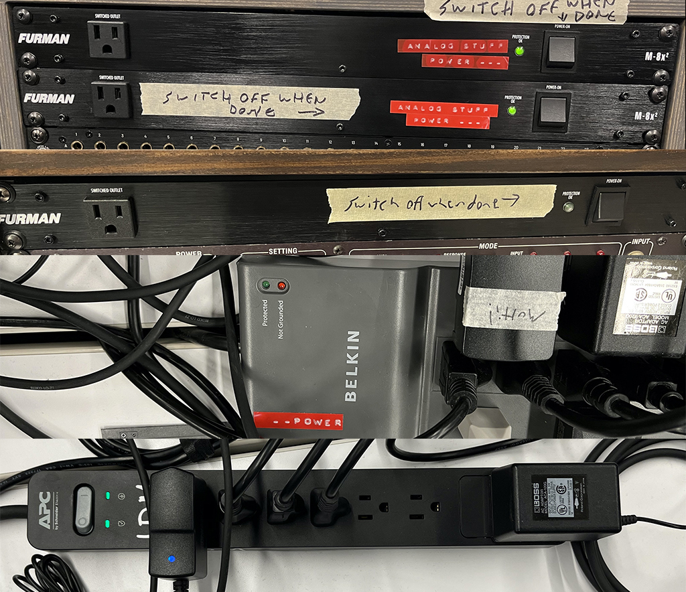
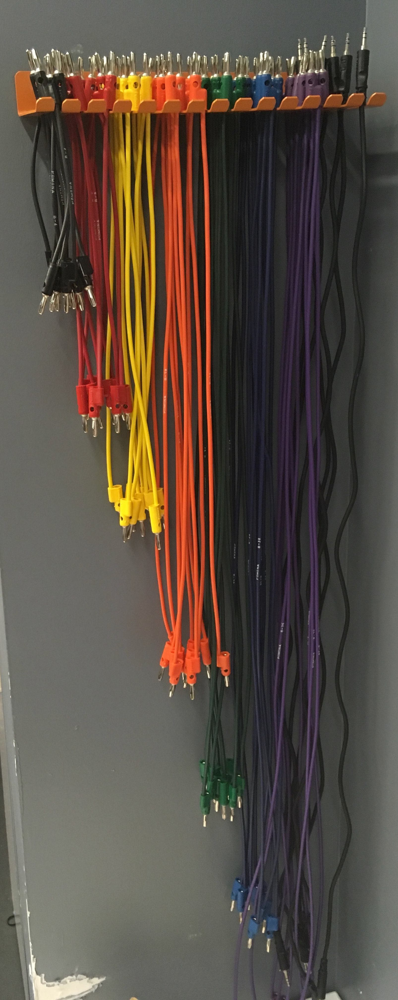
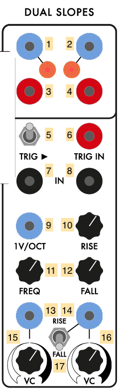
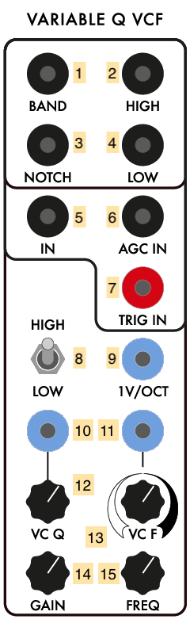
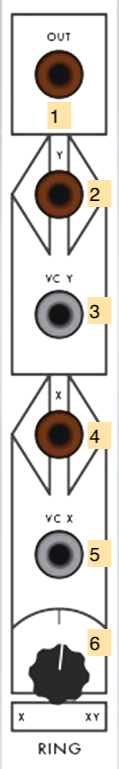
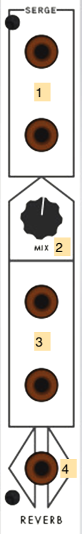
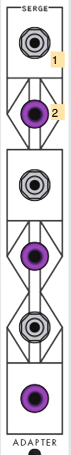
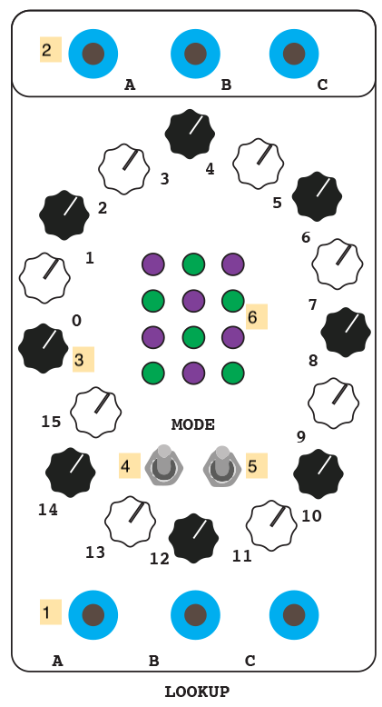

# The IDM Analog Synthesizers

- [Overview](#overview)
- [Studio Basics](#studio-basics)
- [The Synthesizers](#synthesizers)
  - [Serge system overview](#serge-system-overview)
  - [Random\*Source Serge](#random-source-serge) ( [La Bestia II](#panel-1-la-bestia-ii) / [Edelweiss II](#panel-2-edelweiss-ii) / [Mantra](#panel-3-mantra) / [TKB](#panel-4-tkb) )
  - [73-73 Serge](#73-75-serge) ( [Homebuilt Panel 1](#homebuilt-panel-1) / [Homebuilt Panel 2](#homebuilt-panel-2) )
  - [Shelfisizer](#the-shelfisizer) ( [2019 Panel](#2019-panel) )

# Overview

IDM has a collection of analog synthesizers for the users of the Audio Lab to work with, set up as a self-contained studio in the corner of the room. These include:

- a large (4-panel) Serge modular system built for IDM by [Patch Point](https://www.patch-point.com/) in Berlin, using PCBs designed by [Random\*Source](http://randomsource.net/) based on the "4th Generation" Serge systems from 1979-1980.
- a smaller (2-panel) Serge modular system built by [Luther Bradfute](https://www.lbradfute.com/) in Tennessee based on the [73-75](http://www.73-75.com/) modular system designed by [The Human Comparator](http://www.thehumancomparator.net/) in Stockholm. This synthesizer uses the designs from the original 1973 Serge modular systems developed at CalArts.
- the [Shelfisizer](https://github.com/IDMNYU/shelfisizer), a set of Arduino-based Serge-compatible modules designed and built by Luke.

In addition, some auxiliary equipment exists in the Audio Lab to help people work with the synthesizers:
- A [Behringer UFX-1204](https://www.behringer.com/Categories/Behringer/Mixers/Analog/UFX1204/p/P0AB2) Mixer with USB output for recording.
- A [MOTU 8A](https://motu.com/products/avb/8a) DC-coupled Audio Interface with a custom-built banana-jack patchbay.
- A [MOTU Micro Express](https://motu.com/products/midi/micro_usb) MIDI interface.
- A vintage [IVL Pitchrider 4000](https://www.ivlaudio.com/home) pitch-to-MIDI converter.
- A [CV.OCD](https://six4pix.net/product/cvocd/) MIDI-to-Control Voltage converter.
- Multiple [Low-Gain Electronics](http://lowgain-audio.com/) passive converter boxes.
- Three vintage [B&K oscilloscopes](https://en.wikipedia.org/wiki/Oscilloscope_history) - two model 1470s, one model 1479B.
- Stereo Genelec speakers.

# Studio Basics

First, please remember to read the IDM Audio Lab [**Policies, Rules, and Room Reservation Procedure**](./rules.md). 

### Power

The power for *everything* in the analog studio is controled by a single switch, found on the Furman power conditioner on the black rack to the right:

A green light on the conditioner will confirm that you've got power.
**Please use this power switch (and nothing else) to turn on and off all the equipment in the analog studio.**

### Mixer

The mixer for the analog studio is a Behringer UFX-1204, which takes inputs from the various synthesizers and feeds them to the speakers or, by using a USB connector, to your computer for recording.

The first four channels of the mixer are mono, and are hard-wired to:
1. the left output of the "Stereo Mixer" module on the Random\*Source Serge (the rightmost module on the top panel)
2. the right output of the "Stereo Mixer" module on the Random\*Source Serge (the rightmost module on the top panel)
3. the output of the "XFader" module on the Random\*Source Serge (the rightmost module on the 3rd panel)
4. the top output on the "Adapter" module on the 73-75 Serge (the rightmost module on the bottom panel)

The rest of the mixer consists of 8 additional inputs in stereo pairs (5/6, 7/8, 9/10, 11/12). Channels 5/6 have a cable connected that ends in a stereo 1/8" jack so you can connect the analog output of your laptop.

The MUTE buttons on each channel reroute the audio to a secondary ("Alt 3-4") output. The left ("Alt 3") output of this secondary audio bus is connected to one of the Low-Gain converter boxes, so that you could, for example, connect an electric guitar to the mixer, "mute" its channel, and then connect it to the Serge system.

The USB output of the mixer has a cable connected for your use. If you connect it up to your computer, you can record the output of the synthesizers. The mixer shows up as a multi-channel audio interface, with the input channels on the mixer routed on a per-channel basis (e.g. *input channel 3* on the mixer comes into your computer as *input channel 3* of the interface). The "Main Mix" output of the mixer appears on channels 15-16. 

If you are a Mac user, you won't need a driver for the mixer, though you should confirm that you have a connection by looking in the "Audio MIDI Setup" or "Sound" panel under your System Preferences. If you are using a Windows machine, you will have to download and install an ASIO driver for the mixer [here](https://www.behringer.com/Categories/Behringer/Mixers/Analog/UFX1204/p/P0AB2/Downloads).

The mixer can send your computer audio either pre- or post-fader (which includes not only the channel level, but also the internal effects and equalization). The red button at the top of the channel below the white Gain knob lets you set this option. In general, the pre-fader (button up) option will give you a cleaner signal, allowing you to post-process the audio once you've recorded it.

The "Main Mix" of the mixer routes the audio to the two Genelec audio speakers in the analog studio area. They should let you listen to the synths with plenty of volume, so **please don't adjust the gain controls on the Genelecs**.

# The Synthesizers

## Serge System Overview

[Serge synthesizers](https://en.wikipedia.org/wiki/Serge_synthesizer) are [analog modular synthesizers](https://en.wikipedia.org/wiki/Analog_synthesizer) based on the  designs of [Serge Tcherepnin](https://en.wikipedia.org/wiki/Serge_Tcherepnin). Tcherepnin, while working at CalArts in the 1970s, developed his line of synthesizers after meeting with [Don Buchla](https://en.wikipedia.org/wiki/Don_Buchla) and working with composer [Morton Subotnick](https://en.wikipedia.org/wiki/Morton_Subotnick). Tcherepnin realized that modular synthesizers available at the time were far too expensive to be affordable for students and hobbyists, and so he set out to develop a modular system that was low cost and emphasized flexibility. Working with a team of CalArts students, including Rich Gold, Randy Cohen, and Rex Probe, the first Serge systems were built in Tcherepnin's home in 1973. Tcherepnin made a number of innovative decisions to keep costs down, such as the use of (cheaper) banana jacks instead of audio connectors, and the ["paperfacing"](http://djjondent.blogspot.com/2013/12/two-panel-vintage-paperface-serge.html) of his synthesizer panels so that the aluminum could be pre-drilled in a grid regardless of the customer's desired module configuration.

In addition, unlike many of his competitors, Tcherepnin also sold his systems as *kits*, where the customer would receive a circuit board, a face plate and decal label, a Ziploc bag of discrete electronic components, and detailed assembly instructions. This DIY approach - similar to [HeathKit radios](https://shop.heathkit.com/page/homepage) popular at the time - allowed Serge synthesizers to be purchased for a fraction of the cost of a Buchla system if the buyer didn't mind doing some soldering. Many licensed Serge systems today are still sold as kits, with a number of builders, such as our friends at [Patch Point](https://www.patch-point.com/) in Berlin and [Low-Gain Electronics](http://www.lowgain-audio.com/) in Minneapolis available to professionaly assemble the kits into finished synthesizers using high quality components.

Tcherepnin's designs found commercial success as a low-cost alternative to other modular synthesis systems available at the time. His company (Serge Modular Music Systems) sold synthesizers under the **Serge** name until 1986. Tcherepnin then licensed his designs *non-exclusively* to a number of manufacturers, such as [Sound Transform Systems](http://www.serge-fans.com/prices.html) in the USA (run by Tcherepnin's former student and employee Rex Probe), [Elby Designs](https://www.elby-designs.com/index.html) in Australia, [Random\*Source](http://randomsource.net/) in Germany, [the Human Comparator](http://73-75.com) in Sweden, and [Loudest Warning](http://loudestwarning.co.uk) in the UK. In addition, a number of synthesizer designers, such as [Bugbrand](https://bugbrand.co.uk), [Modcan](http://www.modcan.com/), [Ciat-Lonbarde](https://ciat-lonbarde.net), and [Kilpatrick Audio](http://kilpatrickaudio.com/), continue to develop new synths using a Serge-inspired or Serge-compatible format.

The [Serge-Fans](http://www.serge-fans.com/history.htm) web page (which doubles as an information site for Sound Transform Systems) is a great resource to learn more about the history of these synthesizers.

Ken Stone's [Serge Modular](http://serge.synth.net/) is another great resource, containing links to original manuals, price lists, circuit descriptions, and panel art.

In addition, there's a nice video interview by Waveshaper Media with Tcherepnin [here](https://www.youtube.com/watch?v=To_gkk9GEpQ).

A scan of a 1976 manual for the Serge synthesizers, written by Rich Gold, Darrel Johansen, and Marina LaPalma, can be found [here](./serge_goldbook.pdf).

### What makes a Serge a Serge?

Serge synthesizers have a number of technical characteristics that set them apart from other modular systems of their day, as well as modern modular synthesizers that use the [Eurorack](https://en.wikipedia.org/wiki/Eurorack) format:
- Serge synthesizers are designed to be arrayed horizontally into panels that are **4U** (four [rack units](https://en.wikipedia.org/wiki/Rack_unit)) high, the same as [Buchla](https://en.wikipedia.org/wiki/Buchla_Electronic_Musical_Instruments) systems but distinct from [Moog](https://en.wikipedia.org/wiki/Moog_synthesizer) systems (5U) or Eurorack systems (3U). As a result of this sizing standard, Buchla- and Serge-style synthesizers are sometimes referred to generically as "4U" modular systems.
- Serge systems use **4mm [banana connectors](https://en.wikipedia.org/wiki/Banana_connector)** for all their patchcord connectivity, with a common [ground connection](https://en.wikipedia.org/wiki/Ground_(electricity)) used across all the modules in the system. The use of single conductor wires means that, when patching with a Serge, you're connecting the positive current wire only. This is in contrast to most other modular systems, which use two-conductor audio cables such as 1/8" / 3.5mm [phone jacks](https://en.wikipedia.org/wiki/Phone_connector_(audio)) for connectivity. Serge modules (and other  synths that use banana jacks) tend to work with lower impedance signals to mitigate the cross-talk that occurs from the modules' audio circuitry all sharing the same ground plane.
- Tcherepnin designed his synthesizers with **no systemic distinction between "audio" and "control voltages"**. This was a fairly radical departure from contemporary systems, which either had separate modules for generating different types of signals (Moog) or used different cabling standards to keep different kinds of voltages separate (Buchla). In Serge systems, an oscillator could be listened to, or slowed down below 20Hz to create a time-varying [low-frequency oscillator](https://en.wikipedia.org/wiki/Low-frequency_oscillation). By a similar token, Serge modules that generated ramps, triggers, random signals, and even voltage sequences could be sped up to audio rate to generate triangle waves, square waves, noise, or arbitrary waveforms. Instead of dictating the *use* of any given signal generated by the synthesizer, Serge systems distinguish between the *type* of voltage generated - AC, DC, or pulse - without implying how it should be patched and at what frequency it should be used.
- Serge modules often perform multiple functions depending on which connections are active. For example, envelope generators in Serge systems can also be wired to function as oscillators, envelope followers, filters, or gates. Tcherepnin referred to this feature of his synthesizers as **"patch programmability"**, and this flexibility is considered to be one of the hallmarks of Serge modular systems. The Serge [Dual Universal Slope Generator](https://www.elby-designs.com/webtek/cgs/serge/cgs114/cgs114_dusg.html) from 1976 epitomizes this sensibility, and there are several Eurorack modules on the market (e.g. MakeNoise [MATHS](http://www.makenoisemusic.com/modules/maths) and the Befaco [Rampage](https://www.befaco.org/en/rampage/)) that feature similar multiuse capabilities.

In terms of overall design, Serge modular systems are considered, alongside Buchla, to be classic ["West Coast"](https://reverb.com/news/the-basics-of-east-coast-and-west-coast-synthesis) synthesizers:
- They feature a (comparably) large selection of heterogenous modules, to encourage experimentation through a limitless variety of possible connections. This is in contrast to "East Coast" synthesizers which tend to feature oscillators, filters, and amplifiers that are usually patched in sequence and triggered synchronously.
- They emphasize distortion - frequency and ring modulation, waveshaping - as a synthesis technique to make richer harmonic content from simple waveforms, as opposed to the subtractive synthesis used in "East Coast" synthesizers, with their emphasis on ladder filters shaping harmonically rich oscillators.
- They offer sequencing and other automatic behaviors, as well as modules that avoid specific musical conventions but feature circuits that can be used for musical effects, such as sample-and-hold circuits, slew rate limiters, shift registers, and frequency dividers. This is in lieu of the Western keyboard-centric performance setups common in "East Coast" synthesizers.

### Interface standards

Serge synthesizers are made up of **modules** that are 4U (7") tall and multiples of 1" wide. Most (but not all) Serge systems group modules into a single aluminum enclosure (called a "panel" or "boat") that contains up to 16 inches worth of modules and has a single power connector on the rear. The separation between individual modules on a panel is indicated by the panel graphics, usually with a module's name at the top or bottom, and a visual indicator such as a black rounded rectangle or a gap in the decal around the module.

Modules may have **inputs**, **outputs**, or both, depending on their function. In general, outputs on Serge synthesizers appear *above* and/or *to the right* of the inputs, and are usually visually indicated on the panel graphics. In the image above, the lower portion of the module (where the knobs are) contain the inputs, while the upper area (bounded by a rectangle) contain the output jacks.

Interface elements on Serge modules consist of jacks (points of connection), LEDs, knobs, toggle switches, push buttons, and, on the TKB module, capacitive touch strips. Interface elements are usually labeled.

Jacks are colored based on the type of voltage they send (or expect to receive). Tcherepnin's original design called for three types of voltage connection with color codes:

| Voltage Type  | Description     | Voltage Range | R\*S     | 73-75 | Shelfisizer |
| ------------- | --- |           ---            |     ---|    ---|          ---|
| AC            | Bipolar continuous (analog) | -2.5V to 2.5V | Black | Brown | Black |
| DC            | Unipolar continuous (analog) | 0 to 5V       | Light Blue | Light Grey | Dark Blue |
| Pulse \*      | Unipolar discrete (digital) | 0 *or* 5V      | Red | Red | Red |

\* **Serge "Pulse" jacks send and receive more than pulses** - a better way to think of them is "*digital*", "*binary*", or "*boolean*", insofar as their voltage state is either HIGH (5V) or LOW (0V). Pulse jacks are used for gates, PWM / square waves, comparator / switching signals, as well as pulses.

Some modules have additional colors, such as lavender jacks for passive connectors on the 73-75 Adaptor module and orange for the AC-coupled (-5V or 5V) comparator jack on the Random\*Source Smooth / Stepped Generator module.

As noted above, these conventions describe the *kind* of voltage being delivered, not *how* you're going to use it. As in the image above, the output area of the module has black, blue, and red jacks, but all of them can be used to generate either audio patched into the speakers or control voltage patched into another module.

Patching the output of a module delivering one type of voltage into a module jack that expects a *different* type can have unpredictable results. In general, patching a blue (DC) jack into a black (AC) jack will work as expected, though some modules (such as the voltage-controlled filters) are designed to only modify signals in the audio range, so a slow-moving DC signal may end up getting filtered out. Patching a black (AC) source into a blue (DC) destination may have unusual results - the negative voltage in the signal may end up getting clipped to 0V or rectified (flipped into positive voltage). Modules that expect pulses (red jacks) will "fire" when an AC or DC voltage source from a black or blue jack crosses above 2.5V or so, but processing voltage from a pulse source (red jack) through a DC or AC processing module may transform the signal in a way that eliminates its ability to trigger anything.

Serge modules use small knobs to control parameters, often in conjunction with control voltage. Knobs that *scale* (multiply) an input voltage and knobs that *offset* (add to) an input voltage are distinguished on the panel graphics. Serge scalar knobs are usually *bipolar* and can apply negative scaling by moving the knob to the left. The zero (12 o'clock) position scales the incoming voltage to 0.

Serge modules that work with frequency as a parameter (oscillators, filters, slope generators) often have CV inputs for both linear frequency (scaled by a knob) and [1 volt-per-octave](https://en.wikipedia.org/wiki/CV/gate) standard control voltage, allowing the module to be accurately tuned and played by, e.g. a MIDI-to-CV converter. 

Modules are connected by **patching** within and between module jacks using banana cables.

Banana cables can be stacked by inserting one cable into the back or side of another. The cables in the IDM Audio Lab are stored against the wall to the left of the analog studio area, and are color-coded by length.

In addition, a box labeled "shorting bars!!!" contain small plastic blocks with two banana connectors that can be used to connect two adjacent jacks on most Serge modules.

As mentioned above, patching using banana jacks means that you're only connecting the positive (+) end of the audio signal. The negative (-) signals are fed among the sythesizers using common grounding wires. In the analog studio, these are visible as gray banana cables strung around the backs (and sometimes the front) of the equipment. These cables link together the modular synthesizers, the patchbay to the 8A audio interface, the format converter boxes, and the oscilloscopes.

**Do not remove or replug ground wires - this may prevent the equipment from working properly.**

## Random Source Serge

The Random\*Source Serge was built for IDM in 2018-2019 by Darrin Wiener at Patch Point in Berlin. It's currently configured with four [R\*S "shop" panels](http://randomsource.net/serge_panels) (prebuilt configurations of modules): a La Bestia II, an Edelweiss II, a Mantra, and a TKB (Touch Activated Keyboard Sequencer). These panels incorporate many of the module designs sold by Serge Modular Music Systems prior to Tcherepnin's exit from the company in 1986, with a number of innovations by Random\*Source and a few custom modifications for IDM by Darrin and his colleagues.

### Panel 1 (La Bestia II)

#### New Timbral Oscillator

The **New Timbral Oscillator (NTO)** first appeared in 1976, and was (along with a simpler module called the "Precision VCO") the closest thing Tcherepnin designed to an East Coast-style [Voltage Controlled Oscillator](https://en.wikipedia.org/wiki/Voltage-controlled_oscillator).

1. Rising sawtooth wave (DC OUTPUT)
2. Triangle wave (DC OUTPUT)
3. Sine wave (AC OUTPUT)
4. Variable waveform, controlled by *6*, *9*, *12* (AC OUTPUT)
5. Square wave / pulse (labeled "Puls") (Pulse OUTPUT)
6. CV to control the "variable" waveform of *4* (sums with *12*) (DC INPUT)
7. First 1V/Oct CV of oscillator frequency (sums with *8*, *18* x *19*, *20*, and *21*) (DC INPUT)
8. Second 1V/Oct CV of oscillator frequency (sums with *7*, *18* x *19*, *20*, and *21*) (DC INPUT)
9. Scaling knob for *6*
10. [Linear FM](https://en.wikipedia.org/wiki/Frequency_modulation_synthesis) "Modulator" signal (AC INPUT)
11. First ["Portamento"](https://en.wikipedia.org/wiki/Portamento) (frequency slew limiter) CV (sums with *14* and *17*) (DC INPUT)
12. Adjustment for "variable" waveform of *4* (sums with *6* x *9*)
13. CV to control the amount of linear FM *10* (sums with *16*) (DC INPUT)
14. Second Portamento CV (sums with *11* and *17*) (DC INPUT)
15. [Oscillator Sync](https://en.wikipedia.org/wiki/Oscillator_sync) signal for Saw Output *1* (DC INPUT, triggers at 2.5V).
16. Manual control of the amount of linear FM *10*  (sums with *13*)
17. Manual Portamento control (sums with *11* and *14*)
18. Linear frequency CV input (scaled by *19*, sums with *7*, *8*, *20*, and *21*) (DC INPUT)
19. Scaling knob for *18*
20. Fine tuning knob for the VCO's base frequency (sums with *7*, *8*, *18* x *19*, and *21*)
21. Coarse tuning knob for the VCO's base frequency (sums with *7*, *8*, *18* x *19*, and *20*)

*Notes:*
- Four of the five waveform outputs (*1-5*) represent the standard waveforms used in classic analog subtractive synthesis (Sine, Saw, Triangle, Square), with a fifth output allowing for a variable waveform. Be aware that these outputs are **not of the same voltage type** - the Sine and Variable outputs are the only AC ones. Also note that the NTO produces mathematically accurate (as opposed to "good-sounding") oscillators, intended to be usable as source of control voltage (Saw, Triangle) and pulses ("Puls") as well as audio. As a result, the harmonically rich waveforms (especially the Saw) will sound brighter than the equivalent waveforms on, e.g. a Moog.
- The frequency control of the NTO is a summing bus of the multiple voltage inputs. If you want two different voltages interacting to control the oscillator's frequency, using *both* 1V/OCT inputs (*7* and *8*) will give you a cleaner addition of signals than stacking banana cables into one input.
- Like all Serge modules, feedback is an excellent technique to experiment with, by patching, e.g. the Sine output *3* into the modulator input for the Linear FM *10*.

#### Mixer

The **Mixer** is a utility module that allows you to mix up to three AC sources to a single output using a [high quality operational amplifier](https://www.njr.com/MUSES/) developed by NJR. The mixer is AC-coupled, so it will filter out static (and slow-moving) voltages. The DC-coupled version is called the "Control Voltage Processor".

1. Mixed signal (AC OUTPUT)
2. Phase switch for first input (IN 1)
3. First mixer input (AC INPUT)
4. Second mixer input (AC INPUT)
5. Third mixer input (AC INPUT)
6. Scaling knob for *3*
7. Scaling knob for *4*
8. Scaling knob for *5*

*Notes:*
- The phase switch (*2*) is a **three-way** switch - the middle position will turn the first input signal *off*.
- The scaling knobs (*6-8*) are **logarithmic** audio pots, so 12 o'clock is half power (.707), not half gain (0.5).
- As mentioned above, this module is **AC-coupled**, so slow control voltages will be filtered. In addition, positive-biased audio rate signals will come out with their DC offset removed. For example, if you input the Saw output of the NTO into the mixer, the incoming signal (0-5V DC) will come out -2.5V to 2.5V AC.

#### Wave Multipliers

The **Wave Multipliers** module appeared in 1976 and are considered an important circuit for achieving the "West Coast" sound of the Serge modular. The module contains three self-contained distortion effects that work by shaping the amplitude of the incoming audio signal. Quoting from the 1982 Serge catalog, Tcherepnin describes the three Wave Multipliers:

> The uppermost section is the simplest of the three multiplier sections. but it has two switchable effects. With the switch 
> set at the "HI" position, the module functions to "square-up" an incoming signal. This is not the same as a simple 
> comparator squaring function, though, since there is a rounded flattening of the signal peaks: an effect somewhat similar to 
> overdriving a tube amplifier (except that in this version the process is voltage controllable!). With the switch in the "LO" 
> position, the module is a linear gain controlled VCA. This is useful for various functions such as amplitude modulation and 
> for gating signals into the other sections.
>
> The middle Wave Multiplier provides a sweep of the odd harmonics (1, 3, 5, 7, 9, 11 and 13th) when a sine wave is applied to 
> its input and the knob is turned up or a control voltage is swept from low to high. This effect is similar to overblowing a 
> wind pipe closed at one end, and thus the module can be used to produce the sounds of various wind instruments. A second 
> input is included to allow two signals to be mixed before processing, a technique that we have found to be very usable. This 
> module can be used to explore timbral areas beyond the range of ring modulation because there are more varied harmonics than 
> the sum and difference tones.
>
> The bottom Wave Multiplier performs non-linear wavehaping known as full-wave rectification, but with sophisticated level-
> compensating conditioning as well. Actually the circuit uses three full-wave rectifier sections linked in a very refined 
> controllable format. Each section can double the frequency of a sine or triangle wave applied to its input. Thus sweeping 
> the VC input over its range will produce a smooth timbral transition using the even harmonics (second, fourth, and eighth). 
> Many other partials are present in this basic sound, however, and the sonorities are very rich and varied. A notable feature 
> of this multiplier is that the full-wave rectification is not accompanied by a reduction in the output amplitude. There is 
> no alteration of the essential level of the sound. There are two inputs to provide mixing before processing, and two 
> outputs. One output is a "squared up" version of the other. This output resembles voltage controlled pulse width modulation 
> (only much more interesting). 

1. CV input for Multiplier 1 amount (DC INPUT)
2. Processed output of Multiplier 1 (AC OUTPUT)
3. Scaling knob for Multiplier 1 amount
4. Signal input for Multiplier 1 (AC INPUT)
5. High/Low distortion switch for Multiplier 1
6. Processed output of Multiplier 2 (AC OUTPUT)
7. CV input for Multiplier 2 amount (DC INPUT)
8. Second signal input for Multiplier 2 (DC INPUT)
9. Scaling knob for Multiplier 2 amount
10. First signal input for Multiplier 2 (AC INPUT)
11. Second processed ("squared-up") output for Multiplier 3 (DC OUTPUT)
12. First processed output for Multiplier 3 (AC OUTPUT)
13. CV input for Multiplier 2 amount (DC INPUT)
14. Second signal input for Multiplier 3 (AC INPUT)
15. Scaling knob for Multiplier 3 amount
16. First signal input for Multiplier 3 (AC INPUT)

*Notes:*
- The first multiplier can be used in *low* mode as an ordinary [VCA](https://en.wikipedia.org/wiki/Variable-gain_amplifier), and in *high* mode as a simple "clipping" [distortion](https://en.wikipedia.org/wiki/Distortion_(music)) unit. The second multiplier emphasizes odd harmonics through [wave folding](https://www.keithmcmillen.com/blog/simple-synthesis-part-8-wavefolding/); the third emphasizes even harmonic through [full wave rectification](https://www.hackaudio.com/digital-signal-processing/distortion-effects/full-wave-rectification/).
- The second multiplier has a DC-coupled second input (*8*) which allows you to mix an LFO signal in with the input voltage to add to the distortion effect.
- Using the multipliers in series or in feedback (patching an output back into the input) can create some pretty crazy sounds.

#### Smooth / Stepped Generator #1

The **Smooth / Stepped Generator (SSG)** was designed by Tcherepnin in 1974. Along with the Dual Universal Slope Generator, it's one of the most versatile circuits in the canonical Serge system. Depending on how an SSG is patched, it can function as a [slew limiter](https://en.wikipedia.org/wiki/Slew_rate) (envelope follower / lowpass filter), a sample-and-hold circuit, a triangle wave oscillator, or a low-pass gate. When combined with its sidecar **Noise Source** - a small circuit of three jacks - the SSG can be used to develop a wide variety of fluctuating and quantized random voltages, similar to the Buchla 266 [Source of Uncertainty](http://fluxmonkey.com/historicBuchla/266-uncertainty.htm).

The module is divided into two halves: the "Smooth" side at the top, and the "Stepped" at the bottom. In between the two, a Coupler circuit outputs a comparator voltage of the two sides. The sidecar Noise Source provides three different types of random sources to work with, either with the SSG or with other modules in the system.

1. CV input for the Smooth sides's rate (DC INPUT)
2. CV output for the Smooth side (DC OUTPUT)
3. Scaling knob for *1*
4. Cycle trigger (sends a pulse at the end of a cycle set by the Smooth rate) (Pulse OUTPUT)
5. Knob for Smooth rate amount (sums with *1* x *3*)
6. Signal input for the Smooth side (AC INPUT)
7. Hold jack - when set high, Smooth output *2* will freeze and no longer track the module's input (Pulse INPUT)
8. Sample jack - when set high, Stepped output *14* will sample and hold Stepped input *10* (Pulse INPUT)
9. CV input for the Stepped side's rate (DC INPUT)
10. Signal input for the Stepped side (AC INPUT)
11. Scaling knob for *9*
12. Cycle trigger (sends a pulse at the end of a cycle set by the Stepped rate) (Pulse OUTPUT)
13. Knob for Stepped rate amount (sums with *9* x *11*)
14. CV output for thee Stepped module (DC OUTPUT)
15. "Hot" Coupler output - +5V if Stepped output is higher than the Smooth output; -5V if not (*AC* Pulse OUTPUT)
16. Regular Coupler output - 5V if Stepped output is higher than the Smooth output; 0V if not (Pulse OUTPUT)
17. White noise source (AC OUTPUT)
18. Pink noise source (AC OUTPUT)
19. Sample-and-hold "dirty saw" source (DC OUTPUT)

*Notes:*
- The Smooth side can easily self-oscillate in a triangle pattern by patching the cycle trigger (*4*) into the input (*6*). The rate knob and VC inputs (*5*, *1*, *3*) control the speed of this oscillation. The triangle waveform will appear at the CV output jack (*2*).
- The Stepped side will also internally self-oscillate - by patching cycle trigger *12* to input *10* and adjusting the frequency via *13*, *9*, and *11*. However, no signal will appear at output jack *14* until you send pulses into the Sample jack (*8*). These pulses can come from anywhere, e.g. from the Cycle output of the Smooth side, or from another module. This creates a classic [sample-and-hold](https://en.wikipedia.org/wiki/Sample_and_hold) circuit where the internal oscillating waveform is being "sampled" by the trigger pulse at the Sample jack and "held" as the output voltage at jack *14*.
- By a similar token, *any* input can be used on either side of the SSG. In this case, the Smooth side will work as a [low-pass filter](https://en.wikipedia.org/wiki/Low-pass_filter) with the maximum slew (or smoothing amount) controlled by the rate; the Stepped side will sample-and-hold any input signal - simple waveforms will create different staircase effects based on the frequency difference between the incoming waveform and the "sampling" being performed.
- The sidecar Noise Source module provides ideal outputs to experiment with as inputs for either side of the SSG. The Smooth side can be used to generate slow, time-varying random voltages, while the Stepped side, when sampling a random signal, can be used to create classic "bleep-bloop" noises when patched in as the frequency of an oscillator.
- Sending an audio signal into the input (*6*) of the Smooth side of the SSG and sending an envelope into the CV input (*1*) will, depending where the rate knob (*5*) is set, allow you to use the module as a [low-pass gate](https://electronicmusic.fandom.com/wiki/Lowpass_gate), where the gain on the signal rises with the cutoff frequency of the filter. This setup is great for simulating natural sounding instruments such as percussion where the timbre brightens with the attack of the sound.
- The three Noise Source outputs generate [white noise](https://en.wikipedia.org/wiki/White_noise), [pink or 1/f noise](https://en.wikipedia.org/wiki/Pink_noise), and a "dirty saw" - a circuit designed by Tcherepnin containing a sawtooth wave that wobbles in frequency and has low-amplitude noise injected in its signal.
- The SSG is quite a complex module, and the Serge fans site has [an entire 4-page article](http://www.serge-fans.com/wiz_SSG1.htm) dedicated to patching ideas using it.

#### Dual Slopes #1

The **Dual Slopes** are the Random\*Source implementation of a 1976 Serge module called the **Dual Transient Generator** (some Serge licensees still use that name; STS sells a related module called the **Voltage-Controlled Timegen Oscillator**). The module consists of the circuit for a Dual Universal Slope Generator (DUSG - see below) with a simplified panel interface, optimized for generating harmonically linked oscillators and clock pulses. The module contains two sides:
- on the left, an envelope generator that's internally wired to act as a self-clocking oscillator. This outputs a falling sawtooth and a pulse (square wave) at a specified frequency. 
- on the right, a second envelope generator that can be triggered either manually or at the end of the left oscillator's slope. This side outputs a triangle wave with controllable rise and fall times.
- both sides can also act as a slew limiter (envelope follower) on a signal input.

1. Ramp output for the left-hand slope generator (DC OUTPUT)
2. Ramp output for the right-hand slope generator (DC OUTPUT)
3. Pulse output for the left-hand slope generator (Pulse OUTPUT)
4. Pulse output for the right-hand slope generator (Pulse OUTPUT)
5. Trigger "link switch", internally patching a pulse generated at the end of the left envelope to trigger the right envelope
6. External trigger input for the right-hand slope generator (Pulse INPUT)
7. Signal input to the left-hand slope generator, causing it to act as a low-pass filter / envelope follower (AC INPUT)
8. Signal input to the right-hand slope generator, causing it to act as a low-pass filter / envelope follower (AC INPUT)
9. 1V-per-octave CV input to control the self-clocking frequency of the left-hand slope generator (sums with *11*) (DC INPUT)
10. Control knob for the Rise time on the right-hand slope - a higher value is a faster rise
11. Control knob for the self-clocking frequency of the left-hand slope (sums with *9*)
12. Control knob for the Fall time on the right-hand slope - a higher value is a faster fall
13. CV input to control the Fall time on the left-hand slope (scaled by *15*) (DC INPUT)
14. CV input to control either the Rise or Fall time on the right-hand slope (scaled by *16*) (DC INPUT)
15. Scaling knob for *13*.
16. Scaling knob for *16*.
17. Switch to set whether *14* x *16* controls the Rise or the Fall on the right-hand slope.

*Notes:*
- A very common use of the Dual Slopes is as a **master clock**. The pulse outputs (*3* and *4*) can be used to drive the Sequencer / Programmer, the TKB, the "sample" on an SSG, or the trigger inputs on slope generators and filters.
- The Dual Slopes module highlights Tcherepnin's design mantra that the *distinction between control voltage and audio-rate signals is an artificial one*. The module can generate low frequency ramps and pulse trains, as well as audio-rate waveforms.
- The Dual Slopes module is optimized to leverage a side effect of Serge (and other "West Coast") envelope generators: an envelope, once triggered, *can't be retriggered until it has finished its cycle.* As a result, if the right side of the Dual Slopes has a rise and fall time that's greater than the interval the left side is clocking at, the right-hand slope generator will act as a **frequency divider**, triggering its waveform at 1/2, 1/3, 1/4, etc. of the left side's frequency. To hear this effect, turn the left-hand oscillator up to audio rate, turn on the trigger link switch, and listen to the pulse outputs generated by the right (*4*). By manipulating the rise and fall times of the right-hand slope (*10* and *12*), you can generate a [subhamonic series](https://en.wikipedia.org/wiki/Undertone_series) of the left side's frequency.

#### Variable Slope Voltage Controlled Filter

Tcherepnin avoided implementing standard audio filters like those found on Moog and ARP synthesizers until 1976, preferring instead to focus on slew limiters, comparators, waveshapers, and other circuits that felt to him more natural as a designer. The **Variable Slope Voltage Controlled Filter (VCFS)** is a 12dB/octave [state-variable filter](https://en.wikipedia.org/wiki/State_variable_filter) that allows for voltage control over the slope of the filter, as well as its frequency. 

1. Bandpass filter output (AC OUTPUT)
2. High-pass filter output (AC OUTPUT)
3. Low-pass filter output (AC OUTPUT)
4. Filter input 1 (AC INPUT)
5. Filter input 2 (AC INPUT)
6. Mix knob to control the blend between inputs 1 and 2
7. Q knob for the ["quality"](https://en.wikipedia.org/wiki/Q_factor) (resonance) of the filter. This interacts with the slope to generate the specific behavior of the filter.
8. 1-volt-per-octave CV input to control the filter frequency (sums with *10* x *12* and *14*) (DC INPUT)
9. Voltage control input for the filter's slope (scaled by *11* and summed with *13*) (DC INPUT)
10. VC input for linear control of the filter frequency (scaled by *12* and sums with *8* and *14*)
11. Scaling knob for *9*.
12. Scaling knob for *10*.
13. Knob to set the base slope of the filter
14. Knob to set the base frequency of the filter

*Notes:*
- Patching an envelope signal into either the 1V/OCT (*8*) or linear frequency inputs (*10*) allows you to use the VCFS as a low-pass gate.
- Dynamically adjusting the slope of the VCFS using the CV input *9* using a slow-moving control voltage is a great way to make a filter effect that sounds natural.
- Patching the bandpass output *1* back into the filter at input 2 (*5*) with a separate input signal at input 1 (*4*) will create a resonant ["comb"](https://en.wikipedia.org/wiki/Comb_filter) at the filter's frequency, where the strength of the effect can be varied with the mix control (*6*).

#### Variable Q Voltage Controlled Filter #1

The **Variable Q Voltage Controlled Filter (VCFQ)**, sometimes referred to as the **Variable Resonance Filter**, is a 12dB/octave 2-pole state-variable filter that features low-pass, high-bass, band-pass, and band-reject outputs, voltage control over frequency and Q (resonance) of the filter, and multiple inputs, include one with automatic gain control and a pulse input that generates an impulse into the filter. The VCFQ is an **extended range** design, with a switch that allows it to filter sub-audio control voltage signals.

1. Bandpass filter output (AC OUTPUT)
2. High-pass filter output (AC OUTPUT)
3. Notch (band-reject) filter output (AC OUTPUT)
4. Low-pass filter output (AC OUTPUT)
5. Filter input (AC INPUT)
6. Filter input with automatic gain control (AC INPUT)
7. Pulse input to "ring" the filter - output will be the impulse response (Pulse INPUT)
8. High/Low switch to choose the range of the filter between audio ("HIGH") and sub-audio ("LOW") frequencies
9. 1-volt-per-octave CV input to control the filter frequency (sums with *11* x *13* and *15*) (DC INPUT)
10. Voltage control input for the filter's Q (summed with *12*) (DC INPUT)
11. VC input for linear control of the filter frequency (scaled by *13* and sums with *9* and *15*)
12. Knob to set the base Q of the filter
13. Scaling knob for *11*
14. Gain control knob for the filter
15. Knob to set the base frequency of the filter

*Notes:*
- The VCFQ can [self-oscillate](https://en.wikipedia.org/wiki/Self-oscillation) by patching the band-pass output (*1*) into the input (*5*). As you increase the Q, the band-pass output will approach a sine wave. The various outputs of the filter will be 90 degrees out of phase with one another.
- The pulse input *7* can be used to generate filtered percussion straight from a clock source.
- The LOW (extended range) mode of the filter allows you to modify control voltage to get filter-like characterists, e.g. ringing cause by high resonance in the filter.
- The Serge-Fans site has an explanation of [how to use two VCFQs](http://www.serge-fans.com/wiz_filt.htm) in series as a Moog-style 4-pole filter.

#### Stereo Mixer

The **Stereo Mixer** is Random\*Source's take on Tcherepnin's **Dual Channel Stereo Mixer (DCSM)** developed in the early 1980s. First and foremost, the module has 1/4" TRS jacks to output to non-Serge audio equipment. The module allows for voltage-controlled panning of its two inputs into a stereo output; it also allows for voltage control of the two input channel gains, allowing it to be used as a **Dual VCA**.

1. 1/4" TRS output of the left channel
2. 1/4" TRS output of the right channel
3. Left channel output (AC OUTPUT)
4. Right channel output (AC OUTPUT)
5. Auxiliary input for the left channel - bypasses panning and gain (AC INPUT)
6. Auxiliary input for the right channel - bypasses panning and gain (AC INPUT)
7. Channel 1 input (AC INPUT)
8. Channel 2 input (AC INPUT)
9. Panning voltage control for channel 1 (summed with *11*) (AC INPUT)
10. Panning voltage control for channel 2 (summed with *12*) (AC INPUT)
11. Panning knob for channel 1
12. Panning knob for channel 2
13. CV gain input for channel 1 (summed with *15*) (DC INPUT)
14. CV gain input for channel 2 (summed with *16*) (DC INPUT)
15. Gain control knob for channel 1
16. Gain control knob for channel 2

*Notes:*
- By lowering the gain knobs and hard-panning channels 1 and 2 to the left and right, respectively, the Dual Mixer can be used as a Dual Voltage-Controlled Amplifier, with the banana jack outputs for "left" and "right" (*3* and *4*) fed back into the Serge system.
- The CV input for panning is bipolar (AC), not unipolar (DC). To have a DC voltage pan across the entire range, set the knobs opposite their indicator arrows. For channel 1, set knob *11* to the far right - a DC voltage at *13* will pan the signal to the left as it rises. For channel 2, do the opposite: set knob *12* to the far *left*, and a DC voltage input at *14* will pan the channel signal to the right.
- The voltage at the output stage of the module is significantly higher than the rest of the synthesizer in order for the TRS outputs to match professional line level (+4dBU). This includes the banana jacks!
- The two TRS outputs of the Stereo Mixer in the IDM analog studio are wired to inputs 1 and 2 on the Behringer mixer.

### Panel 2 (Edelweiss II)

#### Dual Universal Slope Generator #1

The **Dual Universal Slope Generator (DUSG)**, like the SSG, is one of the more complex Serge modules, developed in 1976 by combining the first generation Envelope Generator module with the Positive and Negative Slew modules. The DUSG can be used as an envelope generator, a low-pass filter / envelope follower, an oscillator, a harmonic subdivider, and a pulse delay. The module has two halves that are almost, but not quite, identical. DUSG #1 on the Random\*Source Serge is a "contemporary" model, with a pulse output on the top half.

1. CV Slope Output (DC OUTPUT)
2. Secondary slope output - a square wave output on the top half; an inverted bipolar output on the bottom half (Pulse OUTPUT / AC OUTPUT)
3. Gate output (Pulse OUTPUT)
4. Signal input for envelope follower (AC INPUT)
5. 1 volt-per-octave input for slope generator (DC INPUT)
6. CV input for envelope rise (scaled by *8* and summed with *10*) (DC INPUT)
7. CV input for envelope fall (scaled by *9* and summed with *11*) (DC INPUT)
8. Scaling knob for *6*
9. Scaling knob for *7*
10. Base knob for rise time (summed with *6* x *8*)
11. Base knob for fall time (summed with *7* x *9*)
12. Envelope trigger input (Pulse INPUT)

*Notes:*
- A pulse sent into input *12* of the DUSG will fire a single **envelope** at output *1* and *2*, based on the rise and fall times of the slope generator.
- Voltage sent into the signal input (*4*) of the DUSG will be slew-limited (smoothed) based on the rise and fall times of the slope generator to create a DC signal at output *1* and *2*. The DUSG performs full-wave rectification of the input signal first, so negative input voltage from a bipolar source will be flipped positive before smoothing to perform as an **envelope follower**.
- Connecting the gate output *3* to the pulse input *12* of the DUSG will make the module function as an **oscillator**, generating a triangle wave shaped by the rise and fall times at output *1*. Output *2* will put out a different waveform - the red jack on the top slope generator puts out a square wave, and the bottom slope generator outputs an AC inverted triangle wave, centered around 0V.
- If the rise and fall time add to a greater period than a pulse wave sent to the pulse input *12*, the DUSG can be used as a **harmonic subdivider**. generating an oscillator at 1/2, 1/3, etc. the frequency of the incoming signal.
- The DUSG can be used as a [monostable](https://en.wikipedia.org/wiki/Monostable) **pulse delay**, where a pulse at input *12* will echo at output *3* at the end of the rise and fall times.

#### Control Voltage Processor

The **Control Voltage Processor**, originally called the **Dual Processor**, is one of Tcherepnin's original 1973 modules, and functions as a mixer / scalar for control voltages. The module is split into two halves, with up to three sources in each half that can be scaled independently, with an overall scalar for each half.

1. Overall scaling knob or the output voltage
2. Output of the control voltage processor (DC OUTPUT)
3. First CV input (DC INPUT)
4. Scalar knob for *3*
5. Second CV input (DC INPUT)
6. Scalar knob for *5*
7. Third CV input (DC INPUT)
8. Scalar knob for *7*

*Notes:*
- The Control Voltage Processor will also mix bipolar (AC) sources, similar to the Mixer module. 
- A static DC signal can be used to "bias" an AC source.

#### Dual Universal Slope Generator #2

The **Dual Universal Slope Generator (DUSG)**, like the SSG, is one of the more complex Serge modules, developed in 1976 by combining the first generation Envelope Generator module with the Positive and Negative Slew modules. The DUSG can be used as an envelope generator, a low-pass filter / envelope follower, an oscillator, a harmonic subdivider, and a pulse delay. The module has two identical halves. DUSG #2 on the Random\*Source Serge is a "classic" model, with an inverted bipolar output in addition to the slope output.

1. CV Slope Output (DC OUTPUT)
2. Secondary inverted bipolar output (AC OUTPUT)
3. Gate output (Pulse OUTPUT)
4. Signal input for envelope follower (AC INPUT)
5. 1 volt-per-octave input for slope generator (DC INPUT)
6. CV input for envelope rise (scaled by *8* and summed with *10*) (DC INPUT)
7. CV input for envelope fall (scaled by *9* and summed with *11*) (DC INPUT)
8. Scaling knob for *6*
9. Scaling knob for *7*
10. Base knob for rise time (summed with *6* x *8*)
11. Base knob for fall time (summed with *7* x *9*)
12. Envelope trigger input (Pulse INPUT)

*Notes:*
- A pulse sent into input *12* of the DUSG will fire a single **envelope** at output *1* and *2*, based on the rise and fall times of the slope generator.
- Voltage sent into the signal input (*4*) of the DUSG will be slew-limited (smoothed) based on the rise and fall times of the slope generator to create a DC signal at output *1* and *2*. The DUSG performs full-wave rectification of the input signal first, so negative input voltage from a bipolar source will be flipped positive before smoothing to perform as an **envelope follower**.
- Connecting the gate output *3* to the pulse input *12* of the DUSG will make the module function as an **oscillator**, generating a triangle wave shaped by the rise and fall times at output *1*. Output *2* will put out a different waveform - an AC inverted triangle wave, centered around 0V.
- If the rise and fall time add to a greater period than a pulse wave sent to the pulse input *12*, the DUSG can be used as a **harmonic subdivider**. generating an oscillator at 1/2, 1/3, etc. the frequency of the incoming signal.
- The DUSG can be used as a [monostable](https://en.wikipedia.org/wiki/Monostable) **pulse delay**, where a pulse at input *12* will echo at output *3* at the end of the rise and fall times.

#### Pulse Divider

The **Pulse Divider** is based on a design by [Ken Stone](https://www.elby-designs.com/webtek/cgs/cgs.htm), who developed a series of Serge-compatible modules in the 1980s and 1990s under the moniker the "Cat Girl Synth", or **CGS**. PCBs for CGS modules are still sold by Elby Designs in Australia. The Pulse Divider takes a pulse input and outputs tiggers on numerical subdivisions, allowing the user to have, e.g. a clock signal input generate a polyrhythmic output.

1. Pulse input for divider (Pulse INPUT)
2. Outputs a pulse every 2nd pulse (Pulse OUTPUT)
3. Outputs a pulse every 3rd pulse (Pulse OUTPUT)
4. Outputs a pulse every 4th pulse (Pulse OUTPUT)
5. Outputs a pulse every 5th pulse (Pulse OUTPUT)
6. Outputs a pulse every 6th pulse (Pulse OUTPUT)
7. Outputs a pulse every 7th pulse (Pulse OUTPUT)
8. Outputs a pulse every 8th pulse (Pulse OUTPUT)

*Notes:*
- The Pulse Divider can be used to bifurcate a (fast) master clock into multiple slower clocks. For example, if you send the pulse output of a Dual Slopes into the Pulse Divider input *1*, and think of that pulse as your 16th notes, then output *2* will be your 8th notes, output *4* will be your quarter notes, output *6* will be dotted-quarter notes, etc.

#### Boolean Logic

The **Boolean Logic** module is another design by Ken Stone, intended to expand on the comparator modules in the original Serge systems. It consists of two basic inverters at the top and bottom, and three submodules that set output voltages HIGH or LOW based on control voltage inputs:

- the AND comparator will output a HIGH value when both of its inputs are over 2.5V
- the OR comparator will output a HIGH value when either of its inputs are over 2.5V
- the XOR comparator will output a HIGH value when either, but not both, of its inputs are over 2.5V

1. Input for top inverter (Pulse INPUT)
2. Output for the top inverter - a HIGH input at *1* will cause a LOW output, and vice versa (Pulse OUTPUT)
3. Input 1 for the AND comparator (DC INPUT)
4. Input 2 for the AND comparator (DC INPUT)
5. Output for the AND comparator (Pulse OUTPUT)
6. Input 1 for the OR comparator (DC INPUT)
7. Input 2 for the OR comparator (DC INPUT)
8. Output for the OR comparator (Pulse OUTPUT)
9. Input 1 for the XOR comparator (DC INPUT)
10. Input 2 for the XOR comparator (DC INPUT)
11. Output for the XOR comparator (Pulse OUTPUT)
12. Input for bottom inverter (Pulse INPUT)
13. Output for the bottom inverter - a HIGH input at *12* will cause a LOW output, and vice versa (Pulse OUTPUT)

*Notes:*
- The outputs will retain a HIGH voltage as long as the "true" state persists at the inputs, making the outputs function as gates rather than pulses.
- When used with the inverters, the AND/OR/XOR values can be transformed into NAND/NOR/XNOR values.

#### Divide-by-N Comparator

The **Divide-by-N Comparator (N COM)** is a circuit designed by Tcherepnin in 1979. The circuit is in two sections which have linked functionality. The bottom half of the module is a signal comparator, with a pulse output when one voltage rises above another. Thee top half counts the pulses from the bottom half, emitting its own pulses every *N* steps (hence the name) in increments up to 31. An additional output generates a "staircase" DC wave that rises with the number of steps coming from the comparator.

1. "Divide-by-N" output pulse divider output (Pulse OUTPUT)
2. Staircase output (DC OUTPUT)
3. Knob for setting number of steps in the pulse divider (1-31)
4. CV input for setting number of steps in the pulse divider (sums with *3*)
5. Comparator output (Pulse OUTPUT)
6. Offset knob for comparator threshold (sums with *8*)
7. Positive (+) comparator input; if this signal is greater than (*6* + *8*), pulse output *5* will fire and the pulse divider will increment
8. Negative (-) comparator input (sums with *6*); if this signal is less than *7*, pulse output *5* will fire and the pulse divider will increment

*Notes:*
- The lower half of the N COM module is fairly straightforward; the pulse output *5* will fire whenever the + voltage (*7*) exceeds the - voltage (*8*, which can be offset by the value at knob *6*).
- Unlike the Boolean Logic comparators which generate binary true/false voltages, the trigger circuit on the N COM is a [Schmitt trigger](https://en.wikipedia.org/wiki/Schmitt_trigger), so it has hysteresis and will only fire once per threshold crossing.
- The upper half of the N COM increments its internal counter everytime the lower half fires its pulse circuit. The values set by knob *3* and CV *4* set the number of steps in its pulse divider. When the count of pulses reaches that value, the pulse divider output *1* fires and the counter resets.
- The staircase output *2* is one of the most musically interesting devices in the Serge system; Tcherepnin decided to expose the signal counter used in the internal circuitry of the pulse divider and scale it by a specific voltage, in steps of 1/6V (i.e. from 0 to 5.1666V at 31 steps), so that it can be used directly as a [whole tone scale](https://en.wikipedia.org/wiki/Whole_tone_scale) when patched into a 1 volt-per-octave input on an oscillating circuit. This voltage can be scaled to other fixed musical intervals as desired.

#### Smooth / Stepped Generator #2

The **Smooth / Stepped Generator (SSG)** was designed by Tcherepnin in 1974. Along with the Dual Universal Slope Generator, it's one of the most versatile circuits in the canonical Serge system. Depending on how an SSG is patched, it can function as a [slew limiter](https://en.wikipedia.org/wiki/Slew_rate) (envelope follower / lowpass filter), a sample-and-hold circuit, a triangle wave oscillator, or a low-pass gate. SSG #2 on the Random\*Source Serge system has no sidecar noise circuit, but can receive voltage from elsewhere in the system to create different random effects.

The module is divided into two halves: the "Smooth" side at the top, and the "Stepped" at the bottom. In between the two, a Coupler circuit outputs a comparator voltage of the two sides.

1. CV input for the Smooth sides's rate (DC INPUT)
2. CV output for the Smooth side (DC OUTPUT)
3. Scaling knob for *1*
4. Cycle trigger (sends a pulse at the end of a cycle set by the Smooth rate) (Pulse OUTPUT)
5. Knob for Smooth rate amount (sums with *1* x *3*)
6. Signal input for the Smooth side (AC INPUT)
7. Hold jack - when set high, Smooth output *2* will freeze and no longer track the module's input (Pulse INPUT)
8. Sample jack - when set high, Stepped output *14* will sample and hold Stepped input *10* (Pulse INPUT)
9. CV input for the Stepped side's rate (DC INPUT)
10. Signal input for the Stepped side (AC INPUT)
11. Scaling knob for *9*
12. Cycle trigger (sends a pulse at the end of a cycle set by the Stepped rate) (Pulse OUTPUT)
13. Knob for Stepped rate amount (sums with *9* x *11*)
14. CV output for thee Stepped module (DC OUTPUT)
15. "Hot" Coupler output - +5V if Stepped output is higher than the Smooth output; -5V if not (*AC* Pulse OUTPUT)
16. Regular Coupler output - 5V if Stepped output is higher than the Smooth output; 0V if not (Pulse OUTPUT)

*Notes:*
- The Smooth side can easily self-oscillate in a triangle pattern by patching the cycle trigger (*4*) into the input (*6*). The rate knob and VC inputs (*5*, *1*, *3*) control the speed of this oscillation. The triangle waveform will appear at the CV output jack (*2*).
- The Stepped side will also internally self-oscillate - by patching cycle trigger *12* to input *10* and adjusting the frequency via *13*, *9*, and *11*. However, no signal will appear at output jack *14* until you send pulses into the Sample jack (*8*). These pulses can come from anywhere, e.g. from the Cycle output of the Smooth side, or from another module. This creates a classic [sample-and-hold](https://en.wikipedia.org/wiki/Sample_and_hold) circuit where the internal oscillating waveform is being "sampled" by the trigger pulse at the Sample jack and "held" as the output voltage at jack *14*.
- By a similar token, *any* input can be used on either side of the SSG. In this case, the Smooth side will work as a [low-pass filter](https://en.wikipedia.org/wiki/Low-pass_filter) with the maximum slew (or smoothing amount) controlled by the rate; the Stepped side will sample-and-hold any input signal - simple waveforms will create different staircase effects based on the frequency difference between the incoming waveform and the "sampling" being performed.
- The sidecar Noise Source module provides ideal outputs to experiment with as inputs for either side of the SSG. The Smooth side can be used to generate slow, time-varying random voltages, while the Stepped side, when sampling a random signal, can be used to create classic "bleep-bloop" noises when patched in as the frequency of an oscillator.
- Sending an audio signal into the input (*6*) of the Smooth side of the SSG and sending an envelope into the CV input (*1*) will, depending where the rate knob (*5*) is set, allow you to use the module as a [low-pass gate](https://electronicmusic.fandom.com/wiki/Lowpass_gate), where the gain on the signal rises with the cutoff frequency of the filter. This setup is great for simulating natural sounding instruments such as percussion where the timbre brightens with the attack of the sound.
- The SSG is quite a complex module, and the Serge fans site has [an entire 4-page article](http://www.serge-fans.com/wiz_SSG1.htm) dedicated to patching ideas using it.

#### Random Source

The **Random Source** is the eponymous design of the company that designed its PCB in Berlin; it combines two of Tcherepnin's noise modules: the **Random Voltage Generator (RVG)** (left column of the module) and the **Noise Source** (right column). The RVG behaves as a pre-patched Smooth / Stepped Generator fed with noise; the Noise Source provides a variety of noise sources to work with as well as a built-in sample-and-hold circuit.

1. Pulse output - generates random pulses at the module rate (specified by *9* x *10* + *12*) (Trigget OUTPUT)
2. Full-spectrum [white noise](https://en.wikipedia.org/wiki/White_noise) (AC OUTPUT)
3. Stepped random output - generates discrete random voltages at the module rate (DC OUTPUT)
4. [Pink Noise](https://en.wikipedia.org/wiki/Pink_noise) (AC OUTPUT)
5. Smooth random output - generates continuous, low-pass filtered random voltages at the module rate (DC OUTPUT)
6. "Dirty saw" - a circuit designed by Tcherepnin containing a sawtooth wave that wobbles in frequency and has low-amplitude noise injected in its signal (DC OUTPUT)
7. Unipolar sample-and-hold output using *6* as its source and trigger *11* or *13* to sample the voltage (DC OUTPUT)
8. Bipolar sample-and-hold output using *6* as its source and trigger *11* or *13* to sample the voltage (AC OUTPUT)
9. CV input to set the rate of random outputs *1*, *3*, and *5* (scaled by *10* and sums with *12*) (DC INPUT)
10. Scalar knob for *9*.
11. Pulse input for the sample-and-hold outputs *7* and *8* (Pulse INPUT) 
12. Base rate for random outputs *1*, *3*, and *5* (sums with *9* x *10*)
13. Button to trigger the sample-and-hold outputs *7* and *8*.

*Notes:*
- The outputs of the module can be patch-programmed into the rate input *9*. This will create a second-order randomness where the speed of the random generator is itself changing randomly.
- Pressing button *13* will cause jack *11* to *output* a pulse - hence its label "TRIG I/O". You can use this as a utility trigger button throughout the system, either to test parts of your Serge patch or in performace.

### Panel 3 (Mantra)

#### Sequencer / Programmer

The ***Sequencer / Programmer*** module is Random\*Source's interpretation of a variety of Serge modules developed over the years. Serge 4-, 5-, 7-, and 8-stage **Sequencing Programmer** modules allowed for multiple stages of preset voltages that could be recalled either manually or in sequence from a pulse input. These stages were often arranged in rows, so that "preset 1" could recall up to four different voltages for different uses. This module is an eight stage, two row configuration.

1. CV output for the "A" row of presets (DC OUTPUT)
2. CV output for the "B" row of presets (DC OUTPUT)
3. CV output for the difference between the "A" and "B" voltages (DC OUTPUT)
4. Gate output corresponding to manual button presses (Pulse OUTPUT)
5. Reset - sets sequencer to first stage (Pulse INPUT)
6. Up/Down - reverses direction of sequencer when HIGH (Pulse INPUT)
7. Hold - temporarily disables sequencer when HIGH (Pulse INPUT)
8. Clock - advances sequence one stage (Pulse INPUT)
9. Sequencer on/off switch; off position only allows manual presets
10. Buttons for manual presets
11. "A" row of CV knobs for each preset stage
12. "B" row of CV knobs for each preset stage

*Notes:*
- The Sequencer / Programmer can be used as an 8-button mini-keyboard, with the rows of presets corresponding to notes in a melody, scales, or any other control voltage value you need.
- The buttons on the programmer control the starting point of the sequencer, allowing you to make it loop through only some of the presets in sequence to make a pattern that's less than 8 steps long.
- Like most Serge modules, the Sequencer / Programmer can be sequenced at high frequency, causing the CV outputs to generate a voltage curve made up of the preset stages that can be heard as a waveform or used as a periodic control signal.

#### Dual Universal Slope Generator XL

The **Dual Universal Slope Generator XL (DUSG-XL)** is an expanded version of the Dual Universal Slope Generator. Like the SSG, it is one of the more complex Serge modules, developed in 1976 by combining the first generation Envelope Generator module with the Positive and Negative Slew modules. The DUSG can be used as an envelope generator, a low-pass filter / envelope follower, an oscillator, a harmonic subdivider, and a pulse delay. The module has two (nearly) identical halves, along with a sidecar circuit that performs a peak / trough function on the generated slopes against a secondary signal.

1. Signal input for envelope follower (AC INPUT)
2. 1 volt-per-octave input for slope generator (DC INPUT)
3. CV input for envelope rise (scaled by *6* and summed with *5* and *8*) (DC INPUT)
4. CV input for envelope fall (scaled by *7* and summed with *5* and *9*) (DC INPUT)
5. CV input for both rise and fall (summed with *3* x *6* + *8* and *4* x *7* + *9*) (DC INPUT)
6. Scaling knob for *3*
7. Scaling knob for *4*
8. Base knob for rise time (summed with *3* x *6* and *5*)
9. Base knob for fall time (summed with *4* x *7* and *5*)
10. CV Slope Output (DC OUTPUT)
11. Unipolar sinusoid output (DC OUTPUT)
12. Inverted bipolar output (AC OUTPUT)
13. Gate output that goes HIGH at the start of fall stage (Pulse OUTPUT)
14. Square wave (pulse) output (Pulse OUTPUT)
15. Gate / end output (Pulse OUTPUT)
16. Envelope trigger input (Pulse INPUT)
17. Peak comparator 2nd input (DC INPUT)
18. Peak voltage output - the higher of *10* (top half) and *17* (DC OUTPUT)
19. Trough voltage output - the lower of *10* (bottom half) and *20* (DC OUTPUT)
20. Trough comparator 2nd input (DC INPUT)

*Notes:*
- A pulse sent into input *16* of the DUSG-XL will fire a single **envelope** at output *10* based on the rise and fall times of the slope generator.
- Voltage sent into the signal input (*1*) of the DUSG-XL will be slew limited (smoothed) based on the rise and fall times of the slope generator to create a DC signal at output *10*. The DUSG XL performs full-wave rectification of the input signal first, so negative input voltage from a bipolar source will be flipped positive before smoothing to perform as an **envelope follower**.
- Connecting the gate output *15* to the trigger input *16* of the DUSG-XL will make the module function as an **oscillator**, generating a triangle wave shaped by the rise and fall times at output *10*. Outputs *11*, *12*, and *14* (top half) output different waveforms - a sinusoid tracking the rise fall stages, an AC inverted triangle wave centered around 0V, and a pulse (square) wave.
- If the rise and fall time add to a greater period than a pulse wave sent to the trigger input *16*, the DUSG-XL can be used as a **harmonic subdivider**. generating oscillators at 1/2, 1/3, etc. the frequency of the incoming signal.
- The DUSG-XL can be used as a [monostable](https://en.wikipedia.org/wiki/Monostable) **pulse delay**, where a pulse at input *16* will echo at output *15* at the end of the rise and fall times.
- The DUSG-XL's additional outputs allow for a lot of experimentation with both control- and audio-rate use of the module. For example, output *13* is a square wave that goes HIGH at the start of the fall stage of the envelope. Playing with the relative lengths of the rise and fall will alter the [duty cycle](https://en.wikipedia.org/wiki/Duty_cycle) of this signal when used as an oscillator. Attaching an LFO to the rise and fall times of the envelope allows for a form of **pulse-width modulation** to occur with this output.
- The DUSG-XL has a sidecar circuit that outputs **peak** (highest) and **trough** (lowest) signal comparisons of the two halves' output ramps with secondary inputs. This can be used for a variety of thresholding (at control rate) or modulation / distortion (at audio rate) effects.
- The CV control for the rise and fall times of the envelopes has an additional "Both" input (*5*) on the DUSG-XL, that allows for controlling the **overall duration** of the envelope shape while maintaining the relative timings of the rise and fall.

#### Active Processor

The **Active Processor (Active Pro)** is based on Tcherepnin's design of the same name from 1979. It consists of a linear, DC-coupled, 2-input crossfader that can mix control voltages and/or audio signals using equal gain (as opposed to equal power) circuitry. The bottom section contains a ["flip-flop"](https://en.wikipedia.org/wiki/Flip-flop_(electronics)) circuit with two outs that alternates which output is set to HIGH based on pulses at the input.

1. Crossfaded signal (DC OUTPUT)
2. Signal input 1 (DC INPUT)
3. Signal input 2 (DC INPUT)
4. Crossfade position voltage (sums with *5*)  (DC INPUT)
5. Crossfade position knob (sums with *4*)
6. Flip (odd) gate (Pulse OUTPUT)
7. Flop (even) gate (Pulse OUTPUT)
6. Flip-flop input (Pulse INPUT)

*Notes:*
- The Active Processor, in a pinch, can be used as a linear **VCA** by patching one signal into the second input (*2*), setting the control knob *5* fully to the left, and sending an amplitude envelope into *4*.
- The Flip-Flop circuit, when fed a pulse train or square wave at audio rate, will generate two signals an octave lower and 180 degrees [out of phase](https://en.wikipedia.org/wiki/Phase_(waves)) with one another.

#### Smooth / Stepped Generator #3

The **Smooth / Stepped Generator (SSG)** was designed by Tcherepnin in 1974. Along with the Dual Universal Slope Generator, it's one of the most versatile circuits in the canonical Serge system. Depending on how an SSG is patched, it can function as a [slew limiter](https://en.wikipedia.org/wiki/Slew_rate) (envelope follower / lowpass filter), a sample-and-hold circuit, a triangle wave oscillator, or a low-pass gate. When combined with its sidecar **Noise Source** - a small circuit of three jacks - the SSG can be used to develop a wide variety of fluctuating and quantized random voltages, similar to the Buchla 266 [Source of Uncertainty](http://fluxmonkey.com/historicBuchla/266-uncertainty.htm).

The module is divided into two halves: the "Smooth" side at the top, and the "Stepped" at the bottom. In between the two, a Coupler circuit outputs a comparator voltage of the two sides. The sidecar Noise Source provides three different types of random sources to work with, either with the SSG or with other modules in the system.

1. CV input for the Smooth sides's rate (DC INPUT)
2. CV output for the Smooth side (DC OUTPUT)
3. Scaling knob for *1*
4. Cycle trigger (sends a pulse at the end of a cycle set by the Smooth rate) (Pulse OUTPUT)
5. Knob for Smooth rate amount (sums with *1* x *3*)
6. Signal input for the Smooth side (AC INPUT)
7. Hold jack - when set high, Smooth output *2* will freeze and no longer track the module's input (Pulse INPUT)
8. Sample jack - when set high, Stepped output *14* will sample and hold Stepped input *10* (Pulse INPUT)
9. CV input for the Stepped side's rate (DC INPUT)
10. Signal input for the Stepped side (AC INPUT)
11. Scaling knob for *9*
12. Cycle trigger (sends a pulse at the end of a cycle set by the Stepped rate) (Pulse OUTPUT)
13. Knob for Stepped rate amount (sums with *9* x *11*)
14. CV output for thee Stepped module (DC OUTPUT)
15. "Hot" Coupler output - +5V if Stepped output is higher than the Smooth output; -5V if not (*AC* Pulse OUTPUT)
16. Regular Coupler output - 5V if Stepped output is higher than the Smooth output; 0V if not (Pulse OUTPUT)
17. White noise source (AC OUTPUT)
18. Pink noise source (AC OUTPUT)
19. Sample-and-hold "dirty saw" source (DC OUTPUT)

*Notes:*
- The Smooth side can easily self-oscillate in a triangle pattern by patching the cycle trigger (*4*) into the input (*6*). The rate knob and VC inputs (*5*, *1*, *3*) control the speed of this oscillation. The triangle waveform will appear at the CV output jack (*2*).
- The Stepped side will also internally self-oscillate - by patching cycle trigger *12* to input *10* and adjusting the frequency via *13*, *9*, and *11*. However, no signal will appear at output jack *14* until you send pulses into the Sample jack (*8*). These pulses can come from anywhere, e.g. from the Cycle output of the Smooth side, or from another module. This creates a classic [sample-and-hold](https://en.wikipedia.org/wiki/Sample_and_hold) circuit where the internal oscillating waveform is being "sampled" by the trigger pulse at the Sample jack and "held" as the output voltage at jack *14*.
- By a similar token, *any* input can be used on either side of the SSG. In this case, the Smooth side will work as a [low-pass filter](https://en.wikipedia.org/wiki/Low-pass_filter) with the maximum slew (or smoothing amount) controlled by the rate; the Stepped side will sample-and-hold any input signal - simple waveforms will create different staircase effects based on the frequency difference between the incoming waveform and the "sampling" being performed.
- The sidecar Noise Source module provides ideal outputs to experiment with as inputs for either side of the SSG. The Smooth side can be used to generate slow, time-varying random voltages, while the Stepped side, when sampling a random signal, can be used to create classic "bleep-bloop" noises when patched in as the frequency of an oscillator.
- Sending an audio signal into the input (*6*) of the Smooth side of the SSG and sending an envelope into the CV input (*1*) will, depending where the rate knob (*5*) is set, allow you to use the module as a [low-pass gate](https://electronicmusic.fandom.com/wiki/Lowpass_gate), where the gain on the signal rises with the cutoff frequency of the filter. This setup is great for simulating natural sounding instruments such as percussion where the timbre brightens with the attack of the sound.
- The three Noise Source outputs generate [white noise](https://en.wikipedia.org/wiki/White_noise), [pink or 1/f noise](https://en.wikipedia.org/wiki/Pink_noise), and a "dirty saw" - a circuit designed by Tcherepnin containing a sawtooth wave that wobbles in frequency and has low-amplitude noise injected in its signal.
- The SSG is quite a complex module, and the Serge fans site has [an entire 4-page article](http://www.serge-fans.com/wiz_SSG1.htm) dedicated to patching ideas using it.

#### Dual Slopes #2

The **Dual Slopes** are the Random\*Source implementation of a 1976 Serge module called the **Dual Transient Generator** (some Serge licensees still use that name; STS sells a related module called the **Voltage-Controlled Timegen Oscillator**). The module consists of the circuit for a Dual Universal Slope Generator (DUSG - see below) with a simplified panel interface, optimized for generating harmonically linked oscillators and clock pulses. The module contains two sides:
- on the left, an envelope generator that's internally wired to act as a self-clocking oscillator. This outputs a falling sawtooth and a pulse (square wave) at a specified frequency. 
- on the right, a second envelope generator that can be triggered either manually or at the end of the left oscillator's slope. This side outputs a triangle wave with controllable rise and fall times.
- both sides can also act as a slew limiter (envelope follower) on a signal input.

1. Ramp output for the left-hand slope generator (DC OUTPUT)
2. Ramp output for the right-hand slope generator (DC OUTPUT)
3. Pulse output for the left-hand slope generator (Pulse OUTPUT)
4. Pulse output for the right-hand slope generator (Pulse OUTPUT)
5. Trigger "link switch", internally patching a pulse generated at the end of the left envelope to trigger the right envelope
6. External trigger input for the right-hand slope generator (Pulse INPUT)
7. Signal input to the left-hand slope generator, causing it to act as a low-pass filter / envelope follower (AC INPUT)
8. Signal input to the right-hand slope generator, causing it to act as a low-pass filter / envelope follower (AC INPUT)
9. 1V-per-octave CV input to control the self-clocking frequency of the left-hand slope generator (sums with *11*) (DC INPUT)
10. Control knob for the Rise time on the right-hand slope - a higher value is a faster rise
11. Control knob for the self-clocking frequency of the left-hand slope (sums with *9*)
12. Control knob for the Fall time on the right-hand slope - a higher value is a faster fall
13. CV input to control the Fall time on the left-hand slope (scaled by *15*) (DC INPUT)
14. CV input to control either the Rise or Fall time on the right-hand slope (scaled by *16*) (DC INPUT)
15. Scaling knob for *13*.
16. Scaling knob for *16*.
17. Switch to set whether *14* x *16* controls the Rise or the Fall on the right-hand slope.

*Notes:*
- A very common use of the Dual Slopes is as a **master clock**. The pulse outputs (*3* and *4*) can be used to drive the Sequencer / Programmer, the TKB, the "sample" on an SSG, or the trigger inputs on slope generators and filters.
- The Dual Slopes module highlights Tcherepnin's design mantra that the *distinction between control voltage and audio-rate signals is an artificial one*. The module can generate low frequency ramps and pulse trains, as well as audio-rate waveforms.
- The Dual Slopes module is optimized to leverage a side effect of Serge (and other "West Coast") envelope generators: an envelope, once triggered, *can't be retriggered until it has finished its cycle.* As a result, if the right side of the Dual Slopes has a rise and fall time that's greater than the interval the left side is clocking at, the right-hand slope generator will act as a **frequency divider**, triggering its waveform at 1/2, 1/3, 1/4, etc. of the left side's frequency. To hear this effect, turn the left-hand oscillator up to audio rate, turn on the trigger link switch, and listen to the pulse outputs generated by the right (*4*). By manipulating the rise and fall times of the right-hand slope (*10* and *12*), you can generate a [subhamonic series](https://en.wikipedia.org/wiki/Undertone_series) of the left side's frequency.

#### Variable Q Voltage Controlled Filter #2

The **Variable Q Voltage Controlled Filter (VCFQ)**, sometimes referred to as the **Variable Resonance Filter**, is a 12dB/octave 2-pole state-variable filter that features low-pass, high-bass, band-pass, and band-reject outputs, voltage control over frequency and Q (resonance) of the filter, and multiple inputs, include one with automatic gain control and a pulse input that generates an impulse into the filter. The VCFQ is an **extended range** design, with a switch that allows it to filter sub-audio control voltage signals.

1. Bandpass filter output (AC OUTPUT)
2. High-pass filter output (AC OUTPUT)
3. Notch (band-reject) filter output (AC OUTPUT)
4. Low-pass filter output (AC OUTPUT)
5. Filter input (AC INPUT)
6. Filter input with automatic gain control (AC INPUT)
7. Pulse input to "ring" the filter - output will be the impulse response (Pulse INPUT)
8. High/Low switch to choose the range of the filter between audio ("HIGH") and sub-audio ("LOW") frequencies
9. 1-volt-per-octave CV input to control the filter frequency (sums with *11* x *13* and *15*) (DC INPUT)
10. Voltage control input for the filter's Q (summed with *12*) (DC INPUT)
11. VC input for linear control of the filter frequency (scaled by *13* and sums with *9* and *15*)
12. Knob to set the base Q of the filter
13. Scaling knob for *11*
14. Gain control knob for the filter
15. Knob to set the base frequency of the filter

*Notes:*
- The VCFQ can [self-oscillate](https://en.wikipedia.org/wiki/Self-oscillation) by patching the band-pass output (*1*) into the input (*5*). As you increase the Q, the band-pass output will approach a sine wave. The various outputs of the filter will be 90 degrees out of phase with one another.
- The pulse input *7* can be used to generate filtered percussion straight from a clock source.
- The LOW (extended range) mode of the filter allows you to modify control voltage to get filter-like characterists, e.g. ringing cause by high resonance in the filter.
- The Serge-Fans site has an explanation of [how to use two VCFQs](http://www.serge-fans.com/wiz_filt.htm) in series as a Moog-style 4-pole filter.

#### Equal Power XFader

The Random\*Source **Equal Power XFader (XFader)** is a design based on Tcherepnin's **Cross-Fader** module for the Serge. It crossfades two audio (AC) signals, with an additional control for overall gain and a 1/4" TRS output to connect to external audio equipment. 

1. 1/4" TRS output for the crossfader
2. Crossfaded signal (AC OUTPUT)
3. Signal input 1 (AC INPUT)
4. Signal input 2 (AC INPUT)
5. Crossfade ("Xfade") position voltage (sums with *6*)  (DC INPUT)
6. Crossfade position knob (sums with *5*)
7. Voltage control input for overall gain (sums with *8*) (DC INPUT)
8. Overall gain knob (sums with *7*).

*Notes:*
- Like the Active Processor, the XFader can be used as a **VCA**, by applying an envelope signal to either the crossfade CV input *5* or the overall gain CV input *7*.
- Unlike the Active Processor, the XFader is AC-coupled, and will reject static or slow-moving DC signals.
- Also unlike the Active Processor, the XFader uses equal-power (as opposed to equal gain) crossfading, using [Blackmer](http://www.thatcorp.com/2180-series_Pre-Trimmed_Blackmer_IC_Voltage-Controlled_Amplifiers.shtml) VCAs as signal amplifiers.
- Like the Stereo Mixer, the voltage at the output of the module is significantly higher than the rest of the synthesizer in order for the TRS outputs to match professional line level (+4dBU). This includes the output banana jack *2*.
- in the IDM analog studio, the TRS output on the XFader is wired to input 3 on the Behringer Mixer.

### Panel 4 (TKB)

#### Touch Activated Keyboard Sequencer

The Serge **Touch Activated Keyboard Sequencer (TKB)** had its debut in 1976, and is considered one of the most historically  influential of Tcherepnin's designs. A combination 16-stage preset manager with 4 rows, sequencer, and keyboard controller, this single module takes up an entire panel in our Serge system. It was the most expensive item in the Serge Modular Music Systems catalog, selling in 1982 for $900 pre-assembled ($2,400 in 2019 dollars).

Tcherepnin, like Don Buchla, rejected implementing Western-style keyboard controllers with white keys and black keys, arranged according to the chromatic scale. Instead, Tcherepnin used capacitive touch pads arranged in an evenly spaced pattern, similar to the touch strips on the [Buchla model 112](http://synthmuseum.com/buchla/buc11201.html). The touch pads on the TKB output the voltage presets set by four rows of knobs (A, B, C, and D) above the pads, as well as a voltage based on the "pressure" applied to the key.

Unlike the Buchla touch controllers, the Serge TKB doubles as a sophisticated sequencer, with pulse output triggers above each stage, the ability to reverse direction, and so forth. It also includes a vertical clock to generate one long (64-value) set of voltages from the four independent rows, a random selector input, and many other features.

1. "ABCD" 64-stage output, driven by the clock and vertical clock (*15* and *16*) (DC OUTPUT)
2. CV output for the "A" row of presets (DC OUTPUT)
3. CV output for the "B" row of presets (DC OUTPUT)
4. CV output for the "C" row of presets (DC OUTPUT)
5. CV output for the "D" row of presets (DC OUTPUT)
6. "Key Vert" CV out - voltage corresponds to the specific key pad pressed in 1/6V increments (similar to the staircase output on the N COM) (DC OUTPUT)
7. Pulse output when a key is pressed (Pulse OUTPUT)
8. CV output for key "pressure" - in reality, this corresponds more to the surface area of the pad covered by finger contact than actual pressure (DC OUTPUT)
9. Reset input - sets the sequencer stage back to 1 (Pulse INPUT)
10. Vertical reset input - sets the vertical clock back to "A" (Pulse INPUT)
11. Random input - causes the sequencer to jumb to a random position (Pulse INPUT)
12. Keyboard on/off switch - when set to "off", the TKB will only respond to external triggers and not the keyboard
13. Up/Down input - when set HIGH, the sequencer will reverse direction (Pulse INPUT)
14. Hold input - when set HIGH, the sequencer will pause and ignore clock pulses (Pulse INPUT)
15. Clock input - pulses will advance the (horizontal) sequencer (Pulse INPUT)
16. Vertical clock input to advance the row of presets used for the "ABCD" output *1* (Pulse INPUT)
17. Glide switch - when on, the knobs on row "B" set a portamento (glide) value for the presets on row "A"
18. Pulse outputs for each stage of the sequencer (Pulse OUTPUT)
19. "A" row of CV knobs for each preset stage
20. "B" row of CV knobs for each preset stage
21. "C" row of CV knobs for each preset stage
22. "D" row of CV knobs for each preset stage
23. Capacitive touch pads (the "keys") for the TKB

*Notes:*
- The TKB allows you to program 4 sequences of preset knobs to control any CV input on the Serge system - scales and melodies for oscillators, but also filter cutoff frequencies, envelope durations, and anything else that you may want to automate. The TKB's clock is typically driven by a pulse generator (such as a Dual Slopes), but clock pulses can come from anywhere, such as the Pulse output of the Random Source module.
- By using the pulse outputs for the individual sequence stages (*18*), you can trigger external events on other modules. You can also use these outputs, in combination with the Up/Down gate *13* and the "Flip/Flop" on the Active Processor to create smaller loops of sequences within the TKB.
- The keyboard pressure output *8* puts out a fairly noisy voltage based on capacitance. Patching it into a DUSG or SSG will allow you to smooth this out as well as add lag to the key (e.g. for keyboard-driven slow fades or filter sweeps).
- The TKB can be sequenced at audio rate, and the preset rows can be used as an arbitrary 16-stage waveform for an oscillator.

## 73-75 Serge

The 73-75 Serge was built by Luther Bradfute based on a kit designed by the Human Comparator in Stockholm as part of their *73-75* project, which aims to revisit the original Serge Modular DIY designs. Called the "Homebuilt" system, this 2-panel setup contains a "greatest hits" of Serge modules from the first generation of Tcherepnin's synthesizers, built in his home and sold as kits while he was still working at CalArts from 1973-1975. In general, these modules are simpler than found on the Random\*Source panels, but contain many examples of Tcherepnin's innovative designs.

### "Homebuilt" Panel 1

#### Oscillator

The 73-75 **Oscillator** has two sets of oscillator outputs - a variable waveform that goes from sine to square, and a sawtooth waveform. Both oscillators can be tapped as AC or DC signals, and the saw wave can be [synced](https://en.wikipedia.org/wiki/Oscillator_sync).

1. Bipolar variable waveform, controlled by *3* and *4* (AC OUTPUT)
2. Unipolar variable waveform, controlled by *3* and *4* (DC OUTPUT)
3. Control knob for variable waveform shape (sine to square - sums with *4*)
4. CV input for variable waveform shape (sums with *3*) (DC INPUT)
5. Unipolar sawtooth waveform (DC OUTPUT)
6. Bipolar sawtooth waveform (AC OUTPUT)
7. CV frequency 1 (scaled by *9*, sums with *8* x *10* and *12*) (DC INPUT)
8. CV frequency 2 (scaled by *10*, sums with *7* x *9* and *12*) (DC INPUT)
9. Scalar knob for *7*
10. Scalar knob for *8*
11. Oscillator sync input for sawtooth outputs *5* and *6* (AC INPUT)
12. Knob for base oscillator frequency (sums with *7* x *9* and *8* x *10*)

*Notes:*
- The 73-75 Oscillator was developed before Tcherepnin adopted the 1 volt-per-octave standard used by Moog synthesizers. As a result, it has a different frequency scaling from the newer circuit designs used in the Random\*Source modules.
- The Oscillator has two separate CV inputs (*7* and *8*) with independent scaling (*9* and *10*) to modulate the frequency of the oscillators. This allows for, e.g. an audio-rate FM input as well as a set of voltages from a sequencer.
- The variable waveform output transitions smoothly from a sine to a (nearly) square waveoutput by using an amplifier / clipping circuit. The square wave is not stable enough to be used as a pulse train, but can be patched through a "square-up" module (such as the Square module on the Shelfisizer).

#### Triple Waveshaper

The Serge **Triple Waveshaper (TWS)**, along with the Wave Multipliers (found on the Random\*Source system), are considered classic examples of modules that perform "West Coast" synthesizer distortion. Consisting of three sets of [waveshapers](https://en.wikipedia.org/wiki/Waveshaper) with CV control, the modules are designed to be patch-programmed to interact with one another in different ways. 

1. Signal to be waveshaped (AC INPUT)
2. Waveshaper CV 2 (DC INPUT)
3. Waveshaper CV 1 (DC INPUT)
4. Knob for waveshaper amount (summed with *2* and *3*)
5. Bipolar output (AC OUTPUT)
6. Unipolar output (DC OUTPUT)

*Notes:*
- The TWS transfer function circuit will, when turned all the way up, transform a sawtooth wave into a sine wave, according to the T2 [Chebyshev polynomial](https://en.wikipedia.org/wiki/Chebyshev_polynomials). The intensity of the shaping control (*2* + *3* + *4*) determines the amount of waveshaping. With a sawtooth wave input, this determines which harmonics are subtracted.
- A sine wave sent into the same transfer function will have its frequency doubled. A harmonically complex signal will distort in complex ways as the transfer function of a waveshaper circuit exhibits nonlinear behavior.
- The outputs of the TWS can be patch-programmed in series, so that all three waveshapers can distort the same signal.
- The TWS is also excellent for shaping low-frequency (control) voltages in complex ways. For example, you could feed one waveshaper in the TWS with the output of an Envelope Generator and a second with an oscillator, using the output of the first as the *CV input* of the second.

#### Peak / Trough

The 73-75 **Peak / Trough** is quite simple, but exemplifies Tcherepnin's instrument design aesthetic of "letting the circuit suggest the sound, rather than the sound suggest the circuit". The module has two sides: the left side (the "Peak") outputs the *highest* signal that appears at its inputs; the right side (the "Trough") outputs the *lowest*.

1. "Peak" (highest) signal of the left-side inputs (DC OUTPUT)
2. "Trough" (lowest) signal of the right-side inputs (DC OUTPUT)
3. Inputs for "Peak" circuit (DC INPUT)
4. Inputs for "Trough" circuit (DC OUTPUT)

*Notes:*
- The Peak / Trough module is designed for generating complex signal - whether to be used as voltages or audio - by inputing multiple input signals at different frequencies (e.g. from an Envelope Generator).
- The module can be used to combine gates / pulses as well - the "Peak" side will go HIGH if any input sends a pulse; the "Trough" side will stay LOW unless all the patched inputs are HIGH.

#### Triple Comparator

The **Triple Comparator** is Tcherepnin's first "Boolean" module, consisting of three identical circuits that send a pulse output HIGH whenever their "+" input rises above their "-" input. A knob can set a fixed DC threshold instead of a varying "-" input.

1. Comparator result - HIGH if *2* > *3* + *4*; LOW otherwise (Pulse OUTPUT)
2. "+" signal (DC INPUT)
3. "-" signal (sums with *4*) (DC INPUT)
4. "-" threshold knob (sums with *3*)

*Notes:*
- The Triple Comparator's pulse output can trigger an envelope, advance a sequencer, or generate a ramp by sending its pulse output through a slew module, in response to the ways in which its input signals interact.
- The Triple Comparator can easily be used to "square up" an input signal (*2*) against a threshold (*4*), to create an audio square wave, a gate, or a pulse. Sending a DC sawtooth signal from the Oscillator module into the "+" input (*2*), for example, will output a square wave, with the "-" level, set by knob *4*, signal input *3*, or both, determining the [pulse width](https://en.wikipedia.org/wiki/Pulse-width_modulation) of the output signal.
- The Triple Comparator's outputs are continuous boolean signal comparators, not Schmitt triggers, so the output voltage will remain HIGH as long as the "+" signal is greater than the "-" signal.

#### Dual Processor

The **Dual Processor** is a first-generation Tcherepnin design that has survived, more-or-less unchanged, as a standard module in the Serge repertoire (on our Random\*Source system, it's called the **Control Voltage Processor**). It functions as a mixer / scalar for control voltages. The module is split into two halves, with up to three sources in each half that can be scaled independently, with an overall scalar for each half.

1. Output of the control voltage processor (DC OUTPUT)
2. Overall scaling knob or the output voltage
3. First CV input (DC INPUT)
4. Scalar knob for *3*
5. Second CV input (DC INPUT)
6. Scalar knob for *5*
7. Third CV input (DC INPUT)
8. Scalar knob for *7*

*Notes:*
- The Dual Processor will also mix bipolar (AC) sources, similar to an audio mixer. 
- A static DC signal can be used to "bias" an AC source.

#### Ring Modulator

The Serge **Ring Modulator** was one of Tcherepnin's earliest designs, and allows for the multiplication of bipolar and unipolar signals to create a variety of effects. A control knob controls the strength of the effect.

1. Output of Ring Modulator (AC OUTPUT)
2. Bipolar Y (Modulator) source (AC INPUT)
3. Unipolar Y (Modulator) source (DC INPUT)
4. Bipolar X (Carrier) source (AC INPUT)
5. Unipolar X (Carrier) source (DC INPUT)
6. Effect control knob - fades from X input only to XY (fully modulated)

*Notes:*
- Two bipolar input signals at will cause [**ring modulation**](https://en.wikipedia.org/wiki/Ring_modulation), with the result being the sum and difference of the two input spectra.
- A bipolar input signal in one input and a unipolar input signal in the other wll cause [**amplitude modulation**](https://en.wikipedia.org/wiki/Amplitude_modulation), which retains the carrier (bipolar) spectrum as well as the sidebands.
- If an audio-rate bipolar signal is used as the X signal (*4*), an envelop signal at the unipolar U input (*3*) will cause the module to function as a [**VCA**](https://en.wikipedia.org/wiki/Variable-gain_amplifier).
- If both input signals are unipolar, the Ring Modulator will multiply the signals, allowing, for example, two envelope generators running at different frequencies to create a signal made up of their interference patterns.
- The bipolar inputs (*2* and *4*) are *AC-coupled* and will filter out slow-moving (<20Hz) signals. The unipolar inputs (*3* and *5*) will work with any frequency but will perform [full-wave rectification](https://en.wikipedia.org/wiki/Rectifier#Full-wave_rectification) on AC signals, flipping them positive.

#### Gate

The 1973 Serge **Gate** module was Tcherepnin's first [**VCA**](https://en.wikipedia.org/wiki/Variable-gain_amplifier) design, allowing the amplitude of input signals to be modified by a second envelope signal. The module has inputs for both linear and logarithmic amplitude scaling as well as an overall gain control.

1. VCA output (AC OUTPUT)
2. Bipolar input (sums with *3*) (AC INPUT)
3. Unipolar input (sums with *2*) (DC INPUT)
4. Linear CV gain (DC INPUT)
5. Logarithmic CV gain (DC INPUT)
6. Scaling knob for overall gain (scales with *4* and *5*)

*Notes:*
- The Gate module can be used as a simple VCA by connecting an audio signal to *2* and the output of an envelope generator to *4* or *5*, depending on the amplitude response you need.
- The unipolar input *3* can be used for control voltage scaling.

#### Reverb

The 1973 Serge **Reverb** unit uses a mounted [spring reverberation](https://en.wikipedia.org/wiki/Reverberation#Spring_reverberators) tank on the back of the panel to add a reverb effect to the incoming signal.

1. Mixed reverb outputs (AC OUTPUT)
2. Mix control knob
3. Direct reverb outputs (AC OUTPUT)
4. Reverb input (AC INPUT)

*Notes:*
- The Reverb module can create a wet/dry mix, or you can directly tap the reverb tank outputs at *3*.

#### Preamp

The Serge *Preamp* provides a gain stage to allow a high-impedance signal to be input into the Serge system.

1. 1/4" TRS input to the preamplifier
2. Gain control knob
3. Amplified outputs (AC OUTPUT)

*Notes:*
- The Preamp isn't, strictly-speaking, necessary to bring external signals into a Serge system - the Low-Gain converter boxes will work just fine. However, it will help with signals that are high-impedance or deliver a low volume, such as the output of an electric guitar.

### "Homebuilt" Panel 2

#### Dual Positive Slew

The **Dual Positive Slew** is the forerunner to the Dual Universal Slope Generator (DUSG - found on our Random\*Source Serge), and is an early example of Tcherepnin's desire to make modules that perform more than one function with the same circuit. It can perform [slew limiting](https://en.wikipedia.org/wiki/Slew_rate) on a rising input signal to function as the first half of an envelope follower (the Dual Negative Slew providing the other half). It can also be patched to oscillate as a rising sawtooth LFO or generate a rising envelope. The module contains two identical circuits laid out in an upper and lower half.

1. VC input for slew limiter amount (scaled by *2*, sums with *9*) (DC INPUT)
2. Scaling knob for *1*
3. Input signal (DC INPUT)
4. Output signal (DC OUTPUT)
5. "Start" envelope trigger (Pulse INPUT)
6. "Sustain" envelope trigger (Pulse INPUT)
7. Gate signal (Pulse OUTPUT)
8. End signal (Pulse OUTPUT)
9. Slew base amount (sums with *1* x *2*)

*Notes:*
- The simplest use of the Positive Slew is as an **envelope follower** that limits rising signals. Voltage sent into input *3* will have a lag on rising signals correlated to the slew limiter amount (*9* + *1* x *2*).
- A pulse at the "Start" trigger will create a rising ramp envelope at *4*, the speed of which is controlled by the slew amount. During the ramp, the gate output *7* will go HIGH. At the end of the ramp, the output signal will drop and the end signal *8* will pulse. Patching *8* back into *5* will turn the positive slew into a rising sawtooth **oscillator**.
- A pulse at the "Sustain" trigger will perform the same as the "Start" trigger, with the exception that the ramp output and gate (*4* and *7*) will remain HIGH at the end of the slew time.
- The Positive Slew adds an interesting distortion to audio signals as, unlike a low-pass filter, it leaves falling signals untouched.
- The Dual Positive Slew is designed to be used with the Dual Negative Slew to perform bidirectional envelope following or create a complete attack-sustain-release (ASR) envelope generator.

#### Dual Negative Slew

The **Dual Negative Slew** is the complement to the Dual Positive Slew, and like its counterpart was incorporated by Tcherepnin into the Dual Universal Slope Generator in 1976. It can perform [slew limiting](https://en.wikipedia.org/wiki/Slew_rate) on a falling input signal to function as the second half of an envelope follower (the Dual Positive Slew providing the other half). It can also be patched to oscillate as a falling sawtooth LFO or generate a falling envelope. The module contains two identical circuits laid out in an upper and lower half.

1. VC input for slew limiter amount (scaled by *2*, sums with *6*) (DC INPUT)
2. Scaling knob for *1*
3. Input signal (DC INPUT)
4. Output signal (DC OUTPUT)
5. "End" trigger (Pulse OUTPUT)
6. Slew base amount (sums with *1* x *2*)

*Notes:*
- The simplest use of the Negative Slew is as an **envelope follower** that limits falling signals. Voltage sent into input *3* will have a lag on rising signals correlated to the slew limiter amount (*6* + *1* x *2*).
- A pulse at input *3* will create a high voltage output at *4* that gradually falls to 0v at the slew amount, upon which the end trigger *5* will fire a pulse. Patching *6* back into *1* will turn the negative slew into a falling sawtooth **oscillator**.
- The Negative Slew adds an interesting distortion to audio signals as, unlike a low-pass filter, it leaves rising signals untouched.
- The Dual Negative Slew is designed to be used with the Dual Positive Slew to perform bidirectional envelope following or create a complete attack-sustain-release (ASR) envelope generator.

#### Envelope Generator #1, #2, #3

The 1973 **Envelope Generator (EG)** modules generate attack-release envelopes, with added features to make them usable as oscillators and sample-and-hold modules. The three EG modules in the 73-75 system are identical.

1. "Start" trigger for the envelope generator (Pulse INPUT)
2. "End" trigger for the envelope generator (Pulse OUTPUT)
3. Envelope signal (DC OUTPUT)
4. Gate signal (Pulse OUTPUT)
5. Knob to set window size of gate (summed with *6*)
6. CV input to set window size of gate (summed with *5*) (DC INPUT)
7. "Cycle" trigger for the envelope generator (Pulse INPUT)
8. "Hold" trigger for the envelope generator (Pulse INPUT)
9. CV input for overall duration (sums with *10* and scales *11* and *12*) (DC INPUT)
10. Base duration for EG (sums with *9* and scales *11* and *12*)
11. Fall time for envelope (scaled by *9* + *10*)
12. Rise time for envelope (scaled by *9* + *10*)

*Notes:*
- The EG can be used as a basic **envelope generator** by sending a pulse to the start input *1*. The voltage at *3* will rise and fall according to the envelope parameters (*9*-*12*), and a gate signal at *4* will go HIGH for all or part of the envelope, depending on the window size setting (*5* + *6*). The end trigger *2* will pulse when the envelope has completed its run.
- The Cycle input, when set HIGH, wil cause the EG to generate a new envelope immediately after the last one completes; this allows you to use the module as a triangle wave **oscillator**. Patching the end trigger *4* into the start trigger *1* accomplishes more or less the same thing.
- The Hold input, when set HIGH, will *freeze* all the EG's outputs and pause the timing of the rise/fall cycle. This can be used to create a [**sample-and-hold**](https://en.wikipedia.org/wiki/Sample_and_hold) effect if the envelope output is patched, e.g. into the frequency of an oscillator.
- The duration, by being CV controllable, allows you to dynamically shorten and lengthen the entire envelope based on external voltage.
- The envelope generator, like most of Tcherepnin's timing circuits (c.f. the Dual Slopes on the Random\*Source Serge) cannot be retriggered until they've completed their envelope. Driving the EG with a pulse train, and then setting the duration of the envelope to greater than the wavelength of the pulses, allows you to use the EG as a [**subharmonic oscillator**](https://en.wikipedia.org/wiki/Undertone_series), generating tones at 1/2, 1/3, etc. the frequency of the input.

#### Adapter

The **Adapter** is a passive utility module that converts between banana jacks and 1/8" (3.5mm) connectors. There are three pairs of connectors in the module, and each converter can be used as an input or an output to the Serge.

1. 1/8" connector
2. Banana connector (any INPUT or OUTPUT)

*Notes:*
- The Adapter module is passive, and won't perform any filtering, attenuation, AC coupling, or preamplification on the signal in either direction.
- The first 1/8" adapter jack on the 73-75 Serge in the IDM analog studio is wired to input 4 on the Behringer mixer.

## The Shelfisizer

The Shelfisizer is an open-source project by Luke DuBois inspired by Serge modular systems but also hybrid analog synthesis / microcontroller systems such as the [Buchla 200e](https://buchla.com/systems-design/). These modules use 16mHz [Adafruit Metro Mini](https://www.adafruit.com/product/2590) microcontrollers and simple monolithic IC chips to handle much of the logic that definies the module's behavior, leaving discrete components for the parts of the modules that actually generate analog signals. The use of microcontrollers makes it simple to prototype modules that require an understanding of "state", such as pattern memory or hysteresis, and the use of CMOS ICs allows for a design that has a much lower part count than typical analog synthesizer modules.

Shelfisizer designs, including microcontroller software, circuit diagrams, and panel graphics can be found on the [Shelfisizer GitHub page](https://github.com/IDMNYU/shelfisizer).

### 2019 Panel

#### Pulse

The **Pulse** module on the Shelfisizer is a 16-stage, 4-row [**sequencer**](https://en.wikipedia.org/wiki/Music_sequencer) with boolean (on/off) states for each stage of each row. The Arduino in the module saves the current sequence as long as the module has power, and a 4-button interface allows you to dynamically program in patterns for the 4 output rows, as well as a numbe of other functions. The module generates pulses in response to an external clock which advances the current step in the sequence.

1. "A" sequence (Pulse OUTPUT)
2. "B" sequence (Pulse OUTPUT)
3. "C" sequence (Pulse OUTPUT)
4. "D" sequence (Pulse OUTPUT)
5. "Page" button
6. "Select" button
7. "Up" button
8. "Down" button
9. External clock (Pulse INPUT)
10. Interface LEDs

*Notes:*
- Pulses sent to the Clock input *9* will advance the sequencer on step at a time. Pulses will be sent out of *1*-*4* at sequence stages that are programmed to be "on" for those rows. This is similar in behavior to the sequencer on a simple drum machine.
- The internal software has seven pages which can be cycled through by pressing the page button *5*. The first shows the current stage by lighting one LED among the sixteen on the panel. Pages 2-5 allow you to program the patterns for outputs A, B, C, and D. The up and down buttons (*7* and *8*) will move a cursor on the LED display, causing the currently selected stage LED to flicker. The select button *6* will invert the current state of that row at that stage, turning on "on" to an "off" and vice versa. The 6th and 7th pages allow you to set the start and end points of the sequence, allowing you to make a sequence that is shorter than 16 stages, begins on a step other than 1, and so on.
- When page 1 is active (i.e. the LEDs are showing the current stage of the sequencer) the "up" button will cause the sequence to jump to a random stage, the "down" button will reverse the direction of the sequencer, and the "select" button will reset the sequence to stage 1.

#### Onebang

The Shelfisizer's **Onebang** module generates rhythmic output by comparing up to six input voltages (labeled as A-F) against a threshold, sending out pulses on a clock input. There are 12 modes of operation, which change the way in which the input voltages generate pulses.

1. CV inputs A-F (DC INPUT)
2. Trigger outputs A-F (Pulse OUTPUT)
3. External clock (Pulse INPUT)
4. Mode button
5. Mode indicator LEDs

*Notes:*
- The Onebang module decides if a input voltage is HIGH or not based on a ~2.5V threshold.
- The Onebang module has 12 modes of operation:
  - 0: if the input voltage on a channel is HIGH, an internal bit is set on the Arduino. On the next clock, a pulse will be fired on that channel and the bit will be reset.
  - 1: similar to 0, but with [hysteresis](https://en.wikipedia.org/wiki/Hysteresis). The input voltage needs to go LOW again before a new pulse will fire on that channel.
  - 2: the input value is a probability for a pulse, i.e. the higher the control voltage, the more likely a pulse will occur on the next clock.
  - 3: each clock pulse causes one trigger to occur across the entire module; the input with the highest voltage will cause the module to fire a pulse at its output.
  - 4: on a clock pulse, pairs of inputs (A/B, C/D, E/F) are compared, with the higher voltage inputs sending a pulse.
  - 5: similar to 4, but with hysteresis, i.e. the comparator relationship has to change for a new pulse to be sent.
  - 6: on a clock pulse, the voltage at input A determines which output (A-F) fires; 0 volts at the input will cause output A to pulse; 5 volts will fire output F; values in between will span all six outputs.
  - 7: similar to 6, but inputs A and D determine pulses on three outputs each (A-C and D-F).
  - 8: inputs A/B and D/E are compared as boolean variables for AND, OR, and XOR operations across outputs A-C and D-F.
  - 9: similar to 8, but with hysteresis, requiring that the output state change before a second pulse can be fired.
  - 10: similar to 8, but with inputs C and F setting the HIGH threshold for the boolean operations.
  - 11: similar to 10, but with hysteresis, requiring that the output state change before a second pulse can be fired.
- The Onebang module is intended to be used experimentally to generate different rhythms. Patching LFOs of different frequencies and phases into the inputs can create a wide variety of rhythms very quickly.

#### Dust / Dirt

The **Dust / Dirt** module is the one part of the 2019 Shelfisizer that generates AC voltage ("audio"). It has two modes, allowing it to act either as a pulse triggered, noisy 6-voice drum machine (DIRT), or as a six-channel noise generator with specific characteristics for each channel (DUST).

1. Trigger inputs for each channel (Mode 0 only) (Pulse INPUT)
2. Drum / noise outputs for each channel (AC OUTPUT)
3. Knobs to control channel parameter
4. LFO rate knob
5. LFO depth knob
6. Mode switch

*Notes:*
- The Dust/Dirt module generates digital noise from the Arduino microcontroller through a bank of analog filters. The digital noise algorithm and the analog filter topology are unique to each channel:
  - L1: "kick" noise through a low-pass filter at a 50Hz cutoff.
  - H1: "snare" noise through a high-pass filter at a 2.3kHz cutoff.
  - B1: "tom" noise through a band-pass filter at 429Hz.
  - L2: "thud" noise through a low-pass filter at a 14Hz rolloff.
  - H2: "scratch" noise through a high-pass filter at a 482Hz cutoff.
  - B2: "ring" noise through a band-pass filter at 4kHz.
- The Arduino in the Dust/Dirt module uses a [Linear-Feeedback Shift Register](https://en.wikipedia.org/wiki/Linear-feedback_shift_register#Galois_LFSRs) technique to generate noise by flipping bits on the digital output pins of the microcontroller. The frequency response of this noise is comparable to the noise generated using a [Zener diode](https://en.wikipedia.org/wiki/Noise_generator#Zener_diode), a common technique in analog synthesizer circuits.
- In mode 0 (DIRT), the module behaves like a drum machine, with pulse inputs firing short bursts of noise. The parameter knobs for each channel control the average sustain of each "drum" envelope.
- In mode 1 (DUST), the module channels continuously output noise, and the trigger inputs are ignored. In this mode, the parameter knobs for each channel control the probability of the noise.
- An internal sine LFO in the Arduino software modulates the sustain / probability of the noise in the two modes. Knobs *4* and *5* control the LFO rate and depth, respectively.

#### Lookup

The **Lookup** module contains a circle of 16 preset knobs (numbered 0-15) that can be accessed by three independent channels of input voltage (A, B, and C). The input voltage switches which preset voltage will appear at the output using a 74HC4067 CMOS multiplexer, making the module work like a sequencer that can be arbitrarily indexed by control voltage. Two mode switches allow for four different behaviors from the module.

1. CV inputs for channels A, B, and C (DC INPUT)
2. Preset voltages for channels A, B, and C (DC OUTPUT)
3. Preset value knobs 0-15.
4. Mode switch 1.
5. Mode switch 2.
6. LED display to show which preset knob is currently being output on which channel. This is a 4-bit display in [Gray code](https://en.wikipedia.org/wiki/Gray_code).

*Notes:*
- The four modes of operation for the Lookup module are:
  - Mode 0 (switches *4* and *5* both down): each channel can independently index all 16 presets.
  - Mode 1 (switch *4* up, *5* down): channel A indexes presets 0-15, while channel B indexes presets 0-7 and channel C indexes presets 8-15.
  - Mode 2 (switch *4* down, *5* up): channel A indexes presets 0-7, channel B 8-11, and channel C 12-15.
  - Mode 3 (switches *4* and *5* both up): channel A acts as a pulse input, with channel B representing the probabilistic center and C the bandwidth of a random selection of presets. Output channels A, B, C each send a random preset voltage selected using this algorithm, with the random selection done less narrowly on channel A, more narrowly on B, and most narrowly on C.
- Using control voltage to index a row of presets allows the waveform of the input to change the pattern of the sequence. A sawtooth wave will run through the preset values sequentially; a triangle wave will move through them in a palindrome motion; a square wave will jump between the first and last values; a noise source will randomly select them.

#### Square

The **Square** module is a simple, six-channel "square up" circuit using LM393/LM339 comparators. Any positive AC voltage input will be raised to 5V, with negative voltages pulled up to 0V.

1. Voltage inputs 1-6 (AC INPUT)
2. "Squared-up" outputs 1-6 (Trigger OUTPUT)

*Notes:*
- the Square module will convert any bipolar waveform into a square / pulse wave.
- the Square module is also useful for *normalizing* pulses generated by other modules in the Serge system to 5V.
- the Square module can be used as an easy way to generate a clock pulse train from an LFO.

#### Shift

The **Shift** module is a dual, 4-stage **Analog Shift Register**, inspired by the 1975 Serge [**ASR**](https://www.modulargrid.net/s/serge-asr) and borrowing a low parts count sample-and-hold design by [Chris McDowell](https://www.kickstarter.com/projects/671510748/superlf398-low-parts-count-sample-and-hold) for each stage. 

An analog shift register functions as a cascading sample-and-hold, where a sampled input voltage appears at the first output; when a new voltage is sampled, this first voltage moves to the second output, while the new voltage appears at the first output, and so on. The Shift module uses LF398 sample-and-hold ICs with polypropylene hold capacitors. It has four stages on two sides (L and R), which can be combined for an eight-stage system. Tcherepnin's ASR was, along with the N COM, one of his most obviously "musical" designs, as the cascaded outputs could be patched to different oscillators to create pitch delays, canons or so-called ["Arabesque"](https://en.wikipedia.org/wiki/Arabesque_(classical_music)) melodies.

1. CV input to be sampled (DC INPUT)
2. Sample trigger (Pulse INPUT)
3. "Carry" pulse (Pulse OUTPUT)
4. Manual trigger button
5. ASR stage 1 (DC OUTPUT)
6. ASR stage 2 (DC OUTPUT)
7. ASR stage 3 (DC OUTPUT)
8. ASR stage 4 (DC OUTPUT)

*Notes:*
- The Shift module creates a four-stage discrete "memory" of an input voltage, allowing it to be used programatically for melodies, rhythms, or other sonic parameters in your Serge patch.
- Like most Serge modules, the Shift module can be sampled at audio rate; this can result in the shift outputs resembling slightly out-of-phase waveforms.
- The carry pulse on the Shift module (*3*) will fire when all four stages of the ASR have completed shifting; because sample-and-hold circuits take a non-zero amount of time to acquire voltage, this pulse may be a few microseconds behind the sample trigger (*2*), and should be used to synchronize events that need to take place *after* the module has done a sample-and-shift of its voltages.

[return](./index.md)
