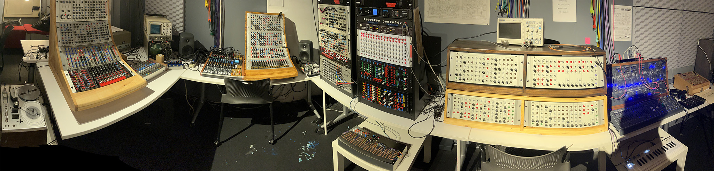

# The IDM Analog Synthesizers

- [Overview](#overview)
- [Studio Basics](#studio-basics)
- [The Synthesizers](#synthesizers)
  - [Serge system overview](#serge-system-overview)
  - [Random Source Serge](#random-source-serge)
  - [73-73 Serge](#73-75-serge)
  - [Shelfisizer](#the-shelfisizer)

# Overview

IDM has a collection of analog synthesizers for the users of the Audio Lab to work with, set up as a self-contained studio in the corner of the room. These include:

- a large Serge modular system built for IDM by [Patch Point](https://www.patch-point.com/) in Berlin, using PCBs designed by [Random Source](http://randomsource.net/) based on the "4th Generation" Serge systems from 1979-1980.
- a smaller Serge modular system built by [Luther Bradfute](https://www.lbradfute.com/) in Tennessee based on the [73-75](http://www.73-75.com/) modular system designed by [The Human Comparator](http://www.thehumancomparator.net/) in Stockholm. This synthesizer uses the designs from the original 1973 Serge modular systems developed at CalArts.
- the [Shelfisizer](https://github.com/IDMNYU/shelfisizer), a set of Arduino-based Serge-compatible modules designed and built by Luke.

In addition, a number of additional bits and pieces exist in the Audio Lab to help people work with the synthesizers:
- A [Behringer UFX-1204](https://www.behringer.com/Categories/Behringer/Mixers/Analog/UFX1204/p/P0AB2) Mixer with USB output for recording.
- A [MOTU 8A](https://motu.com/products/avb/8a) DC-coupled Audio Interface with a custom-built banana-jack patchbay.
- A [MOTU Micro Express](https://motu.com/products/midi/micro_usb) MIDI interface.
- A vintage [IVL Pitchrider 4000](https://www.ivlaudio.com/home) pitch-to-MIDI converter.
- A [CV.OCD](https://six4pix.net/product/cvocd/) MIDI-to-Control Voltage converter.
- Multiple [Low-Gain Electronics](http://lowgain-audio.com/) passive converter boxes.
- Three vintage [B&K oscilloscopes](https://en.wikipedia.org/wiki/Oscilloscope_history) - two model 1470s, one model 1479B.
- Stereo Genelec speakers.

# Studio Basics

### Power

The power for *everything* in the analog studio is controled by a single switch, found on the Furman power conditioner on the black rack to the right:

A green light on the conditioner will confirm that you've got power.
**Please use this power switch (and nothing else) to turn on and off all the equipment in the analog studio.**

### Mixer

The mixer for the analog studio is a Behringer UFX-1204, which takes inputs from the various synthesizers and feeds them to the speakers or, by using a USB connector, to your computer for recording.

The first four channels of the mixer are mono, and are hard-wired to:
1. the left output of the "Stereo Mixer" module on the Random Source Serge (the rightmost module on the top panel)
2. the right output of the "Stereo Mixer" module on the Random Source Serge (the rightmost module on the top panel)
3. the output of the "XFader" module on the Random Source Serge (the rightmost module on the 3rd panel)
4. the top output on the "Adapter" module on the 73-75 Serge (the rightmost module on the bottom panel)

The rest of the mixer consists of 8 additional inputs in stereo pairs (5/6, 7/8, 9/10, 11/12). Channels 5/6 have a cable connected that ends in a stereo 1/8" jack so you can connect the analog output of your laptop.

The Mute buttons on each channel reroute the audio to a secondary ("Alt 3-4 Output"). The left ("Alt 3") output of this secondary audio bus is connected to one of the Low-Gain converter boxes, so that you could, for example, connect an electric guitar to the mixer, "mute" its channel, and then connect it to the Serge system.

The USB output of the Mixer has a cable connected for your use. If you hook it up to your computer, you can record the output of the synthesizers. The mixer shows up as a multi-channel audio interface, with the input channels on the mixer routed on a per-channel basis (e.g. *input channel 3* on the mixer comes into your computer on *input channel 3* of the interface), and with the "Main Mix" of the mixer coming in on channels 15-16. 

If you are a Mac user, you won't need a driver for the mixer, though you should confirm that you have a connection by looking in the "Audio Midi Setup" or "Sound" panel under your System Preferences. If you are using a Windows machine, you will have to download and install an ASIO driver for the mixer [here](https://www.behringer.com/Categories/Behringer/Mixers/Analog/UFX1204/p/P0AB2/Downloads).

The mixer can send your computer audio either pre- or post-fader (which includes not only the channel level, but also the internal effects and equalization). The red button at the top of the channel below the white Gain knob lets you set this option. In general, the pre-fader (button up) option will give you a cleaner signal, allowing you to post-process the audio once you've recorded it.

The "Main Mix" of the mixer routes the audio to the two Genelec audio speakers in the analog studio area. They should let you listen to the synths with plenty of volume, so please don't adjust the gain controls on the Genelecs.

# The Synthesizers

## Serge System Overview

[Serge synthesizers](https://en.wikipedia.org/wiki/Serge_synthesizer) are analog modular synthesizers that incorporate the  designs of [Serge Tcherepnin](https://en.wikipedia.org/wiki/Serge_Tcherepnin). Tcherepnin, while working at CalArts in the 1970s, developed his line of modular synthesizers after meeting with [Don Buchla](https://en.wikipedia.org/wiki/Don_Buchla) and working with composer [Morton Subotnick](https://en.wikipedia.org/wiki/Morton_Subotnick). Tcherepnin realized that contemporary modular synthesizers were far too expensive to be affordable for students and hobbyists, and so he set out to develop a modular system that was low cost and emphasized flexibility. Tcherepnin made a number of innovative decisions to keep costs down, such as the use of (cheaper) banana jacks instead of audio connectors, and the ["paperfacing"](http://djjondent.blogspot.com/2013/12/two-panel-vintage-paperface-serge.html) of his synthesizer panels so that the aluminum  could be pre-drilled in a grid regardless of the customer's desired module configuration.

In addition, unlike many of his competitors, Serge also sold his systems as *kits*, where the customer would receive a PCB, a face plate and decal label, a bill-of-materials for which electronic components to purchase, and detailed assembly instructions. This DIY approach - similar to [HeathKit radios](https://shop.heathkit.com/page/homepage) popular at the time - allowed Serge systems to be purchased for a fraction of the cost of a Buchla system if the buyer didn't mind doing some soldering. Many licensed Serge systems today are still sold as kits, with a number of builders, such as our friends at [Patch Point](https://www.patch-point.com/) in Berlin, available to professionaly assemble the kits into finished synthesizers using high quality components.

Tcherepnin's designs found commercial success as a low-cost alternative to other modular synthesis systems available at the time. His company (Serge Modular Music Systems) sold synthesizers under the **Serge** name until 1986. After that, Tcherepnin licensed his designs *non-exclusively* to a number of manufacturers, such as [Sound Transform Systems](http://www.serge-fans.com/prices.html) in the USA, [Elby Designs](https://www.elby-designs.com/index.html) in Australia, [Random Source](http://randomsource.net/) in Germany, [the Human Comparator](http://73-75.com) in Sweden, and [Loudest Warning](http://loudestwarning.co.uk) in the UK. In addition, a number of synthesizer designers, such as [Bugbrand](https://bugbrand.co.uk), [Modcan](http://www.modcan.com/), [Ciat-Lonbarde](https://ciat-lonbarde.net), and [Kilpatrick Audio](http://kilpatrickaudio.com/), continue to develop new synths using a Serge-inspired or Serge-compatible format.

The [Serge-Fans](http://www.serge-fans.com/history.htm) web page (which doubles as an information site for Sound Transform Systems) is a great resource to learn more about the history of these synthesizers. In addition, there's a nice video interview with Tcherepnin [here](https://www.youtube.com/watch?v=To_gkk9GEpQ).

### What makes a Serge a Serge?

Serge synthesizers have a number of technical characteristics that set them apart from other modular systems of their day, as well as modern modular synthesizers that use the [Eurorack](https://en.wikipedia.org/wiki/Eurorack) format:
- Serge synthesizers are designed to be arrayed horizontally into panels that are **4U** (four [rack units](https://en.wikipedia.org/wiki/Rack_unit)) high, the same as [Buchla](https://en.wikipedia.org/wiki/Buchla_Electronic_Musical_Instruments) systems but distinct from [Moog](https://en.wikipedia.org/wiki/Moog_synthesizer) systems (5U) or Eurorack systems (3U). As a result of this sizing standard, Buchla- and Serge-style synthesizers are sometimes referred to generically as "4U" modular systems.
- Serge systems use **4mm [banana connectors](https://en.wikipedia.org/wiki/Banana_connector)** for all their patchcord connectivity, with a common [ground connection](https://en.wikipedia.org/wiki/Ground_(electricity)) used across all the modules in the system. The use of single conductor wires means that, when patching with a Serge, you're connecting the positive current wire only. This is in contrast to most other modular systems, which use two-conductor audio cables such as 1/8" / 3.5mm [phone jacks](https://en.wikipedia.org/wiki/Phone_connector_(audio)) for connectivity. Serge modules (and other  synths that use banana jacks) tend to work with lower impedance signals to mitigate the cross-talk that occurs from the modules' audio circuitry all sharing the same ground plane.
- Tcherepnin designed his synthesizers with **no systemic distinction between "audio" and "control voltages"**. This was a fairly radical departure from contemporary systems, which either had separate modules for generating different types of signals (Moog) or used different cabling standards to keep different kinds of voltages separate (Buchla). In Serge systems, an oscillator could be listened to, or slowed down below 20Hz to create a time-varying [low-frequency oscillator](https://en.wikipedia.org/wiki/Low-frequency_oscillation). By a similar token, Serge modules that generated ramps, triggers, random signals, and even voltage sequences could be sped up to audio rate to generate triangle waves, square waves, noise, or arbitrary waveforms. Instead of dictating the *use* of any given signal generated by the synthesizer, Serge systems distinguish between the *type* of voltage generated - AC, DC, or trigger - without implying how it should be patched and at what frequency it should be used.
- Serge modules often perform multiple functions depending on which connections are active. For example, envelope generators in Serge systems can also be wired to function as oscillators, envelope followers, filters, or gates. Tcherepnin referred to this feature of his synthesizers as **"patch programmability"**, and this flexibility is considered to be one of the hallmarks of Serge modular systems. The Serge [Dual Universal Slope Generator](https://www.elby-designs.com/webtek/cgs/serge/cgs114/cgs114_dusg.html) from 1976 epitomizes this sensibility, and there are several Eurorack modules on the market (e.g. MakeNoise [MATHS](http://www.makenoisemusic.com/modules/maths) and the Befaco [Rampage](https://www.befaco.org/en/rampage/)) that feature similar multiuse capabilities.

In terms of overall design, Serge modular systems are considered, alongside Buchla, to be classic ["West Coast"](https://reverb.com/news/the-basics-of-east-coast-and-west-coast-synthesis) synthesizers:
- They feature a (comparably) large selection of heterogenous modules, to encourage experimentation through a limitless variety of possible connections. This is in contrast to "East Coast" synthesizers which tend to feature oscillators, filters, and amplifiers that are usually patched in sequence and triggered synchronously.
- They emphasize distortion - frequency and ring modulation, waveshaping - as a synthesis technique to make richer harmonic content from simple waveforms, as opposed to the subtractive synthesis used in "East Coast" synthesizers, with their emphasis on ladder filters shaping harmonically rich oscillators.
- They offer sequencing and other "automatic," clock-based behaviors, as well as modules that avoid specific musical conventions but can be used for musical effects, such as sample-and-hold modules. This is in lieu of the Western keyboard-centric performance setups common in "East Coast" synthesizers.

### Interface standards

Serge synthesizers are made up of **modules** that are 4U (7") tall and multiples of 1" wide. Most (but not all) Serge systems group modules into a single aluminum enclosure (called a "panel" or "boat") that contains up to 16 inches worth of modules and has a single power connector on the rear. The separation between individual modules on a panel is indicated by the panel graphics, usually with a module's name at the top or bottom, and a visual indicator such as a black rounded rectangle or a gap in the decal around the module.

Modules may have **inputs**, **outputs**, or both, depending on their function. In general, outputs on Serge synthesizers appear *above* and/or *to the right* of the inputs, and are usually visually indicated on the panel graphics. In the image above, the lower portion of the module (where the knobs are) contain the inputs, while the upper area (bounded by a rectangle) contain the output jacks.

Interface elements on Serge modules consist of jacks (points of connection), LEDs, knobs, toggle switches, push buttons, and, on the TKB module, capacitive touch strips. Interface elements are usually labeled.

Jacks are colored based on the type of voltage they send (or expect to receive). Tcherepnin's original design called for three types of voltage connection with color codes:

| Voltage Type  | Description     | Voltage Range | RS     | 73-75 | Shelfisizer |
| ------------- | --- |           ---            |     ---|    ---|          ---|
| AC            | Bipolar continuous (analog) | -2.5V to 2.5V | Black | Brown | Black |
| DC            | Unipolar continuous (analog) | 0 to 5V       | Light Blue | Light Grey | Dark Blue |
| Trigger       | Unipolar discrete (digital) | 0 *or* 5V      | Red | Red | Red |

Some modules have additional colors, such as lavender jacks for passive connectors on the 73-75 Adaptor module and orange for the AC-coupled (-5V or 5V) comparator jack on the Random Source Smooth/Stepped Generator module.

As noted above, these conventions describe the kind of voltage being delivered, not *how* you're going to use it. As in the image above, the output area of the module has black, blue, and red jacks, but all of them can be used to generate either audio patched into the speakers or control voltage patched into another module.

Serge modules use small knobs to control parameters, often in conjunction with control voltage. Knobs that *scale* (multiply) an input voltage and knobs that *offset* (add to) an input voltage are distinguished on the panel graphics.

Modules are connected by **patching** within and between module jacks using banana cables.

Banana cables can be stacked by inserting one cable into the back or side of another. The cables in the IDM Audio Lab are stored against the wall to the left of the analog studio area, and are color-coded by length.

In addition, a box labeled "shorting bars!!!" contain small plastic blocks with two banana connectors that can be used to connect two adjacent jacks on most Serge modules.

As mentioned above, patching using banana jacks means that you're only connecting the positive (+) end of the audio signal. The negative (-) signals are fed among the sythesizers using common grounding wires. In the analog studio, these are visible as gray banana cables strung around the backs (and sometimes the front) of the equipment. These cables link together the modular synthesizers, the patchbay to the 8A audio interface, the format converter boxes, and the oscilloscopes.

**Do not remove or replug ground wires - this may prevent the equipment from working properly.**

## Random Source Serge

## 73-75 Serge

## The Shelfisizer

[return](./index.md)
